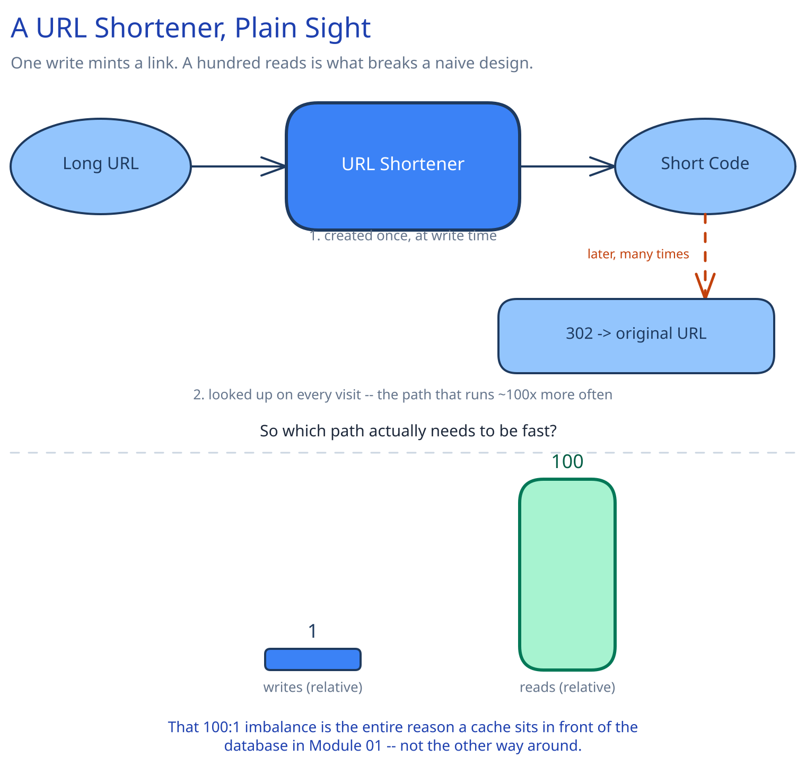

# Module 00 — Overview

## The feature, with no infrastructure in it yet

A user pastes a long URL and gets back a short one. Later, anyone who opens that short URL is redirected to the original. That's the entire feature — no infrastructure, no boxes, just a mapping from a short code to a long URL.

The interesting design problem is entirely in the numbers, not the feature: this redirect gets hit roughly **100 times for every 1 link created**, it has to resolve in well under 100ms every time, and it must never hand out the same short code for two different long URLs. Every module after this one exists to satisfy those three constraints — nothing more.

## Requirements

**Functional:**
- Given a long URL, return a short one.
- Given a short URL, redirect to the original long URL.
- *(Stretch, not required for the core design)* let a user pick a custom alias, or set an expiration date.

**Non-functional** (these are what actually drive the architecture):
- **Scale:** assume 100M new short links created per day, and a 100:1 read-to-write ratio (redirects vastly outnumber creations — people click links far more often than they mint new ones).
- **Latency:** a redirect should resolve in well under 100ms — nobody tolerates a slow bounce.
- **Availability:** redirects should keep working even if the write path is degraded; a link that already exists is more valuable to keep serving than a new one is to keep accepting.
- **Uniqueness:** two different long URLs must never collide on the same short code.

## Capacity Estimation

- 100M writes/day ≈ **1,160 writes/sec** average.
- 100:1 ratio → **≈116,000 reads/sec** average — this is the number that has to survive, and it's why a cache exists at all.
- If an average short-URL row is ~100 bytes and links are kept for 5 years, storage is roughly 100M × 365 × 5 × 100 bytes ≈ **18TB** — large, but well within what a sharded relational store or a managed key-value store handles routinely (Module 03 picks this up).

## Approach Walkthrough

Every long URL maps to a short, unique code generated once at creation time; a redirect is then just a lookup from that code back to the URL. Because reads outnumber writes 100:1, the read path is the one worth optimizing first — that single fact is the reason a cache sits in front of the database at all, rather than, say, optimizing write throughput.

## API Surface

- `POST /api/v1/urls {long_url}` → `201 {short_code, short_url}` — creates a new short link. Validates `long_url`, generates a short code (Module 02 covers exactly how), and writes the mapping.
- `GET /{short_code}` → `302 Redirect` to the original `long_url` on a hit; `404` if the code doesn't exist or has expired.
- `429 Too Many Requests` — from the rate limiter sitting in front of both endpoints (Module 02's `RateLimiter` decorator).
