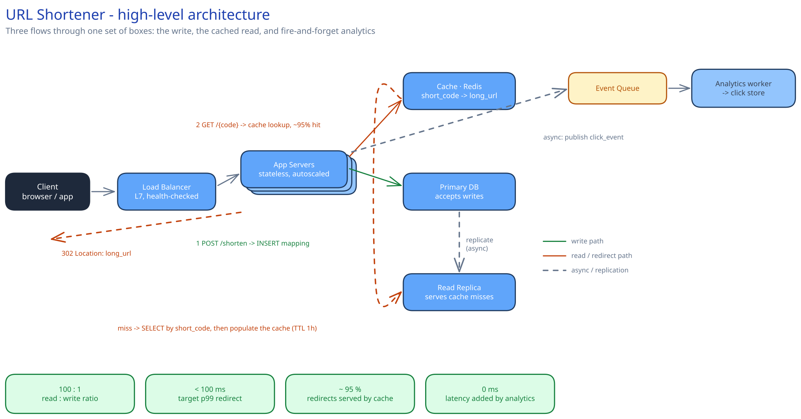

# Module 01 — High-Level Design (HLD)

## What HLD is actually for

High-level design is the conversation you have *before* anything gets built: what are the major pieces, what does each one own, and how does a request travel between them? Get this wrong and no amount of good code in Module 02 saves you — you'll have built the wrong boxes. HLD deliberately stays above the level of classes and tables; those come later, once the shape of the system is settled.

## Monolith vs. microservices

This system is small enough to stay one deployable service — a single API layer talking to a cache, a database, and a queue — not a fleet of microservices. Splitting "create a link" and "resolve a redirect" into separate services would only pay off once one of them needed a genuinely different scaling or reliability profile from the other, and at this system's numbers neither does: both are stateless, both sit behind the same load balancer, and the 100:1 read:write split is handled by a cache, not by a service boundary. Reaching for microservices here anyway is the exact anti-pattern this guide's [Practice Problems](04-practice-problems.md) module calls out for the Parking Lot system: match complexity to actual scale, not to what looks more sophisticated on a whiteboard.

## The building blocks

| Block | Role |
|---|---|
| **Load balancer** | Spreads incoming requests across many identical app servers, and stops sending traffic to one that fails a health check |
| **Application / API servers** (stateless) | Any server can handle any request, which is what makes it possible to add more of them under load (horizontal scaling) instead of buying a bigger single machine (vertical scaling) |
| **Cache** | A fast, in-memory store (Redis, Memcached) sitting in front of the database for data read far more than it's written — the direct answer to the 100:1 ratio above |
| **Primary database + read replica(s)** | The primary accepts writes; replicas are copies kept in sync (with a small lag) that absorb read traffic so the primary isn't the bottleneck for both |
| **Message queue** | Lets the app server hand click-analytics work off without waiting for it, so a slow or non-critical task never blocks the critical path (serving the redirect) |

## The worked design

The architecture diagram above shows three separate flows through the same set of boxes:

**Write path — creating a short link**
`Client → Load Balancer → App Server → Primary DB`
The app server validates the long URL, generates a short code (Module 02 covers exactly how), and writes the mapping. This path is rare (Module 00's whole premise) so it doesn't need to be blazing fast — it needs to be *correct*, above all never handing out the same short code twice.

**Read path — resolving a redirect**
`Client → Load Balancer → App Server → Cache` (check first) `→ Read Replica` (only on a miss) `→ back to Cache` (populate it) `→ Client`
This is the path that runs 100x more often than the write path, so it's the one that gets the cache. On a cache hit — the diagram estimates ~95% of requests — the database is never touched at all.

**Async path — click analytics**
`App Server → Queue → Analytics worker → separate store`
Counting a click is not something the user is waiting on, so it's decoupled entirely: the app server fires an event and immediately returns the redirect. If the analytics worker falls behind or even goes down for a few minutes, redirects keep working perfectly — that's the whole point of the queue.

## Trade-offs to make explicit

| Decision | Chosen | Alternative | Why |
|---|---|---|---|
| Cache population | Cache-aside (populate lazily, on a miss) | Write-through (populate at creation time too) | Write-through raises the hit rate slightly at the cost of extra work on every write — a path that's already rare. Not worth it here |
| Click counting | Async, off the critical path | Synchronous (increment on every redirect, in the request path) | Synchronous adds latency and load exactly where it's least affordable; async costs eventual — not immediate — consistency on a number nobody watches in real time |
| Deployment topology | Single region | Multi-region, active-active | Real global scale needs the read path replicated per-region and writes centralized or conflict-free — worth knowing this exists, not worth building for a "simple" version |
| Short code generation | Base62 encode a counter/ID | Hash the long URL, truncate | A counter guarantees no collision ever; a hash-and-truncate needs a collision-retry loop. Module 02 picks the counter for exactly this reason |

## Load Handling

- **Peak-vs-average tolerance:** ~116,000 reads/sec average (Module 00) is an ordinary horizontal-scaling problem for the stateless app-server tier — more instances behind the load balancer, same logic.
- **Where backpressure kicks in first:** a cache miss storm (e.g. a cold cache after a deploy) is the one scenario that can genuinely overload the primary DB's read path — this is what read replicas exist for, so a miss storm degrades gracefully into "slower reads from a replica," not a primary-DB outage.
- **What gets shed under overload:** click-analytics events, never the redirect itself. The queue absorbs an analytics backlog; the redirect's own latency budget is never spent waiting on anything analytics-related.
- **Load-test target:** sustain 116,000 reads/sec with p99 redirect latency under 100ms, with the cache hit rate held at ~95%, for 10 minutes.

## Concurrent-User Handling

| Race | Mechanism | What the "loser" sees |
|---|---|---|
| Two clients request a short link for the same long URL at the same instant | Not deduplicated by design — each request gets its own new code, since this system doesn't index by `long_url` | Two valid, different short codes for the same destination — a correctness non-issue, just a minor storage cost |
| Two app-server instances generate a short code from the same counter value (a race in ID allocation) | The counter itself is the single source of truth (an atomic increment, or a DB sequence) — two instances can never receive the same next value | No collision is possible; this is closed at the counter, not by retrying after the fact |
| A short code collision slips through anyway (e.g. a hash-based scheme instead of a counter) | A unique index on `short_code` (Module 03) makes the second insert fail at the database level | The insert fails cleanly; the app server retries with a freshly generated code, never silently overwriting the first link |

## Scaling & Reliability

- **Horizontal scaling:** app servers scale by request rate, same as any stateless tier.
- **Circuit breaker:** a cache outage doesn't take down redirects — the app server falls back to querying the read replica directly, at higher latency but still correct.
- **Graceful degradation:** if the queue is unavailable, the app server can drop the click-analytics event rather than block the redirect on it — analytics is explicitly the part of this system allowed to lose data; the redirect is not.
- **Multi-region:** not built here — see "what you'd revisit" below.

## What you'd revisit as this grows

- The primary DB becomes a bottleneck for writes long before it does for reads (that's what the cache is for) — the fix is sharding the `urls` table by short code, covered in Module 03.
- A single message queue and one analytics worker are a single point of *delay*, not correctness, if they fall over — but at high enough volume you'd want to partition the queue too.
- Custom aliases and expiration (the stretch requirements from Module 00) both change the write path slightly — worth trying to slot them into this same diagram once you've read Module 02.
