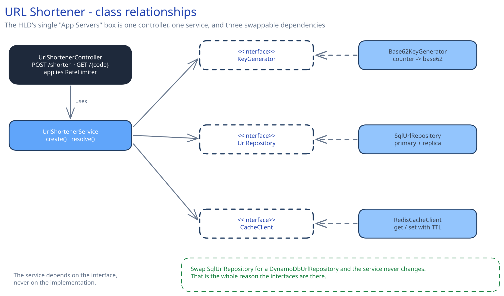
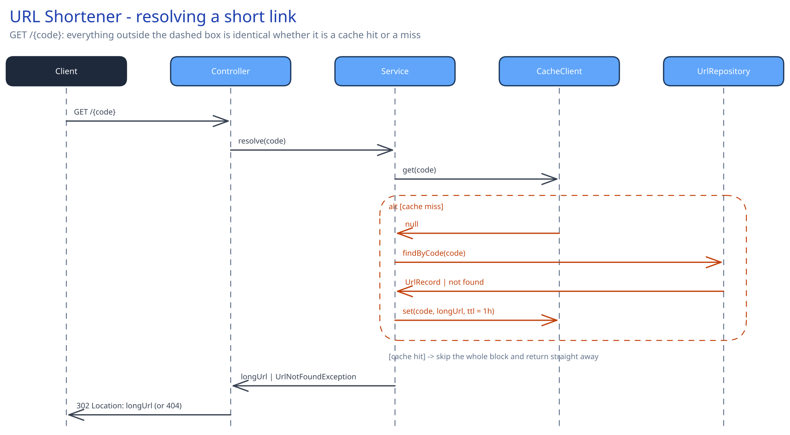

# Module 02 — Low-Level Design (LLD)



## What LLD is actually for

HLD said "App Server" and drew one box. LLD opens that box: what classes live inside it, what does each one own, and what's the exact order of calls when a request comes in? If HLD is the floor plan, LLD is the wiring diagram — precise enough that two different engineers implementing from it would end up with compatible code.

## The core idea: depend on interfaces, not implementations

This is the single most useful habit in LLD, and the worked example exists mainly to show why. If `UrlShortenerService` calls `SqlUrlRepository` directly, then every future decision about storage — read Module 03 and you'll want to change your mind — means editing the service. If it calls a `UrlRepository` *interface* instead, and `SqlUrlRepository` is just one implementation of it, you can add a `DynamoDbUrlRepository` later and the service never changes. Same reasoning applies to the cache and the key generator.

## The worked design

The class diagram above has five classes, three of which are interfaces:

- **`UrlShortenerController`** — the HTTP layer. Parses requests, applies the `RateLimiter`, calls the service, and turns the result into an HTTP response (a 201 with the short URL, or a 302 redirect, or a 404/429). It knows nothing about databases or caches.
- **`UrlShortenerService`** — the business logic. Two methods: `create(longUrl)` and `resolve(code)`. It orchestrates the interfaces below it but implements none of the storage itself.
- **`KeyGenerator`** *(interface)* → **`Base62KeyGenerator`** — turns an internal numeric ID into a short, URL-safe string using the 62 characters `[a-zA-Z0-9]`. A 7-character base62 code covers 62⁷ ≈ 3.5 trillion values, comfortably more than this system will ever mint.
- **`UrlRepository`** *(interface)* → **`SqlUrlRepository`** — reads and writes the `urls` table (writes go to the primary, reads can go to a replica — see Module 01).
- **`CacheClient`** *(interface)* → **`RedisCacheClient`** — `get(code)` / `set(code, longUrl, ttl)` against Redis.

### Pseudocode for the two methods that matter

```
Service.create(longUrl):
    if not isValidUrl(longUrl):
        raise InvalidUrlException

    id = repository.nextId()
    code = keyGenerator.encode(id)          # e.g. base62(id) -> "aZ3kQ1x"

    repository.save(code, longUrl, ownerId)  # INSERT, unique index on `code` catches any collision
    return code

Service.resolve(code):
    longUrl = cache.get(code)
    if longUrl is not null:
        return longUrl                       # cache hit — the common case

    record = repository.findByCode(code)
    if record is null or record.isExpired():
        raise UrlNotFoundException            # controller turns this into a 404

    cache.set(code, record.longUrl, ttl = 1h)
    return record.longUrl
```

Two error cases worth designing for deliberately, not as an afterthought:

- **ID collision on write:** because `code` has a unique index at the database level (Module 03), a duplicate insert fails loudly instead of silently overwriting someone else's link. The service can retry with a freshly generated ID a small, bounded number of times.
- **Not found / expired on read:** these are two different states a caller needs to distinguish — "never existed" vs. "existed, expired" — so `UrlNotFoundException` should carry which one it is rather than collapsing both into one generic error.

### The sequence: what actually happens on `GET /{code}`



The sequence diagram above walks this step by step. The important thing to notice: the controller and the service *don't know or care* whether the answer came from the cache or the database — that branch lives entirely inside `resolve()`. That's the interface boundary paying off again: you could delete the cache entirely, and only `resolve()`'s implementation would change.

## Concurrency at the code level

`repository.save(code, longUrl, ownerId)` needs no in-process lock, and this is worth stating explicitly: `UrlShortenerService` runs on many horizontally-scaled app-server instances (Module 01), so a language-level mutex would only protect against other threads *on the same instance* — it would do nothing about another instance inserting a colliding code a moment later. Correctness comes entirely from the database's own unique constraint on `code`, the same pattern this guide uses everywhere two writers might race for the same value: push the atomicity requirement down into the one system that can actually guarantee it.

The one place an application-level decision *is* needed: how many times to retry `create()` after a collision, and with what backoff. A fixed, small retry count (e.g. 3, with a freshly generated ID each time) is enough given a 7-character base62 space — a real collision on a fresh ID is vanishingly rare, so more than a couple of retries would only ever mask a different, more serious bug (like a key generator that isn't actually random/sequential).

## Design patterns you just used, named

You didn't need to know these names to design the system above, but naming them makes the pattern easier to reach for on the next problem:

- **Repository pattern** — `UrlRepository` hides *how* data is stored behind a method-call interface (`findByCode`, `save`). The service talks to data the same way regardless of what's underneath.
- **Strategy pattern** — `KeyGenerator` is a strategy: base62-from-counter is one strategy, but "hash the long URL and take the first 7 chars, retry on collision" is a valid alternative strategy behind the exact same interface.
- **Decorator / middleware** — the `RateLimiter` wraps the controller's handling of a request without the controller's own logic needing to know it exists.

## Practice: extend it yourself

Before moving to Module 03, try sketching (even just in pseudocode) how you'd add:

1. **Custom aliases** — a user supplies their own code instead of one being generated. Which method changes? What new failure mode does it introduce that generated codes don't have?
2. **Expiration** — a link stops resolving after a given date. Where does the check belong — the repository, the service, or both? (Hint: think about what happens if only one of them checks.)

There's no single right answer to either — the point is to notice that the interface boundaries you already drew make it obvious *where* each change belongs.
