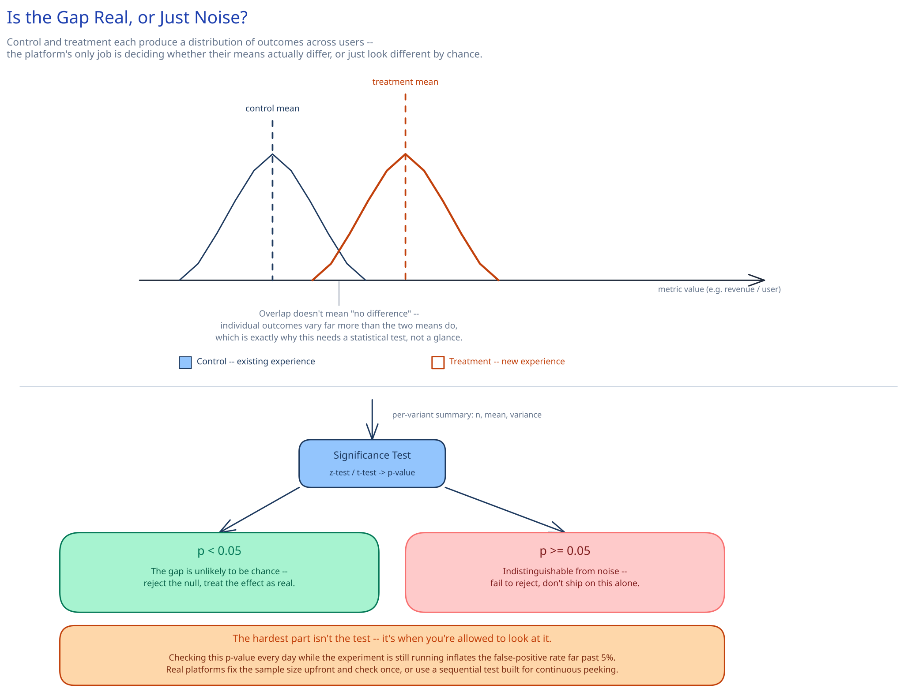

# Module 00 — Overview

## The feature, with no infrastructure in it yet

A product team wants to know: does making the checkout button green instead of blue actually increase purchases, or would purchases have gone up that week regardless? They show green to half of visitors and blue to the other half, wait, and compare. Every other requirement in this module exists to answer that one question honestly: **the hard part was never showing two different things to two groups of people — [feature flags](../../../feature-flags-rollout/00-overview.md) already do that — it's proving, with a number a skeptic can check, that the difference in what those two groups did afterward is a real effect of the button color and not a coincidence of who happened to land in which group.**

That's a genuinely different bar than "ship the change to some users first." A feature flag's job ends the instant a user is bucketed and served a variant. This system's job **starts** there — it has to decide, after the fact, whether what people did next was actually caused by what they saw, using nothing but statistics on noisy human behavior. Get the bucketing wrong and you've shipped a bug. Get the *statistics* wrong and you've shipped a bug and then convinced an entire company it was a feature.

## Requirements

**Functional:**
- Define an experiment: two or more variants (control plus one or more treatments), a traffic allocation across them, a primary metric, and one or more guardrail metrics.
- Deterministically and stably assign any given user to exactly one variant per experiment, for the life of the experiment, with no per-user storage write.
- Log the moment a user is actually **exposed** to their assigned variant, kept distinct from the assignment computation itself.
- Join each user's exposure against their downstream conversion events and roll the results into per-variant statistical summaries (count, mean, variance).
- Test whether the primary metric's observed difference between variants is statistically significant, without letting continuous monitoring inflate the false-positive rate.
- Detect and flag **Sample Ratio Mismatch** — an observed traffic split that deviates from the configured allocation enough to make the whole comparison untrustworthy.
- Monitor guardrail metrics continuously and automatically halt an experiment's exposure if one regresses past a threshold, independent of how the primary metric looks.

**Non-functional** (stated as assumptions, interview-style):
- 100M daily active users, each exposed to roughly 5 concurrently running experiments on average. Checking "which variant is this user in" happens at the same order of magnitude, for the same reason, as this guide's [feature-flag evaluation volume](../../../feature-flags-rollout/01-architecture-hld.md) — hundreds of millions of checks/sec platform-wide — and it can never cost a network hop.
- Exposure *logging* volume is much smaller than assignment-*checking* volume, because only actually-served variants get logged: ~500M exposure events/day (~5,800/sec average, ~29,000/sec at a 5x peak).
- Thousands of experiments run concurrently platform-wide — a realistic assumption at the scale of the companies that ask this question, not a hypothetical.
- Primary-metric results refresh at least once daily; guardrail metrics refresh far more often (hourly or tighter), because a guardrail regression has to trigger an automatic halt inside a bounded blast radius, not wait for a nightly job.
- The non-negotiable bar: a reported "statistically significant" result must actually mean what it claims — the significance test's false-positive rate has to hold at its configured threshold (say, 5%) regardless of how many times someone looks at the dashboard while the experiment is still running. This is this platform's version of [the payments case study](../payments-system/00-overview.md)'s "never double-charge" bar: get it wrong, and every downstream ship/no-ship decision in the company is built on a number that lies.

## Capacity Estimation

Using this guide's [back-of-envelope method](../../foundations/back-of-envelope-estimation.md):

- **Exposure events:** ~500M/day ≈ 5,800/sec average, ~29,000/sec at peak. At ~150 bytes/event (`experiment_id`, `user_id`, `variant_key`, `timestamp`, a little context): 500M × 150B ≈ **~75GB/day** raw.
- **Exposure retention:** kept for the life of the longest-running experiment plus an analysis buffer — call it 90 days: 75GB × 90 ≈ **~6.75TB** rolling raw exposure log.
- **Conversion events:** the metric pipeline doesn't stand up a new firehose for these — it joins against the company's existing product-analytics event stream, which already runs at a far larger volume than exposures alone (billions/day), the same separation of "ingest once, reuse everywhere" this guide's [ad-click aggregation](../ad-click-aggregation/00-overview.md) pipeline draws between its own ingestion and serving paths.
- **Aggregate summary storage:** tiny by comparison, the same gap ad-click-aggregation's own capacity math makes between its raw log and its aggregate store. At ~3,000 concurrent experiments × ~3 variants × ~5 tracked metrics (1 primary + guardrails) × a ~30-day average run: **~1.35M summary rows** live at once — nowhere near a scaling concern on its own.

## Approach Walkthrough

An experiment definition names its variants, a traffic allocation across them, and the metric that decides the outcome. A user's variant is never looked up from a table — it's computed on demand from a deterministic hash of the experiment's id, a per-experiment salt, and the user's id, the same bucketing trick this guide's [feature-flag](../../../feature-flags-rollout/02-lld.md) design uses for rollout percentages, so assignment costs nothing and needs no storage. The genuinely new work starts one step later: the instant a user is actually served their assigned variant, that gets logged as an **exposure** — deliberately separate from the assignment computation, because a user who was bucketed into treatment but never actually saw it has no business being counted in the results. From there, a metric pipeline joins each user's exposure against whatever conversion events they generate afterward, rolls the joined pairs up into per-variant summary statistics, and only then does a significance test decide whether the gap between control's and treatment's numbers is a real effect or noise — checked once, on a schedule the experiment commits to before it starts, because checking it constantly is itself how a platform lies to itself.

## API Surface

- `POST /experiments {name, variants: [{key, allocation_pct}], primary_metric, guardrail_metrics, salt}` → `{experiment_id, status: "draft"}`.
- `POST /experiments/{id}/start` — freezes the variant list and allocation (see [Database Design](03-db-design.md) for why this has to be immutable once live) and flips `status` to `running`.
- SDK call, in-process, no network hop: `ExperimentClient.getVariant(experiment_id, user_id) -> variant_key` — a pure function of the current experiment definition, evaluated locally exactly like a feature flag.
- `POST /exposures {experiment_id, user_id, variant_key, timestamp}` — fired by application code the instant it actually renders the assigned variant; fire-and-forget.
- Conversion events arrive through the existing product-analytics pipeline, not a purpose-built endpoint — the metric pipeline consumes that stream rather than requiring a second one.
- `GET /experiments/{id}/results` → `{variants: [{key, n, mean, variance}], primary_metric: {p_value, confidence_interval, lift}, srm_check: {expected, observed, p_value, flagged}, guardrails: [{metric, status}]}`.
