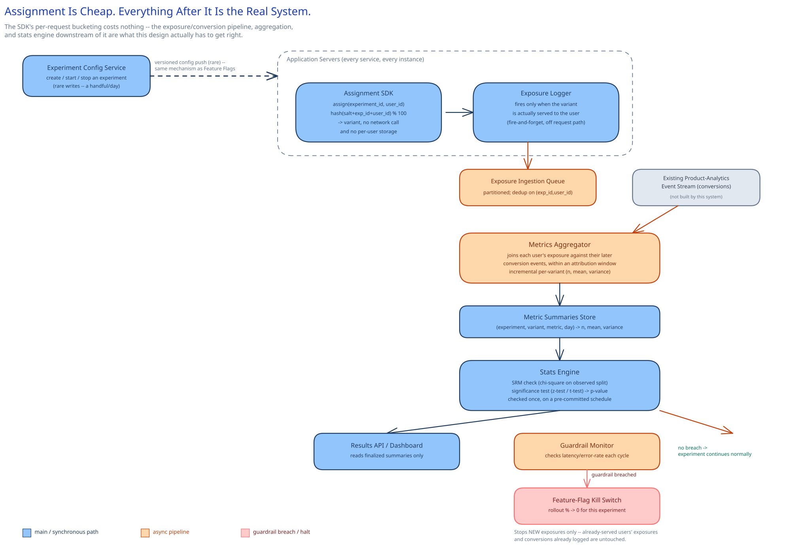

# Module 01 — Architecture & High-Level Design

## Monolith vs. microservices

This design actually has two very different halves, and they get pulled apart for opposite reasons.

**Assignment stays embedded, never a network call**, for exactly the reason this guide's [feature-flag](../../../feature-flags-rollout/01-architecture-hld.md) design gives for its own evaluation path: at hundreds of millions of checks/sec platform-wide, a network hop per check would mean building a service that has to sustain hundreds of millions of requests/sec just to answer "which variant is this user in" — a far more expensive system than the one it would be serving. A small SDK embedded in every calling service computes the answer locally from an in-memory experiment definition, the same shape as a flag evaluator, just keyed by `experiment_id` instead of `flag_key`.

**Everything downstream of an exposure is a separate, centralized pipeline**, and this is the piece that doesn't exist in a feature-flag system at all. A flag's evaluator never needs to see what any *other* instance decided for any *other* user — every check is independent. Answering "is the gap between control and treatment real" is the opposite: it inherently requires collecting every exposed user's outcome, across every instance, into one place before a single number can be computed. That requirement — a global view before an answer exists — is what forces a centralized metrics-aggregation and stats-computation service, with a completely different operational profile (batch/stream, write-heavy, latency-tolerant) than the assignment SDK's in-process, zero-latency-budget hot path.

Put plainly: this case study shares its bucketing mechanism with feature flags, but that mechanism was never the hard part of either system. It's genuinely the *entire* system for feature flags, and it's the easy 10% of this one.

## Building Blocks

| Block | Role |
|---|---|
| **Experiment Config Service** | Control plane; where an experiment's variants, allocation, salt, primary metric, and guardrails are defined and started/stopped — low write volume, matching the feature-flag control plane's own profile |
| **Assignment SDK** (embedded, in-process) | Computes `hash(salt + experiment_id + user_id) % 100`, maps the result against the experiment's frozen bucket ranges, returns a variant — no network call, no per-user storage |
| **Exposure Logger** | Fires only when application code actually serves the assigned variant to the user — deliberately decoupled from the assignment call itself |
| **Exposure/Conversion Ingestion** | Partitioned queues; exposures come from the Exposure Logger, conversions are consumed from the company's existing product-analytics event stream |
| **Metrics Aggregator** | Joins each user's exposure against their later conversion events (within an attribution window) and maintains an incrementally-updated per-variant `(n, mean, variance)` |
| **Stats Engine** | Runs the Sample Ratio Mismatch check and the primary-metric significance test, on a pre-committed schedule, not on every dashboard refresh |
| **Guardrail Monitor** | Continuously checks guardrail metrics (latency, error rate, and similar) against threshold, independent of the primary-metric readout |
| **Results API / Dashboard** | Reads only finalized summaries — never the live, in-flight aggregation state |

## Per-path walkthrough

**Assignment path (in-process, no network hop)** — `Application code → Assignment SDK.getVariant(experiment_id, user_id) → deterministic hash → bucket → variant`. Identical in shape and cost to this guide's [feature-flag evaluation path](../../../feature-flags-rollout/01-architecture-hld.md) — a 10x traffic spike on the calling service is invisible to this system entirely, because there's nothing here for the spike to touch.

**Exposure path (async, fire-and-forget)** — `Application code (renders the assigned variant) → Exposure Logger → Exposure Ingestion Queue → Metrics Aggregator`. Publishing the exposure event is never on the calling request's own critical path — same discipline this guide's [ad-click aggregation](../ad-click-aggregation/01-architecture-hld.md) pipeline applies to the click beacon.

**Conversion path** — `Existing product-analytics event stream → Metrics Aggregator (join by user_id + experiment_id, within the attribution window)`. The Metrics Aggregator doesn't own this stream or its ingestion; it's a consumer of a pipe that mostly already exists for other reasons.

**Analysis path (batch/stream, scheduled)** — `Metrics Aggregator (per-variant summaries) → Stats Engine (SRM check + significance test) → Results Store → Results API / Dashboard (read-only)`. The dashboard never computes anything live — it only ever displays what the Stats Engine already finalized on its own schedule, which is the mechanism (not a UI restriction) that keeps a human from peeking at a number that hasn't been computed yet.

**Guardrail path (async, tighter cadence than the primary-metric readout)** — `Metrics Aggregator (guardrail-metric summaries) → Guardrail Monitor (threshold check) → [breach] → Feature-Flag Kill Switch (rollout % → 0 for this experiment)`. This is the one place the two systems this module keeps separating come back together: the *decision* to halt is this platform's (it's the one watching a metric no flag system tracks on its own), but the *mechanism* that actually stops new exposures is the same kill switch [Feature Flags](../../../feature-flags-rollout/00-overview.md) already builds for a human to pull manually. Nothing new gets invented for the emergency stop — it's reused.

## Trade-offs to make explicit

| Decision | Chosen | Alternative | Why |
|---|---|---|---|
| Assignment mechanism | Deterministic hash, computed on demand | Pre-assign and store every user's bucket in a row | A stored assignment needs a write (or at least a lookup) the first time every user hits every experiment, reintroducing exactly the per-check I/O this design exists to avoid; a stateless hash gets the same stability for free |
| Allocation stability | Frozen for the life of the experiment once started | Ramp the allocation gradually, like a feature-flag rollout | Growing a flag's rollout percentage is safe because it only ever adds newly-exposed users going forward; doing the same to an experiment's control/treatment split would move already-measured users from one arm to the other mid-experiment, contaminating the exact comparison being measured — the same [hash-boundary-shift property](../../hld-building-blocks/consistent-hashing.md) that makes ramping safe for one use case makes it unsafe for the other |
| Significance-testing cadence | Fixed sample size/duration decided upfront, checked once (or a sequential test built explicitly for continuous peeking) | Recompute and display a live p-value on every dashboard refresh | Checking a fixed-horizon p-value against a threshold repeatedly while an experiment runs inflates the false-positive rate well past the configured 5% — peeking is a real statistical error, not a UX inconvenience |
| Guardrail enforcement | Automatic halt via the existing feature-flag kill switch | A human reviewing a dashboard and deciding to pause | A regression nobody notices for a few hours (a weekend, a time-zone gap) is a regression that keeps shipping to a meaningful fraction of traffic for those hours; automating the trip wire caps the blast radius to the monitor's own check interval |
| Exposure vs. assignment | Log exposure only when the variant is actually served | Log every `getVariant()` call the moment it's made | `getVariant()` is called far more often than a variant is ever actually rendered (an eligibility check on a page the user never visits); logging every call would dilute the analysis with users who were never really "in" the experiment |

## Load Handling

- **Peak-vs-average tolerance:** assignment load is a non-problem by construction, for the identical reason this guide's feature-flag design names — the check never leaves the calling process, so it scales exactly as far as the calling service's own capacity does. The real load concern is entirely on the exposure/conversion ingestion side.
- **Where backpressure kicks in first:** the exposure and conversion ingestion queues, exactly as in [ad-click aggregation](../ad-click-aggregation/01-architecture-hld.md) — if the Metrics Aggregator can't keep up with a sustained spike, events queue in the partitioned log rather than being dropped, and a growing queue depth is the correct signal to autoscale on.
- **What gets shed under overload:** nothing on the counting path. An exposure or conversion event is either ingested and eventually joined into a summary, or it never reached ingestion at all (a true beacon-send failure, outside this system's control). What lags under pressure is how soon a summary reflects the latest events — never whether it's eventually correct.
- **Autoscaling lag:** the Metrics Aggregator's stream-processing tier autoscales on the same 1–3 minute horizon as this guide's other stateless/horizontally-scaled tiers; the ingestion queue is what absorbs the gap until new capacity comes online.
- **Load-test target:** sustain 30,000 exposure events/sec for 10 minutes with zero dropped events (verified against a replay of the raw exposure log) and per-variant summaries reconciling exactly against that replay, independent of how backed up the queue got during the burst.

## Concurrent-User Handling

| Race | Mechanism | What the "loser" sees |
|---|---|---|
| The same user assigned to the same experiment by two different app-server instances at the same instant | Both instances compute the identical `hash(salt + experiment_id + user_id) % 100` independently — no coordination exists to race over | Both instances return the identical variant; there is no "loser," the same consistency-by-determinism story this guide's feature-flag design already makes |
| Two exposure-log calls for the same `(experiment_id, user_id)` racing (a double-render, a client retry) | Unique constraint on `exposures(experiment_id, user_id)` at the database level (see [Database Design](03-db-design.md)) | The second insert is a no-op; only the first exposure's timestamp and variant are kept |
| A conversion event arriving after its user's attribution window has already closed | Routed to an explicit "unattributed / late" note rather than silently folded into an already-finalized summary — the same discipline [ad-click aggregation](../ad-click-aggregation/01-architecture-hld.md)'s watermark applies to a late click, just over a window measured in days rather than seconds | The conversion doesn't count toward that experiment's read at all; a persistent pattern of this is itself a signal the attribution window is mistuned, not something to silently absorb |
| A guardrail-triggered auto-halt racing with the Stats Engine's own scheduled analysis run | The halt only stops *new* exposures via the kill switch; already-logged exposures and conversions are untouched, and the analysis run simply sees a shorter enrollment window than originally planned | The analysis reflects "the experiment ran until it was halted," never a corrupted or partially-overwritten data set |

## Scaling & Reliability

- **Horizontal scaling:** the exposure/conversion ingestion tiers and the Metrics Aggregator scale by adding partition consumers, the same reasoning this guide applies to [ad-click aggregation](../ad-click-aggregation/01-architecture-hld.md)'s stream-processing tier.
- **Circuit breaker & retries:** a stream worker's write to the summary store is retried with bounded backoff on transient failure (cross-ref [Circuit Breakers & Retries](../../scalability-resilience/circuit-breakers-retries.md)); a sustained store outage trips a breaker and the worker holds its position in the log rather than losing track of what it has and hasn't aggregated.
- **Dead-letter queue:** a malformed exposure or conversion event (missing `experiment_id`, an unparseable payload) routes to a DLQ rather than stalling every other experiment's on-time stream.
- **Graceful degradation:** if the Stats Engine is down, exposures and conversions keep accumulating in the aggregator regardless — the next scheduled analysis run just processes a larger backlog. A delayed readout, never a wrong one.
- **Multi-region:** not built here — a real gap, named below rather than glossed over.

## What you'd revisit as this grows

- **Mutually exclusive experiment layers.** Two experiments that both touch the same surface (checkout button color, checkout button copy) can interact in ways a single flat hashing scheme doesn't prevent; a mature platform partitions traffic into non-overlapping layers/namespaces so concurrently running experiments on the same surface can't silently contaminate each other.
- **Sequential / always-valid significance testing.** This design's default is "commit to a sample size upfront, look once" — safe, but rigid, and it wastes time when an effect is obviously large (or obviously harmful) well before the committed horizon. A mature version adds a sequential-testing method (an always-valid p-value) as a second `SignificanceTest` strategy, letting a dashboard show a continuously-updating, peeking-safe number instead of a single end-of-experiment read.
- **Interference between units.** This design assumes one user's outcome is independent of another user's assigned variant — false on a two-sided marketplace (a rider's experience depends on which variant the *driver* serving them got), which is exactly the kind of setup this guide's ride-sharing and marketplace case studies name as a real, unsolved-by-this-design problem: cluster-level randomization instead of per-user randomization.
- **Multi-region event merging.** Assignment itself needs no multi-region story — it's stateless and deterministic everywhere `salt`, `experiment_id`, and `user_id` agree. The real gap is the Metrics Aggregator: a genuinely global platform needs regional ingestion merged centrally before a single, global significance test can run, reopening the same "same event counted twice" question this guide's [ad-click aggregation](../ad-click-aggregation/01-architecture-hld.md) names for its own multi-region gap.
