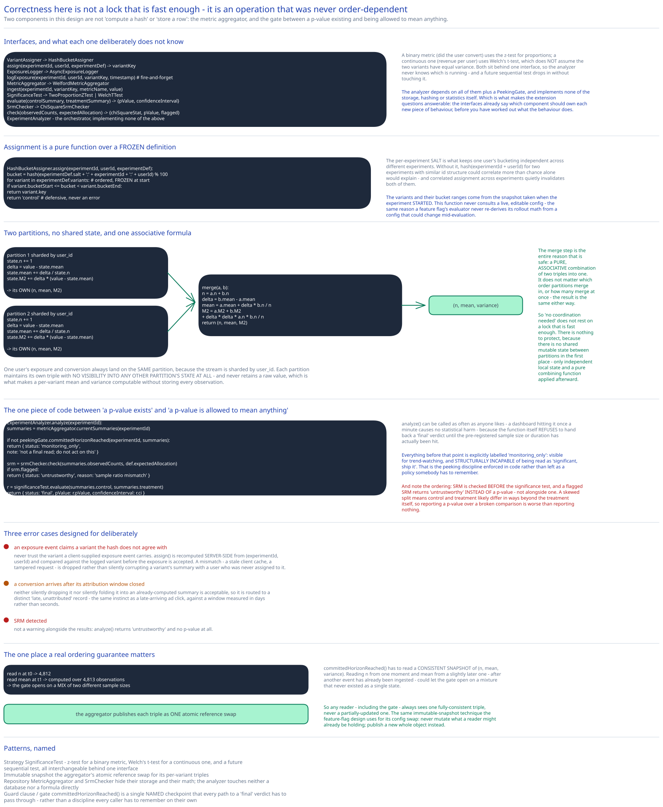

# Module 02 — Low-Level Design



## The two components worth designing carefully

Everything else in this feature is "compute a hash" or "store a row." These two are not:

1. **The metric aggregator** — turning a stream of per-user `(exposure, conversion)` pairs into a per-variant `(n, mean, variance)` without ever storing every raw value, and without needing partitions to coordinate with each other to do it.
2. **The peeking gate** — the one piece of code that stands between "a p-value exists" and "a p-value is allowed to mean anything."

## Interfaces vs. implementations

- **`VariantAssigner`** *(interface)* → **`HashBucketAssigner`** — `assign(experimentId, userId) -> variantKey`. A pure function: no state, no I/O, given the current (frozen) experiment definition as an argument, the same shape as this guide's [feature-flag evaluator](../../../feature-flags-rollout/02-lld.md).
- **`ExposureLogger`** *(interface)* → **`AsyncExposureLogger`** — `logExposure(experimentId, userId, variantKey, timestamp)`, fire-and-forget publish to the exposure ingestion queue.
- **`MetricAggregator`** *(interface)* → **`WelfordMetricAggregator`** — `ingest(experimentId, variantKey, metricName, value)`, maintaining a running `(n, mean, M2)` triple per `(experiment, variant, metric)` — incremental, no raw values retained.
- **`SignificanceTest`** *(interface)* → **`TwoProportionZTest`** / **`WelchTTest`** — `evaluate(controlSummary, treatmentSummary) -> {pValue, confidenceInterval}`. A binary metric (did the user convert) uses the z-test for proportions; a continuous metric (revenue per user) uses Welch's t-test, which doesn't assume the two variants have equal variance.
- **`SrmChecker`** *(interface)* → **`ChiSquareSrmChecker`** — `check(observedCounts, expectedAllocation) -> {chiSquareStat, pValue, flagged}`.
- **`ExperimentAnalyzer`** — the orchestrator. Depends on all of the above plus a `PeekingGate`, implements none of the storage, hashing, or statistics itself.

## The assignment function, and why it's frozen

```
HashBucketAssigner.assign(experimentId, userId, experimentDef):
    bucket = hash(experimentDef.salt + ":" + experimentId + ":" + userId) % 100
    for variant in experimentDef.variants:            # ordered, frozen at experiment start
        if variant.bucketStart <= bucket < variant.bucketEnd:
            return variant.key
    return "control"                                   # defensive default, never an error
```

The per-experiment `salt` is what keeps one user's bucketing independent across different experiments — without it, `hash(experimentId + userId)` for two experiments sharing a similar id structure could correlate more than chance alone would explain. `experimentDef.variants` and their bucket ranges are read from the frozen snapshot taken when the experiment started (Module 01's "allocation stability" trade-off) — this function never consults a live, editable config, the same reason a feature flag's evaluator never re-derives its rollout math from a config that could change mid-evaluation.

## Metric ingestion: Welford's algorithm, and why no lock is needed to merge partitions

```
WelfordMetricAggregator.ingest(key, value):            # key = (experiment, variant, metric)
    state = partitionState[key]                          # this partition's own local triple
    state.n += 1
    delta = value - state.mean
    state.mean += delta / state.n
    state.M2 += delta * (value - state.mean)

WelfordMetricAggregator.merge(a, b):                    # combining two partitions' triples
    n = a.n + b.n
    delta = b.mean - a.mean
    mean = a.mean + delta * b.n / n
    M2 = a.M2 + b.M2 + delta * delta * a.n * b.n / n
    return (n, mean, M2)
```

Each stream partition (sharded by `user_id`, so one user's exposure and conversion always land on the same partition) maintains its own `(n, mean, M2)` with no visibility into any other partition's state at all. The `merge` step is the entire reason that's safe: it's a pure, associative combination of two triples into one — it doesn't matter which order partitions merge in, or how many merge at once, the result is the same either way. That's what "no coordination needed" (Module 01's Concurrent-User Handling) actually rests on: not a lock that's fast enough, but an operation that was never order-dependent to begin with.

## The peeking gate

```
ExperimentAnalyzer.analyze(experimentId):
    summaries = metricAggregator.currentSummaries(experimentId)   # per-variant (n, mean, variance)

    if not peekingGate.committedHorizonReached(experimentId, summaries):
        return {status: "monitoring_only", note: "not a final read; do not act on this"}

    srmResult = srmChecker.check(summaries.observedCounts, experimentDef.expectedAllocation)
    if srmResult.flagged:
        return {status: "untrustworthy", reason: "sample ratio mismatch", srm: srmResult}

    result = significanceTest.evaluate(summaries.control, summaries.treatment)
    return {status: "final", pValue: result.pValue, confidenceInterval: result.confidenceInterval}
```

`analyze()` can be called as often as anyone likes — a dashboard hitting it once a minute causes no statistical harm, because the function itself refuses to hand back a `"final"` verdict until `peekingGate.committedHorizonReached` says the pre-registered sample size or duration has actually been hit. Everything before that point is explicitly labeled `"monitoring_only"` — visible for trend-watching, but structurally incapable of being read as "significant, ship it." This is the peeking discipline from Module 01 enforced in code rather than left as a policy someone has to remember.

## Error cases worth designing for deliberately

- **An exposure event claims a variant the hash doesn't agree with.** Never trust the variant a client-supplied exposure event carries — `HashBucketAssigner.assign()` is recomputed server-side from `(experimentId, userId)` and compared against the logged variant before the exposure is accepted. A mismatch (a stale client cache, a tampered request) is dropped rather than silently corrupting a variant's summary with a user who was never actually assigned to it.
- **A conversion event arrives after its attribution window closed.** Neither silently dropping nor silently folding it into an already-computed summary is acceptable — it's routed to a distinct "late, unattributed" record, the same instinct this guide applies to [ad-click aggregation](../ad-click-aggregation/02-lld.md)'s late-arriving click, just against a window measured in days rather than seconds.
- **SRM detected.** `srmChecker` flagging a check isn't a warning alongside the results — `analyze()` returns `"untrustworthy"` instead of a p-value at all. A skewed split means control and treatment likely differ in ways beyond the treatment itself, and reporting a p-value computed over a broken comparison would be worse than reporting nothing.

## Concurrency at the code level

`WelfordMetricAggregator.ingest()` needs no lock across partitions, and this is worth stating explicitly the same way this guide does everywhere two writers might race for the same logical value: correctness here doesn't come from a lock at all, it comes from the merge formula being associative and order-independent by construction — there's nothing to protect because there's no shared mutable state between partitions in the first place, only independent local state and a pure combining function applied afterward.

The one place a real ordering guarantee matters is `peekingGate.committedHorizonReached()` itself: it has to read a **consistent snapshot** of `(n, mean, variance)` — reading `n` from one moment and `mean` from a slightly later one (after another event has already been ingested) could let the gate open on a mix of two different sample sizes. The aggregator publishes its per-variant triple as a single atomic reference swap (the same immutable-snapshot technique this guide's [feature-flag](../../../feature-flags-rollout/02-lld.md) design uses for its config swap), so any reader — including the gate — always sees one fully-consistent triple, never a partially-updated one.

## Design patterns you just used, named

- **Strategy** — `SignificanceTest` is a strategy: `TwoProportionZTest` for a binary metric, `WelchTTest` for a continuous one, and a future sequential test, all interchangeable behind one interface without `ExperimentAnalyzer` knowing which is running.
- **Immutable snapshot** — the aggregator's atomic reference swap for its per-variant triples is the identical technique this guide's feature-flag config swap uses: never mutate what a reader might already be holding, publish a new whole object instead.
- **Repository pattern** — `MetricAggregator` and `SrmChecker` hide their storage and math behind method calls; `ExperimentAnalyzer` never touches a database or a formula directly.
- **Guard clause / gate pattern** — `peekingGate.committedHorizonReached()` is a single, named checkpoint that every path to a `"final"` verdict has to pass through, rather than a discipline every caller has to remember on their own.

## Practice: extend it yourself

Before moving to Database Design, sketch (pseudocode is fine) how you'd add:

1. **Mutually exclusive experiment layers** — experiment A and experiment B both touch the checkout button, and a user should never be in both at once. Does `VariantAssigner` need a second hash input (a layer id), and what changes about `experimentDef` to express "these experiments share a layer and can't co-assign the same user"?
2. **A sequential significance test for continuous peeking** — instead of `peekingGate` gating a single fixed-horizon `TwoProportionZTest`, swap in an always-valid sequential test that's mathematically safe to check on every `analyze()` call. Does the aggregator need to expose anything it currently doesn't (a running *sequence* of summaries over time, not just the latest snapshot), or does the new `SignificanceTest` implementation absorb all of the change?

Neither has one clean answer — the point is noticing that the interfaces already drawn (`VariantAssigner`, `SignificanceTest`, the aggregator's snapshot) make it obvious which component *should* own each new piece of behavior, even before you've fully worked out what that behavior does.
