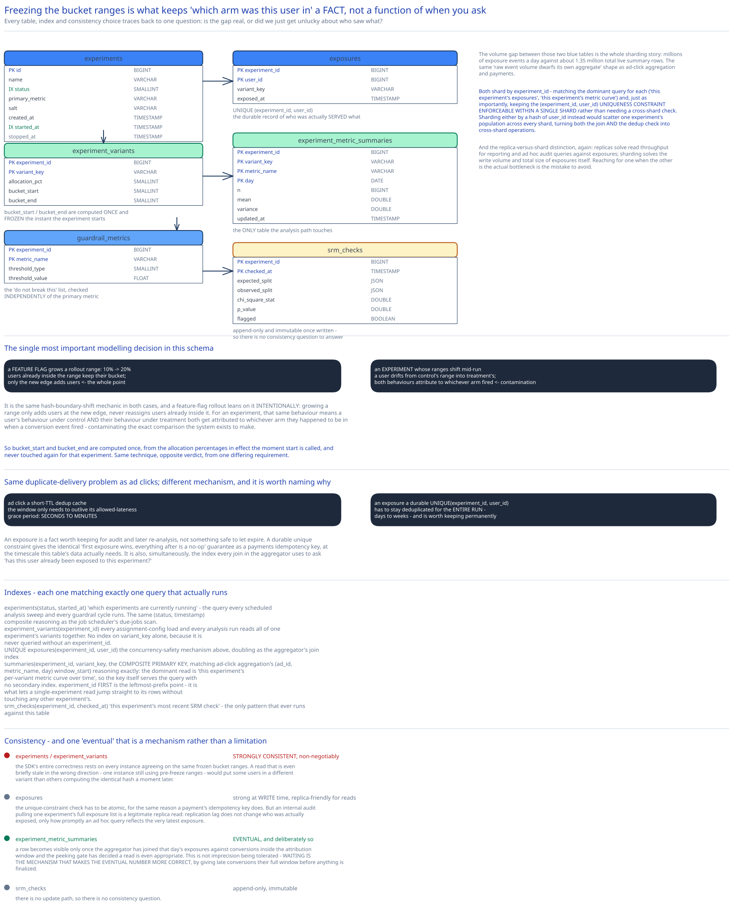

# Module 03 — Database Design & Scaling

## From entities to schema

- **`experiments`** `(id, name, status, primary_metric, salt, created_at, started_at, stopped_at)` — the experiment's identity and lifecycle state.
- **`experiment_variants`** `(experiment_id, variant_key, allocation_pct, bucket_start, bucket_end)` — one row per variant, ordered, with `bucket_start`/`bucket_end` computed and **frozen** the instant the experiment transitions from `draft` to `running`.
- **`guardrail_metrics`** `(experiment_id, metric_name, threshold_type, threshold_value)` — the "don't break this" list, checked independently of the primary metric.
- **`exposures`** `(experiment_id, user_id, variant_key, exposed_at)` — one row per user per experiment, the durable record of who was actually served what.
- **`experiment_metric_summaries`** `(experiment_id, variant_key, metric_name, day, n, mean, variance, updated_at)` — the aggregate the Metrics Aggregator writes and the Stats Engine reads; this is the only table the analysis path touches.
- **`srm_checks`** `(experiment_id, checked_at, expected_split, observed_split, chi_square_stat, p_value, flagged)` — the data-quality gate every result has to pass before it's trusted.

## Why `experiment_variants`' bucket ranges are frozen, not recomputed live

This is the single most important modeling decision in this schema, and it's a direct consequence of Module 01's "allocation stability" trade-off. `bucket_start`/`bucket_end` are computed once, from the allocation percentages in effect the moment `POST /experiments/{id}/start` runs, and never touched again for that experiment. A live-recomputed version — where editing `allocation_pct` immediately shifts the ranges — would be the exact same [hash-boundary-shift mechanic](../../hld-building-blocks/consistent-hashing.md) a feature-flag rollout leans on *intentionally*: growing a range only adds users at the new edge, never reassigns users already inside it. For a flag, that's the whole point. For an experiment, a user drifting from `control`'s range into `treatment`'s mid-run means their behavior under control and their behavior under treatment both get attributed to whichever arm they happened to be in when a conversion event fired — contaminating the exact comparison this system exists to make. Freezing the ranges is what keeps "which arm was this user in" a fact about the experiment, not a function of when you ask.

## Why `exposures` gets a unique index on `(experiment_id, user_id)`, not a TTL cache

The same "duplicate delivery" problem [ad-click aggregation](../ad-click-aggregation/03-db-design.md) solves with a short-TTL dedup cache shows up here, but the right mechanism is different, and it's worth naming why: ad-click's dedup window only needs to outlive its allowed-lateness grace period (seconds to minutes), so a TTL cache is the cheap, correct tool. An experiment's exposure has to stay deduplicated for the entire run — days to weeks — and it's a fact worth keeping permanently for audit and later re-analysis, not something safe to let expire. A durable unique constraint (`UNIQUE(experiment_id, user_id)`) gives the identical "first exposure wins, everything after is a no-op" guarantee as a payments idempotency key, at the timescale this table's actual data actually needs.

## Why `experiment_metric_summaries` is eventually consistent, and deliberately so

The same reasoning [ad-click aggregation](../ad-click-aggregation/03-db-design.md) applies to its own aggregate store: a row here only becomes visible once the Metrics Aggregator has joined that day's exposures against conversions inside the attribution window and the peeking gate has decided a read is even appropriate. This isn't imprecision being tolerated — waiting is the mechanism that makes the eventual number *more* correct, by giving late-arriving conversions their full attribution window before anything is finalized.

## Indexes

- `experiments(status, started_at)` — the query every scheduled analysis sweep and every Guardrail Monitor cycle runs: "which experiments are currently `running`" — the same `(status, timestamp)` composite reasoning this guide's [distributed job scheduler](../distributed-job-scheduler/03-db-design.md) uses for its own due-jobs scan.
- `experiment_variants(experiment_id)` — every assignment-config load and every analysis run reads all of one experiment's variants together; no separate index on `variant_key` alone is needed since it's never queried without an `experiment_id`.
- **Unique** `exposures(experiment_id, user_id)` — the concurrency-safety mechanism above, and simultaneously the index every join in the Metrics Aggregator uses to look up "has this user already been exposed to this experiment."
- `experiment_metric_summaries(experiment_id, variant_key, metric_name, day)` — the **composite primary key**, matching [ad-click aggregation](../ad-click-aggregation/03-db-design.md)'s `(ad_id, window_start)` reasoning exactly: the dominant read is "this experiment's per-variant metric curve over time," so the key itself serves the query with no secondary index required (cross-ref [Database Indexing](../../database-design/database-indexing.md)'s leftmost-prefix point — `experiment_id` first is what lets a single-experiment read jump straight to its rows without touching any other experiment's).
- `srm_checks(experiment_id, checked_at)` — "this experiment's most recent SRM check," the only query pattern that ever runs against this table.

## Consistency

- **`experiments` / `experiment_variants`:** strongly consistent, non-negotiably. The Assignment SDK's entire correctness rests on every instance agreeing on the same frozen bucket ranges; a read that's even briefly stale in the wrong direction (one instance still using pre-freeze ranges) would put some users in a different variant than others computing the identical hash a moment later.
- **`exposures`:** strongly consistent at write time — the unique-constraint check has to be atomic, for the same reason a payment's idempotency key does — but read-heavy queries (an internal audit pulling one experiment's full exposure list) are a legitimate candidate for a read replica, since replication lag doesn't change who was actually exposed, only how promptly an ad hoc query reflects the very latest exposure.
- **`experiment_metric_summaries`:** eventually consistent by design, per above — this is a property of the pipeline that produces it, not a limitation to work around.
- **`srm_checks`:** append-only and immutable once written, the same "there's no update path, so there's no consistency question" property this guide's [ad-click aggregation](../ad-click-aggregation/03-db-design.md) raw click log has.

## Scaling the schema

- **Sharding, once volume demands it:** `exposures` and `experiment_metric_summaries` both shard by `experiment_id` — matching the dominant query pattern for both ("this experiment's exposures," "this experiment's metric curve") *and*, just as importantly, keeping the `(experiment_id, user_id)` uniqueness constraint enforceable within a single shard rather than needing a cross-shard check. Sharding either table by a hash of `user_id` instead would scatter one experiment's population across every shard, turning both the join and the dedup check into cross-shard operations.
- **`exposures` outgrows `experiment_metric_summaries` by orders of magnitude** (Module 00's capacity math: millions of exposure events/day against ~1.35M total live summary rows) — the same "raw event volume dwarfs its own aggregate" gap this guide's ad-click-aggregation and payments case studies both build their sharding story around.
- **Read replicas vs. sharding, again:** replicas solve read throughput for reporting and ad hoc audit queries against `exposures`; sharding solves the write volume and total size of `exposures` itself as traffic and experiment count grow. Reaching for one when the other is the actual bottleneck is the mistake to avoid, the same distinction this guide draws in every other case study's DB design.

## Connecting it back

Look at all three modules together: Module 00's requirement that a "statistically significant" result actually mean what it claims is why Module 01 puts a frozen allocation and a peeking gate at the center of the design rather than trusting a live dashboard; that same requirement is why `experiment_variants`' bucket ranges are computed once and never touched again here, rather than recomputed on every read the way a feature flag's rollout percentage safely is; and the unique constraint on `exposures(experiment_id, user_id)` is what makes "a user who was bucketed but never actually saw the treatment doesn't count" (Module 00's core distinction) a database-enforced fact rather than a hope. Nothing in this schema is arbitrary — every table, index, and consistency choice traces back to the one question this case study opened with: is the gap real, or did we just get unlucky about who saw what?
