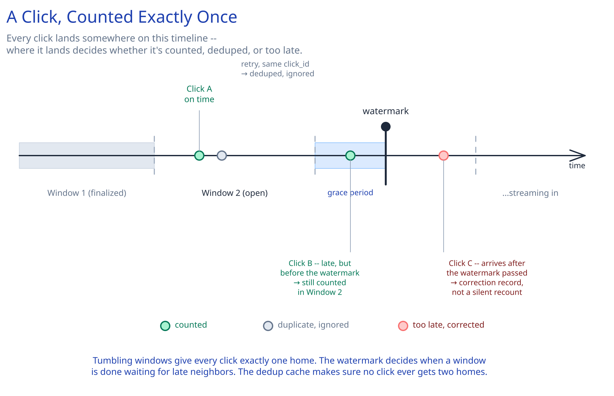

# Module 00 — Overview

## Requirements

**Functional:**
- Ingest ad-click events fired from wherever an ad is shown (a redirect, a tracking pixel).
- Aggregate click counts per `(ad_id, time_window)` for advertiser billing and reporting.
- Never double-count the same click, even if the client retries the tracking request.
- Tolerate events arriving a little late (network delay between the click and the tracking beacon reaching the ingestion tier) without producing a wrong final count.

**Non-functional** (stated as assumptions, interview-style):
- 1M clicks/sec at peak (a major campaign launch).
- Aggregated counts need to be available within a few minutes of a time window closing — advertisers check dashboards, they don't need sub-second billing numbers.
- An advertiser must never be billed for a duplicate or fraudulent click — correctness of the count matters more than how fast it appears.

## Capacity Estimation

Using this guide's [back-of-envelope method](../../foundations/back-of-envelope-estimation.md):

- **Ingestion rate:** 1M clicks/sec peak. At roughly 200 bytes/event (ad_id, timestamp, user/session id, metadata): **~200MB/sec** raw ingestion bandwidth at peak.
- **Raw event storage:** if raw click events are retained for 30 days for audits/fraud review: 200MB/sec × 86,400 × 30 ≈ **~500PB** — large enough that raw events clearly need cold, cheap storage, not a hot database (cross-ref [Object / Blob Storage](../../scalability-resilience/object-blob-storage.md)).
- **Aggregate storage:** the AGGREGATED counts are tiny by comparison — one row per `(ad_id, minute)` instead of one row per click. With, say, 10M active ads and 1,440 minutes/day: ~14.4B aggregate rows/day, each a few dozen bytes — orders of magnitude smaller than the raw stream, which is the entire point of aggregating.

## Approach Walkthrough

A click event is fired, lands in an ingestion queue, and is processed by a stream aggregation layer that buckets it into a fixed time window (e.g. one-minute tumbling windows) and increments that window's running count. A window isn't finalized and written to the durable aggregate store the instant its time boundary passes — it waits a short grace period for straggling, slightly-late events first. A serving API then reads from the durable aggregate store, not from the live stream, so an advertiser's dashboard query never touches the hot ingestion path.

## API Surface

- Click ingestion (fire-and-forget from the ad-serving side): `POST /clicks {ad_id, click_id, client_timestamp, session_id}`.
- `GET /campaigns/{ad_id}/stats?window_start=&window_end=` -> `{ windows: [{window_start, click_count, unique_click_count}] }`.
