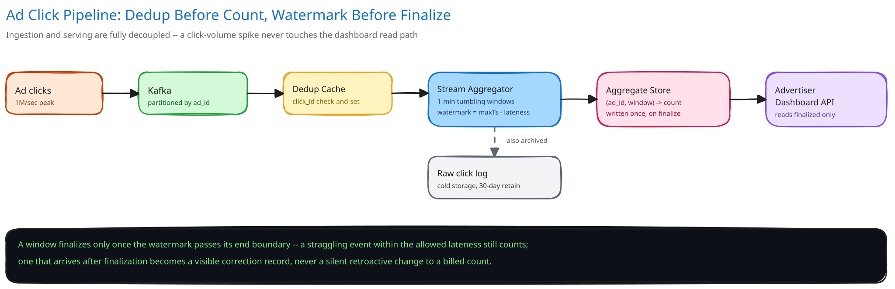

# Module 01 — Architecture & High-Level Design

## Monolith vs. microservices

Click ingestion and aggregation is pulled out as its own pipeline, entirely separate from the ad-serving path that actually shows the ad and fires the tracking beacon. The two have almost opposite load profiles: ad-serving is **latency-critical** — a slow ad response is a lost impression, and it has to answer in single-digit milliseconds — while click aggregation is **throughput-critical but latency-tolerant**, per the requirement that a few minutes of delay before a count appears on a dashboard is fine. Folding aggregation into the ad-serving service would force ad-serving to be provisioned and operated for aggregation's very different failure mode: a 1M-click/sec ingestion burst is a capacity problem for a stream pipeline, but it would be an availability incident for a service that also has to keep answering ad requests in milliseconds. Keeping them separate means a click-ingestion backlog (queue growing, per Load Handling below) never once threatens the ad-serving path's own latency budget.

The seam is exactly "fire the event" / "count the event": ad-serving publishes a click event and forgets about it; everything downstream — dedup, windowing, watermarking, aggregation — belongs to a pipeline that ad-serving never talks to directly or waits on.

## Per-path walkthrough

**Ingestion path** — `Ad-serving beacon → Ingestion queue (partitioned by ad_id) → Stream Processor (dedup check, window assignment, running-count increment)`. Fire-and-forget from the ad-serving side — publishing the click event is not on the ad response's own critical path, so a slow or backed-up ingestion tier never delays an ad impression.

**Finalization path** — `Stream Processor (watermark advances past a window's end) → Aggregate Store (durable write, window marked finalized)`. This is the step that converts an in-memory running count into a durable, billable number — and it only happens once, per window, per ad, driven by the watermark rather than a wall-clock timer.

**Serving path (read)** — `Advertiser dashboard → Serving API → Aggregate Store (read-only)`. Deliberately never touches the live stream or the in-memory running counts — a dashboard query only ever sees windows that have already been finalized, which is what makes the "never double-count, never bill on an unfinished number" guarantee hold even under concurrent reads.

## Trade-offs to make explicit

| Decision | Chosen | Alternative | Why |
|---|---|---|---|
| Window type | Tumbling (fixed, non-overlapping) | Sliding (overlapping) windows | Billing needs a click to belong to exactly one window; a sliding window's whole point is letting one event contribute to several overlapping buckets, which is the wrong shape for "count this click exactly once against exactly one billing period" |
| Late-data handling | Watermark-based grace period, then explicit correction record | Wait indefinitely for every possible late event before finalizing | Waiting indefinitely means a window (and the advertiser's bill) never actually closes; a bounded grace period trades a small, named risk of dropped/late data for the ability to finalize and bill on a predictable schedule |
| Dedup mechanism | Atomic check-and-set against a TTL'd cache, keyed by `click_id` | A distributed lock around the increment | A lock only prevents concurrent access, it doesn't record what's already been seen — the cache-based check-and-set is what actually answers "have I processed this exact click before," the same reasoning [Idempotency Keys](../../scalability-resilience/idempotency-keys.md) applies everywhere in this guide |
| Delivery semantics | At-least-once delivery + application-level dedup | Exactly-once stream processing | True exactly-once delivery across a distributed log and a downstream store is a much harder, more expensive guarantee to build and operate; at-least-once plus an idempotent dedup check achieves the same *observable* effect (no double-counted click) far more cheaply |
| Fraud filtering | A separate pass over the same ingested stream | Built into the core counting/windowing logic | Keeps the windowing mechanism simple and universally correct; fraud rules change far more often than the counting mechanism does, and coupling them would mean every fraud-model update risks the core billing-count logic |

## Load Handling

- **Peak-vs-average tolerance:** a viral ad or a campaign launch spiking to the stated 1M clicks/sec peak is an ordinary horizontal-scaling problem for the stream-processing tier — more partition consumers, same per-event logic. Because ingestion and serving are fully decoupled (per the walkthrough above), this spike never once touches the advertiser-facing dashboard's latency.
- **Where backpressure kicks in first:** at the ingestion queue itself. If the stream processors can't keep up with a sustained spike, events queue in the partitioned log rather than being dropped (cross-ref [Backpressure, Load Shedding & Bulkheads](../../scalability-resilience/backpressure-load-shedding.md)) — a growing queue depth is the visible, correct signal to autoscale on.
- **What gets shed under overload:** nothing on the counting path — a click is either ingested and eventually counted, or it isn't ingested at all (a true beacon-send failure on the client side, outside this system's control). What *can* lag under pressure is how quickly a window finalizes, which only affects how promptly a number appears on a dashboard, never whether it's eventually correct.
- **Autoscaling lag:** stream-processor autoscaling reacts on a 1-3 minute horizon, same as this guide's other stateless/horizontally-scaled tiers. The queue is exactly what absorbs the gap before new capacity comes online — a burst that started ninety seconds ago is still sitting safely in the log, not lost.
- **Load-test target:** sustain 1M events/sec ingestion for 10 minutes with zero dropped events (verified against the raw click log's own count) and windows finalizing within the configured watermark grace period plus a small, bounded processing lag.

## Concurrent-User Handling

| Race | Mechanism | What the "loser" sees |
|---|---|---|
| The same click delivered twice (a genuine client retry, or the stream's own at-least-once redelivery after a consumer restart) | Dedup cache's check-and-set on `click_id` is a single atomic operation, not a read-then-write | The second (and any subsequent) delivery is recognized as already-seen and dropped — the count increments exactly once |
| A click's timestamp lands right on a window boundary (e.g. exactly at the minute mark) | Window assignment is a deterministic function of `client_timestamp` alone (`tumblingWindowFor`), evaluated identically regardless of which consumer or how many times it's evaluated | The click lands in exactly one window every time it's assigned, even if dedup logic re-evaluates it on a retried delivery |
| A late click arrives just inside the watermark grace period vs. one arriving just after it closes | The watermark is a single moving threshold per partition; "inside" vs. "outside" is a strict, deterministic comparison against that threshold at the moment the event is processed | An event just inside the grace period increments the still-open window normally; one just outside is routed to the explicit late-data correction path instead of silently mutating a finalized count |
| Two partition consumers both believe they own the same partition during a rebalance (a slow consumer-group failover) | Kafka's own consumer-group protocol guarantees exactly one consumer is assigned a given partition at a time (cross-ref [Kafka & the Distributed Log](../../hld-building-blocks/kafka-distributed-log.md)) | The losing (stale) consumer's in-flight processing for that partition is fenced off by the broker once the rebalance completes — it never gets to commit further offsets for a partition it no longer owns |

## Scaling & Reliability

- **Horizontal scaling:** the stream-processing tier scales by adding partition consumers, up to the partition count of the underlying log — more partitions means more parallelism headroom, which is why partition count is chosen generously upfront (cross-ref [Kafka & the Distributed Log](../../hld-building-blocks/kafka-distributed-log.md)).
- **Circuit breaker & retries:** a stream processor's write to the Aggregate Store is retried with bounded backoff on transient failure; a sustained Aggregate Store outage trips a breaker and the processor holds its position in the log rather than losing track of what it has and hasn't finalized — nothing is acknowledged as processed until the durable write actually succeeds.
- **Dead-letter queue:** a malformed event (a corrupt payload, a missing `ad_id`) is routed to a DLQ rather than crashing the processor or silently being dropped — one bad event from one misbehaving client shouldn't stall every other ad's on-time stream.
- **Graceful degradation:** if the Aggregate Store is briefly unavailable, in-memory running counts keep accumulating and windows simply queue up unfinalized until the store recovers — dashboards show slightly stale data, never wrong data.
- **Multi-region:** not built here, and worth naming as a real gap — see "what you'd revisit" below.

## What you'd revisit as this grows

- **Multi-region ingestion.** A single-region pipeline is a regional single point of failure for ad revenue reporting; a mature version ingests regionally and merges aggregates centrally, which reopens the "same click counted in two regions" dedup question at a larger scope.
- **Dynamic watermark tuning.** A fixed allowed-lateness window is a blunt instrument — different networks and client types produce different real-world lateness distributions, and a production system would tune (or even learn) the grace period per traffic segment rather than using one global constant.
- **Fraud detection feeding back into the pipeline**, without adding synchronous latency to ingestion — deliberately scoped out of this module as its own problem (a scoring pass over the stream, per the Trade-offs table above), not tangled into the core counting mechanism.
- **Exactly-once semantics if a downstream consumer ever needs it** — this design accepts at-least-once-plus-dedup as good enough for billing counts; a future consumer with a stricter requirement (e.g. triggering a one-time side effect per click) would need a different guarantee than "the count is eventually correct."
