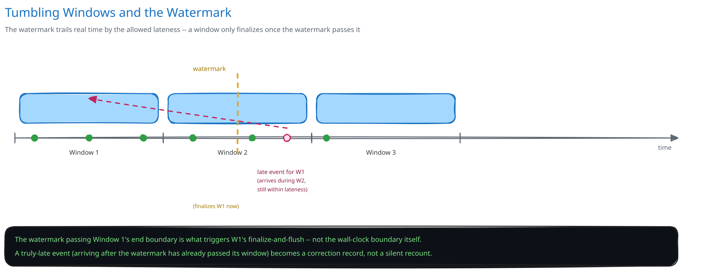

# Module 02 — Low-Level Design



## Interfaces vs. implementations

- **`Deduplicator`** *(interface)* → **`RedisDeduplicator`** — `seen(clickId)`, `markSeen(clickId, ttl)`, backed by a single atomic check-and-set (`SET clickId NX EX ttl` or equivalent) so the check and the write are one operation, not two.
- **`WindowAggregator`** *(interface)* → **`TumblingWindowAggregator`** — `assign(timestamp)` returns the window a click belongs to; `increment(adId, window)`; `advanceWatermark(timestamp)` returns the list of windows now eligible to finalize.
- **`AggregateStore`** *(interface)* → **`ShardedAggregateStore`** — `write(adId, window, counts)`, `read(adId, windowRange)` — the durable, billable source of truth once a window finalizes.
- **`StreamProcessor`** — the orchestrator. Depends on all three interfaces, implements none of the storage or dedup logic itself, matching this guide's repository-pattern discipline elsewhere.

## Window assignment and watermark-triggered finalization

```
StreamProcessor.onEvent(click):
    if deduplicator.seen(click.click_id):
        return   # already counted, ignore
    deduplicator.markSeen(click.click_id, ttl=allowedLateness + buffer)   # atomic check-and-set

    window = windowAggregator.assign(click.client_timestamp)
    windowAggregator.increment(click.ad_id, window)

    watermark = max(watermark, click.client_timestamp - allowedLateness)
    for w in windowAggregator.advanceWatermark(watermark):
        if not w.finalized:
            aggregateStore.write(w.ad_id, w, windowAggregator.countsFor(w))
            w.finalized = True
```

A late event arriving for an already-finalized window is routed to a separate correction record rather than silently mutating a count an advertiser may have already been billed against — the pipeline makes the correction visible instead of quietly changing history.

## Error cases worth designing for deliberately

- **Duplicate delivery (retry or redelivery):** `deduplicator.seen()` returning true is not an error — it's the expected, common outcome of at-least-once delivery. Silently dropping is correct here; there is no result to return to a fire-and-forget beacon anyway.
- **Late arrival past the watermark:** neither silently dropping nor silently incrementing a finalized window is acceptable — this guide's convention (distinguishing states explicitly rather than collapsing them, the same instinct as the URL shortener's "not found" vs. "expired") applies here as "on time" vs. "late-but-correctable," routed to a distinct correction path.

## Concurrency at the code level

`deduplicator.markSeen()` needs no in-process lock, and this is worth stating explicitly: many stream-processor instances run concurrently across partitions (and, during a rebalance, briefly across a handoff), so a language-level mutex would only ever guard against other threads *on the same instance*. Correctness comes entirely from the check-and-set being atomic at the cache layer itself — the same pattern this guide applies everywhere two writers might race for the same logical key: push the atomicity requirement down into the one system built to provide it for free.

The one place a real ordering guarantee matters at the code level: `advanceWatermark` must only ever move forward, never backward, even if events arrive out of timestamp order within a partition — a naive `watermark = click.client_timestamp - allowedLateness` (without the `max(...)`) would let one out-of-order early click regress the watermark and reopen a window that should already be closing.

## Design patterns you just used, named

- **Repository pattern** — `AggregateStore` hides storage behind method calls; `StreamProcessor` never writes directly to whatever database backs it.
- **Strategy pattern** — `WindowAggregator` is a strategy: `TumblingWindowAggregator` is one implementation: a `SlidingWindowAggregator` for a different metric (not billing) could sit behind the same interface without changing the orchestrator.
- **Idempotency-key pattern** — `Deduplicator` is this pattern by name, applied to a click event instead of a payment request, exactly as [Idempotency Keys](../../scalability-resilience/idempotency-keys.md) describes generically.

## Practice: extend it yourself

Before moving to Database Design, sketch (pseudocode is fine) how you'd add:

1. **Fraud-click filtering** — a velocity check that flags more than N clicks from the same session within a short window as suspicious. Does this belong inside `StreamProcessor.onEvent`, or as a separate pass over the same stream? What does "excluded from the count" need to look like so it's auditable later, not just silently missing?
2. **Multi-dimensional aggregation** — counting by `(ad_id, window)` **and**, simultaneously, by `(campaign_id, geography, window)` for a different report. Does `WindowAggregator` need a second implementation, or can one event update multiple aggregation keys through the same interface? What happens to the dedup check if the same click now needs to increment two different counters?

Neither has one clean answer — the point is noticing that the interfaces already drawn make it obvious which component *should* own each new piece of behavior, even before you've fully worked out what that behavior does.
