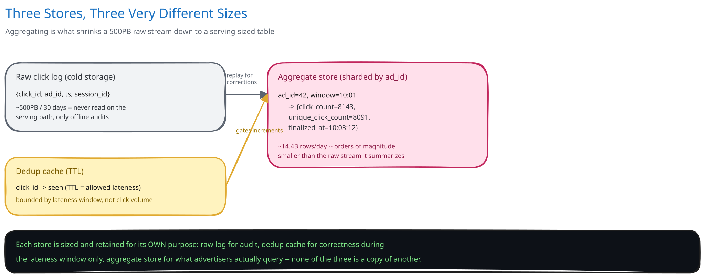

# Module 03 — Database Design & Scaling

## From entities to schema

- **Aggregate store:** `(ad_id, window_start) -> {click_count, unique_click_count, finalized_at}`, sharded by `ad_id` — every serving query is "this ad's counts over some time range," so keeping one ad's windows together avoids fan-out on the dominant read.
- **Dedup cache:** a short-lived, TTL-based key-value store (cross-ref [Caching Strategies](../../hld-building-blocks/caching-strategies.md)) keyed by `click_id` — it only needs to retain entries slightly longer than the allowed-lateness window, not forever, since a click older than that has already either been counted or dropped for good.
- **Raw click log:** append-only, cold storage (cross-ref [Object / Blob Storage](../../scalability-resilience/object-blob-storage.md)), kept for audit/fraud-review purposes — never read on the serving path, only by offline analysis.

## Indexes

- **Aggregate store:** primary key `(ad_id, window_start)` — the composite key itself *is* the index this system's dominant query needs ("this ad's counts, this time range"), no separate secondary index required for the serving path.
- **Aggregate store, secondary:** `(finalized_at)` if a batch job needs "windows finalized in the last hour" for downstream export or reconciliation — a narrow, purpose-specific index rather than one added speculatively.
- **Dedup cache:** no traditional index — a key-value store's native key lookup (`click_id`) *is* the access pattern, which is exactly why a cache, not a relational table, is the right engine for this piece of the schema (cross-ref [SQL vs NoSQL](../../database-design/sql-vs-nosql.md)'s point that the query pattern should pick the storage engine).
- **Raw click log:** no index at all in the traditional sense — it's written once, sequentially, and read back only by full-range batch scans (a reprocessing job, an audit), the access pattern cold object storage is built for.

## Consistency

- **Aggregate store:** eventually consistent by design, and explicitly so — a window's count only becomes visible once the watermark finalizes it, which is itself an intentional delay (the allowed-lateness grace period) traded for correctness. This is a different flavor of "eventual" than a cache lag: it isn't imprecision to be tolerated, it's the mechanism that makes the final number *more* correct by waiting for stragglers.
- **Dedup cache:** must be strongly consistent for a single `click_id` — a check-and-set that can race (two concurrent reads both seeing "not seen yet") would reintroduce the exact double-count this system exists to prevent. This is why it's implemented as one atomic operation, not a read followed by a write.
- **Raw click log:** append-only and immutable once written — there's no update path at all, which sidesteps the consistency question for this store entirely; the only operation is "append" and "read a range."

## Scaling the schema

- **Sharding the aggregate store**, once volume demands it: by `ad_id`, matching the dominant query pattern exactly as noted above — an alternative like sharding by a hash of `(ad_id, window_start)` would scatter one ad's history across shards and turn "this ad's counts over time" into a fan-out-and-merge query.
- **The raw click log scales independently and far faster** than the aggregate store (per Module 00's capacity math: ~500PB vs. a comparatively tiny aggregate store) — this is itself a reason the two live on entirely different storage tiers rather than one schema trying to serve both access patterns.
- **Read replicas vs. sharding, again:** replicas would help if serving-query read volume ever became the bottleneck (many advertisers polling dashboards); sharding solves the aggregate store's write volume and total size as ad count grows. Reaching for one when the other is the actual constraint is the mistake to avoid, the same distinction this guide draws in every other case study's DB design.

## Connecting it back

Look at all three modules together: Module 00's "never double-count, tolerate late arrivals" requirement is why Module 01 introduces a watermark instead of finalizing windows on a wall-clock timer; that same requirement is why the dedup cache's check-and-set has to be atomic rather than a read-then-write; and the decision to keep raw events in cheap cold storage, entirely separate from the tiny aggregate store, is what makes reprocessing after a bug (Module 04) possible at all without re-ingesting live traffic. Nothing in this schema is arbitrary — the storage tier for each entity traces directly back to how that entity is actually queried.
