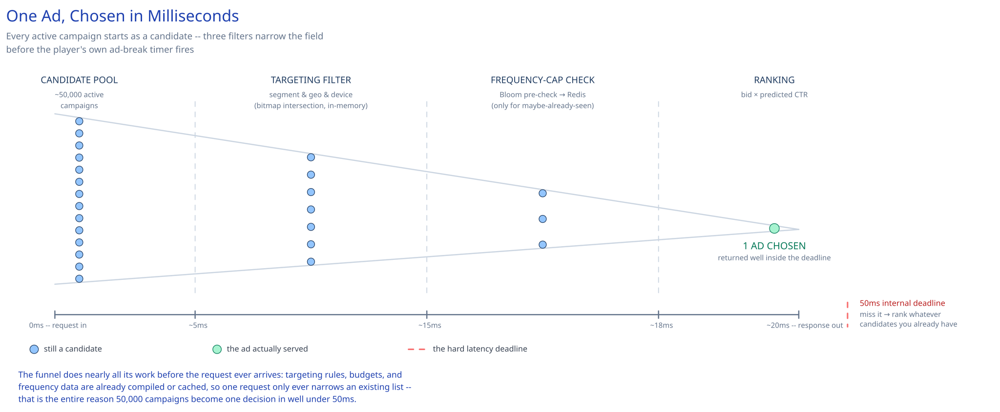

# Module 00 — Overview

## The feature, with no infrastructure in it yet

A video app is about to play an ad break. It asks one question — "what should I show this viewer, right now?" — and the answer has to come back before the player's own ad-break timer runs out: well under 100ms, and often closer to 50ms, because the ad call is just one of several things happening inside a page or app load that itself has a latency budget of a few hundred milliseconds. Miss that window and there's no time to fall back to a second choice; the slot plays nothing, or a default house ad, and that impression's revenue is gone. That's the one hard constraint every other decision in this case study answers to: **this is a hard real-time decision problem, not a lookup with a generous SLA** — closer in spirit to [Rate Limiting](../../hld-building-blocks/rate-limiting.md)'s per-request check than to a typical CRUD read.

Underneath that single question are three separable problems, each hard on its own: which of tens of thousands of active campaigns is this viewer even eligible to see (targeting, budget, flight dates, frequency cap); which of the eligible ones is worth showing the most (ranking); and how do you know a viewer hasn't already seen this exact ad too many times today, without a synchronous database round trip on every single request (frequency capping). This case study covers the **serving** side of ad tech — deciding which ad to show, in real time, before the page renders. What happens to an impression or click *after* it's served — durably counting it for billing and reporting — is a different problem with the opposite latency profile, covered separately in [Ad Click Aggregation Pipeline](../ad-click-aggregation/00-overview.md).

## Requirements

**Functional:**
- Given an ad request (viewer id, context — geo, device, content being watched, slot spec), return exactly one eligible ad creative, or an explicit no-fill, within the latency budget.
- Match the viewer against active campaigns' targeting rules: audience segment, geo, device type, content category.
- Enforce a per-user, per-campaign frequency cap (e.g., no more than 3 impressions/day) — this is the concurrency-critical piece of the whole design.
- Respect each campaign's remaining budget and flight (start/end) dates — an exhausted or expired campaign is never eligible.
- Rank the eligible candidates and select a winner by a blended score (bid × predicted click-through rate).
- Fire an impression event asynchronously once an ad is chosen, for downstream billing/reporting — never block the response on this write.

**Non-functional** (stated as assumptions, interview-style):
- p99 ad-decision latency under 100ms, with an internal target closer to 50ms — this call sits on the critical path of a page/app load, not a background job, and it's frequently one of several concurrent steps competing for the same overall load budget.
- Peak load: ~70,000 ad requests/sec during prime-time viewing hours (see Capacity Estimation).
- A slow or unavailable ad-decision path must degrade to "no ad shown," never to "the video/page doesn't load" — availability of the *host* experience outranks availability of the ad itself.
- Slight over-serving of the frequency cap (an occasional extra impression) is an acceptable trade-off against adding synchronous latency to every request; a payments-grade "never wrong" guarantee is explicitly not the bar here — contrast with [Payments System](../payments-system/00-overview.md), where it is.

## Capacity Estimation

Using this guide's [back-of-envelope method](../../foundations/back-of-envelope-estimation.md):

- **Ad requests/day:** 100M ad-supported viewers × ~12 ad opportunities/viewer/day (roughly 2 hours of viewing, one ad slot every ~10 minutes) ≈ **1.2B requests/day** → 1.2B / 86,400 ≈ **~14,000/sec average**. At a 5x prime-time peak factor (7-10pm local — a predictable, recurring clustering, not a rare spike): **~70,000/sec peak**.
- **Active campaigns:** ~50,000 concurrently active campaigns at any moment, each targeting an average of 5 dimension-values (a segment, a geo, a device type, etc.) → **~250,000 rows** in the targeting-rules table — small enough to fully compile into memory (see Approach Walkthrough), which is the whole point.
- **Frequency-cap counters:** 100M users, each exposed to roughly 20 distinct campaigns/day → **~2B active `(user, campaign)` counter keys/day**, each a few dozen bytes with a 24-48h TTL → **~100GB** of hot counter state, clearly a job for a sharded in-memory store, not a relational table.
- **Bloom filter for the fast frequency pre-check:** sized for the same ~2B `(user, campaign)` pairs at [Bloom Filters](../../scalability-resilience/bloom-filters.md)' ~10-bits-per-item guidance ≈ **~2.5GB** — small enough to shard alongside the counter store.

## Approach Walkthrough

An ad request arrives with almost no time to spare: match the viewer against every active campaign's targeting rules, throw out anything already at its frequency cap, out of budget, or outside its flight dates, rank what's left, and answer — all before the player's own ad-break timer fires. The trick that makes this possible at all is doing almost none of that work *at* request time: campaigns, their compiled targeting rules, and each campaign's current budget-eligible flag are periodically compiled into an in-memory index that every ad-decision instance holds locally, so a request only ever does in-memory lookups plus, for a small minority of candidates, one fast round trip to a regional counter store — never a query against the durable campaign database itself.

## API Surface

- `POST /ad-decision {user_id, context: {geo, device, content_id, slot_id}}` → `{ad_id, campaign_id, creative_ref}` or `{no_fill: true}` — the hot synchronous call this whole design exists to answer fast.
- Internal, fire-and-forget on a decision: `impression.served {user_id, campaign_id, ad_id, request_id, served_at}` published to the async event pipeline (feeds billing, frequency-counter reconciliation, and the ingestion side of [Ad Click Aggregation Pipeline](../ad-click-aggregation/00-overview.md)).
- `POST /clicks {ad_id, campaign_id, request_id, client_timestamp}` — the click beacon; ingesting and aggregating this event is out of scope here and covered in full by [Ad Click Aggregation Pipeline](../ad-click-aggregation/00-overview.md).
- `POST /campaigns {advertiser_id, targeting_rules, budget, flight_dates, frequency_cap, bid}` → `{campaign_id}` — advertiser-facing campaign management, low-QPS, not on the hot path (see Architecture & HLD).
