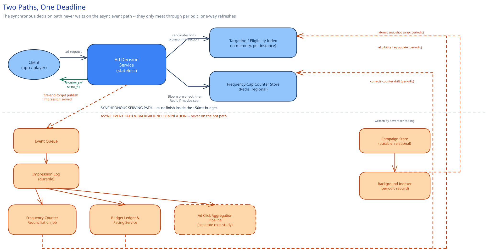

# Module 01 — Architecture & High-Level Design

## Monolith vs. microservices

The Ad Decision Service is pulled out as its own service, separate from the advertiser-facing Campaign Management backend (campaign CRUD, budget entry, the ad-ops dashboard). The two have almost opposite operating profiles: ad decisioning is **latency-critical and read-only-at-request-time** — it has to answer in tens of milliseconds, tens of thousands of times a second, and never writes to the durable campaign store directly — while campaign management is a **low-QPS, write-heavy CRUD service** with no real-time constraint at all. Folding them together would force the low-latency serving tier to share deploys, schema locks, and failure modes with a service built for a completely different job; a slow campaign-management query would have no business ever being able to slow down an ad decision, and keeping them separate makes that structurally impossible rather than a discipline someone has to remember.

There's a second reason the seam holds: the Ad Decision Service's data dependency is a periodically-compiled *snapshot*, not a live connection to the Campaign Store. That asymmetry — one side always reads fresh, the other side is deliberately always a little stale — is exactly the kind of thing that gets muddled if both concerns live in one service, where it's tempting to "just query the DB" the moment a feature needs slightly fresher data.

## Building blocks

| Block | Role |
|---|---|
| **Ad Decision Service** (stateless) | Receives the ad request; orchestrates the targeting lookup, frequency-cap check, budget/flight check, and ranking — the entire hot path lives here |
| **Targeting/Eligibility Index** (in-memory, per-instance replica) | A compiled snapshot of every active campaign's targeting rules plus a budget-eligible flag, rebuilt periodically from the Campaign Store and swapped in atomically — every lookup on the hot path is a memory read against this, never a database query |
| **Frequency-Cap Counter Store** (Redis, regional) | Per-`(user, campaign)` impression counters with a TTL matching the cap window — the authoritative, fast check behind the Bloom-filter pre-check |
| **Bloom filter** (per-region, sharded) | A cheap, in-memory "has this user possibly already seen this campaign" pre-check in front of the Redis round trip — cross-ref [Bloom Filters](../../scalability-resilience/bloom-filters.md) |
| **Campaign Store** (durable, relational) | Source of truth for campaign definitions — targeting rules, budget, flight dates, bid — written by advertiser tooling, read only by the offline indexer, never by a live ad request |
| **Budget Pacing Service** (background) | Periodically compares each campaign's spend-to-date against a smoothed target and flips its serving-eligible flag before the next index rebuild |
| **Event pipeline** (async) | Fire-and-forget publish of `impression.served` and click-beacon events; feeds billing, the frequency-counter reconciliation job, and [Ad Click Aggregation Pipeline](../ad-click-aggregation/00-overview.md) |

## Per-path walkthrough

**Ad decision path (sync, hot — the whole point)** — `Client (app/player) → Ad Decision Service → Targeting Index (in-memory bitmap intersection: segment ∩ geo ∩ device ∩ budget-eligible) → candidate campaigns → Bloom filter pre-check per candidate (in-memory) → Frequency-Cap Counter Store (Redis, only for candidates the Bloom filter flags as "maybe already seen") → Ranker (bid × predicted CTR over what's left) → Client response (one ad, or no-fill)`. Every step is either a memory read or, for a shrinking minority of candidates, one small regional network hop — never a call to the durable Campaign Store.

**Async event path** — `Ad Decision Service (fire-and-forget publish, no local DB write to anchor an outbox to) → Event Queue → Impression Log (durable) → consumed by: frequency-counter reconciliation, Budget Ledger updater (feeds Budget Pacing), and the ingestion side of Ad Click Aggregation Pipeline`. Fully decoupled from the response — a backlog here never adds latency to the decision path, the same separation [Ad Click Aggregation Pipeline](../ad-click-aggregation/01-architecture-hld.md) argues for its own ingestion tier.

**Campaign onboarding / index-refresh path (async, background)** — `Advertiser tooling → Campaign Store (write) → Background Indexer (periodic full or incremental rebuild) → new Targeting Index snapshot → atomically swapped into every Ad Decision Service instance`. Eventually consistent by design — a brand-new or just-paused campaign takes up to one refresh interval (seconds to a couple of minutes) to actually start or stop being eligible, a bounded, named staleness window, not a bug.

## Trade-offs to make explicit

| Decision | Chosen | Alternative | Why |
|---|---|---|---|
| Candidate filtering | Precomputed in-memory index (bitmap intersection per targeting dimension), rebuilt periodically | Query the Campaign Store live, per ad request | Filtering tens of thousands of campaigns against a relational store, per request, at 70,000 requests/sec, cannot fit inside a 50ms budget no matter how well-indexed the table is — the query has to already be answered before the request arrives |
| Frequency-cap increment timing | Async, fire-and-forget increment after the winner is chosen | Synchronous check-and-increment (atomic, before responding) | An atomic check-and-increment adds a blocking Redis round trip to every request; this design accepts a small, bounded amount of over-serving instead — explicitly the opposite trade-off [Payments System](../payments-system/00-overview.md) makes, because the cost of being wrong here is a few cents of inventory, not a customer's money |
| Frequency-cap pre-check | A Bloom filter in front of the Redis round trip | Always hit Redis for every candidate | Cross-ref [Bloom Filters](../../scalability-resilience/bloom-filters.md): a false positive here only costs one extra Redis read; a false negative is structurally impossible, so the pre-check can never wrongly skip the authoritative check — it only ever saves work, on the majority of candidates a user was never shown |
| Impression-event durability | Direct fire-and-forget publish to the event queue | Transactional outbox (write + event in one local transaction) | Unlike this guide's other case studies, the Ad Decision Service makes no local database write at decision time to anchor an outbox row to — adding one purely to get outbox guarantees would mean paying for a synchronous DB write inside a 50ms budget that doesn't need one for any other reason |
| Ranking sophistication | A cached, periodically-refreshed predicted-CTR score blended with bid | A live ML inference call per candidate, per request | An inline model call for every eligible candidate on every request risks blowing the latency budget on its own; a periodically-refreshed score is just another in-memory lookup, the same reasoning that keeps the Targeting Index itself off the hot path |

## Load Handling

- **Peak-vs-average tolerance:** prime-time viewing (7-10pm local) is a predictable, recurring ~5x clustering, not a rare spike — closer to the round-number clustering [Distributed Job Scheduler](../distributed-job-scheduler/00-overview.md) designs around than to a one-off flash event.
- **Where backpressure kicks in first:** at the ranking step's sophistication, not at request admission — an ad request is never queued behind others waiting for free CPU the way a typical backend sheds load, because a queued request that answers late is worthless no matter how correct the eventual answer would have been.
- **What gets shed under overload:** a degradation ladder, cheapest first — full bid × predicted-CTR ranking → bid-only ranking (skip the CTR blend) → a single default/house ad → no-fill. Each rung is faster and less sophisticated than the last, and the Ad Decision Service picks the cheapest rung that still fits inside whatever time budget remains for that specific request.
- **Autoscaling lag:** the Ad Decision Service is stateless and scales horizontally like any tier in this guide, but a new instance needs to finish loading its full in-memory Targeting Index copy before it can serve correct decisions — a genuine cold-start cost this design has to account for (a new instance either blocks on a health check until loaded, or briefly serves from a shared, network-fetched snapshot).
- **Load-test target:** sustain 70,000 requests/sec for 10 minutes with p99 decision latency under 100ms and zero requests exceeding a hard deadline that would block the caller's own page/ad-break timer.

## Concurrent-User Handling

| Race | Mechanism | What the "loser" sees |
|---|---|---|
| Two concurrent ad requests for the same user (multiple ad slots on one page, or two rapid page loads) both check the same `(user, campaign)` frequency counter before either's async increment has landed | No atomic check-and-increment, by design (see Trade-offs) — both reads can legitimately see "one under cap" | Both requests may select the same near-capped campaign; the user ends up with one extra impression, an accepted, bounded over-serve rather than an error |
| A campaign's budget is exhausted at the exact moment many Ad Decision Service instances across the fleet are mid-decision against it | The budget-eligible flag is read from each instance's own Targeting Index snapshot, not locked or coordinated across instances | A handful of instances may serve one more round of impressions than the campaign's exact remaining budget allows, bounded by the index refresh interval — corrected by the async Budget Ledger, never by blocking a request |
| A campaign is paused by an advertiser right as the Background Indexer is mid-rebuild | Each Ad Decision Service instance atomically swaps in the *next completed* snapshot as one pointer update — never a partially-rebuilt index | Requests decided in the gap still see the *previous* snapshot and may serve the just-paused campaign a few more times until the next rebuild completes |
| The same ad-request retried by a flaky client (a page reload racing its own prior request) | `request_id` is carried through to the impression event; the downstream billing consumer dedupes on it the same way [Ad Click Aggregation Pipeline](../ad-click-aggregation/01-architecture-hld.md) dedupes click events on `click_id` | The retried request gets its own fresh ad decision (a retry is a new ad opportunity, not a duplicate of the first), but only one impression is ever billed for a given `request_id` |

## Scaling & Reliability

- **Horizontal scaling:** Ad Decision Service instances are stateless aside from their local Targeting Index copy, and scale by request rate like any stateless tier in this guide.
- **Circuit breaker:** the Redis frequency-cap round trip is wrapped in a circuit breaker (cross-ref [Circuit Breakers & Retries](../../scalability-resilience/circuit-breakers-retries.md)) that fails **open**, not closed — if Redis is slow or down, the decision proceeds without the frequency check rather than blocking or failing the whole request. This is the opposite of the default [Rate Limiting](../../hld-building-blocks/rate-limiting.md) recommends for abuse-protection limits, and deliberately so: an ad request is not an abuse vector, and an unenforced cap for a few minutes is a far smaller cost than failing ad decisions across the fleet.
- **Retries:** none on the synchronous decision path itself — a retried decision that blows the latency budget is worse than a fast no-fill. Retries only apply to the async event-publish path, which can safely retry a failed publish since it's off the hot path entirely.
- **Dead-letter queue:** an impression or click event that fails to publish/process after a few attempts lands in a DLQ rather than blocking the queue behind it or being silently dropped — the same discipline [Ad Click Aggregation Pipeline](../ad-click-aggregation/01-architecture-hld.md) applies to a malformed event.
- **Graceful degradation:** the ranking degradation ladder from Load Handling *is* this system's graceful-degradation story — there's no scenario where the right answer is to fail the request outright while any cheaper rung of the ladder is still available.
- **Multi-region:** each region runs its own full stack (Ad Decision Service, Targeting Index snapshot, regional Redis counter shard) so no ad decision ever crosses a region boundary; frequency-cap and budget consistency *across* regions for the same user is eventual, reconciled centrally — named as a real gap below.

## What you'd revisit as this grows

- **Real-time bidding / third-party demand.** This design assumes first-party, directly-sold campaigns with a known bid; a real ad platform also auctions inventory to external demand partners in real time (RTB), a genuinely different, harder latency and protocol problem layered on top of, not instead of, this one.
- **Cross-region frequency-cap and budget consistency.** A user who reconnects in a different region mid-day is, today, tracked by a separate regional counter shard — a mature system needs a global (or at least cross-region-reconciled) view without reintroducing a synchronous cross-region call on the hot path.
- **ML-driven ranking.** The blended bid × predicted-CTR score here is a periodically-refreshed, cached number; a mature system explores real-time bandit-style ranking and continuously retrains the CTR model — deliberately scoped out as its own hard problem, the same way fraud detection is scoped out of [Payments System](../payments-system/01-architecture-hld.md).
- **Creative selection within a chosen campaign** (which specific asset, A/B testing between variants) is out of scope here — this design picks a winning *campaign*, not a winning creative variant within it.
