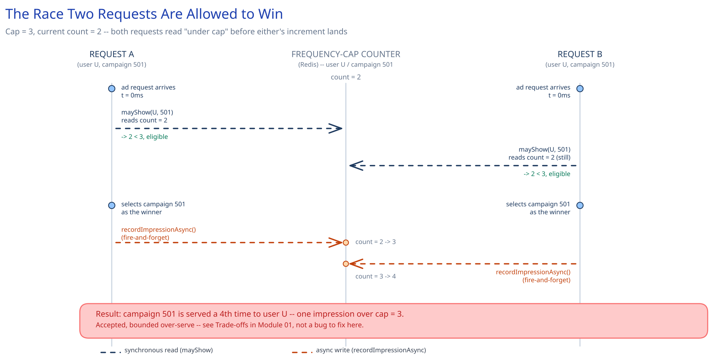

# Module 02 — Low-Level Design



## Interfaces vs. implementations

- **`TargetingIndex`** *(interface)* → **`BitmapTargetingIndex`** — `candidatesFor(profile, context) -> Set<CampaignId>` (intersects one bitmap per targeting dimension — segment ∩ geo ∩ device ∩ budget-eligible), `swap(newSnapshot)` (the atomic pointer update the Background Indexer calls once a rebuild finishes).
- **`FrequencyGate`** *(interface)* → **`BloomPrefilteredRedisFrequencyGate`** — `mayShow(userId, campaignId) -> bool` (Bloom pre-check, then a conditional Redis read only when the Bloom filter says "maybe"), `recordImpressionAsync(userId, campaignId)` (fire-and-forget increment, never awaited by the caller).
- **`Ranker`** *(interface)* → **`BidTimesCtrRanker`** — `rank(candidates) -> Candidate`, scoring each by `bid * predicted_ctr` and returning the highest.
- **`AdDecisionService`** — the orchestrator. Depends on all three interfaces plus a `UserProfileCache`, and implements none of the storage, caching, or ranking logic itself.

## Pseudocode for the decision path

```
AdDecisionService.decide(userId, context, requestId):
    deadline = now() + DECISION_BUDGET_MS              # e.g. 50ms

    profile = userProfileCache.getOrDefault(userId, contextOnlyProfile(context))
    candidates = targetingIndex.candidatesFor(profile, context)
                                                        # in-memory bitmap intersection; already excludes
                                                        # out-of-budget and out-of-flight-date campaigns

    eligible = []
    for c in candidates:
        if now() > deadline:
            break                                       # stop widening the candidate set; rank what we have
        if frequencyGate.mayShow(userId, c.campaignId):
            eligible.append(c)

    if eligible.isEmpty():
        return NO_FILL

    winner = ranker.rank(eligible)                       # bid * predicted_ctr, highest wins

    publishAsync(ImpressionEvent(userId, winner.campaignId, winner.adId, requestId, now()))
    frequencyGate.recordImpressionAsync(userId, winner.campaignId)   # fire-and-forget, not awaited

    return winner.creativeRef
```

`frequencyGate.mayShow`, the fast-pre-check-then-authoritative-check shape:

```
FrequencyGate.mayShow(userId, campaignId):
    key = (userId, campaignId)
    if not bloomFilter.probablySeen(key):
        return true                                     # definitely never served before — skip Redis entirely
    count = redis.get(counterKeyFor(key))                # only paid for the minority the Bloom filter flags
    return count < campaignFrequencyCap(campaignId)
```

The Bloom filter here plays exactly the role [Bloom Filters](../../scalability-resilience/bloom-filters.md) describes generically — a cheap first check in front of an expensive one — except the expensive check it's guarding is a cache round trip, not a database lookup, and correctness still comes entirely from the guarantee that a false positive costs work, never correctness: the filter can never wrongly report "definitely not seen" for a user it actually has seen, so `mayShow` can never skip the authoritative Redis check when it genuinely needed to run.

## Error cases worth designing for deliberately

- **User profile lookup miss (new/unknown user, cold start):** not an error — fall back to context-only targeting (geo/device straight from the request) rather than failing the whole decision; a colder profile just means a less-targeted, still-valid ad.
- **No eligible candidates after filtering:** `NO_FILL` is a legitimate, named outcome distinct from a system failure — the same instinct this guide applies elsewhere (the URL shortener's "not found" vs. "expired"): the caller needs to be able to tell "nothing to show" apart from "the ad server is broken."
- **Frequency-cap store (Redis) unreachable:** `mayShow` fails **open** (returns `true`) rather than propagating the error — matches the circuit-breaker default from Architecture & HLD; a candidate is treated as under-cap rather than blocking the whole decision on a dependency whose correctness value doesn't justify that cost.
- **Decision deadline reached mid-scan:** the loop stops widening the candidate set and ranks whatever it already has rather than either blocking past the deadline or failing outright — a partial candidate set still produces a valid, if less optimal, winner.

## Concurrency at the code level

`frequencyGate.recordImpressionAsync` needs no in-process lock and, more pointedly, no *cross-process* atomicity either — this is the one place in this guide's case studies where two concurrent writers racing on the same logical counter is an accepted outcome, not a bug to engineer away. Contrast this directly with [Distributed Job Scheduler](../distributed-job-scheduler/02-lld.md)'s claim step or [Payments System](../payments-system/02-lld.md)'s idempotency-key insert, where the same shape of race gets a database-enforced atomic guard: here, the cost of the race (a rare extra impression) is cheaper than the cost of closing it (a blocking round trip on every request), so the design leaves it open on purpose rather than reaching for the usual "push the atomicity into the store" pattern.

`targetingIndex.swap(newSnapshot)` **does** need to be atomic, but at the pointer level, not the data level: each Ad Decision Service instance holds a reference to one immutable snapshot object, and `swap` only ever replaces that reference in a single atomic operation once a new snapshot is fully built off to the side. A request that started reading against the old snapshot moments before a swap simply finishes against a completely valid, internally-consistent (if slightly stale) snapshot — there's no partial-rebuild state a concurrent reader can ever observe, the same copy-on-write discipline that keeps a reader from needing to lock anything at all.

## Design patterns you just used, named

- **Repository pattern** — `TargetingIndex` and `FrequencyGate` hide storage (an in-memory structure, Redis) behind method calls; `AdDecisionService` never touches either directly.
- **Strategy pattern** — `Ranker` is swappable (bid-only vs. bid×CTR) without touching the orchestrator, the same shape [Payments System](../payments-system/02-lld.md) uses for `ProcessorClient`.
- **Immutable snapshot + atomic swap (copy-on-write)** — worth naming explicitly: the Targeting Index is never mutated in place; a full new snapshot is built off to the side and only ever exposed via one atomic reference swap.
- **Fast-negative pre-check (Bloom filter)** — named by [Bloom Filters](../../scalability-resilience/bloom-filters.md) directly: a cheap, false-positive-tolerant, false-negative-proof gate in front of an expensive, authoritative check.
- **Circuit breaker, fail-open** — the Redis dependency's failure mode is a deliberate policy choice, not a framework default, per Architecture & HLD.

## Practice: extend it yourself

Before moving to Database Design, sketch (pseudocode is fine) how you'd add:

1. **Per-creative frequency capping** — cap each specific creative variant within a campaign separately, not just the campaign as a whole (e.g., a user can see campaign 501 up to 3 times/day, but never the same creative within it more than once). Does the Bloom filter's key change from `(userId, campaignId)` to `(userId, campaignId, creativeId)`, and what does that do to the filter's sizing math from Module 00's capacity estimation?
2. **Explore/exploit for the CTR score** — occasionally rank a campaign with too little click data higher than its cached predicted-CTR alone would justify, to gather fresh signal for the model. Which interface does this belong behind — a new `Ranker` implementation, or a change to what `TargetingIndex.candidatesFor` returns?

Neither has one clean answer — the point is noticing that the interfaces already drawn (`FrequencyGate`, `Ranker`) make it obvious which component *should* own each new piece of behavior, even before you've fully worked out what that behavior does.
