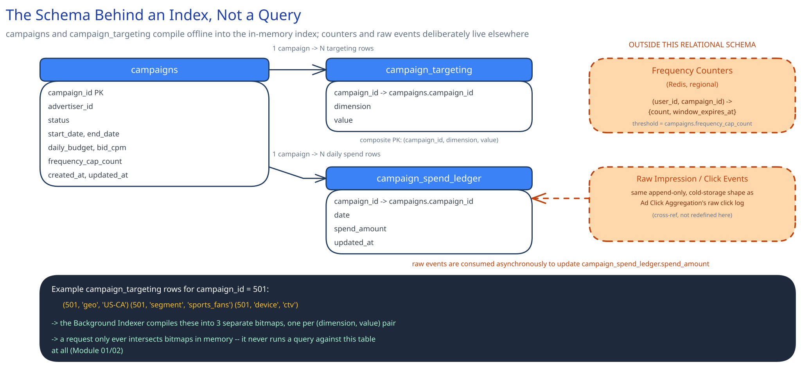

# Module 03 — Database Design & Scaling

## From entities to schema

- **`campaigns`** `(campaign_id, advertiser_id, status, start_date, end_date, total_budget, daily_budget, bid_cpm, frequency_cap_count, frequency_cap_window_hours, created_at, updated_at)` — the advertiser-facing source of truth for a campaign's own settings.
- **`campaign_targeting`** `(campaign_id, dimension, value)`, composite primary key — one row per targeting value a campaign matches on, e.g. `(501, 'geo', 'US-CA')`, `(501, 'segment', 'sports_fans')`, `(501, 'device', 'ctv')`. This narrow, variable-cardinality shape is the raw material the Background Indexer compiles into the in-memory index (see Architecture & HLD): one bitmap per distinct `(dimension, value)` pair, with a bit set for every `campaign_id` among that pair's rows.
- **`campaign_spend_ledger`** `(campaign_id, date, spend_amount, updated_at)` — updated asynchronously by consuming impression/click events off the event pipeline; the read side the Budget Pacing Service checks against a smoothed target.
- **Frequency counters** live in Redis, not this schema, but their logical shape is worth stating anyway: `(user_id, campaign_id) -> {count, window_expires_at}` — fast, regional, TTL'd, and reconciled against the durable impression-event log rather than trusted as a permanent source of truth.
- **Raw impression/click events** land in the same append-only, cold-storage shape as [Ad Click Aggregation Pipeline](../ad-click-aggregation/03-db-design.md)'s raw click log — cross-referenced rather than redefined here, since it's the same problem already solved there.

## Why `campaign_targeting` is a narrow three-column table, not columns on `campaigns`

A campaign can target an arbitrary *number* of values on any dimension — a national campaign might target 40 different city geos, while another targets exactly one segment and nothing else. Modeling this as fixed columns on `campaigns` (`geo_1`, `geo_2`, ...) would cap how many values a campaign can target and waste space for every campaign that targets fewer. The narrow `(campaign_id, dimension, value)` shape is exactly what [Normalization & Schema Design](../../database-design/normalization-schema-design.md) recommends for a genuinely variable-cardinality attribute, and it maps directly onto how the index gets built: the Background Indexer's core query is "every `campaign_id` with this exact `(dimension, value)`," run once per distinct value to produce one bitmap.

## Why this schema is never read on the hot path — the single biggest decision it encodes

Tie this back to Module 00's latency requirement directly: the Ad Decision Service never issues a SQL query against any table in this file. Everything here exists to be periodically compiled by the Background Indexer into the in-memory structure Module 01 and 02 describe. A useful test of that claim: if every index below were dropped and this schema were only ever table-scanned once every 30 seconds during a rebuild, the ad-decision path's own p99 latency would be completely unaffected — that's the tell that this data belongs in a durable, advertiser-facing store built for correctness and manageability, not a hot-path one built for speed.

## Indexes

- `campaigns(status, start_date, end_date)` — **composite**, leftmost-prefix: the indexer's core query is "active campaigns whose flight window covers now" — filter to `status = 'active'` first, then range-check the dates, matching [Database Indexing](../../database-design/database-indexing.md)'s leftmost-prefix reasoning.
- `campaign_targeting(dimension, value)` — the indexer's other core query: "every `campaign_id` targeting this specific `(dimension, value)`," evaluated once per distinct value when building each bitmap.
- `campaign_targeting(campaign_id)` — supports "all of this campaign's targeting rules" for the advertiser-facing edit/view path, and lets the indexer incrementally rebuild just one campaign's bitmap entries when it changes, instead of always doing a full rebuild.
- `campaign_spend_ledger(campaign_id, date)` — the Budget Pacing Service's read pattern: this campaign's spend, today.

## Consistency

- **`campaigns` / `campaign_targeting`:** the advertiser-facing *write* needs to be strongly consistent — a paused campaign should reliably persist as paused the moment an advertiser clicks pause. But the *read* side that actually matters for serving, the in-memory index, is deliberately eventually consistent with a bounded staleness window (the refresh interval) — the same write/read consistency split [Distributed Job Scheduler](../distributed-job-scheduler/03-db-design.md) draws between a job definition's write and a dashboard's read.
- **`campaign_spend_ledger`:** eventually consistent, fed entirely by the async impression/click event stream — a campaign's true spend as this ledger sees it can lag actual ad-serving decisions by however long the event pipeline takes, which is exactly why budget-based eligibility is a "probably still has budget" check, not a guarantee. A small amount of overspend is possible and acceptable — the same shape of trade-off as the frequency-cap over-serving named in Module 01 and 02, not a separate concession.
- **Frequency counters (Redis):** fast and regional, explicitly not durable in the strong sense — reconciled periodically against the durable impression-event log rather than treated as a permanent source of truth. If a Redis shard is lost, the worst case is a temporary window of unenforced caps for the users it held, not lost history — the durable log still has the real record.

## Scaling the schema

- **`campaigns` / `campaign_targeting` don't need to be sharded for the reason most of this guide's hot tables do** — per-request read latency — because the only reader is the periodic Background Indexer job, a comparatively low-QPS batch process. They need to scale for total campaign *count* and rebuild-job throughput as the platform grows into millions of campaigns, a different scaling axis entirely from request-latency-driven sharding.
- **Frequency counters in Redis scale by sharding on `user_id`** across the cluster (consistent hashing, cross-ref [Consistent Hashing](../../hld-building-blocks/consistent-hashing.md)), so a user's own counters land predictably and no single busy user skews one shard more than any other key distribution would.
- **The raw impression/click event log scales exactly the way [Ad Click Aggregation Pipeline](../ad-click-aggregation/03-db-design.md)'s raw click log does** — partitioned by time and volume in cold storage, a problem already solved there rather than re-derived here.

## Connecting it back

Look at all three modules together: Module 00's "under 100ms, never a query against the durable store" requirement is why this schema is compiled offline into an in-memory structure instead of ever being queried live on the hot path; that same requirement is why `campaign_targeting`'s narrow, variable-cardinality shape maps directly onto one bitmap per `(dimension, value)` rather than a wider, harder-to-compile table; and the eventually-consistent `campaign_spend_ledger` is what lets budget-based eligibility be a fast in-memory flag instead of a live balance check a request would otherwise have to wait on. Nothing in this schema is arbitrary — every table and index here exists to be read by a background job, never by the request a viewer is actually waiting on.
