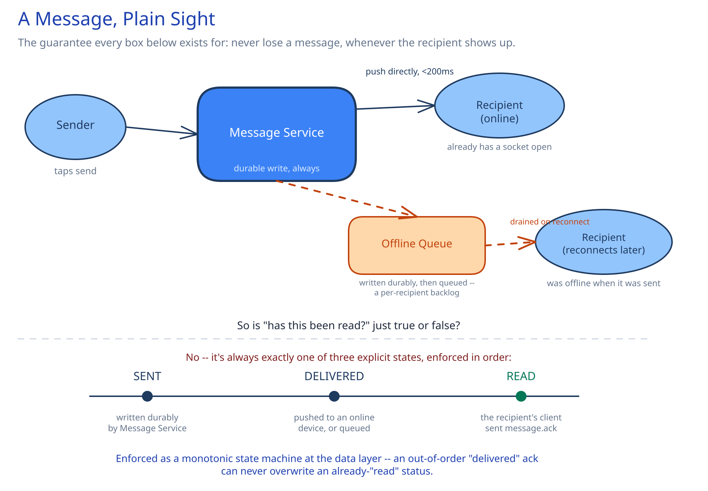

# Module 00 — Overview

## Requirements

**Functional:**
- 1:1 messaging and group chat (up to a few hundred members per group).
- Delivery status per message, per recipient: sent → delivered → read.
- Message history with pagination, oldest-to-newest and newest-to-oldest.
- Online-now presence, visible to a user's contacts.

**Non-functional** (stated as assumptions, interview-style):
- 500M DAU, averaging 40 messages sent per user per day.
- p99 delivery latency under 200ms for a recipient who's currently online.
- A message must never be lost, even if the recipient is offline for days — delivery can be delayed, but not silently dropped.
- Read/delivered receipts can lag by a second or two without anyone noticing; the message itself can't.

That last pair is the design's central tension: the message body needs at-least-once, never-lose guarantees; the receipts riding alongside it are allowed to be best-effort. Treating them as the same problem would either over-engineer the receipts or under-engineer the message.

## Capacity Estimation

Using this guide's [back-of-envelope method](../../foundations/back-of-envelope-estimation.md):

- **Messages/day:** 500M users × 40 = 20B messages/day.
- **Messages/sec, average:** 20B / 86,400 ≈ 231,000/sec. At a 3x peak factor (evenings, regional overlap): **~700,000/sec peak**.
- **Storage/day:** assume ~200 bytes/message (sender, recipient(s), body, timestamps, ids). 20B × 200B = 4TB/day → **~1.5PB/year** before any compression or cold-tiering.
- **Concurrent WebSocket connections at peak:** assume 40% of DAU online simultaneously at peak → **~200M concurrent connections**. At ~10,000 connections per gateway instance, that's **~20,000 gateway instances** just to hold sockets open — the number that makes the connection-management tier the expensive part of this design, not the message store.
- **Bandwidth:** 700,000 msg/sec × ~200 bytes ≈ 140MB/sec of message payload at peak, before per-connection protocol overhead (WebSocket framing, TLS).

## Approach Walkthrough

Before any boxes: a message sent to an **online** recipient should go straight from the sender's connection to the recipient's connection with nothing durable in between blocking that path — the durable write happens in parallel, not before delivery. A message sent to an **offline** recipient can't be delivered at all right now, so it has to land somewhere durable and wait, then get pushed the moment that recipient reconnects. Everything below is infrastructure built to make both of those sentences true at 700,000 messages/sec.

## API Surface

Non-realtime, over REST:
- `POST /conversations` — create a 1:1 or group conversation.
- `GET /conversations/{id}/messages?cursor=&limit=` — paginated history.
- `GET /conversations` — a user's conversation list, most-recently-active first.

Realtime, over the WebSocket connection each client holds:
- `message.send` (client → server): `{ conversation_id, client_msg_id, body }` — `client_msg_id` is client-generated, and doubles as an idempotency key (see Concurrent-User Handling below).
- `message.new` (server → client): the delivered message, pushed to every online recipient.
- `message.ack` (client → server): `{ message_id, status: "delivered" | "read" }`.
- `presence.update` (server → client): `{ user_id, status: "online" | "offline", last_seen }`.
