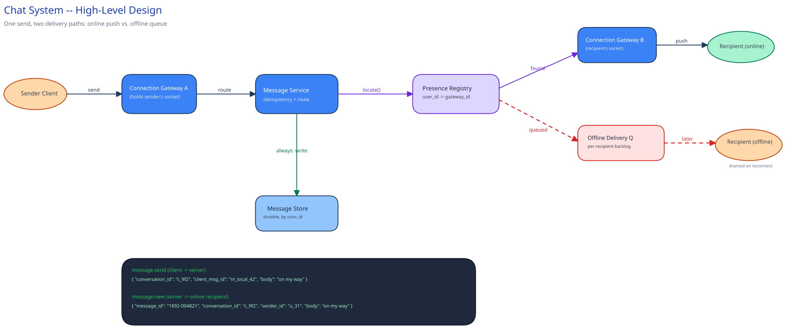
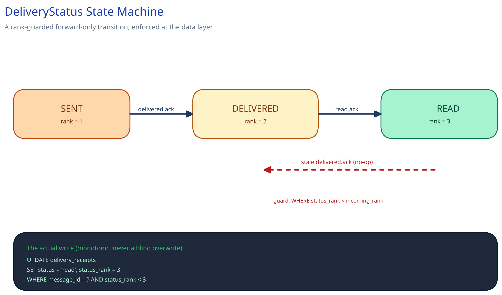
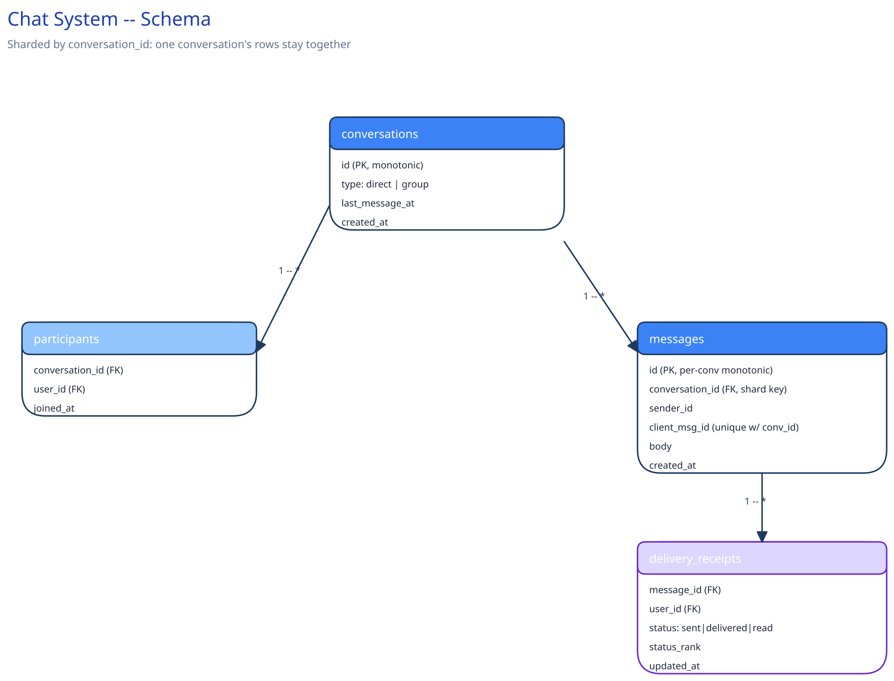

# Design a Chat / Messaging System

## Requirements

**Functional:**
- 1:1 messaging and group chat (up to a few hundred members per group).
- Delivery status per message, per recipient: sent → delivered → read.
- Message history with pagination, oldest-to-newest and newest-to-oldest.
- Online-now presence, visible to a user's contacts.

**Non-functional** (stated as assumptions, interview-style):
- 500M DAU, averaging 40 messages sent per user per day.
- p99 delivery latency under 200ms for a recipient who's currently online.
- A message must never be lost, even if the recipient is offline for days — delivery can be delayed, but not silently dropped.
- Read/delivered receipts can lag by a second or two without anyone noticing; the message itself can't.

That last pair is the design's central tension: the message body needs at-least-once, never-lose guarantees; the receipts riding alongside it are allowed to be best-effort. Treating them as the same problem would either over-engineer the receipts or under-engineer the message.

## Capacity Estimation

Using this guide's [back-of-envelope method](../../foundations/back-of-envelope-estimation.md):

- **Messages/day:** 500M users × 40 = 20B messages/day.
- **Messages/sec, average:** 20B / 86,400 ≈ 231,000/sec. At a 3x peak factor (evenings, regional overlap): **~700,000/sec peak**.
- **Storage/day:** assume ~200 bytes/message (sender, recipient(s), body, timestamps, ids). 20B × 200B = 4TB/day → **~1.5PB/year** before any compression or cold-tiering.
- **Concurrent WebSocket connections at peak:** assume 40% of DAU online simultaneously at peak → **~200M concurrent connections**. At ~10,000 connections per gateway instance, that's **~20,000 gateway instances** just to hold sockets open — the number that makes the connection-management tier the expensive part of this design, not the message store.
- **Bandwidth:** 700,000 msg/sec × ~200 bytes ≈ 140MB/sec of message payload at peak, before per-connection protocol overhead (WebSocket framing, TLS).

## Approach Walkthrough

Before any boxes: a message sent to an **online** recipient should go straight from the sender's connection to the recipient's connection with nothing durable in between blocking that path — the durable write happens in parallel, not before delivery. A message sent to an **offline** recipient can't be delivered at all right now, so it has to land somewhere durable and wait, then get pushed the moment that recipient reconnects. Everything below is infrastructure built to make both of those sentences true at 700,000 messages/sec.

## API Surface

Non-realtime, over REST:
- `POST /conversations` — create a 1:1 or group conversation.
- `GET /conversations/{id}/messages?cursor=&limit=` — paginated history.
- `GET /conversations` — a user's conversation list, most-recently-active first.

Realtime, over the WebSocket connection each client holds:
- `message.send` (client → server): `{ conversation_id, client_msg_id, body }` — `client_msg_id` is client-generated, and doubles as an idempotency key (see Concurrent-User Handling below).
- `message.new` (server → client): the delivered message, pushed to every online recipient.
- `message.ack` (client → server): `{ message_id, status: "delivered" | "read" }`.
- `presence.update` (server → client): `{ user_id, status: "online" | "offline", last_seen }`.

## High-Level Design



**Building blocks:**
- **Connection Gateway tier** — stateful, holds the persistent WebSocket per online client. This is a genuinely different scaling shape from the rest of this design, for exactly the reason [Long Polling, WebSockets & SSE](../../scalability-resilience/long-polling-websockets-sse.md) names: a stateless server can answer any client's next request, but a gateway instance has to be *that specific client's* instance for the life of the connection.
- **Presence Registry** — a fast shared store (Redis) mapping `user_id → gateway_instance_id` for every currently-connected user. This is the answer to the hard routing problem: when Message Service needs to deliver to a specific recipient, it looks up which gateway instance (if any) holds that recipient's socket, the same shape as [service discovery](../../scalability-resilience/service-discovery.md)'s registry, specialized to one user per entry instead of one service instance per entry.
- **Message Service** — receives `message.send`, writes it durably, then either pushes it directly (recipient online: found in the Presence Registry) or drops it onto the **offline-delivery queue** (recipient not found there).
- **Offline-delivery queue** — cross-ref [Message Queues & Pub/Sub](../../hld-building-blocks/message-queues-pubsub.md): a per-recipient backlog, drained the moment that recipient's gateway registers them back into the Presence Registry on reconnect.
- **Message Store** — the durable, sharded log of every message ever sent (schema below).

**Load Handling.** The system is built to tolerate roughly 3x its average load as ordinary daily peak (the factor already used above) without shedding anything. Beyond that — a regional outage recovery reconnect storm, for instance, where a large fraction of the 200M connections all reconnect within seconds — backpressure kicks in first at the Connection Gateway tier: new connection attempts are rate-limited per gateway instance rather than accepted unboundedly (cross-ref [Backpressure, Load Shedding & Bulkheads](../../scalability-resilience/backpressure-load-shedding.md)), and a client that's shed retries with jittered backoff rather than all reconnecting in the same instant. A concrete load-test target: sustain 1M new connection attempts/minute for 10 minutes without the Presence Registry's write rate exceeding its provisioned capacity.

**Concurrent-User Handling.** Three races, named explicitly:
1. **Two devices, same user, different online states** (phone reconnects while laptop is still connected) — resolved by treating presence as *per-connection*, not per-user: the Presence Registry stores one entry per `(user_id, device_id)`, and a contact sees "online" if *any* entry exists. The losing side of a near-simultaneous connect/disconnect is just a stale read for at most one heartbeat interval, not a correctness bug.
2. **Concurrent delivery-receipt writes for the same message** (delivered and read acks arriving out of order, or from two of the recipient's devices) — resolved by making the receipt write a monotonic state transition, not a blind overwrite: `UPDATE delivery_receipts SET status = 'read' WHERE message_id = ? AND status_rank < 3` (sent=1, delivered=2, read=3) — a receipt can only move forward, so an out-of-order "delivered" arriving after "read" is a no-op, not a regression.
3. **Message ordering within one conversation, sent from multiple devices near-simultaneously** — resolved by the message ID itself being the ordering key (see Database Design below): whichever write lands first in that conversation's ordered store wins the earlier slot; there's no "correct" wall-clock order to preserve beyond what actually got persisted first, and clients render in that persisted order, not send-time order.

## Low-Level Design



**`DeliveryStatus`**, as an explicit state machine, not a boolean (matching this guide's own convention elsewhere): `SENT → DELIVERED → READ`, with the monotonic-transition guard from above enforced at the data layer, not just trusted from the client.

**`PresenceRouter`** *(interface)* → **`RedisPresenceRouter`** — `locate(user_id) -> gateway_instance_id | null`, `register(user_id, device_id, gateway_instance_id)`, `deregister(...)`. Message Service depends on the interface, not Redis directly, so the backing store could change without touching delivery logic.

Pseudocode for the core path:
```
GatewayConnection.onMessage(client_msg_id, conversation_id, body):
    if MessageStore.existsByClientMsgId(client_msg_id):     # idempotency check
        return existing_message_id                           # duplicate send, already handled
    message_id = MessageStore.append(conversation_id, sender_id, body, client_msg_id)
    for recipient in Conversation.participants(conversation_id) - {sender_id}:
        gateway = PresenceRouter.locate(recipient)
        if gateway is not None:
            gateway.push(message_id)                         # online: deliver now
        else:
            OfflineQueue.enqueue(recipient, message_id)       # offline: deliver on reconnect
    return message_id
```

Concurrency note: `PresenceRouter` and `MessageStore` are both shared, distributed state — this component runs on thousands of Gateway instances simultaneously, so any coordination here is a distributed-store operation (a Redis `SET`/lookup), never an in-process mutex; an in-process lock would only protect one instance's own memory; it's the wrong tool the moment there's more than one instance, which there always is at this scale.

## Database Design & Scaling



**Entities:** `conversations` (id, type: direct/group, created_at), `participants` (conversation_id, user_id — the membership join table), `messages` (id, conversation_id, sender_id, body, client_msg_id, created_at), `delivery_receipts` (message_id, user_id, status, status_rank, updated_at).

**The message ID is a monotonic ID scoped to the conversation, not a global auto-increment.** History pagination and ordering are always asked *within one conversation* ("give me this conversation's next page"), never across all conversations globally — a per-conversation monotonic ID (e.g. a Snowflake-style ID with the conversation embedded, or a per-conversation counter) keeps that the cheap, naturally-ordered query it needs to be. It also sets up the sharding key: sharding `messages` by `conversation_id` (cross-ref [Data Partitioning & Sharding](../../hld-building-blocks/data-partitioning-sharding.md)) keeps one conversation's entire message history on one shard, so pagination never fans out across shards — exactly the same reasoning this guide's sharding page gives for choosing a key that matches the query that actually runs constantly.

**Indexes:** a unique index on `messages(conversation_id, client_msg_id)` (the idempotency check in the pseudocode above depends on this being fast and unique-enforced, not just fast); a composite index on `messages(conversation_id, id)` for paginated history reads; an index on `participants(user_id)` for "which conversations is this user in."

**Denormalization:** `conversations.last_message_at` is kept as a column, updated on every send, so the conversation-list query (`GET /conversations`, sorted by recent activity) never has to scan `messages` to find each conversation's latest timestamp — the same "freeze a number that's expensive to recompute live" instinct as this guide's [e-commerce schema](../../database-design/ecommerce-schema-worked-example.md)'s `total_amount`.

## Interviewer Q&A

**What happens when two of a user's devices send `message.send` for the same logical message at the same instant (e.g. a retry after a flaky connection)?**
The unique index on `(conversation_id, client_msg_id)` makes the second insert a no-op that returns the first attempt's `message_id` instead of creating a duplicate — this is exactly why `client_msg_id` is client-generated and sent with the original request, not assigned by the server after the fact.

**What happens when traffic spikes 10x for an hour (a major news event driving group-chat activity)?**
Message Service and the Connection Gateway tier are both stateless-per-request (aside from the gateway holding sockets) and scale horizontally to absorb it; the Presence Registry, being a single shared store, is the more likely bottleneck — it's sized with headroom for exactly this and sharded by `user_id` hash so no single node holds the whole registry. If it still saturates, presence lookups degrade to "assume offline, queue it" rather than blocking sends, trading a temporarily-higher offline-queue depth for keeping the send path itself unaffected.

**Why not just use the recipient's `last_seen` timestamp instead of a live Presence Registry?**
`last_seen` answers "when did we last hear from them," which is stale by definition; the routing decision needs "which specific gateway instance, right now, holds their socket" — a fundamentally different, live question that only a registry updated on connect/disconnect can answer.

**How would you support a group chat with thousands of members, where the current design's "push to every online recipient" fan-out gets expensive?**
This is the same push-vs-pull tension this guide's [News Feed](../news-feed-system.md) case study covers for feeds: fan-out-on-write (push to every member's queue at send time) is fine for a few hundred members but doesn't hold at thousands; past that threshold, switch that specific conversation to fan-out-on-read (recipients pull recent messages on reconnect/open instead of each one being individually pushed).

**Could `delivery_receipts` just be columns on `messages` instead of a separate table?**
Not cleanly — a message has *one* row but potentially many recipients (any group chat), each needing their own independent delivery/read state; a separate table keyed by `(message_id, user_id)` is the only shape that lets one recipient's read receipt update without touching every other recipient's.

**Would you make message delivery exactly-once?**
No — at-least-once delivery plus the `client_msg_id` idempotency check (same mechanism as the retry case above) is cheaper to build and just as correct in practice; true exactly-once delivery across a network is the kind of guarantee [Distributed Transactions](../../hld-building-blocks/distributed-transactions-saga.md) shows is extremely expensive to get exactly right, for a problem idempotency already solves at the consumer.

**What's the actual failure mode if the offline-delivery queue itself goes down?**
Messages to offline recipients queue up in the durable `messages` table regardless (the write there happens before the online/offline branch, not after) — the queue is only the *mechanism* that wakes a reconnecting client up quickly; if it's down, a reconnecting client still gets its backlog by querying unread messages directly, just without the low-latency push the moment it reconnects.

**Would you shard the Presence Registry the same way as the message store?**
No, and that's deliberate — Presence Registry is sharded by `user_id` hash (an even, arbitrary spread, since presence lookups are always single-user), while `messages` is sharded by `conversation_id` (so one conversation stays together); the two datasets have different access patterns and there's no reason to force them onto the same shard key.
