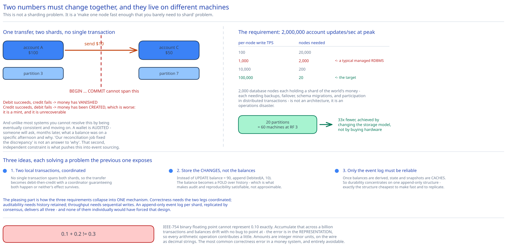

# Module 00 — Overview



## The feature, with no infrastructure in it yet

A user has a balance inside the app. They send $10 to another user. A moment later the sender's balance is $10 lower and the recipient's is $10 higher. No card network, no bank rails — both accounts live in the same system, so the transfer is just two numbers changing.

That last sentence is the whole problem. **Two numbers must change together, and they live on different machines.**

At the scale this design targets, one database node cannot hold every account, so the sender's balance and the recipient's balance are on different shards. A transfer is therefore two writes to two independent stores, and there is no single transaction that covers both. If the debit succeeds and the credit fails, money has vanished. If the credit succeeds and the debit fails, money has been created — which is worse, because it's a mint.

And unlike most systems, **you cannot resolve this by being eventually consistent and moving on.** A wallet is audited. Someone will ask, months later, what a specific balance was on a specific afternoon and why — and "our reconciliation job fixed the discrepancy" is not an answer to "why". That audit requirement is a second, independent constraint, and it's what pushes the design past ordinary distributed transactions into event sourcing.

## Requirements

**Functional:**
- Transfer balance between two wallet accounts in the same system.
- Query an account's current balance.
- Query an account's transaction history.
- **Reproduce any historical balance**, at any point in time, from primary records — not from a periodic snapshot.

**Non-functional:**
- **Throughput:** 1,000,000 transfers/sec at peak, ~100,000/sec average. Because each transfer is two legs, that's **2,000,000 account updates/sec at peak.**
- **Correctness:** absolute. No lost money, no created money, no double-spend. The sum of all balances must be invariant under transfer.
- **Availability:** 99.99%.
- **Auditability:** every balance change must be attributable and replayable. A reconciliation job that *detects* a discrepancy is insufficient — the system must be able to show how the balance got that way.
- **Reproducibility:** re-running the system's logic over the same inputs must produce the same outputs, including after a code change. This is a much stronger requirement than it looks and it dictates [Module 03](./03-event-sourcing-cqrs.md) almost entirely.

Out of scope, stated to bound the problem: foreign exchange, external payment rails (that's the [payments system](../payments-system/00-overview.md) case study), and KYC.

## Capacity Estimation

Method from [Back-of-the-Envelope Estimation](../../foundations/back-of-envelope-estimation.md).

**The node-count problem.** A cloud-hosted relational database node sustains roughly **1,000 write TPS** with real durability settings. The requirement is 2,000,000 account updates/sec:

| Per-node write TPS | Nodes needed at peak |
|---|---|
| 100 | 20,000 |
| **1,000** (a typical managed RDBMS) | **2,000** |
| 10,000 | 200 |
| 100,000 | **20** |

2,000 database nodes each holding a shard of the world's money — each needing backups, failover, schema migrations, and participation in distributed transactions — is not an architecture, it's an operations disaster. **So the primary design goal becomes raising per-node throughput**, because every 10× improvement removes an order of magnitude of machines. That reframing is the single most useful thing to say early: this isn't a "how do I shard" problem, it's a "how do I make one node fast enough that I barely need to shard" problem.

The answer, developed in [Module 04](./04-lld.md#making-one-node-fast), is to stop treating the store as a general-purpose database: append events sequentially to local disk, keep state in memory, and replicate the log rather than the state. That gets to ~100,000 TPS per group, which turns 2,000 nodes into **20 replication groups — 60 machines at replication factor 3.** A 33× reduction, achieved by changing the storage model rather than by buying more hardware.

**Storage.**
- An event is ~200 bytes (account, amount, currency, transaction id, sequence, timestamp).
- Two events per transfer. At average load: 100k × 2 × 200 B = **40 MB/sec** → **3.5 TB/day** → **1.26 PB/year**.
- At peak: 400 MB/sec.
- Events are **permanent** — that's the audit requirement — so this grows without bound and must tier to object storage (cross-ref the [object storage](../object-storage-s3/00-overview.md) case study). Snapshots make the recent state fast; the archive makes deep history possible without keeping 1.26 PB on local SSD.

**Sanity check on sequential I/O.** At 200 bytes/event, a 150 MB/sec sequential disk can absorb **750,000 events/sec** — well above the 100k TPS/node target, so the disk is not the constraint. Serialization and consensus round trips are. That's a useful thing to establish: it tells you the optimization work belongs in CPU and network, not storage.

## Approach Walkthrough

Three ideas stacked, each solving a problem the previous one exposes.

**1. A transfer is two local transactions, coordinated.** Since no single transaction spans both shards, the transfer becomes debit-then-credit, with a coordinator that guarantees both happen or neither's effect survives. [Module 02](./02-distributed-transactions.md) works through 2PC, TC/C and Saga and picks one.

**2. Store the changes, not the balances.** Instead of `UPDATE balance SET amount = 90`, append `Debited(account=A, amount=10)`. The balance becomes a *derived* value — the fold of every event over the account's history. This is what makes the audit and reproducibility requirements satisfiable rather than approximable: you can recompute any historical balance because you never threw away the information that produced it. [Module 03](./03-event-sourcing-cqrs.md).

**3. Make the event log the only thing that needs to be reliable.** Once balances are derived, state and snapshots are *caches* — regenerable from the log. So durability effort concentrates on one append-only structure, which is exactly the structure that's cheapest to make fast and to replicate. That's how the per-node throughput problem gets solved: replicate a log with Raft, not a database with 2PC.

The pleasing part is how the three requirements collapse into one mechanism. Correctness needs the two legs coordinated; auditability needs history retained; throughput needs sequential writes. An append-only event log per shard, replicated by consensus, delivers all three — and none of them individually would have forced that design.

## API Surface

```
POST /v1/wallet/transfers
  Idempotency-Key: <client UUID>          # REQUIRED, not optional — see below
  {
    "from_account": "acct_A",
    "to_account":   "acct_C",
    "amount":       "10.00",              # STRING, never a float
    "currency":     "USD"
  }
  → 201 { "transaction_id": "...", "status": "completed" }
  → 200 { ... }   replay of a prior identical request (same key) — returns the original result
  → 402 insufficient funds
  → 409 same Idempotency-Key, different payload
  → 422 account frozen / invalid currency

GET /v1/wallet/accounts/{id}/balance            → { balance, currency, as_of_sequence }
GET /v1/wallet/accounts/{id}/balance?at=<ts>    → the balance at a past instant (Module 03)
GET /v1/wallet/accounts/{id}/transactions       → paginated history
GET /v1/wallet/transfers/{transaction_id}       → status of one transfer
```

Three API decisions that carry real weight:

**`amount` is a string, never a float.** IEEE-754 binary floating point cannot represent `0.10` exactly, so `0.1 + 0.2 != 0.3`. Accumulate that across a billion transactions and balances drift with no bug to point at. The wire format is a decimal string; internally it's an integer count of minor units (cents) or an arbitrary-precision decimal. This is the most common correctness error in a money system and it's entirely avoidable.

**The idempotency key is mandatory.** A client that times out cannot know whether the transfer happened, and retrying without a key risks sending the money twice. Making the key required means the *only* way to call the API is safely — the design refuses to offer the unsafe option. Cross-ref [Idempotency Keys](../../scalability-resilience/idempotency-keys.md).

**Balance responses carry `as_of_sequence`.** Because reads are served from a derived read model that can lag the write path ([Module 03](./03-event-sourcing-cqrs.md#cqrs-why-reads-and-writes-split)), a bare balance is ambiguous — the client can't tell if it reflects the transfer it just made. Returning the sequence number the balance was computed at lets a client detect staleness and, if it cares, wait for its own transfer's sequence to be reflected. Exposing the consistency boundary in the response beats pretending it doesn't exist.

## Where this goes next

| Module | The question it answers |
|---|---|
| [01 · Architecture & HLD](./01-architecture-hld.md) | What are the boxes, and how does a transfer move through them? |
| [02 · Distributed Transactions](./02-distributed-transactions.md) | **Two accounts on two shards — how do both legs happen or neither?** 2PC vs TC/C vs Saga. |
| [03 · Event Sourcing & CQRS](./03-event-sourcing-cqrs.md) | **How do you prove a balance was correct last March?** Commands, events, state, and replay. |
| [04 · LLD](./04-lld.md) | Interfaces, the state machine, and how one node reaches 100k TPS. |
| [05 · DB Design](./05-db-design.md) | The event log, the double-entry ledger, snapshots, and the read models. |
| [06 · Interviewer Q&A](./06-interviewer-qna.md) | The ten follow-ups this design invites. |
