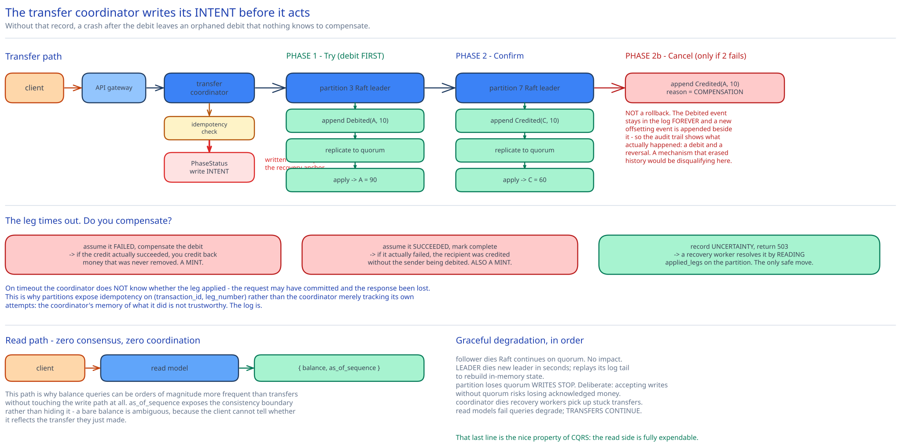

# Module 01 — Architecture & High-Level Design



## Monolith vs. microservices

**The wallet core is one service, and splitting it would be a correctness error rather than merely a performance one.**

The tempting decomposition is an "account service" and a "transfer service". It fails immediately: a transfer *is* the mutation of two accounts, so a transfer service that owns no balances would have to reach into the account service for every debit and credit — which means the transactional boundary now crosses a network on the path that must be atomic. You'd have converted a hard problem (two shards, one transaction) into a harder one (two shards and two services, one transaction).

The same argument rules out separating "balance" from "ledger". A balance is a projection of the ledger; they are one datum viewed two ways, not two concerns.

What genuinely *is* separated:

- **The transfer coordinator** is separate from the **partitions** that hold accounts, because they have opposite state models. A coordinator holds short-lived per-transaction state and must be horizontally scalable and disposable; a partition holds durable money and must be consensus-replicated and carefully placed. Merging them would put transaction bookkeeping inside the thing whose durability is most expensive.
- **Read models** are separate from the write path — the whole point of [CQRS](./03-event-sourcing-cqrs.md#cqrs-why-reads-and-writes-split). Balance queries vastly outnumber transfers and need none of the write path's consensus machinery.
- **The archiver** is separate because it moves cold events to object storage on a completely different cadence and has no latency requirement.

## Per-path walkthrough

**Transfer path (the critical one)**

```
Client → API gateway (auth, rate limit)
   → Transfer coordinator
       → idempotency check: has this key been seen?   [if yes, return the stored result]
       → write a PhaseStatus record: "transfer T started, legs = [A-10 on P3, C+10 on P7]"
       → PHASE 1 (Try): debit A on partition 3
             P3 leader: validate (balance >= 10, account active)
                        append event Debited(A, 10, txn=T) to the Raft log
                        replicate to P3 followers → committed
                        apply to in-memory state → A's balance now 90
       → record "leg 1 committed" in PhaseStatus
       → PHASE 2 (Confirm): credit C on partition 7
             P7 leader: append Credited(C, 10, txn=T), replicate, apply
       → record "leg 2 committed" → transfer complete
       → store the idempotency result
   → 201 { transaction_id, status: completed }
```

**The debit always happens first, and this ordering is a correctness requirement rather than a convention.** Between phase 1 and phase 2 the money is genuinely nowhere — A has lost it, C hasn't gained it, and the system's total is temporarily short by $10. That is an acceptable intermediate state. The reverse order is not: crediting first would mean the system's total is temporarily *high* by $10, and during that window C could spend money that A still has. Debit-first makes the transient state a temporary *deficit* rather than a temporary *mint*, and a deficit is recoverable while a double-spend is not. [Module 02](./02-distributed-transactions.md#why-the-debit-must-come-first) develops this.

**Compensation path (phase 2 fails)**

```
P7 rejects the credit (account frozen), or times out beyond the retry budget
   → coordinator reads PhaseStatus: leg 1 committed, leg 2 failed
   → PHASE 2b (Cancel): append Credited(A, 10, txn=T, reason=compensation) on P3
   → transfer marked failed; A's balance restored to 100
```

Note what compensation is **not**: it is not a rollback. The `Debited` event stays in the log forever, and a *new* compensating event is appended beside it. The audit trail therefore shows what actually happened — a debit and a reversal — rather than pretending the debit never occurred. Under the audit requirement from [Module 00](./00-overview.md#requirements), a mechanism that erased history would be disqualifying, which is why an approach with true rollback semantics is not automatically preferable here.

**Coordinator crash recovery**

```
Coordinator dies mid-transfer → its lease expires
   → a recovery worker scans PhaseStatus for transfers stuck in a non-terminal state
   → for each: re-read which legs committed (the log is the source of truth)
       leg 1 only, past the deadline  → drive Cancel
       both legs                      → mark complete (it was done; only the record was missing)
       neither                        → mark failed, nothing to undo
```

This is why `PhaseStatus` exists and why it's written **before** phase 1: a crash with no record of intent leaves an orphaned debit that nothing will ever compensate. The record is the design's recovery anchor, and it's the same discipline as the [transactional outbox](../../hld-building-blocks/transactional-outbox-cdc.md) — persist the intent before acting on it.

**Read path**

```
Client → API gateway → Read model (a materialized balance table, or in-memory map)
   → { balance, as_of_sequence }
```

Zero consensus, zero coordination. This path is why balance queries can be orders of magnitude more frequent than transfers without affecting the write path at all.

## Building blocks

**API gateway** — auth, per-account rate limiting, request validation. Cross-ref [API Gateway](../../hld-building-blocks/api-gateway.md).

**Transfer coordinator** — stateless apart from a lease; drives the two-phase protocol and owns `PhaseStatus`. Horizontally scalable, and any instance can recover another's abandoned work.

**Partitions (Raft groups)** — the core. Each partition owns a subset of accounts (`hash(account_id) % N`), and each is a **Raft group of 3–5 nodes** (cross-ref [Replication & Consensus](../../hld-building-blocks/replication-consensus.md)). The leader appends events to a local log; followers replicate. State lives in memory, derived from the log.

**Event log** — append-only, per partition, replicated by Raft. The **only** durable source of truth in the system.

**Snapshot store** — periodic serialized state, so recovery doesn't replay from genesis. A cache, not a record — regenerable.

**Read models** — materialized balances and transaction history, updated from the committed event stream. Eventually consistent by design.

**Archiver** — moves sealed log segments to object storage. Cross-ref the [object storage](../object-storage-s3/00-overview.md) case study.

**Reconciliation job** — recomputes balances from events and compares against the read models. Under event sourcing its role changes fundamentally: it is no longer *repairing* divergence between two authorities, it's *verifying* that a derived view matches its source. A mismatch is a bug report, not a routine fix.

## Trade-offs to make explicit

| Decision | Chosen | Alternative | Why |
|---|---|---|---|
| Distributed transaction protocol | **TC/C** (try-confirm/cancel) | 2PC | 2PC holds locks across a network round trip and its coordinator is a blocking single point of failure — a coordinator crash leaves rows locked indefinitely. TC/C uses committed local transactions plus compensation, so nothing is ever held. [Module 02](./02-distributed-transactions.md). |
| Coordination shape | **TC/C over Saga** | Saga (linear, choreographed) | TC/C's phases are parallelizable and its two legs are symmetric; Saga is strictly sequential. With only two legs the difference is latency, and the wallet's p99 matters. |
| What's stored | **Events (deltas)** | Current balances | Balances can be derived from events; events cannot be derived from balances. Only the former satisfies "reproduce any historical balance from primary records". [Module 03](./03-event-sourcing-cqrs.md). |
| Replication unit | **The event log, via Raft** | The database's own replication, per shard | Replicating one append-only log is far cheaper than replicating a mutable B-tree, and it's what makes the 100k TPS/node target reachable. Also means state and snapshots need no durability of their own. |
| Leg ordering | **Debit before credit, always** | Either order, or in parallel | Debit-first makes the intermediate state a temporary deficit; credit-first makes it a temporary mint, which permits a double-spend. Recoverable versus not. |
| Reads | **CQRS — separate read models** | Read balances from the write path | Balance queries dwarf transfers; serving them from the consensus-replicated write path would waste its capacity on work needing none of its guarantees. Cost: reads lag, which is why `as_of_sequence` is exposed. |
| Money representation | **Integer minor units / decimal** | Floating point | `0.1 + 0.2 != 0.3`. Non-negotiable. |
| Compensation | **A new offsetting event** | Delete or amend the original event | Erasing history would defeat the audit requirement. The log is append-only, including for mistakes. |

## Load Handling

- **Peak-vs-average.** 100k TPS average against 1M TPS peak — a **10× spike factor**, which is unusually high and driven by real events (payday, a flash sale, a festival). Provisioning for peak means running 10× idle capacity most of the time; the partition count is therefore sized for peak, since repartitioning under load is the one thing you cannot do.

- **Where backpressure kicks in first.** At the **Raft commit round trip** on a partition leader. Every event needs a quorum acknowledgement, so the leader's throughput is bounded by network latency to its followers and by how well appends batch. When a partition saturates, its coordinator's calls queue, and the coordinator sheds rather than queueing unboundedly. Cross-ref [Backpressure & Load Shedding](../../scalability-resilience/backpressure-load-shedding.md).

- **The hot-account problem**, which is this design's genuine weak spot. Sharding by `hash(account_id)` distributes *accounts* evenly, but a merchant account receiving 50,000 payments/sec is **one account on one partition** — and no amount of resharding helps, because a single account's events must be totally ordered to keep its balance correct. Two mitigations, both with real costs:
  - **Split the hot account into N sub-accounts** whose balances sum to the logical balance. Writes distribute; reading the balance now requires summing N partitions, and the sub-accounts must be rebalanced periodically so one doesn't run dry. This is the same sharded-counter pattern as [like counting at scale](../../../like-counting-at-scale/00-overview.md).
  - **Batch credits** to the hot account: aggregate many incoming credits into one event per 100ms. Reduces event count sharply, at the cost of coarser-grained audit records — you can no longer point at a single event per payment, which partially undermines the audit requirement.

- **What gets shed under overload**, in order: balance *queries* first (they're cacheable and a slightly stale balance is tolerable), then new transfers (`503` with `Retry-After`, safe because the idempotency key makes the client's retry free), and **never in-flight transfers** — a transfer past phase 1 must always be driven to a terminal state, because abandoning it leaves money missing.

- **Autoscaling lag.** Coordinators and read models autoscale in minutes. **Partitions cannot** — adding one requires migrating accounts, which means moving their event history and pausing writes for those accounts. Partition count is effectively fixed at deployment, the same one-way-door property as [message queue partitions](../distributed-message-queue/04-consumers-delivery.md#changing-partition-count).

- **Load-test target.** Sustain 1M transfers/sec across 20 partitions with p99 under 100ms, while (a) killing a partition leader and confirming failover under 5 seconds with zero lost or duplicated events, (b) killing a coordinator mid-transfer and confirming the recovery worker drives every stuck transfer to a terminal state, and (c) asserting after the run that **total money in the system is exactly what it was before**, which is the only test that actually matters.

## Concurrent-User Handling

| Race | Mechanism | What the "loser" sees |
|---|---|---|
| Two transfers debiting the same account simultaneously | The partition's Raft **leader is a single writer** processing its command queue serially. Balance validation and event append are one atomic step in that sequence. | Whichever is ordered second validates against the *already-updated* balance, so it correctly fails with `402` if funds are now insufficient. No lock is needed — serial execution by one leader replaces it. |
| A user double-clicks "send" | **Idempotency key** checked before phase 1; a replay returns the stored original result. | The identical `200` and the same `transaction_id`. Money moves once. |
| Two coordinators both driving the same stuck transfer | `PhaseStatus` updates are conditional (compare-and-set on state and attempt), so only one transitions the transfer. | The loser's CAS fails; it abandons the transfer to the winner. No double compensation. |
| A "zombie" coordinator resumes after a pause and re-issues a leg | Every leg carries `(transaction_id, leg_number)`; the partition rejects an event whose `(txn, leg)` it has already applied. **Idempotency at the partition, not just at the API.** | The duplicate is discarded and success is returned. Without this, a delayed retry could debit twice. |
| A `Cancel` arrives at a partition before its `Try` (network reordering) | The partition records an **out-of-order flag** for that `(txn, leg)`. A subsequent `Try` sees the flag and refuses. | The late `Try` fails; the transfer is already cancelled. Missing this check permits a debit that nothing will ever compensate — the nastiest bug in the protocol. |
| A balance query during an in-flight transfer | Reads hit the read model, which reflects only *committed and applied* events per account. | Either the pre-transfer or post-transfer balance for that account, never a torn value. The system-wide intermediate deficit is real but not observable through any single-account read. |

## Scaling & Reliability

- **Horizontal scaling.** Coordinators and read models scale freely. Partitions scale by count, fixed at deployment. Per-partition throughput scales by making the leader faster ([Module 04](./04-lld.md#making-one-node-fast)) — which is the lever that actually mattered.

- **Circuit breaker.** Around each partition. When one is unavailable, transfers *involving* it fail fast rather than piling up in coordinators; transfers between two healthy partitions are unaffected. So a partition outage degrades a fraction of traffic proportional to its share of accounts, rather than the whole system.

- **Retries.** Legs are retried against the same partition with the same `(txn, leg)`, which is safe precisely because of the partition-level idempotency above. Bounded, with backoff; past the budget the coordinator compensates rather than retrying forever.

- **Dead-letter queue.** A transfer that can neither complete nor compensate (both partitions unreachable for an extended period) goes to a DLQ for human resolution. Unlike most DLQs this one is a genuine financial-recovery mechanism, not a debugging aid — money is sitting in an indeterminate state and someone must resolve it.

- **Graceful degradation:**
  1. **A partition follower dies** → Raft continues with the remaining quorum. No impact.
  2. **A partition leader dies** → Raft elects a new leader in seconds; it replays its log tail to rebuild in-memory state. Committed events survive; in-flight legs are retried by coordinators.
  3. **A partition loses quorum** (2 of 3 nodes gone) → that partition **stops accepting writes entirely.** Deliberate: accepting writes without quorum risks losing acknowledged money. Reads continue from the read model. This is the design choosing consistency over availability, which for a wallet is not a close call.
  4. **A coordinator dies** → recovery workers pick up its stuck transfers from `PhaseStatus`.
  5. **Read models lag or fail** → balance queries become stale or unavailable; **transfers continue**, because the write path doesn't depend on them. A nice property of CQRS: the read side is fully expendable.

- **Multi-region.** Not solved here, and honestly the hardest remaining piece — see below.

## What you'd revisit as this grows

- **The hot-account problem is only mitigated.** Sub-account splitting works but complicates balance reads and needs a rebalancer; credit batching works but coarsens the audit trail. Neither is satisfying, and a large merchant is a completely ordinary requirement rather than an edge case.

- **Multi-region is unsolved.** A cross-region Raft group would put 100ms+ of consensus latency into every transfer. Region-local Raft groups with cross-region transfers as an explicit two-partition TC/C is the plausible shape, but a cross-region transfer's latency is then inherently ~2 RTTs, and a region partition leaves cross-region transfers stuck in phase 1 with money in deficit until it heals. There's no version of this that's both fast and safe.

- **Partition count is fixed at deployment.** Migrating an account between partitions means moving its event history while pausing its writes. At a 10× peak-to-average ratio, guessing the partition count wrong is expensive in one direction and unfixable in the other.

- **Event log growth is unbounded by design.** 1.26 PB/year with permanent retention makes archival mandatory, and replaying a multi-year history for an audit means reading from object storage — so "reproduce any historical balance" is technically satisfied but might take hours. The requirement doesn't specify a time bound, which is convenient, and a real system would need to.

- **Snapshot correctness has no verifier.** Snapshots are caches derived from the log, so a snapshotting bug would silently corrupt recovered state — and recovery is exactly when you'd least like to discover it. A background job that rebuilds from genesis and compares against the snapshot belongs in the design and isn't here.
