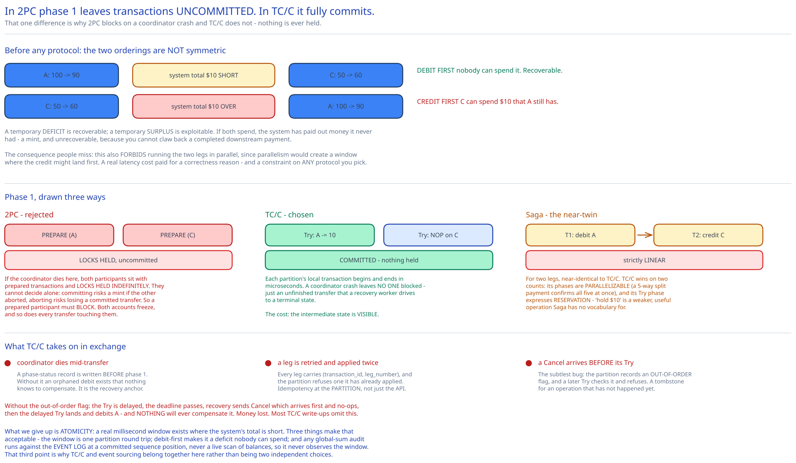

# Module 02 — Distributed Transactions: 2PC, TC/C & Saga



The problem in one line: **account A is on partition 3, account C is on partition 7, and `BEGIN … COMMIT` cannot span both.**

This module works through the three standard answers with their actual failure modes, then picks one. The general treatment is in [Distributed Transactions: 2PC, Saga & Compensation](../../hld-building-blocks/distributed-transactions-saga.md); this is the wallet-specific argument, including one protocol that page doesn't cover.

## Why the debit must come first

Before the protocols, the invariant that constrains all of them.

Any two-step transfer has a window where only one step has happened. There are two possible orderings and they are **not** symmetric:

```
Debit first:    A: 100→90   [WINDOW: system total is $10 SHORT]   C: 50→60
Credit first:   C: 50→60    [WINDOW: system total is $10 OVER ]   A: 100→90
```

In the credit-first window, **C can spend $10 that A still has.** If both spend, the system has paid out $10 it never had — money created from nothing. That's a mint, and it's unrecoverable: you cannot claw back a completed downstream payment.

In the debit-first window, the money is temporarily nowhere. Nobody can spend it. If the transfer fails, compensation restores it to A. The worst case is a user briefly seeing a lower balance than they should.

**A temporary deficit is recoverable; a temporary surplus is exploitable.** So debit-first is mandatory, and it also rules out doing the two legs *in parallel* — parallelism would create a window in which the credit might land first. That's a real latency cost accepted for a correctness reason, and it's worth stating as a constraint the protocol must respect rather than as a property of any particular protocol.

## Option 1 — Two-phase commit

The coordinator drives both partitions through prepare and commit, using their native transaction machinery.

```
PHASE 1 (prepare)
  Coordinator → P3: BEGIN; UPDATE A balance -10; PREPARE     → "yes"  (locks HELD, uncommitted)
  Coordinator → P7: BEGIN; UPDATE C balance +10; PREPARE     → "yes"  (locks HELD, uncommitted)

PHASE 2 (commit)
  Coordinator → P3: COMMIT      → locks released
  Coordinator → P7: COMMIT      → locks released
```

2PC gives genuine **atomicity**: no observer ever sees a half-completed transfer, because neither change is visible until both commit. That's a real guarantee the other two options don't offer, and it's why 2PC keeps being proposed.

**Why it's rejected here.** Two problems, and the second is disqualifying.

**Locks are held across a network round trip.** Between `PREPARE` and `COMMIT`, A's row is locked. The hold time is the coordinator's decision latency plus a network hop — milliseconds, not microseconds — and during it *nothing else can touch A*. At 1M TPS with any account concentration this collapses: a merchant account would be locked essentially continuously. Cross-ref [Optimistic vs Pessimistic Concurrency Control](../../database-design/optimistic-vs-pessimistic-locking.md) for why long-held pessimistic locks don't scale.

**The coordinator is a blocking single point of failure.** This is the fatal one. If the coordinator dies after both partitions replied "yes" but before sending `COMMIT`:

> Both partitions sit with prepared, uncommitted transactions and **locks held indefinitely.** They cannot decide for themselves — committing risks a mint if the other aborted, aborting risks losing a committed transfer. A prepared participant must *block* until the coordinator returns. Accounts A and C are frozen, and so is every transfer touching them.

This isn't a tuning problem; it's inherent. 2PC is a **blocking protocol**, and the standard fix (Paxos-replicated coordinator, i.e. 3PC-like schemes) adds consensus round trips to the critical path of every transfer, making the latency problem worse to fix the availability problem.

## Option 2 — TC/C (Try-Confirm/Cancel)

The key move: instead of one distributed transaction, use **two independent local transactions that each commit immediately**, plus a compensating transaction if the second fails.

```
                    Partition 3 (account A)        Partition 7 (account C)
PHASE 1  Try        balance -= 10  ← COMMITTED     no-op
PHASE 2a Confirm    no-op                          balance += 10  ← COMMITTED
PHASE 2b Cancel     balance += 10  ← COMMITTED     no-op
```

The difference from 2PC is precise and worth stating exactly: **in 2PC, phase 1 leaves transactions un-committed; in TC/C, phase 1 is fully committed.** Nothing is ever held. Every partition's local transaction begins and ends in microseconds.

The consequence is that the intermediate state is **visible** — after `Try`, A's balance really is 90 and the system's total really is short $10. TC/C gives up atomicity in exchange for never holding a lock, and the debit-first rule is what makes that visible intermediate state safe.

### The failure modes, and how they're handled

**The coordinator dies mid-transfer.** Unlike 2PC, the partitions are *not blocked* — their transactions committed. But something must eventually finish or reverse the transfer, so the coordinator writes a **phase-status record before phase 1**:

```
phase_status(txn_id, legs, try_status, second_phase, second_status, out_of_order_flag, deadline)
```

A recovery worker scans for non-terminal transfers past their deadline and drives each to completion or cancellation. The record is the recovery anchor — without it, an orphaned debit exists that nothing knows to compensate.

**A leg is retried and applied twice.** Each leg carries `(transaction_id, leg_number)`, and a partition refuses to apply a `(txn, leg)` it has already applied. Idempotency at the *partition*, not just at the API — a zombie coordinator's delayed retry must not debit twice.

**`Cancel` arrives before `Try`** — network reordering, or a recovery worker cancelling a transfer whose `Try` is still in flight. This is the subtlest bug in the protocol:

```
Coordinator sends Try to P3       → delayed in the network
Deadline passes; recovery sends Cancel to P3  → arrives FIRST
P3: "cancel a transfer I never tried?" → if it no-ops, then...
The delayed Try arrives → P3 debits A → NOTHING will ever compensate it. Money lost.
```

The fix is the **out-of-order flag**: when a `Cancel` arrives with no matching `Try`, the partition records that this `(txn, leg)` is cancelled. A later `Try` checks the flag and refuses. It's a tombstone for an operation that hasn't happened yet, and it's the detail most TC/C descriptions omit.

## Option 3 — Saga

A sequence of local transactions, each with a compensating transaction, rolled back in reverse on failure.

```
Forward:   T1 (debit A)  →  T2 (credit C)  →  done
On T2 fail: C1 (credit A back)  ←  rollback
```

For a two-step transfer, Saga and TC/C are nearly identical — which is worth admitting rather than manufacturing a distinction. The differences that matter:

| | TC/C | Saga |
|---|---|---|
| Phase structure | Try / Confirm / Cancel — **3 explicit phases** | Forward / compensate — 2 phases |
| Ordering | Phases may run in **parallel** across participants | Strictly **linear** |
| Resource reservation | `Try` can *reserve* without committing the effect | No reservation concept; each step is a real effect |
| Coordination | Central coordinator | Choreography (event-driven) **or** orchestration |
| Best fit | Few participants, low latency, symmetric operations | Many participants, long-running, heterogeneous services |

**TC/C is chosen over Saga here for two reasons.** First, TC/C's phases are parallelizable in general — and although the debit-first rule forbids parallelism for *this* operation, it matters for multi-leg transfers (a split payment to five recipients can confirm all five in parallel). Saga's strict linearity makes that five round trips instead of one.

Second, TC/C's `Try` phase naturally expresses **reservation**, which a wallet wants: "hold $10 of A's balance" is a different, weaker operation than "debit A", and it's exactly what you need for a pending payment awaiting authorization. Saga has no vocabulary for it — every step is a full effect.

Where Saga wins, and it's worth knowing: **long-running, multi-service business processes** — order placed, payment taken, inventory reserved, shipment created, each in a different service, over minutes. There the sequential structure matches the business process, and choreography avoids a coordinator that must know every service. That's why the [payments system](../payments-system/01-architecture-hld.md) case study reaches for Saga while this one doesn't: different shape of problem, same family of solution.

## Comparison

| | 2PC | **TC/C** | Saga |
|---|---|---|---|
| Atomicity (no visible intermediate) | **Yes** | No | No |
| Locks held across the network | **Yes** — the killer | No | No |
| Blocks if the coordinator dies | **Yes** — participants freeze | No — participants already committed | No |
| Isolation | Serializable-ish | **None** — intermediate state visible | None |
| Parallel participants | Yes | Yes | No (linear) |
| Reservation semantics | Implicit (prepared state) | **Explicit (`Try`)** | None |
| Complexity lives in | The database | **The application** | The application |
| Compensation must be written by | Nobody | **You** | **You** |
| Suits | A few nodes, low throughput, strong isolation needed | **High throughput, few participants, compensation is cheap** | Long-running, many heterogeneous services |

## Chosen: TC/C

**Why.** The throughput requirement (2M account updates/sec) makes any lock-holding protocol non-viable, and the availability requirement (99.99%) makes a blocking coordinator non-viable. TC/C's local transactions commit in microseconds and its participants are never blocked by a coordinator failure — it's the only one of the three that satisfies both constraints.

**What we give up, stated plainly.** Atomicity. There is a real window in which the system's total money is short, and a sufficiently determined observer summing all balances during that window would see an inconsistency. Three things make that acceptable:

1. The window is **milliseconds**, bounded by one partition round trip.
2. Because of debit-first, the intermediate state is a **deficit** — no user can spend money that doesn't exist, so no incorrect action can be taken based on it.
3. Any global-sum audit runs against the **event log at a committed sequence position** ([Module 03](./03-event-sourcing-cqrs.md)), not against a live scan of balances — so it never observes the window at all.

That third point is the one that actually closes the argument, and it's why TC/C and event sourcing belong together in this design rather than being two independent choices.

**What we take on.** Compensation logic is now application code, and it must be correct: idempotent, order-insensitive, and always eventually driven to completion. That's real, permanent complexity that 2PC would have kept inside the database — and it's why the recovery worker, the `(txn, leg)` idempotency check, and the out-of-order flag are all load-bearing rather than defensive extras.

## Practice: extend it yourself

1. **Extend the protocol to a 5-way split payment** (A pays B, C, D, E in one atomic operation). Work out: does debit-first still suffice, or do you need all recipients' `Try` phases before any `Confirm`? What does the phase-status record look like when 3 of 4 credits succeed? And how do you avoid a partial payout that leaves the sender debited for more than was delivered?
2. **Design the recovery worker's deadline policy.** Too short and it cancels transfers whose `Try` is merely slow (the out-of-order case, which then requires the flag to save you); too long and money sits in deficit. Pick a deadline, justify it against the partition's p99 and Raft commit latency, and describe the metric that would tell you the value is wrong in either direction.
