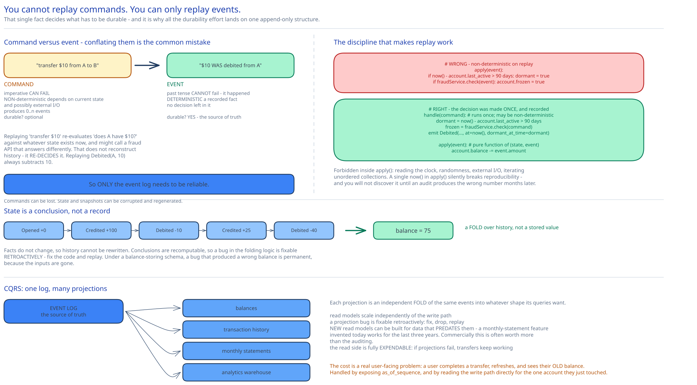

# Module 03 — Event Sourcing & CQRS



The requirement this module exists for: **reproduce any historical balance, at any point in time, from primary records** — and prove the system's logic is still correct after a code change.

## Why storing balances fails the requirement

The obvious schema:

```sql
UPDATE accounts SET balance = 90 WHERE id = 'A';
```

The information that A used to have 100 is now **gone**. You can log the change alongside it, but then you have two sources of truth that can disagree, and when they do — a bug, a missed log write, a manual `UPDATE` during an incident — the log is not authoritative, so you cannot use it to correct the balance. You're left reconciling two records with no principled way to decide which is right.

The three audit questions in [Module 00](./00-overview.md#requirements) are each unanswerable under this schema:

- *What was A's balance last March 3rd at 14:00?* → Unknown. You have today's balance and a log you don't fully trust.
- *How do we know today's balance is correct?* → You don't. There's nothing to check it against.
- *Is the logic still correct after this code change?* → Unanswerable, because the inputs that produced the current state weren't kept.

## Store the change, derive the value

```
Instead of:  balance = 90
Store:       Debited(account=A, amount=10, txn=T1, seq=41, at=…)
```

The balance becomes a **fold over history**:

```
balance(A) = Σ over all events for A of (+credit or −debit)
```

Now every question is answerable:

- *Balance last March 3rd?* → Fold events for A up to that timestamp.
- *How do we know it's correct?* → Recompute from event 0 and compare.
- *Still correct after a code change?* → Replay the same events through the new code and diff the results.

The key property is that **events are facts and state is a conclusion.** Facts don't change, so history can't be rewritten; conclusions can be recomputed, so a bug in the folding logic is fixable retroactively — you fix the code and replay. Under the balance-storing schema, a bug that produced a wrong balance is permanent, because the inputs are gone.

## The four concepts

Event sourcing has a precise vocabulary, and conflating command with event is the most common mistake.

| | **Command** | **Event** |
|---|---|---|
| Tense | Imperative — *"transfer $10 from A to C"* | Past tense — *"$10 was debited from A"* |
| Can it fail? | **Yes** — insufficient funds, frozen account | **No** — it already happened |
| Deterministic? | **No** — depends on current state and possibly external I/O | **Yes** — a recorded fact |
| Count | One command produces **zero or more** events | — |
| Stored durably? | Optional (useful for debugging) | **Yes — this is the source of truth** |

**State** is the current fold of all events. **The state machine** validates commands and applies events.

The reason the distinction matters so much:

> **You cannot replay commands. You can only replay events.**

A command like "transfer $10" is non-deterministic — replaying it re-evaluates "does A have $10?" against whatever state exists now, and might produce a different outcome, or call an external fraud API that returns something different. Replaying it doesn't reconstruct history; it *re-decides* it.

An event is a fact with no decision left in it. Replaying `Debited(A, 10)` always subtracts 10.

**So only the event log needs to be reliable.** Commands can be lost; state and snapshots can be corrupted and regenerated. That single conclusion is what focuses all the durability effort in [Module 01](./01-architecture-hld.md#building-blocks) on one append-only structure — which is also the cheapest structure to replicate and the fastest to write.

## The state machine must be deterministic

Replay only reproduces history if applying the same events in the same order always yields the same state. So the state machine is forbidden from:

- **Reading the clock.** `if (now() > deadline)` produces a different result on replay. Timestamps must arrive *inside* the event, stamped once when it was created.
- **Random numbers.** IDs and nonces are generated when the command is handled and recorded in the event, never regenerated during apply.
- **External I/O.** No API calls, no database reads, no fraud-service lookups inside `apply()`. Anything external must be resolved during command *validation* and its result baked into the event.
- **Iterating over unordered collections**, or anything else whose order varies between runs.

```
# WRONG — non-deterministic on replay
apply(event):
    if now() - account.last_active > 90 days: account.dormant = true
    if fraudService.check(event): account.frozen = true

# RIGHT — the decision was made once, at command time, and recorded
handle(command):                          # may be non-deterministic; runs ONCE
    dormant = now() - account.last_active > 90 days
    frozen  = fraudService.check(command)
    emit Debited(..., at=now(), dormant_at_time=dormant, fraud_flag=frozen)

apply(event):                             # pure function of (state, event)
    account.balance -= event.amount
    account.dormant  = event.dormant_at_time
```

This is the discipline that makes event sourcing work, and it's where implementations most often go wrong — a single `now()` inside `apply()` silently breaks reproducibility, and you won't discover it until an audit produces the wrong number months later.

## Snapshots

Folding two years of events on every restart is unacceptable. So state is periodically serialized:

```
snapshot(partition=3, up_to_sequence=8_421_007) → { account → balance, ... }

Recovery:  load the latest snapshot → replay only events after 8_421_007
```

The point worth being firm about: **a snapshot is a cache, not a record.** It's derivable from the log, so it needs no durability guarantees of its own — losing every snapshot costs recovery time, not data. Which is why snapshots go to object storage rather than into the consensus-replicated log.

Snapshots also *don't* satisfy the historical-balance requirement. "The balance at any point in time" needs the events; snapshots only give you the balance at snapshot boundaries. They're a performance optimization for recovery, and treating them as a historical record is a category error.

## CQRS: why reads and writes split

The write path is a consensus-replicated log with a single-writer state machine per partition. That's exactly wrong for balance queries, which are:

- Vastly more frequent than transfers.
- Read-only, needing no ordering or consensus.
- Diverse in shape — a balance, a transaction history, a monthly statement, an analytics rollup.

**Command Query Responsibility Segregation** is the observation that these need different models entirely:

```
Commands ──▶ State machine ──▶ EVENT LOG (the source of truth)
                                    │
                                    ├──▶ balances read model      (account → balance)
                                    ├──▶ transaction history      (account → paginated events)
                                    ├──▶ monthly statements        (account, month → aggregate)
                                    └──▶ analytics warehouse       (columnar)
```

Each read model is a **projection** — an independent fold of the same events into whatever shape its queries want. Four consequences, and the third is the one people underrate:

1. **Read models scale independently.** Add replicas of the balances projection without touching the write path.
2. **A read model can be rebuilt from scratch** by replaying the log. So a projection bug is fixable retroactively: fix the code, drop the projection, replay.
3. **New read models can be added for data that predates them.** A "monthly statement" feature invented today can be built for the last three years, because the events were kept. Under a balance-storing schema that feature could only ever work going forward — and this is the most commercially valuable property of event sourcing, not the auditing.
4. **The read side is expendable.** If projections fail entirely, transfers continue; only queries degrade ([Module 01](./01-architecture-hld.md#scaling-reliability)).

**The cost is eventual consistency, and it's a real user-facing problem.** A user completes a transfer and immediately refreshes — the projection may not have applied the event yet, so they see their **old balance.** "I sent money and it didn't work" is a support ticket and a trust problem, so it needs handling rather than accepting:

- **Expose the boundary.** Every balance response carries `as_of_sequence` ([Module 00](./00-overview.md#api-surface)), and the transfer response returns its committed sequence. A client that knows its transfer was sequence 8,421,008 can tell that a balance `as_of_sequence: 8,421,001` predates it.
- **Read-your-writes on demand.** The client passes `?min_sequence=8421008`; the read model waits (briefly) until it has applied that far, or returns `409` so the client retries. Cross-ref [Consistency Models](../../hld-building-blocks/consistency-models.md).
- **Or read the write path.** For the single account the user just transacted on, query the partition's in-memory state directly — authoritative and cheap, since it's one account. This is the pragmatic answer most systems use: eventual consistency for browsing, strong consistency for the account you just touched.

## What this buys, concretely

Returning to Module 00's requirements:

| Requirement | How event sourcing satisfies it |
|---|---|
| Reproduce any historical balance | Fold events up to that timestamp. The events were never discarded. |
| Prove today's balance is correct | Recompute from sequence 0 and compare against the projection. A mismatch is a bug, with both inputs available to diagnose it. |
| Prove logic is correct after a code change | Replay the same event log through old and new code; diff the resulting state. This is a genuine regression test over production data — impossible without retained events. |
| Auditability of every change | Every balance change *is* an event, with its transaction id, amount and timestamp. There is no path that changes a balance without producing one. |
| Compensation without erasing history | A reversal is a **new** event beside the original ([Module 01](./01-architecture-hld.md#per-path-walkthrough)), so the trail shows the debit *and* its reversal. |

And the throughput benefit that wasn't the motivation but falls out anyway: **the write path is now an append-only sequential write**, which is the fastest thing a disk does and the cheapest thing to replicate ([Module 04](./04-lld.md#making-one-node-fast)).

## What event sourcing costs

Worth being honest about, because it's frequently oversold:

- **Schema evolution is genuinely hard.** Events are immutable and permanent, so a three-year-old event was written by three-year-old code. `apply()` must handle **every version of every event, forever.** Upcasters (transforming old events to the current shape on read) are the standard tool and they accumulate indefinitely. This is the single largest ongoing cost.
- **Unbounded storage.** 1.26 PB/year, permanently. Archival is mandatory.
- **Deletion fights the design.** A GDPR erasure request means deleting facts from an append-only log that everything is derived from. The usual answer is **crypto-shredding** — store personal data encrypted, and destroy the key — which leaves the event structurally intact and its payload unreadable. It works, and it's a workaround rather than a solution.
- **Every query needs a projection.** There is no ad-hoc `SELECT` against current state; if no projection answers your question, you build one. Powerful, but it means more moving parts than a table.
- **The determinism discipline is easy to violate** and the violation is silent until an audit.

**When not to event-source:** when there's no audit requirement, no need for historical state, and no value in retroactive projections. For a user-profile service, `UPDATE users SET name = ?` is correct and event sourcing would be self-harm. The wallet earns it because auditability is a stated, non-negotiable requirement — not because event sourcing is generally better.

## Practice: extend it yourself

1. **Design the schema-evolution path.** `Debited` v1 has `amount` as an integer of cents; v2 adds `currency`; v3 splits `amount` into `gross` and `fee`. Write the upcaster chain, then answer the harder question: when a v1 event has no currency, where does the correct value come from — and what do you do if the answer is "we don't know"?
2. **Handle a GDPR erasure request.** A user demands deletion. Their events are inputs to their own balance, their counterparties' transaction histories, and a monthly-statement projection. Work out what can be destroyed, what must be retained for the counterparty's audit trail, and how crypto-shredding interacts with replay — specifically, what `apply()` does when it encounters an event whose payload it can no longer decrypt.
