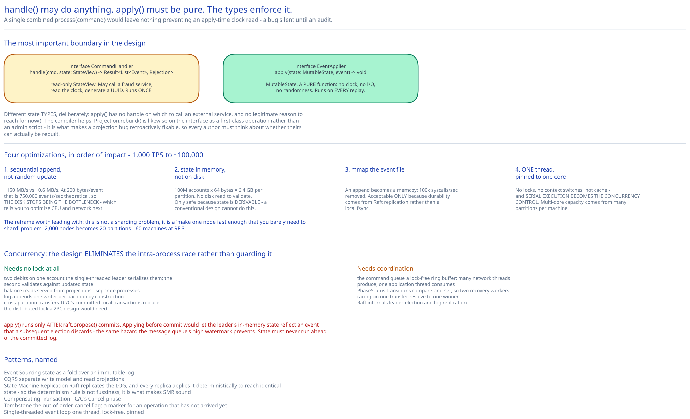

# Module 04 — Low-Level Design



## Interfaces vs. implementations

```
interface CommandHandler                       # validates; may be non-deterministic
    handle(cmd: Command, state: StateView) -> Result<List<Event>, Rejection>

interface EventApplier                         # MUST be a pure function
    apply(state: MutableState, event: Event) -> void

interface EventLog
    append(events: List<Event>) -> Sequence     # returns only after quorum commit
    readFrom(seq: Sequence) -> Iterator<Event>
    truncateTo(seq: Sequence) -> void           # archival only; never data loss

interface ConsensusGroup
    isLeader() -> bool
    propose(entry: LogEntry) -> Future<Sequence>
    currentTerm() -> long

interface SnapshotStore
    save(state: State, upToSeq: Sequence) -> void
    loadLatest() -> (State, Sequence)?

interface Projection                            # one per read model
    apply(event: Event) -> void
    lastAppliedSequence() -> Sequence
    rebuild() -> void                           # drop and replay from 0

interface TransferCoordinator
    execute(transfer: TransferRequest) -> TransferResult
    recover(txnId: TxnId) -> void                # drive a stuck transfer to terminal
```

The split between **`CommandHandler` and `EventApplier` is the most important boundary in this design**, and it's not an aesthetic decomposition — it's a type-level encoding of [Module 03](./03-event-sourcing-cqrs.md#the-state-machine-must-be-deterministic)'s determinism rule.

`handle` receives a **read-only `StateView`** and may do anything — call a fraud service, read the clock, generate a UUID. It runs exactly once. `apply` receives a **`MutableState`** and an event, and is a pure function: no clock, no I/O, no randomness. It runs every time the log is replayed.

Making them separate interfaces with different state types means the compiler helps: `apply` has no handle on which to call an external service, and no legitimate reason to reach for `now()`. A single combined `process(command)` method — the intuitive design — would leave nothing preventing an `apply`-time clock read, and that bug is silent until an audit produces a wrong historical balance months later.

`Projection.rebuild()` is on the interface deliberately, as a first-class operation rather than an admin script. It's the mechanism that makes a projection bug retroactively fixable, and putting it in the type means every projection author has to think about whether theirs can actually be rebuilt.

## Making one node fast

[Module 00](./00-overview.md#capacity-estimation) established the goal: a general-purpose database node does ~1,000 write TPS, needing 2,000 nodes for peak. Getting to **~100,000 TPS/node** turns that into 20 partitions (60 machines at RF 3). Four optimizations, in order of impact.

### 1. Sequential append instead of random update

A database `UPDATE` is a random write: locate the page, modify it, write a WAL record, eventually flush the dirty page. Appending an event touches only the tail of one file.

Sequential disk is ~150 MB/sec versus ~0.6 MB/sec random — the same 244× gap the [message queue](../distributed-message-queue/02-storage-engine.md#the-measurement-everything-follows-from) is built on. At 200 bytes per event that's a theoretical **750,000 events/sec**, comfortably above target. So **the disk stops being the bottleneck**, which is the finding that tells you where to optimize next: CPU and network.

### 2. State in memory, not on disk

Balances live in an in-memory map, rebuilt on startup from a snapshot plus the log tail. There is no read from disk to validate a command.

This is only safe because of [Module 03](./03-event-sourcing-cqrs.md#snapshots)'s conclusion that **state is derivable**. Losing it costs recovery time, not money. A conventional design cannot do this, because there the in-memory value *is* the only copy of the current balance and must be persisted before acknowledging.

Sizing: 100M accounts × ~64 bytes (id, balance, flags, sequence) ≈ **6.4 GB per partition** — trivially resident. This is the optimization that removes disk reads from the hot path entirely.

### 3. `mmap` the event file

```
mmap(fd, size, PROT_WRITE, MAP_SHARED)   → a byte array backed by the file
append: memcpy into the mapped region, bump the offset
```

The kernel handles flushing. So an append is a `memcpy` — no `write()` syscall, no user-to-kernel copy. At 100k events/sec that removes 100k syscalls/sec, and the page cache means recently-written events are re-readable (for followers catching up) with no disk read at all.

The honest trade: `mmap` gives up explicit control over *when* bytes reach the platter. That's acceptable **only** because durability comes from Raft replication to three machines, not from a local `fsync` — the same substitution the [message queue](../distributed-message-queue/02-storage-engine.md#durability-without-fsync-per-message) makes. Without consensus replication this would be reckless.

### 4. A single-threaded application loop pinned to a core

```
loop forever:                          # ONE thread, pinned to one CPU core
    cmd = commandQueue.poll()          # lock-free ring buffer
    events = handler.handle(cmd, state)
    seq = raft.propose(events)         # batched with other pending commands
    for e in events: applier.apply(state, e)
    respond(cmd, seq)
```

Counter-intuitively, **one thread beats many** here:

- **No locks.** Every command touching account state runs on one thread, so there is no mutex, no atomic contention, no lock convoy. The [message queue](../distributed-message-queue/02-storage-engine.md#batching-is-the-whole-performance-story)'s append-lock contention problem simply doesn't arise.
- **No context switches.** Pinning to a core keeps the L1/L2 cache hot; the working set (balance map, log tail) stays resident.
- **Serial execution is the concurrency control.** The `Concurrent-User Handling` table in [Module 01](./01-architecture-hld.md#concurrent-user-handling) claims two concurrent debits on one account need no lock, and *this* is why: the leader processes commands in sequence, so the second command validates against state the first already updated. Ordering replaces locking.
- **Determinism comes free.** A single-threaded apply loop has one unambiguous order, which is exactly what replay needs. A multi-threaded applier would need its interleaving recorded to be replayable — which would mean serializing it anyway.

Multi-core capacity is recovered by running **multiple partitions per machine**, each with its own pinned thread and its own Raft group. Parallelism across partitions, serialism within one.

## Pseudocode: the transfer coordinator

```
TransferCoordinator.execute(req) -> TransferResult:
    # 1. Idempotency, before ANY side effect
    if prior = idempotencyStore.get(req.actor, req.idempotencyKey):
        if prior.requestHash != hash(req): throw ConflictError        # 409
        return prior.result                                            # replay

    txn   = TxnId.generate()
    debit  = Leg(1, partitionOf(req.from), DEBIT,  req.from, req.amount)
    credit = Leg(2, partitionOf(req.to),   CREDIT, req.to,   req.amount)

    # 2. Record INTENT before acting. The recovery anchor.
    phaseStatus.create(txn, legs=[debit, credit],
                       deadline = now() + TRANSFER_DEADLINE)

    # 3. PHASE 1 — Try. Debit FIRST, always (Module 02).
    try:
        tryResult = partition(debit).execute(txn, debit)      # idempotent on (txn, leg)
    except InsufficientFunds:
        phaseStatus.markTerminal(txn, FAILED_NO_FUNDS)        # nothing to compensate
        return failure(402)
    except Timeout:
        # UNKNOWN whether it applied. Do NOT assume. Leave it to recovery.
        phaseStatus.markUncertain(txn, leg=1)
        throw RetryableError(503)

    phaseStatus.markLegCommitted(txn, 1, tryResult.sequence)

    # 4. PHASE 2 — Confirm.
    try:
        confirmResult = partition(credit).execute(txn, credit)
    except (AccountFrozen, PermanentError):
        compensate(txn, debit)                                 # PHASE 2b
        phaseStatus.markTerminal(txn, FAILED_COMPENSATED)
        return failure(422)
    except Timeout:
        phaseStatus.markUncertain(txn, leg=2)
        throw RetryableError(503)                              # recovery resolves it

    phaseStatus.markTerminal(txn, COMPLETED)

    # 5. Store the idempotency result only AFTER success
    result = TransferResult(txn, COMPLETED, confirmResult.sequence)
    idempotencyStore.put(req.actor, req.idempotencyKey, hash(req), result)
    return result


compensate(txn, debitLeg):
    reversal = Leg(3, debitLeg.partition, CREDIT, debitLeg.account, debitLeg.amount,
                   reason = COMPENSATION, compensates = debitLeg.legNumber)
    retryWithBackoff(() -> partition(reversal).execute(txn, reversal))
    # This MUST eventually succeed. If it exhausts retries -> DLQ, page a human.
    # Money is missing until it does.
```

**The two `Timeout` branches are the most important part.** On timeout the coordinator does **not** know whether the leg applied — the request may have committed and the response been lost. The wrong responses are both tempting:

- *Assume it failed and compensate* → if it actually succeeded, you've now credited back money that was never debited. **A mint.**
- *Assume it succeeded and continue* → if it actually failed, you credit the recipient without debiting the sender. **Also a mint.**

The only safe move is to **record uncertainty and let recovery resolve it by reading the partition's log**, which is the authoritative record of whether `(txn, leg)` was applied. This is why the partitions expose idempotency on `(txn, leg)` rather than the coordinator merely tracking its own attempts: the coordinator's memory of what it did is not trustworthy, and the log is.

## Pseudocode: the partition state machine

```
Partition.execute(txn, leg) -> LegResult:
    if not raft.isLeader(): throw NotLeaderError(raft.currentLeader())

    # Idempotency at the PARTITION — a zombie coordinator's retry must not double-apply
    if applied = appliedLegs.get(txn, leg.number):
        return LegResult(applied.sequence, alreadyApplied = true)

    # The out-of-order tombstone (Module 02) — a Cancel arrived before this Try
    if cancelledLegs.contains(txn, leg.number):
        throw AlreadyCancelledError

    account = state.get(leg.account)
    if account is null:            throw UnknownAccountError
    if account.frozen:             throw AccountFrozenError

    if leg.type == DEBIT:
        if account.balance < leg.amount:
            throw InsufficientFundsError          # NOT an event — nothing happened
        event = Debited(leg.account, leg.amount, txn, leg.number, at = now())
    else:
        event = Credited(leg.account, leg.amount, txn, leg.number, at = now(),
                         reason = leg.reason)

    seq = raft.propose([event])                   # blocks until quorum-committed
    applier.apply(state, event)                   # only AFTER commit
    appliedLegs.record(txn, leg.number, seq)      # itself an event in the log
    return LegResult(seq)
```

Three details:

**`at = now()` is called in `handle`, not `apply`.** The timestamp is captured once and stored *inside* the event, so replay uses the recorded value. This is the determinism rule in one line, and getting it backwards is the classic error.

**`InsufficientFunds` produces no event.** A rejected command is not a fact about the account — nothing happened to it. (A system wanting to audit *attempts* would emit a separate `TransferRejected` event to a different stream, deliberately not part of the balance fold.)

**`apply` happens only after `raft.propose` returns.** Applying before commit would let the leader's in-memory state reflect an event that a subsequent leader election discards — the same hazard the message queue's [high watermark](../distributed-message-queue/03-replication-isr.md#the-high-watermark) prevents. State must never run ahead of the committed log.

## Error cases worth designing for deliberately

| Error | HTTP | Why it's its own type |
|---|---|---|
| `InsufficientFundsError` | 402 | A normal business outcome, not a failure. Must not be logged as an error or alerted on. |
| `AccountFrozenError` | 422 | Well-formed request, refused subject. Distinct from a validation error. |
| `NotLeaderError` | 503 + leader hint | Retryable *immediately* against a different node. Carrying the current leader saves a discovery round trip. |
| `AlreadyCancelledError` | 409 | The out-of-order guard fired. Rare, and its rate is a signal that the recovery deadline is too aggressive. |
| `AlreadyAppliedError` | 200 (not an error) | Idempotent replay. Returning success is the *correct* response — surfacing it as an error would make clients retry a completed operation. |
| `TimeoutError` | 503 | **Outcome unknown.** The one error whose handling must never assume either direction. |
| `ConflictError` (same key, different body) | 409 | Catches a client reusing an idempotency key for a different transfer — otherwise it would silently receive someone else's result. |
| `QuorumLostError` | 503 | The partition cannot safely accept writes. Deliberately unavailable rather than risking acknowledged-then-lost money. |

## Concurrency at the code level

**What needs no lock:**

- **Two debits on one account.** The single-threaded leader loop serializes them; the second validates against updated state. **Serial execution is the concurrency control**, which is the whole reason for the pinned-thread design.
- **Balance reads.** Served from projections, which are separate processes entirely ([Module 03](./03-event-sourcing-cqrs.md#cqrs-why-reads-and-writes-split)). Readers and the writer never touch the same memory.
- **Log appends.** One writer per partition by construction — the Raft leader. Followers only append what the leader sends, in order.
- **Cross-partition transfers.** No lock spans partitions; TC/C's committed local transactions replace the distributed lock a 2PC design would need.

**What does need coordination:**

- **The command queue** — a lock-free ring buffer (many network threads producing, one application thread consuming). Lock-free rather than mutex-guarded because the whole point is that the application thread never blocks.
- **`PhaseStatus` transitions** — compare-and-set, so two recovery workers racing on one stuck transfer resolve to a single winner. This is optimistic concurrency control (cross-ref [Optimistic vs Pessimistic Concurrency Control](../../database-design/optimistic-vs-pessimistic-locking.md)), correct here because contention is near-zero.
- **Raft's own internals** — leader election and log replication, handled by the consensus library.

The pattern, as everywhere in this guide: cross-process races belong to consensus or a database; intra-process races belong to a queue or a mutex. What's distinctive here is that the design **eliminates** the intra-process race rather than guarding it, by having exactly one thread.

## Design patterns you just used, named

- **Event Sourcing** — state as a fold over an immutable event log.
- **CQRS** — separate write model and read projections.
- **State Machine Replication** — Raft replicates the *log*, and every replica applies it deterministically to reach identical state. The determinism rule isn't fussiness; it's what makes SMR sound.
- **Compensating Transaction** — TC/C's `Cancel` phase.
- **Tombstone** — the out-of-order cancel flag: a marker for an operation that hasn't arrived yet.
- **Memento / Snapshot** — periodic serialized state as a recovery shortcut, explicitly a cache.
- **Single-threaded event loop (Reactor)** — one thread, lock-free, pinned.

## Practice: extend it yourself

1. **Add a "hold" operation** for a pending payment: reserve $10 of A's balance so it can't be spent, then either capture or release it later. Design the events (how many, and what does the balance fold become when available and reserved balances differ?), the `apply` logic, and the expiry mechanism for a hold nobody captures — noting that expiry needs a clock, which `apply` is forbidden from reading. Where does the expiry decision live?
2. **Handle a partition leader that applies an event and dies before responding.** The coordinator times out and marks uncertainty. Write the recovery worker's resolution logic: how it interrogates the new leader for whether `(txn, leg)` was applied, what it does if the new leader's log is *shorter* than the old leader's uncommitted tail, and why `appliedLegs` must itself be part of the replicated log rather than in-memory bookkeeping.
