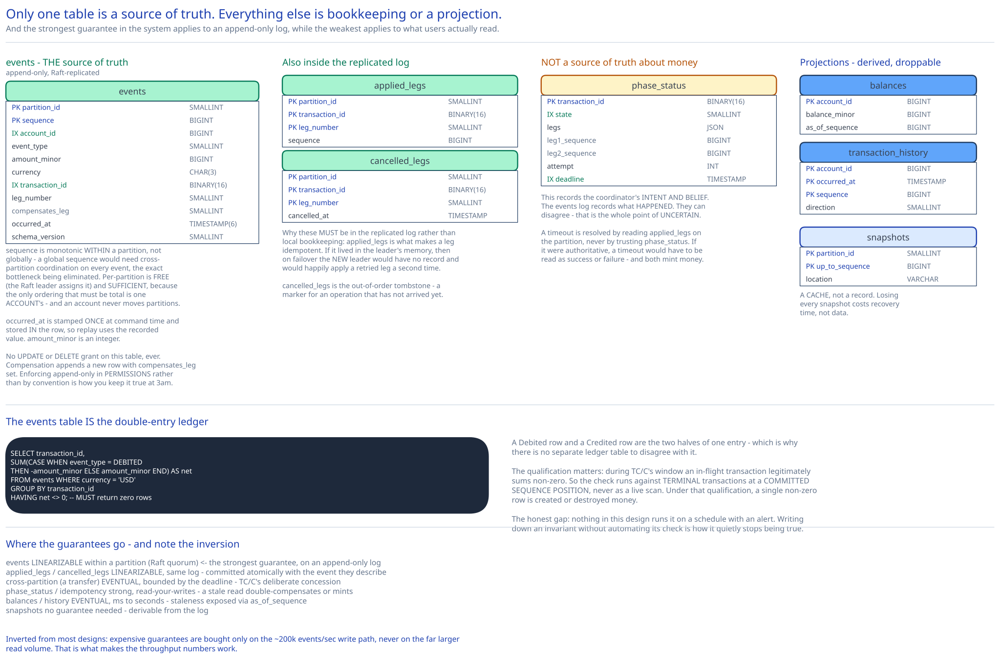

# Module 05 — Database Design



The unusual thing about this schema is that **only one table is a source of truth.** Everything else is either transaction bookkeeping or a derived projection that can be dropped and rebuilt.

## From entities to schema

```sql
-- ═══ THE SOURCE OF TRUTH. Append-only. Replicated by Raft. Never updated, never deleted. ═══
CREATE TABLE events (
    partition_id    SMALLINT     NOT NULL,
    sequence        BIGINT       NOT NULL,      -- monotonic WITHIN a partition
    account_id      BIGINT       NOT NULL,
    event_type      SMALLINT     NOT NULL,      -- DEBITED | CREDITED | ACCOUNT_OPENED | FROZEN | …
    amount_minor    BIGINT       NOT NULL,      -- INTEGER minor units. Never a float.
    currency        CHAR(3)      NOT NULL,
    transaction_id  BINARY(16)   NOT NULL,
    leg_number      SMALLINT     NOT NULL,      -- 1=debit, 2=credit, 3=compensation
    compensates_leg SMALLINT     NULL,          -- non-null on a reversal
    occurred_at     TIMESTAMP(6) NOT NULL,      -- stamped ONCE at command time (Module 04)
    schema_version  SMALLINT     NOT NULL,      -- for upcasting (Module 03)
    payload         BLOB         NULL,          -- type-specific extras; encrypted if it has PII
    PRIMARY KEY (partition_id, sequence)
);

-- ═══ Idempotency at the partition. Itself part of the replicated log. ═══
CREATE TABLE applied_legs (
    partition_id    SMALLINT     NOT NULL,
    transaction_id  BINARY(16)   NOT NULL,
    leg_number      SMALLINT     NOT NULL,
    sequence        BIGINT       NOT NULL,      -- which event this leg produced
    PRIMARY KEY (partition_id, transaction_id, leg_number)
);

-- ═══ The out-of-order tombstone (Module 02). Also part of the log. ═══
CREATE TABLE cancelled_legs (
    partition_id    SMALLINT     NOT NULL,
    transaction_id  BINARY(16)   NOT NULL,
    leg_number      SMALLINT     NOT NULL,
    cancelled_at    TIMESTAMP    NOT NULL,
    PRIMARY KEY (partition_id, transaction_id, leg_number)
);

-- ═══ Coordinator bookkeeping. NOT a source of truth about money. Sharded on transaction_id. ═══
CREATE TABLE phase_status (
    transaction_id  BINARY(16)   NOT NULL,
    state           SMALLINT     NOT NULL,      -- STARTED|LEG1_OK|COMPLETED|COMPENSATING|FAILED|UNCERTAIN
    legs            JSON         NOT NULL,      -- [{leg,partition,account,amount,type}]
    leg1_sequence   BIGINT       NULL,
    leg2_sequence   BIGINT       NULL,
    attempt         INT          NOT NULL,      -- the CAS guard
    deadline        TIMESTAMP    NOT NULL,
    updated_at      TIMESTAMP    NOT NULL,
    PRIMARY KEY (transaction_id)
);

-- ═══ API-level idempotency. Sharded on (actor_id, idem_key). TTL'd. ═══
CREATE TABLE idempotency_keys (
    actor_id        BIGINT       NOT NULL,
    idem_key        VARCHAR(64)  NOT NULL,
    request_hash    BINARY(32)   NOT NULL,      -- detects key reuse with a different body
    transaction_id  BINARY(16)   NOT NULL,
    result          JSON         NOT NULL,
    created_at      TIMESTAMP    NOT NULL,
    PRIMARY KEY (actor_id, idem_key)
);

-- ═══ PROJECTIONS. All derived. All droppable and rebuildable. ═══
CREATE TABLE balances (                          -- the hot read model
    account_id      BIGINT       NOT NULL,
    balance_minor   BIGINT       NOT NULL,
    currency        CHAR(3)      NOT NULL,
    as_of_sequence  BIGINT       NOT NULL,      -- exposed in the API (Module 00)
    updated_at      TIMESTAMP    NOT NULL,
    PRIMARY KEY (account_id)
);

CREATE TABLE transaction_history (               -- account-ordered, for statements
    account_id      BIGINT       NOT NULL,
    occurred_at     TIMESTAMP(6) NOT NULL,
    sequence        BIGINT       NOT NULL,
    transaction_id  BINARY(16)   NOT NULL,
    direction       SMALLINT     NOT NULL,
    amount_minor    BIGINT       NOT NULL,
    counterparty    BIGINT       NULL,
    PRIMARY KEY (account_id, occurred_at, sequence)
);

CREATE TABLE snapshots (                         -- a CACHE, not a record
    partition_id    SMALLINT     NOT NULL,
    up_to_sequence  BIGINT       NOT NULL,
    location        VARCHAR(512) NOT NULL,      -- an object-storage URI
    created_at      TIMESTAMP    NOT NULL,
    PRIMARY KEY (partition_id, up_to_sequence)
);
```

### Why `amount_minor` is an integer

`BIGINT` counting cents (or the currency's smallest unit), never `FLOAT` or `DOUBLE`.

IEEE-754 binary floating point cannot represent `0.10` exactly. `0.1 + 0.2` yields `0.30000000000000004`. Accumulate that over a billion transactions and balances drift with no single bug to point at — the errors are in the *representation*, so every arithmetic operation contributes a little. `DECIMAL(19,4)` is also acceptable (databases implement it as scaled integers internally), but a `BIGINT` of minor units is faster, unambiguous, and forces the application to be explicit about scale.

The corollary is that **currency must travel with the amount.** `1000` minor units is ¥1000 or $10.00 depending on the currency's exponent, so an amount without a currency is meaningless. Hence `currency CHAR(3)` on every event.

### Why the primary key is `(partition_id, sequence)`

Two properties, both load-bearing:

**Sequence is monotonic within a partition, not globally.** A global sequence would need cross-partition coordination on every single event — the exact bottleneck [Module 00](./00-overview.md#capacity-estimation) is trying to eliminate. Per-partition monotonicity is free (the Raft leader assigns it) and it's *sufficient*, because the only ordering that must be total is the ordering of events **for one account**, and an account never moves between partitions.

**It makes the table append-only in physical layout.** Inserts always land at the end of the clustered index — no page splits, no random writes, so the B-tree grows sequentially. That's what lets a relational engine keep up at 100k events/sec, and it's the same property the [message queue's log](../distributed-message-queue/02-storage-engine.md#segments-and-why-the-log-isnt-one-file) is built on. (In the real implementation the log is a raw `mmap`'d file rather than a SQL table — this schema is the logical shape.)

Note what is deliberately **absent**: no `UPDATE` or `DELETE` grant on this table, ever. Compensation appends a new row with `compensates_leg` set. The append-only property is the audit guarantee, and enforcing it in permissions rather than by convention is how you keep it true during an incident at 3am.

### Why `applied_legs` must be in the replicated log

It looks like local bookkeeping, and putting it in local memory or a side table would be a subtle disaster.

`applied_legs` is what makes a leg idempotent — a zombie coordinator's retry checks it and gets `AlreadyApplied` instead of double-debiting. If it lived in the leader's memory, then on leader failover the **new** leader would have no record of applied legs and would happily apply a retried leg a second time. So it has to be part of the same replicated, committed sequence as the events themselves — written atomically with the event it describes.

This is the schema-level expression of [Module 04](./04-lld.md#pseudocode-the-transfer-coordinator)'s conclusion that *the coordinator's memory of what it did is not trustworthy; the log is.*

### The double-entry property

Traditional accounting keeps a ledger where every transaction has balanced debit and credit entries, and the sum of all entries is always zero. This schema gets that property without a separate ledger table:

```sql
-- Every leg of every transaction, and the invariant that must hold
SELECT transaction_id,
       SUM(CASE WHEN event_type = DEBITED THEN -amount_minor ELSE amount_minor END) AS net
FROM events
WHERE currency = 'USD'
GROUP BY transaction_id
HAVING net <> 0;          -- MUST return zero rows for every COMPLETED transfer
```

**The events table *is* the double-entry ledger** — a `Debited` row and a `Credited` row are the two halves of one entry. That's why there's no separate `ledger` table: it would be a duplicate of `events` with the same information and the possibility of disagreeing with it.

The invariant is the system's most valuable test, and it's worth being precise about when it holds. During TC/C's window between leg 1 and leg 2 the sum is legitimately non-zero for an in-flight transaction ([Module 02](./02-distributed-transactions.md#chosen-tcc)). So the check runs against transactions in a **terminal** state, at a committed sequence position — never as a live scan. Under that qualification it must be exactly zero, always, and a single non-zero row is either created or destroyed money.

### Why `phase_status` is not a source of truth about money

This is the distinction that keeps recovery correct. `phase_status` records the coordinator's *intent and belief*. The `events` log records what *happened*.

They can disagree — that's the whole point of the `UNCERTAIN` state. A coordinator that times out doesn't know if the leg applied, so it records uncertainty, and the recovery worker resolves it by **reading `applied_legs` on the partition**, not by trusting `phase_status`. If `phase_status` were treated as authoritative, a timeout would have to be interpreted as either success or failure, and [Module 04](./04-lld.md#pseudocode-the-transfer-coordinator) shows both interpretations can mint money.

So `phase_status` is a to-do list, and it's sharded and replicated ordinarily — it needs durability (losing it orphans a debit) but not the append-only audit properties of the event log.

## Indexes

| Index | Serves |
|---|---|
| `PRIMARY KEY (partition_id, sequence)` on `events` — clustered | Replay, recovery, and archival — all sequential range scans. Append-only insert pattern. |
| `INDEX (partition_id, account_id, sequence)` on `events` | Folding one account's history — the audit query, and projection rebuild for a single account. |
| `INDEX (transaction_id)` on `events` | The double-entry invariant check, and "show me both legs of this transfer". |
| `PRIMARY KEY (partition_id, transaction_id, leg_number)` on `applied_legs` | The idempotency check on every leg. Highest-frequency lookup in the write path. |
| `PRIMARY KEY (transaction_id)` on `phase_status` | Coordinator and recovery lookups. |
| `INDEX (state, deadline) WHERE state NOT IN (COMPLETED, FAILED)` on `phase_status` | **The recovery worker's scan.** Partial, so the vast majority of rows (terminal transfers) aren't indexed — otherwise this index would grow with total transfer volume to serve a query that only ever wants the handful in flight. |
| `PRIMARY KEY (account_id)` on `balances` | The balance query. One point lookup. |
| `PRIMARY KEY (account_id, occurred_at, sequence)` on `transaction_history` | Statement pagination as an ordered range scan, newest-first, no sort. |
| `PRIMARY KEY (actor_id, idem_key)` on `idempotency_keys` | Idempotency replay detection, and the uniqueness that makes concurrent replays safe. |

**Deliberately absent:** nothing on `occurred_at` in `events`. Tempting for "all events in a time range", but that's an analytics query that belongs in the warehouse projection, and the index would cost a write on all 200k events/sec to serve a query that should never hit the write store. And nothing on `amount_minor` — never searched by.

## Consistency

| Data | Model | Why |
|---|---|---|
| `events` | **Linearizable within a partition** (Raft quorum) | This is money. An acknowledged event must survive any minority failure, and one account's events must be totally ordered or its balance is undefined. Cross-ref [Replication & Consensus](../../hld-building-blocks/replication-consensus.md). |
| `applied_legs`, `cancelled_legs` | **Linearizable, same log** | Committed atomically with the event they describe; must survive leader failover or idempotency breaks. |
| Cross-partition (a whole transfer) | **Eventually consistent, bounded by the deadline** | TC/C's deliberate concession. A window exists where only the debit has landed. Safe because debit-first makes it a deficit, and audits read at a committed sequence rather than scanning live. |
| `phase_status` | **Strong, read-your-writes** | A recovery worker reading a stale state could double-compensate. Must be read from the primary. |
| `idempotency_keys` | **Strong, read-your-writes** | A stale "no such key" mints a second transfer. Primary reads only. |
| `balances`, `transaction_history` | **Eventual**, milliseconds to seconds | Projections. Staleness is exposed via `as_of_sequence` and optionally overridden with `?min_sequence=`. |
| `snapshots` | **No guarantee needed** | Derivable from the log. Losing all of them costs recovery time only. |

**The asymmetry worth naming:** the strongest guarantee in the system (linearizable consensus) applies to the append-only event log, and the weakest (eventual, expendable) applies to everything a user actually reads. That's inverted from most designs, and it's what makes the throughput numbers work — expensive guarantees are bought only on the ~200k events/sec write path, not on the far larger read volume.

## Scaling the schema

**`events` — sharded by `partition_id = hash(account_id) % N`, with N fixed at deployment.**

Every write names an account, so the partition is computable with no lookup: **single-partition writes, always.** No distributed transaction touches the log itself; TC/C operates *above* it, coordinating two independent single-partition commits.

Why the alternatives fail:
- **Shard by `transaction_id`** → a transfer's two legs land on one shard, which sounds convenient, but then an *account's* events scatter across every shard and folding one balance becomes a full-cluster scatter-gather. Balance correctness needs an account's events co-located and ordered; that requirement dominates.
- **Shard by time** → all writes hit the newest shard. The usual total write hotspot.
- **Shard by currency or region** → wildly skewed, and it makes cross-shard transfers the common case rather than the exception.

The cost, stated honestly: **an account cannot change partitions** without moving its entire event history, and partition count therefore cannot change without a migration that pauses writes for the affected accounts. It's the same one-way door as [message queue partition count](../distributed-message-queue/04-consumers-delivery.md#changing-partition-count), and with a 10× peak-to-average ratio it has to be sized for peak on day one.

**`phase_status` — sharded on `transaction_id`.** Random UUIDs distribute perfectly, every access carries the id, and the table is self-cleaning (terminal rows archived after a retention window).

**`balances` — sharded on `account_id`, replicated aggressively.** This is the read-heavy table, so it gets many replicas; because it's a rebuildable projection, replica consistency requirements are weak and a corrupt replica can simply be re-derived rather than repaired.

**`transaction_history` — sharded on `account_id`**, so statement queries are single-shard ordered scans. Note it deliberately shares `balances`' shard key but is a *separate* projection with a different physical ordering — the same CQRS-in-the-schema move the [object storage listing table](../object-storage-s3/04-db-design.md#the-listing-problem) makes.

**Archival.** Sealed event ranges move to object storage after 90 days, with `snapshots` marking the boundary. The log stays logically infinite; only the hot tail is local. Deep audits read from the archive, which is slower — see the gap below.

## Connecting it back

**"Reproduce any historical balance from primary records"** (Module 00) → store events, not balances, with a deterministic applier (Module 03) → which requires the timestamp to be stamped at command time and `apply()` to be pure (Module 04) → surfacing here as `occurred_at` and `schema_version` **on the event row**, and as the absence of any `UPDATE`/`DELETE` grant on `events`. The append-only property is the audit guarantee, made structural.

**"2,000,000 account updates/sec at peak"** (Module 00) → raise per-node throughput rather than adding nodes, via sequential append, in-memory state, `mmap`, and a single pinned thread (Module 04) → surfacing here as `PRIMARY KEY (partition_id, sequence)`, which makes every insert land at the tail of the clustered index, and as sharding on `hash(account_id)` so every write is single-partition.

**"No lost or created money"** (Module 00) → TC/C with debit-first ordering and compensation-as-a-new-event (Module 02) → which requires partition-level idempotency and an out-of-order tombstone → surfacing here as `applied_legs` and `cancelled_legs` **inside the replicated log** (not local state), plus `compensates_leg` on the event so a reversal is traceable to what it reverses, plus the double-entry `SUM = 0` invariant that makes the whole thing testable.

**"Balance queries dwarf transfers"** (Module 00) → CQRS projections off the event stream (Module 03) → surfacing here as `balances` and `transaction_history` being fully derived and droppable, and as `as_of_sequence` being a *column* so the consistency boundary can be returned to the client rather than hidden.

## What you'd revisit as this grows

- **Deep audits are slow.** "Balance last March" for an account with three years of history means reading archived events from object storage — minutes to hours. The requirement doesn't specify a time bound, which is convenient; a real system would need periodic **historical snapshots** (month-end balances retained permanently) so that a point-in-time query folds from the nearest month rather than from genesis. That's a schema addition this module doesn't have.

- **`schema_version` implies an upcaster chain with no lifecycle.** Events are permanent, so `apply()` must handle every version forever ([Module 03](./03-event-sourcing-cqrs.md#what-event-sourcing-costs)) and the chain only ever grows. There's no plan here for retiring old versions — arguably there can't be one, but the code-complexity growth should at least be acknowledged as a permanent tax.

- **PII in `payload` fights append-only storage.** A GDPR erasure request means destroying data in a log everything is derived from. Crypto-shredding (encrypt PII, destroy the key) is the intended answer and `payload BLOB` is shaped for it, but the schema doesn't model the key store, key rotation, or what `apply()` does with an undecryptable payload during replay.

- **No `accounts` table.** Account existence and frozen status are derived from `ACCOUNT_OPENED`/`FROZEN` events into in-memory state, which is consistent with the design's philosophy — but it means account *metadata* (name, tier, limits) has nowhere to live, and modelling slowly-changing attributes as events is awkward. A conventional `accounts` table alongside the log is probably right, and drawing that boundary honestly is unfinished work.

- **The double-entry invariant isn't continuously verified.** The `SUM = 0` query is stated as the system's most valuable test and nothing here runs it on a schedule, at a committed sequence, with an alert. Writing down an invariant without automating its check is how it stops being true.
