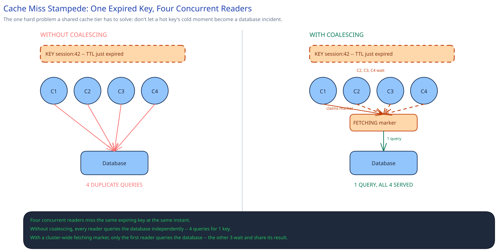

# Module 00 — Feature Overview



A shared, in-memory lookup tier that many independent application services read and write against: `get(key)`, `set(key, value, ttl)`, `delete(key)` against an opaque value, addressed only by its key. Not one app's private in-process cache — a fleet of cache nodes that every service in the company talks to, which is exactly what makes its failure modes different from a single-process cache library. The one hard rule everything below exists to protect: **a single cache node dying, or a hot key expiring, must never cascade load into the database or take the tier down.** Losing a key is fine — a miss just refetches it. Staying up and staying fast under a miss is the actual bar.

## Requirements

**Functional:**
- `get(key)` — sub-millisecond read of a cached value.
- `set(key, value, ttl)` — write or overwrite a value with an expiry.
- `delete(key)` — explicit invalidation.

**Non-functional** (stated as assumptions, interview-style):
- ~200M distinct keys resident across the cluster, average value size 2KB.
- Sub-millisecond p99 read latency — this is the entire reason the tier exists; if it were as slow as the database, nothing would use it.
- A node failure must degrade only the keys that node owned — never the whole tier, never a latency spike for unrelated keys.
- A popular key's cold moment (TTL expiry, or its node dying) must not turn into a correlated spike of duplicate database queries — the thundering-herd problem this design is built specifically to avoid.
- No durability guarantee on the cache itself — the database underneath is always the system of record. A cache never needs to survive a full cluster restart with its data intact.

This is a narrower problem than [Designing a Distributed Key-Value Store](../distributed-key-value-store/00-overview.md): that design is a *system of record* — no single node failure may lose data, so it pays for replication, quorum writes, and conflict resolution on every operation. A cache is disposable by design — a miss is always a safe, cheap fallback to the database — so none of that machinery is the default here. Cross-ref [Caching Strategies](../../hld-building-blocks/caching-strategies.md) for the general read/write patterns this tier implements underneath.

## Capacity Estimation

Using this guide's [back-of-envelope method](../../foundations/back-of-envelope-estimation.md):

- **Working set:** 200M keys × 2KB ≈ 400GB of resident data.
- **Cluster sizing:** at 32GB usable cache memory per node, 400GB needs **~13 nodes** minimum for the data alone; provisioning ~20 nodes leaves headroom for a dead node's slice landing on its neighbor without an immediate second-order eviction wave (see Module 01's Load Handling).
- **Ops/sec, average:** a cache's whole purpose is absorbing read load a database can't sustain directly — assume a 20:1 read:write ratio, ~100,000 writes/sec (values being populated or refreshed) → **~2,000,000 reads/sec average**.
- **Peak (3x factor):** ~300,000 writes/sec, **~6,000,000 reads/sec** — the number that has to stay sub-millisecond at p99, since nothing about a cache is useful if it can't clear this bar.
- **Per-node share:** ~20 nodes → each serves roughly 300,000 reads/sec and 15,000 writes/sec, well inside what an in-memory store on ordinary hardware sustains.

## Approach Walkthrough

Every key hashes onto a ring (cross-ref [Consistent Hashing](../../hld-building-blocks/consistent-hashing.md)); a thin router — a client-side library every application links against, or a shared proxy in front of the cluster — hashes the key and walks clockwise to the node that owns it, with no coordinator and no lookup service consulted per request. A `get` that misses doesn't just return empty: the miss path itself is the interesting part of this design. The first miss for a key claims a short-lived cluster-visible "fetching" marker, queries the database, populates the cache, and clears the marker; every other concurrent miss for that same key sees the marker and waits on it instead of independently repeating the database query. That single mechanism — coalescing concurrent misses into one upstream call — is what keeps a hot key's cold moment from becoming a database incident.

## API Surface

```
GET    /keys/{key}                 -> { value: bytes, found: bool }
PUT    /keys/{key}                 body: { value: bytes, ttl_seconds: int }
DELETE /keys/{key}
```

Internal, node-to-node (not client-facing):

```
POST /internal/claim-fetch   { key }              -- router -> owning node, sets the "fetching" marker
POST /internal/populate      { key, value, ttl }   -- router -> owning node, after a DB fetch resolves
```
