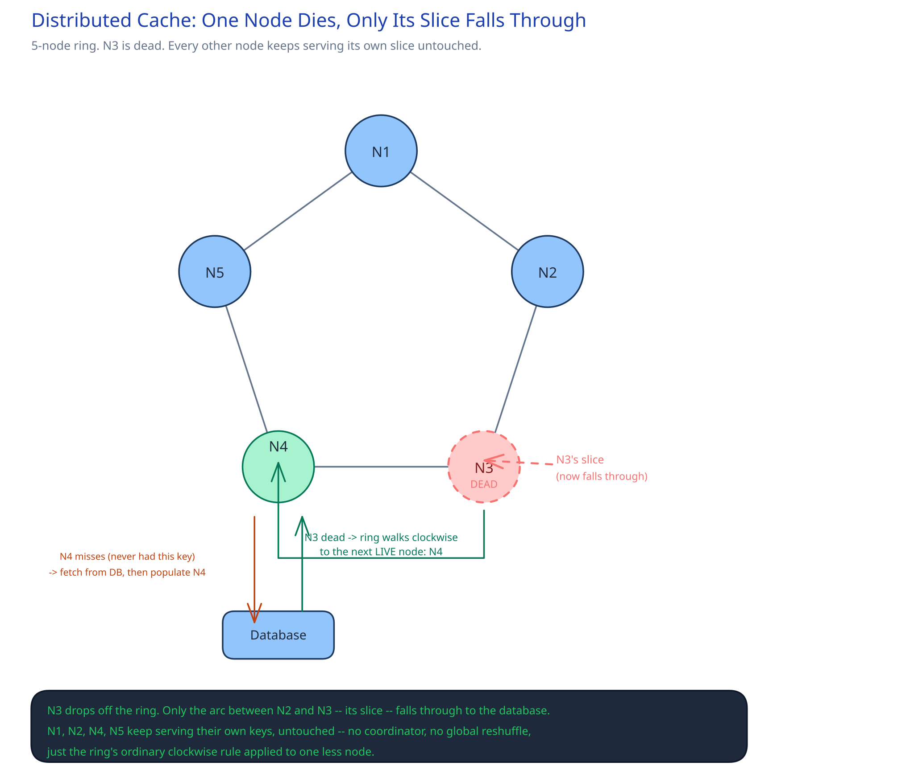

# Module 01 — Architecture & High-Level Design

## Monolith vs. microservices

There's no monolith version of this to compare against — a shared cache tier is infrastructure other services depend on, never a feature bolted onto one app. The real question is why it's a dedicated fleet at all, rather than each service just caching in its own process. An in-process cache can't be shared: two instances of the same service, let alone two different services, would each hold their own cold copy of the same hot key, multiplying the exact database load a cache exists to remove. A shared tier means one populated key serves every caller, at the cost of a network hop the in-process version wouldn't pay — a trade this design makes deliberately, since the alternative (every process caching independently) fails at exactly the scale where caching matters most.

## Building Blocks

| Block | Role |
|---|---|
| **Router** (client-side library, or a shared proxy in front of the cluster) | Hashes a key and walks the ring to the node that owns it — no coordinator, no per-request lookup |
| **Cache node** | Holds an in-memory key-value store for its ring slice; serves `get`/`set`/`delete` for the keys it owns |
| **Fetching marker** | A short-lived, cluster-visible flag on a key mid-refill, checked by every concurrent miss before it queries the database (cross-ref [Caching Strategies](../../hld-building-blocks/caching-strategies.md)) |
| **Health check / membership** | Marks a node down (heartbeat timeout) so the router stops routing to it — no gossip or consensus protocol needed, since a wrong routing decision here just costs one extra miss, not corrupted data |
| **Database** | The system of record underneath — every miss's fallback, and the only place a value's "true" state actually lives |

## Per-path walkthrough

**Read path (hit)** — `Client → Router → hash key onto ring → owning node → return value (sub-ms)`.

**Read path (miss, uncontended)** — `Client → Router → owning node → miss → node sets fetching marker → Database (query) → node populates cache, clears marker → return value to client`.

**Read path (miss, contended — the stampede case)** — `N concurrent clients → Router → same owning node → first request sets fetching marker and queries Database → remaining N-1 requests see the marker and wait/retry against the cache → all N are served from exactly 1 database query, not N`.

**Write path** — `Client → Router → owning node → set(key, value, ttl) → acknowledge`. No fan-out, no quorum — a cache write only has to land on the one node the ring says owns the key.

## Trade-offs to make explicit

| Decision | Chosen | Alternative | Why |
|---|---|---|---|
| Replication | None by default — a dead node's slice cold-starts against the database | Replicate every node like a real datastore | A cold-start miss is already cheap (the database is right there); replicating everything roughly doubles cluster memory to prevent an outcome that mostly self-heals in one query |
| Node placement | Consistent hashing ring | A centralized routing/lookup service | A central service is one more thing that can go down and block every request; the ring computes placement locally from the key alone |
| Miss coordination | Cluster-visible fetching marker | Each caller queries the database independently on a miss | Independent queries turn one hot key's cold moment into a load spike sized to however many clients happened to miss at once — exactly the stampede this design exists to prevent |
| Consistency with the database | Best-effort, no read-your-writes guarantee across the cache/DB boundary | Synchronously invalidate the cache on every DB write | A synchronous invalidation call on every write couples the database's write path to the cache's availability; a short TTL bounds the staleness instead, without that coupling |
| Failure handling | Node marked down, its ring slice reassigned to the next live node | Block requests to a dead node's keys until it recovers | Blocking turns one node's failure into an outage for its entire slice; falling through to the database is strictly better than being unavailable, since the cache never held the only copy anyway |

## Load Handling

- **Peak-vs-average tolerance:** the 3x peak factor from Capacity Estimation (~300K writes/sec, ~6M reads/sec) is absorbed by adding cache nodes — reads and writes both scale roughly linearly with node count, since no coordinator or quorum step bottlenecks the fan-out the way a replicated store's write path would.
- **Where backpressure kicks in first:** at an individual node's local memory and CPU budget for handling concurrent misses — this is precisely why the fetching-marker mechanism exists: without it, backpressure would show up as duplicated database queries instead of being absorbed inside the cache tier itself.
- **What gets shed under overload:** nothing is silently dropped on the read path — a miss always has a safe fallback (the database). The one thing that can degrade is the marker mechanism itself under extreme concurrency on a single key, where waiters may see a slightly longer wait for the fetch to resolve rather than a failure.
- **Autoscaling:** adding a node is a ring-join — cross-ref [Consistent Hashing](../../hld-building-blocks/consistent-hashing.md) — only the new node's immediate ring neighbor hands off a slice to it, so capacity can be added incrementally under live load, but the new node starts genuinely cold: its entire slice is a guaranteed miss until naturally repopulated.
- **Load-test target:** sustain 6,000,000 reads/sec and 300,000 writes/sec for 10 minutes, then kill one node under that same load and confirm the miss rate spikes only for that node's slice (roughly 1/20th of keys) and recovers to baseline within one TTL window, with zero increase in duplicate-fetch database queries for any single key.

## Concurrent-User Handling

| Race | Mechanism | What the "loser" sees |
|---|---|---|
| N clients miss the same key at the same instant (TTL expiry or a cold node) | The first miss claims the cluster-visible fetching marker before querying the database; every other concurrent miss checks the marker first and waits/retries against the cache instead of querying the database itself | All N clients get the same, correctly populated value — just some wait a few extra milliseconds behind the first fetch, rather than each triggering their own database round trip |
| A `set(key, ...)` lands on a node at the same instant that node is mid-refill from a miss on the same key | The refill's `populate` call and the concurrent `set` are just two writes to the same local key on one node — the node's local store serializes them the same way any single-node store serializes concurrent writes; whichever lands last locally wins | The other write is simply superseded, exactly like two ordinary overlapping writes to the same key — no corruption, just last-write-wins at the node level |
| A node is marked down mid-request — some in-flight requests already routed to it, others arrive after the router's view updates | In-flight requests to the dying node time out and the caller falls through to the database directly (the same miss path as any cold key); requests arriving after the router's updated view go straight to the new owning node | The unlucky "in-flight" caller pays one extra database round trip instead of a fast cache hit — a slower response, never an error |

## Scaling & Reliability

- **Horizontal scaling:** adding nodes to the ring is the entire scaling story, the same mechanism [Consistent Hashing](../../hld-building-blocks/consistent-hashing.md) uses elsewhere in this guide — a join only disrupts one neighbor's slice.
- **Circuit breaker:** the router stops routing to a node that repeatedly times out within a cooldown window (cross-ref [Circuit Breakers & Retries](../../scalability-resilience/circuit-breakers-retries.md)), falling through to the database for that node's entire slice until it recovers or is replaced.
- **Retries:** a single retry with a short timeout on a slow node, then straight to the database — retrying repeatedly against a cache is pointless when the fallback is one query away and just as fast as a second retry would be.
- **Dead-letter queue:** not applicable in the usual sense — there's no message a cache can fail to process and needs to park for later; a failed `set` simply means that value stays uncached until the next read repopulates it.
- **Graceful degradation:** losing an entire node degrades only its slice (~1/20th of keys, per the 20-node cluster sizing) to database-speed reads until it's repopulated — every other key on every other node is untouched, and the tier as a whole never becomes unavailable.
- **Multi-region:** not built here — see below.

## What you'd revisit as this grows

- **Multi-region caching.** This design assumes one region; a global deployment either runs an independent cache per region (accepting each region's own cold-start on deploy) or replicates specific hot keys cross-region, reopening the same replication-cost trade-off this module argues against paying by default.
- **Replication for specific hot/expensive keys.** A key whose miss is unusually expensive to recompute (a heavy aggregation, a rate-limited external call) is worth replicating to a standby *despite* the general argument against it — a targeted escalation for that one key, not a redesign of the tier's default behavior.
- **Eviction policy tuning under cascading failure.** A node inheriting a dead neighbor's slice may need to evict its own previously-warm keys to make room — the eviction policy (LRU vs. LFU, cross-ref [Caching Strategies](../../hld-building-blocks/caching-strategies.md)) decides which keys pay that second-order cost, and it's worth revisiting once real traffic shows which policy actually protects the hottest keys.
- **Per-key TTL policy as a first-class setting**, rather than every caller picking a TTL by hand at `set` time.
