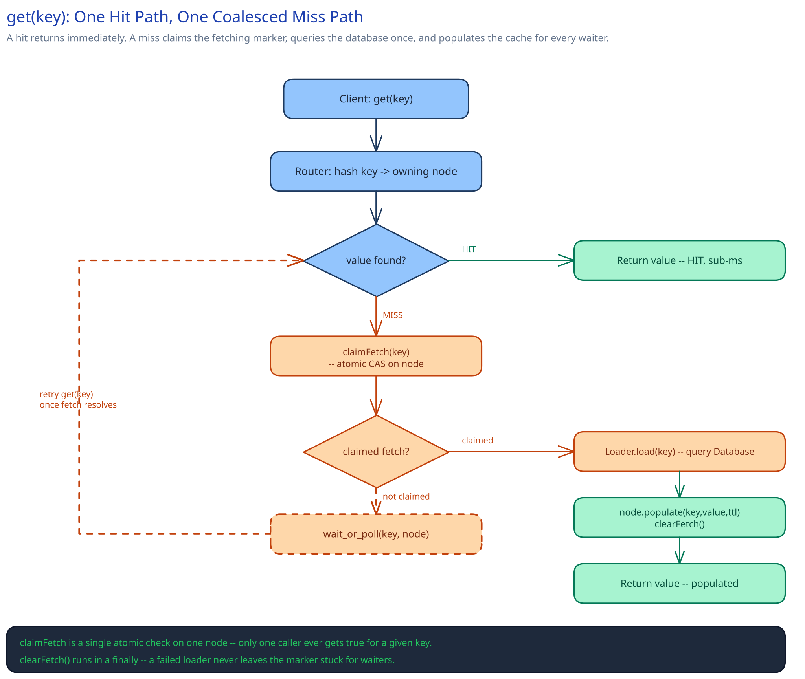

# Module 02 — Low-Level Design



## Interfaces vs. implementations

- **`Router`** *(interface)* → **`ConsistentHashRouter`** — given a key, returns the one node address that owns it. The entry point every client call goes through first.
- **`CacheNodeClient`** *(interface)* → **`GrpcCacheNodeClient`** — a handle to one specific node; `get()`/`set()`/`delete()`/`claimFetch()`/`populate()` over the network, each with its own bounded timeout.
- **`FetchCoalescer`** *(interface)* → **`MarkerBasedCoalescer`** — owns the "has someone already claimed this key's refill" decision; a different implementation (e.g. a pub/sub-based "notify waiters" variant) could replace it without the caller ever knowing.
- **`Loader`** *(interface)* → **`DatabaseLoader`** — the actual miss-fill logic: given a key, fetch its current value from the system of record. This is the one piece every service plugging into this cache tier supplies itself — the cache doesn't know or care what's behind it.

## Pseudocode for the core method

```
CacheClient.get(key):
    node = router.nodeFor(key)
    value = node.get(key)
    if value is not None:
        return value                                   # hit — fast path, done

    claimed = node.claimFetch(key)                       # atomic on the node: only one caller gets true
    if claimed:
        try:
            value = loader.load(key)                     # query the database, exactly once
            node.populate(key, value, ttl)
        finally:
            node.clearFetch(key)                          # always clears, even on loader failure
        return value
    else:
        wait_or_poll(key, node)                           # another caller already claimed the fetch
        return node.get(key)                              # by now, likely populated
```

## Error cases worth designing for deliberately

- **The loader itself fails (database timeout, or the key genuinely doesn't exist upstream).** `clearFetch` runs in a `finally`, specifically so a failed fetch never leaves the marker stuck — a stuck marker would make every subsequent reader wait forever for a fetch that already gave up. Callers waiting on a claimed fetch need their own bounded timeout so a slow loader doesn't cascade into a slow client indefinitely.
- **A waiter's `wait_or_poll` times out before the claimant's fetch resolves.** Falling through to a direct database read for that one caller — not failing the request — keeps the miss path's core guarantee (a miss is always survivable) true even under a slow refill, at the cost of that one caller not benefiting from the coalescing.

## Concurrency at the code level

`node.claimFetch(key)` needs to be atomic on the node, and this is the one place an actual concurrency primitive matters in this whole design: two nearly-simultaneous misses on the same key both need to see "not yet claimed" resolve to exactly one `true` and every other `false`. A single-node in-memory store already gives this for free — a compare-and-set on the marker field, the same guarantee any single-threaded event loop or a single-key lock inside one process provides — so nothing distributed is needed here. This is the opposite situation from the [Distributed Key-Value Store](../distributed-key-value-store/02-lld.md)'s coordinator, which genuinely needs cross-node quorum logic; here, a key only ever has one owning node, so "atomic across the cluster" reduces to "atomic on one node," which is cheap.

## Design patterns you just used, named

- **Facade pattern** — `CacheClient` is a facade: a caller sees `get`/`set`/`delete`, never the routing, coalescing, and loader calls underneath.
- **Strategy pattern** — `Loader` is a strategy supplied per use case (one service's loader queries its orders table, another's calls a different service) behind one interface the cache tier itself never varies.
- **Null object / sentinel-free miss handling** — a miss returns `None` and triggers the fetch path rather than the caller having to distinguish "cached null" from "not cached," a distinction that would otherwise need its own tombstone-like marker (cross-ref the [Distributed Key-Value Store](../distributed-key-value-store/03-db-design.md)'s tombstone reasoning for the general shape of that problem, deliberately not needed here since a cache miss and an absent key mean the same thing).

## Practice: extend it yourself

1. **Negative caching** — some keys are looked up constantly but genuinely don't exist upstream (a typo'd user ID hitting a profile lookup, repeatedly). How would you cache "this key doesn't exist" without it looking, to a later reader, like an ordinary miss that should trigger another database query?
2. **Write-through vs. write-around** — this design's `set()` only ever writes to the cache directly, assuming some other path already wrote the database. What changes in the interfaces above if you instead want `set()` to write the database *and* the cache atomically, and what does "atomically" even mean across two systems that don't share a transaction?
