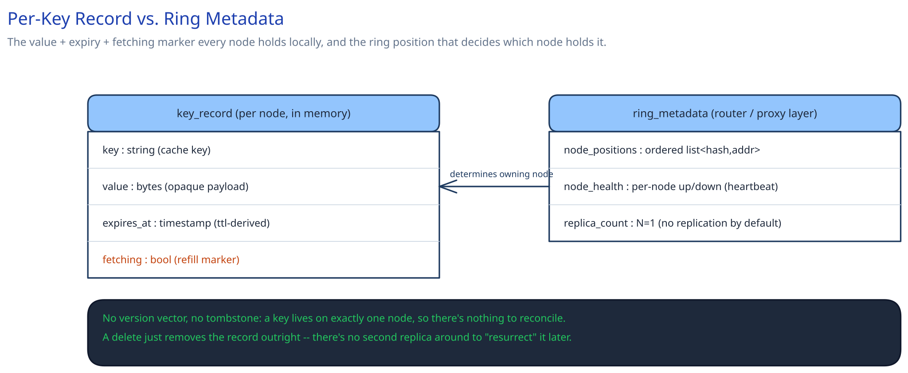

# Module 03 — Database Design

## From entities to schema

There's no relational schema here — a cache node's "database" is its own in-memory record per key, and the only cluster-wide state is the ring itself:

- **Key record** (held locally, in memory, on the one node that owns the key): `key`, `value` (opaque bytes), `expires_at` (derived from the `set` call's `ttl`), `fetching` (a boolean marker, set while a miss is being resolved, cleared once populated or on failure).
- **Ring metadata** (held by the router / proxy layer, not per-key): the ordered list of node positions on the hash ring, used to compute a key's owning node without a lookup.

Compare this directly against the [Distributed Key-Value Store](../distributed-key-value-store/03-db-design.md)'s per-key record — `key, value, version (vector clock), tombstone` — which exists to survive a node failure without losing data. This design's record has no version vector and no tombstone, because neither problem exists here: there's only ever one copy of a key (no replicas to reconcile), and a `delete` can just remove the record outright, since there's no risk of a stale replica "resurrecting" a deleted value when there was never a second replica to begin with.

### Why `expires_at` lives on the record, not in a separate expiry index

A cache node has to check "is this still valid" on every single read, so the expiry has to be co-located with the value it governs — the same "read together, store together" reasoning this guide's [E-Commerce Schema](../../database-design/ecommerce-schema-worked-example.md) module gives for denormalizing `orders.total_amount`. A separate expiry table would turn every read into a join-equivalent lookup for a check that has to happen on the hot path of every single `get`.

### Why the `fetching` marker is a field on the key, not a separate lock service

The marker only ever needs to answer one question — "has someone already claimed this key's refill" — for exactly one key, on exactly the one node that owns it. A separate distributed lock service would add a network hop and its own failure mode to a check that a single in-memory compare-and-set on the node itself already answers atomically and for free (cross-ref Module 02's Concurrency at the code level).

## Indexes

There's no secondary index in the traditional sense. The ring *is* the index for "which node owns this key" (an O(1) hash computation, cross-ref [Data Partitioning & Sharding](../../hld-building-blocks/data-partitioning-sharding.md)). Locally, each node's in-memory store is typically a hash map keyed by the cache key itself — a point lookup, not a scan — so no additional index structure is needed on top of it; unlike a disk-backed store, there's no B-tree or LSM-tree layer to tune here, since everything lives in memory already.

## Consistency

- **Key/value data:** no consistency guarantee is offered across the cache and the database — a cached value can be stale for up to its TTL, which is an explicit, accepted trade (cross-ref [Consistency Models](../../hld-building-blocks/consistency-models.md)) rather than something this design tries to fix. The database is always the strongly consistent source of truth; the cache is a bounded-staleness view of it.
- **Ring/membership metadata:** needs to converge quickly across every router/proxy instance — a stale view just means a request is routed to the wrong (possibly dead) node, which costs one extra timeout-and-fallback, not a correctness bug the way a stale view would be for the [Distributed Key-Value Store](../distributed-key-value-store/03-db-design.md)'s replica placement. This is precisely why a lightweight heartbeat/health-check mechanism is enough here — the cost of a brief disagreement is a slower request, never wrong data.

## Scaling the schema

- **"Shard key" is the cache key's own ring position** — there's no separate sharding decision, since placement and lookup are the same mechanism (cross-ref [Consistent Hashing](../../hld-building-blocks/consistent-hashing.md)).
- **Adding capacity is a ring join**, and only the new node's immediate neighbor hands off a slice — never a full-cluster rebalance. The new node starts genuinely empty, though, which is why Module 01's Load Handling sizes the cluster with headroom for a freshly-joined (or freshly-recovered) node's cold slice.
- **Read replicas vs. sharding, and why neither applies the usual way:** a traditional database scales reads with replicas and writes with sharding; this design already shards every key by ring position, and "read replicas" would mean literally duplicating a node's slice onto a standby — which Module 01 explicitly frames as a targeted escalation for specific hot keys, not the default scaling mechanism the way it is for a relational store.

## Connecting it back

Trace it end to end: Module 00's requirement that "a miss is always a safe fallback, never a durability guarantee" is why this schema has no version vector or tombstone — there's nothing to reconcile when there's only one copy of a key. That same requirement is why Module 01 doesn't replicate by default. The stampede requirement — "a hot key's cold moment can't cascade into duplicate database load" — is why the `fetching` marker exists as a field on the record at all, and why Module 02's `claimFetch` is built as a single atomic check on one node rather than a cluster-wide lock. Every piece of this schema is smaller and simpler than the [Distributed Key-Value Store](../distributed-key-value-store/03-db-design.md)'s equivalent precisely because this system solves a narrower problem — and a design worth trusting is one where the schema visibly shrinks to match a narrower requirement, not one that carries machinery the requirements never asked for.
