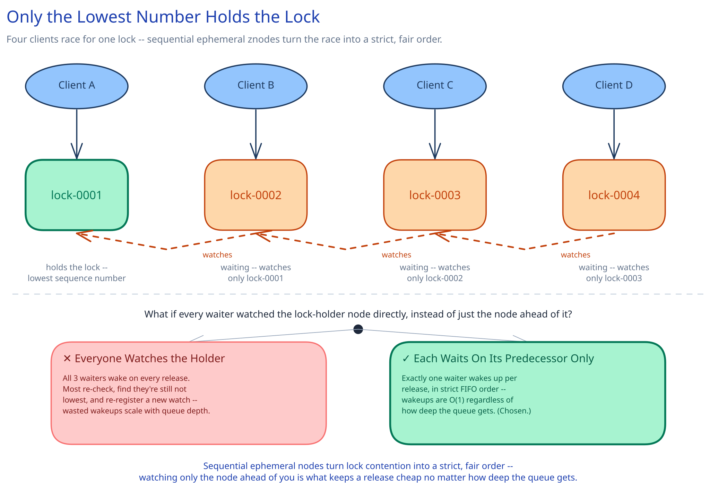

# Module 00 — Overview



*A recurring interview question at Microsoft, Uber, and DoorDash — anywhere a platform team runs enough independent machines that "which one of us does X right now" stops having an obvious answer.*

Picture ten instances of the same service, all healthy, all running the same code. Exactly one of them is supposed to be "the" leader that writes a particular record; or exactly one of them is supposed to hold a lock on a shared resource while it does something non-repeatable; or all ten need to agree, right now, on the current value of a piece of shared configuration. None of them can just decide this locally — an in-process mutex protects threads in one process, not ten separate machines that can't see each other's memory. **The one hard constraint that makes this an interesting design problem: the system you build to answer "who's in charge right now" cannot itself become a single point of failure, or you've just moved the outage, not removed it.**

This case study is not "how do I use a distributed lock" — that mechanism (lease-based locks, TTLs, the fencing-token problem) is already covered in [Distributed Locks](../../scalability-resilience/distributed-locks.md), and this design leans on that page's framing throughout rather than re-deriving it. This case study is the service *underneath* that mechanism: the small, highly-available, strongly-consistent cluster — Chubby at Google, ZooKeeper at Yahoo/Apache, etcd for Kubernetes — that many independent clients connect to so they can all agree on one thing at a time. It's the piece this guide's own [distributed job scheduler](../distributed-job-scheduler/01-architecture-hld.md) and [unique ID generator](../unique-id-generator/01-architecture-hld.md) case studies both assumed already existed ("a coordination store, e.g. etcd/ZooKeeper") without building it. This module builds it.

Name the constraint precisely, because it shapes every decision below: this is **a strongly-consistent, small-data coordination primitive — never a general-purpose database.** It stores kilobytes to low megabytes of coordination metadata (who's the leader, who holds the lock, what the current config value is) — never your application's actual rows, files, or events. Every design choice from here on defends that boundary.

## Requirements

**Functional:**
- Maintain a small hierarchical namespace of nodes (ZooKeeper calls them **znodes** — think a tiny, in-memory filesystem: `/locks/order-42`, `/election/leader`, `/config/feature-flags`) that clients can create, read, update, and delete.
- Support **ephemeral nodes** — a node tied to the client session that created it, automatically deleted the instant that session ends (crash, network partition, clean disconnect).
- Support **sequential nodes** — the server, not the client, appends a monotonically increasing suffix to the name on creation (`lock-0000000001`, `lock-0000000002`, ...), giving every creator a strict, contention-free ordering with no client ever having to guess a free name.
- Let a client set a **one-time watch** on a node or its children and be notified exactly once when it changes — the foundation for both of the primitives below.
- Provide three concrete coordination primitives built entirely out of the mechanisms above: a **distributed lock**, **leader election**, and **group membership / configuration change notification**.

**Non-functional** (stated as assumptions, interview-style):
- A cluster of 5 coordination-service replicas, tolerating 2 simultaneous node failures without losing availability *or* consistency.
- Every write is **linearizable** — once a client is told a write succeeded, every other client's next read reflects it; two clients must never be told they both hold the same lock. This is the one guarantee this whole design exists to provide, the same way "never double-charge" dominates the [payments case study](../payments-system/00-overview.md).
- A client session that stops heartbeating for longer than its negotiated timeout (typically 10-40 seconds) is considered dead, and every ephemeral node it owns is deleted automatically.
- **This system is deliberately not built for high write throughput or large data volumes** — that constraint is load-bearing, not a limitation to apologize for; see Capacity Estimation.

## Capacity Estimation

Using this guide's [back-of-envelope method](../../foundations/back-of-envelope-estimation.md), and notice these numbers run the *opposite* direction from most of this guide's case studies:

- **Cluster size:** 5 replicas (an odd number — see Architecture & HLD for why), tolerating `⌊(5-1)/2⌋ = 2` node failures while still holding a majority.
- **Connected clients:** ~20,000 long-lived sessions (one per service instance that needs coordination), each a persistent connection with a background heartbeat.
- **Total tree size:** ~200,000 live znodes (lock queue entries, leader-election candidates, config keys, membership entries) at ~500 bytes of data each ≈ **~100MB** — small enough that every replica holds the *entire* tree in memory, with room to spare. If this number were creeping toward gigabytes, that would be a sign of misuse, not a scaling problem to solve.
- **Watches:** ~3 outstanding watches per session on average × 20,000 sessions ≈ **60,000 active watches**, each just a few bytes of bookkeeping (a path and a session id) — cheap in aggregate, but *concentration* on one popular node is the real hazard, which is exactly why the lock recipe below (Approach Walkthrough) is built to avoid it.
- **Write throughput:** every write pays a network round trip to a majority of replicas plus a disk fsync on each of them before it's acknowledged — realistically single-digit-milliseconds per write, single-digit-thousands of writes/sec ceiling for the whole cluster. Compare this to the payments system's ~2,900 transactions/sec peak or the job scheduler's ~1,400 triggers/sec: this system's ceiling is in the *same order of magnitude*, not because the workload is small, but because linearizable writes across a consensus quorum are inherently expensive per-operation. **This is the reason a coordination service must never be asked to store application data** — the write path that makes it trustworthy is also the write path that makes it slow at scale.
- **Read throughput:** reads that don't require a linearizable guarantee are served from whichever replica a client is connected to, straight out of memory, no consensus round trip — tens of thousands/sec per replica, and scaled further by adding non-voting replicas (see Architecture & HLD).

## Approach Walkthrough

The core idea, before any boxes: keep a tiny, fully-replicated, in-memory hierarchical namespace, and make every write to it go through a single elected leader that only commits the write once a **majority** of the cluster's own replicas have durably acknowledged it — that majority-commit discipline (a consensus protocol, Raft or ZooKeeper's own ZAB) is what gives every client the same one consistent view of the tree, even while some replicas are down, slow, or partitioned away. On top of that one primitive — a small namespace with linearizable writes, ephemeral nodes, sequential nodes, and one-shot watches — three real coordination patterns fall out as *ordinary applications of the same mechanism*, not separate subsystems: a **distributed lock** is a client creating a sequential ephemeral node under a shared path and holding the lock exactly when it's the lowest-numbered child; **leader election** is the identical recipe under a different path name; **membership and config** is clients registering ephemeral presence nodes and everyone else watching that path's children. Nothing about the three primitives requires new server-side logic — they're client-side recipes over one small, boring, extremely reliable server-side mechanism.

## API Surface

The core primitive is a small, filesystem-like API, exposed over a session-based client connection (not stateless REST — the session itself is part of the contract):

```
create(path, data, mode: PERSISTENT | EPHEMERAL | PERSISTENT_SEQUENTIAL | EPHEMERAL_SEQUENTIAL) -> actual_path
delete(path, expected_version)
exists(path, watch: bool) -> stat | null
getData(path, watch: bool) -> (data, stat)
setData(path, data, expected_version) -> stat
getChildren(path, watch: bool) -> [child_names]
```

Every `watch` fires **at most once** — see Architecture & HLD's Trade-offs section for why that's a deliberate design choice, not a limitation to work around.

Layered on top, the three primitives this whole case study exists to deliver, as a client-library surface (never new server behavior):

```
DistributedLock(path).acquire() -> LockHandle{fencingToken}   // blocks until held
DistributedLock(path).release()

LeaderElection(path).campaign(onElected: callback, onRevoked: callback)

MembershipGroup(path).join(memberData) -> handle
MembershipGroup(path).watchMembers(onChange: callback)
```
