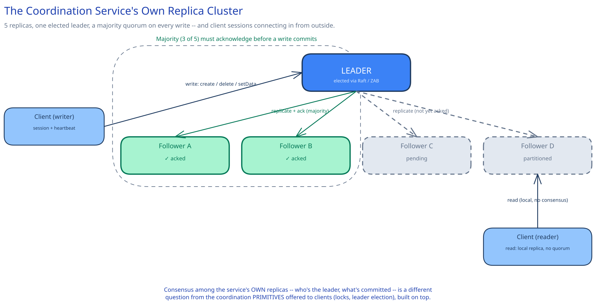

# Module 01 — Architecture & High-Level Design

## Monolith vs. microservices

This one isn't a question of pulling a feature out of a monolith — a coordination service only has value as a single, centrally-run cluster, never embedded inside each service that wants to use it. The reason is definitional, not a style preference: the entire point of the primitive is that many *independent* clients see one shared, agreed-upon answer to "who holds this lock" or "who's the leader." If every service ran its own embedded lock manager, "the lock on resource X" would mean something different to each one — there'd be no shared arbiter left to ask. Centralizing it is what makes cross-service agreement possible at all, the same reasoning this guide's [distributed job scheduler](../distributed-job-scheduler/01-architecture-hld.md) uses for centralizing its own leader election rather than letting each service run its own scanning loop — except here, the coordination service itself is the *thing* that job scheduler was assuming existed.

There's a second reason this has to stay a separate, small system rather than a feature bolted onto whatever database a team already runs: mixing a few kilobytes of coordination metadata into a multi-terabyte application database means every backup, every migration, and every slow query on the big table now risks the availability of the small, ultra-sensitive coordination data riding alongside it. Isolating the coordination service means its blast radius, its consistency guarantees, and its operational runbook are all scoped to exactly the workload that needs them.

## Building Blocks

| Block | Role |
|---|---|
| **Replica cluster** (3, 5, or 7 nodes — always odd) | The service's own fault-tolerant core; one elected leader, the rest followers |
| **Consensus layer** (Raft, or ZooKeeper's own ZAB) | Elects the leader *among the service's own replicas* and requires majority acknowledgment before any write is considered committed — cross-ref [Replication & Consensus](../../hld-building-blocks/replication-consensus.md), whose entire framing this module builds on directly |
| **In-memory znode tree** (per replica) | The full hierarchical namespace, held entirely in memory on every replica — small by design (Overview's ~100MB), so every read is a memory lookup, never a disk seek |
| **Write-ahead log + snapshots** (per replica) | Durability for the in-memory tree — every accepted write is appended and fsynced to a local log before being applied or acknowledged; periodic snapshots bound how much log a restarting replica has to replay (full mechanics in Module 03) |
| **Session manager** | Tracks each client's heartbeat and session timeout, and the exact set of ephemeral znodes and watches that session owns — the single structure that makes a crashed client's cleanup atomic |
| **Watch manager** | One-time change notifications registered per path; delivered once, then discarded, never automatically renewed |
| **Client library** | Implements the lock / leader-election / membership recipes on top of the raw znode API, plus session heartbeat and transparent reconnection to a different replica on failover |

## Per-path walkthrough

**Write path** — `Client → connected replica (forwards to leader if not already the leader) → Leader assigns the write a global order (a zxid/log index) → Leader replicates to followers' write-ahead logs → Majority of replicas fsync and ack → Leader commits, applies to its in-memory tree, acks the client → followers apply the same committed entry to their own trees → any one-time watches on the affected path fire and are cleared`. The majority-ack step is the one moment in this entire design that has to be airtight — everything else (session tracking, watch delivery) is bookkeeping layered on top of a write that's already, unambiguously, committed.

**Read path** — `Client → whichever replica it's connected to → served directly from that replica's in-memory tree, no consensus round trip`. This is deliberately *not* routed through the leader or a majority by default — see Trade-offs below and [Consistency Models](../../hld-building-blocks/consistency-models.md) for why a coordination workload (many more reads and watches than writes) benefits from decoupling read scalability from the write-consistency mechanism, with an explicit `sync()` call available for a client that needs a guaranteed up-to-date read before proceeding.

**Session / ephemeral-node path** — `Client connects → session created, heartbeat begins → client create()s an ephemeral znode tied to that session → [crash, GC pause, or partition — client stops heartbeating] → session timeout elapses with the leader having received no heartbeat → leader expires the session → every ephemeral znode that session owned is deleted in one pass → watchers on the parent path are notified`. Nothing about this path is a special case bolted onto the write path — a session expiry is just a very ordinary batch of deletes, triggered by a timer instead of a client request.

**Lock-acquisition path** (the primitive this design is built to make cheap and fair — full mechanics in Module 02) — `Client creates a sequential ephemeral node under the lock's path → lists the path's children → if its own node is the lowest-numbered, it holds the lock → otherwise it sets a watch on the single node immediately before its own → waits → notified once that predecessor is deleted (released or expired) → re-checks`.

## Trade-offs to make explicit

| Decision | Chosen | Alternative | Why |
|---|---|---|---|
| Cluster size | Odd number of replicas (3/5/7) | Even number (e.g. 4 or 6) | A majority of an even-sized cluster still requires the same `⌊N/2⌋+1` nodes as the next odd number down, so an even cluster pays for an extra replica's storage and network cost without tolerating one additional failure — see Module 04, Q3 |
| Read consistency | Serve reads locally from whichever replica a client is connected to, by default | Route every read through the leader (or a majority), same as writes | Most coordination reads (watching a lock queue, checking a config value) don't need a guarantee stronger than "my own reads never go backward" — forcing every read through the write path would collapse read throughput to the write ceiling, which is the opposite of what this workload needs (cross-ref [Consistency Models](../../hld-building-blocks/consistency-models.md)) |
| Lock queue fairness | Sequential ephemeral nodes; each waiter watches only its immediate predecessor | Every waiter polls, or every waiter watches the lock-holder node directly | Watching only the predecessor means exactly one waiter wakes up per release — a FIFO-ish queue with O(1) notification fan-out per event, instead of every waiter re-checking on every single change (the thundering herd this design is built to avoid) |
| Failure detection | Session-based: one heartbeat, one timeout, cleans up *everything* that client owns | Per-primitive TTL, renewed independently for each lock/lease the client holds | Tying liveness to the session means a dead client's locks, leadership, and membership registrations all disappear together as one atomic event, instead of each primitive separately re-litigating whether its own holder is still alive |
| Data model | Hierarchical namespace (a tiny filesystem of nodes) | Flat key-value store | The membership and lock recipes both depend on watching a *set of children under a path* changing (who joined, who's ahead of me in the queue) — a flat KV store has no native notion of "list everything under this prefix and watch that list," which is the operation these recipes are actually built on |
| Data size | Hard cap per znode (small, e.g. ~1MB) and an operational expectation the whole tree stays in the megabytes | No cap — treat it like a general document store | An uncapped tree breaks the assumption every replica holds the full tree in memory and replicates it in full on every write — the exact mechanism that makes this service fast and consistent for *coordination* data becomes catastrophically slow the moment it's asked to hold *application* data |

## Load Handling

- **Peak-vs-average tolerance:** this is the one system in this guide where adding more replicas does **not** raise the write ceiling — it lowers it. More voting members means a majority takes longer to assemble, not less. Write throughput is bounded by the leader's own commit pipeline (network round trip to a majority plus each of their fsyncs), and that ceiling is fixed by physics (disk and network latency), not by horizontal scaling the way a stateless service tier scales.
- **Where backpressure kicks in first:** the leader's own write-ahead log — specifically, the fsync latency of the slowest replica still counted in the majority. A single slow disk among the voting members measurably slows every write in the cluster, which is exactly why voting membership is kept small and deliberately never grown to "add capacity."
- **What gets shed under overload:** reads are never shed — they're cheap, served locally, and don't compete with the write pipeline. Writes are not elastic the way a stateless service's request handling is; a client library is expected to throttle its own write volume (batch config changes, reuse sessions, avoid create-storms) because this system was never meant to absorb bursts the way a queue or a stateless API tier does.
- **Autoscaling lag:** doesn't apply to the voting cluster in the usual sense — you don't add voting replicas mid-incident to handle load, because doing so slows down every write while the new member catches up. What *does* scale on demand is read capacity: adding non-voting **observer** replicas (ZooKeeper's term) that replicate the committed log and serve reads, without being counted in the write quorum at all.
- **Load-test target:** sustain 2,000 writes/sec across the cluster with p99 commit latency under 50ms and zero split-brain (no two clients ever told they hold the same lock) across a simulated network partition that isolates a minority of replicas; separately, confirm a single znode release fans out to exactly one waiting watcher, not all of them, at a queue depth of 10,000 waiters.

## Concurrent-User Handling

| Race | Mechanism | What the "loser" sees |
|---|---|---|
| Two clients both attempt to `create()` the *same* non-sequential exclusive path (e.g. `/election/leader`) at once | Only one `create()` can succeed — the leader assigns a single global write order, so the second create against an already-existing path fails outright | A `NodeExists` error, not a queued attempt — the client treats this as "someone else already holds it" and falls back to watching, or (for the sequential-node recipe below) never hits this case at all |
| Two clients both create **sequential** ephemeral nodes under the same lock path at the identical instant | The leader assigns sequence numbers as part of the single, globally-ordered write path — there is exactly one authority handing out numbers, so a strict order always exists regardless of network arrival order | The client with the higher-numbered node simply isn't the lowest; it watches its own immediate predecessor and waits — no error, no retry loop |
| A lock holder's client pauses (GC pause, network partition) long enough for its session to expire while it still believes it holds the lock | Session expiry deletes its ephemeral node; the next-lowest sequential node is granted the lock. The **fencing token** — the sequence number itself, monotonically increasing and already assigned by the leader — is what the *downstream resource* uses to reject the paused client's eventual, stale write (full mechanics cross-ref [Distributed Locks](../../scalability-resilience/distributed-locks.md), whose fencing-token problem this is, concretely) | The paused client resumes believing it still holds the lock and issues its write with its old (now-stale) token; the resource it's protecting rejects that write because it has already seen a higher token from the client that legitimately holds the lock now |
| The cluster's own leader crashes with a write replicated to some followers but not yet a majority | A new leader is elected by majority vote among the *surviving* replicas; any write that never reached a majority is discarded, and any write that *did* reach a majority is guaranteed to be present in whichever replica the new leader turns out to be (cross-ref [Replication & Consensus](../../hld-building-blocks/replication-consensus.md)) | The client that issued the barely-uncommitted write sees its request fail or time out — never a write that appears to succeed and then silently vanishes, and never a write that appears to succeed on two divergent leaders at once |

## Scaling & Reliability

- **Horizontal scaling:** read capacity scales by adding non-voting observers; write capacity does not scale horizontally at all in the usual sense — it's bounded by quorum size and network/disk latency among the voting members, a genuinely different scaling story from every other case study in this guide.
- **Circuit breaker:** the client library wraps calls to any one replica in a bounded timeout and fails over to another replica in the connection string rather than blocking indefinitely on a replica that's partitioned or down (cross-ref [Circuit Breakers & Retries](../../scalability-resilience/circuit-breakers-retries.md)).
- **Retries:** a `create()` or `setData()` that times out is genuinely ambiguous — it may have committed on the (now unreachable) leader moments before a failover. The client library never blindly retries a raw `create()` for a sequential node (that could produce a *second* node and leave the client racing itself); instead it re-lists and looks for a node it can recognize as its own (see Module 02's error-case handling).
- **Dead-letter queue:** doesn't apply here, worth stating plainly rather than forcing the analogy — there's no message pipeline in this design; a rejected or failed write is answered synchronously to the caller, not queued for later redelivery.
- **Graceful degradation:** with a minority of replicas down, the cluster keeps serving both reads and writes at full consistency, just with one fewer replica sharing the fsync cost. With a *majority* down, writes are explicitly rejected — not served with a weakened guarantee — because there is no way to commit a write without risking a second, disconnected majority (there can't be one, but the surviving minority can't prove that) doing the same thing. This is the CP choice this whole design makes, and it's a deliberate one: an unavailable coordination service is a visible, bounded outage; a coordination service that silently degrades its consistency guarantee is the failure mode this entire system exists to prevent.
- **Multi-region:** not built here, and a genuinely hard gap — cross-region network round trips added to every majority-write commit push latency into the hundreds of milliseconds, which most coordination workloads (a lock held for a few seconds) can't tolerate. Real deployments run one coordination cluster per region and treat cross-region coordination as a separate, much harder problem, rather than stretching one consensus group across continents.

## What you'd revisit as this grows

- **Dynamic cluster reconfiguration** — adding or removing a voting replica without a window of unavailability is a genuinely hard consensus problem in its own right (joint consensus in Raft, reconfiguration in ZAB), deliberately out of scope here.
- **Watch storms on very hot paths** — the sequential-node recipe avoids a thundering herd for lock queues by design, but a single popular config key watched by tens of thousands of clients simultaneously is a different fan-out problem this design doesn't solve on its own; a mature deployment batches or rate-limits notification delivery.
- **Multi-region coordination**, named above, is real future work, not a solved problem quietly assumed away.
- **Snapshot and log-compaction tuning** as the write-ahead log grows — this module assumes periodic snapshotting bounds recovery time, but doesn't work out the actual snapshot interval or the cost of taking one on a live leader (covered lightly in Module 03, not solved in full here).
