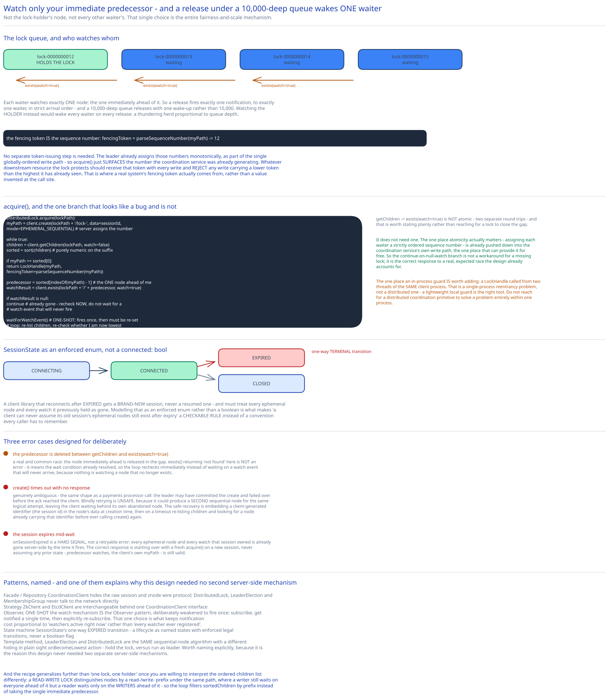

# Module 02 — Low-Level Design



**`SessionState`**, as an explicit state machine, matching this guide's convention elsewhere: `CONNECTING → CONNECTED → [EXPIRED | CLOSED]`, with `EXPIRED` a one-way terminal transition — a client library that reconnects after `EXPIRED` gets a *brand-new* session, never a resumed one, and must treat every ephemeral node and watch it previously held as gone. Modeling this as an enforced enum, not a boolean `connected: bool`, is what makes "a client can never assume its old session's ephemeral nodes still exist after expiry" a checkable rule instead of a convention every caller has to remember.

## Interfaces vs. implementations

- **`CoordinationClient`** *(interface)* → **`ZkClient`** / **`EtcdClient`** — the raw znode API from Module 00: `create`, `delete`, `exists`, `getData`, `setData`, `getChildren`, plus session lifecycle (`connect`, heartbeat, `onSessionExpired` callback). Every concrete coordination backend becomes one implementation behind this single interface.
- **`DistributedLock`** *(interface, built entirely on `CoordinationClient`)* → **`SequentialNodeLock`** — `acquire() -> LockHandle{fencingToken}`, `release()`.
- **`LeaderElection`** *(interface)* → **`SequentialNodeElection`** — `campaign(onElected, onRevoked)`. Structurally identical to `DistributedLock` underneath (see Design Patterns below) — worth noticing before assuming it needs its own mechanism.
- **`MembershipGroup`** *(interface)* → **`EphemeralGroupRegistry`** — `join(memberData) -> handle`, `watchMembers(onChange)`.

## Pseudocode for lock acquisition

```
DistributedLock.acquire(lockPath):
    myPath = client.create(lockPath + "/lock-", data=sessionId,
                            mode=EPHEMERAL_SEQUENTIAL)          # server assigns the sequence number

    while true:
        children = client.getChildren(lockPath, watch=false)
        sortedChildren = sort(children)                         # sort is purely numeric on the suffix

        if myPath == sortedChildren[0]:
            return LockHandle(myPath, fencingToken=parseSequenceNumber(myPath))
                                                                 # ^ lowest node -- I hold the lock

        predecessor = sortedChildren[indexOf(myPath) - 1]        # the ONE node ahead of me, not the holder
        watchResult = client.exists(lockPath + "/" + predecessor, watch=true)

        if watchResult is null:
            continue                                             # predecessor already gone -- recheck now,
                                                                   # don't wait for a watch event that'll never fire

        waitForWatchEvent()                                      # one-time -- fires once, then must be re-set
        # loop back around: re-list children, re-check if now lowest
```

Watching only the immediate predecessor — never the lock-holder node, never every other waiter's node — is the entire fairness-and-scale mechanism: exactly one waiter wakes up per release, in strict arrival order, and a release under a 10,000-deep queue triggers one notification, not 10,000.

**The fencing token is the sequence number itself** — the leader already assigns it, monotonically, as part of the single globally-ordered write path (Module 01). No separate token-issuing step is needed; `acquire()` just surfaces the number the coordination service was already generating. Whatever downstream resource this lock protects should receive that token with every write and reject any write carrying a lower token than the highest it's already seen — this is [Distributed Locks](../../scalability-resilience/distributed-locks.md)'s fencing mechanism, and the coordination service's sequential-node recipe is where that token actually comes from in a real system, rather than a value invented at the call site.

## Error cases worth designing for deliberately

- **Predecessor deleted between `getChildren` and `exists(watch=true)`.** A real, common race: the node immediately ahead is released in the gap between listing children and registering the watch. `exists()` returning "not found" here is not an error — it means the wait condition already resolved, and the loop's `continue` re-checks immediately instead of waiting on a watch event that will never arrive (nothing is watching a node that no longer exists).
- **`create()` times out with no response** — genuinely ambiguous, the same shape of problem the [payments case study](../payments-system/02-lld.md) designs around for its processor call: the leader may have committed the create and failed over before the ack reached the client. Blindly retrying `create()` again is unsafe — it could produce a *second* sequential node for the same logical acquire attempt, and the client would then be waiting behind its own abandoned node. The safe recovery is embedding a client-generated identifier (e.g. the session id) in the node's data at creation time, then on a timeout, re-listing children and looking for a node already carrying that identifier before ever attempting `create()` again.
- **Session expires while a client is mid-wait.** The client library surfaces `onSessionExpired` as a hard signal, not a retryable error — every ephemeral node and every watch that session owned is already gone server-side by the time this fires. The correct response is starting over from a fresh `acquire()` call on a new session, never assuming any prior state (predecessor watches, the client's own `myPath`) is still valid.

## Concurrency at the code level

The `getChildren` → `exists(watch=true)` pair is not atomic in application code — two separate round trips — and this is worth stating plainly rather than reaching for a lock to close the gap. It doesn't need one: the one place atomicity actually matters (assigning each waiter a strictly ordered sequence number) is already pushed down into the coordination service's own write path, the one place that can provide it for free (Module 01). The `continue`-on-null-watch branch above isn't a workaround for a missing lock — it's the correct response to a real, expected race the design already accounts for.

The one place an in-process guard *is* worth adding: a `LockHandle` object being called from two threads of the *same* client process (`acquire()` called twice concurrently on one handle). That's a single-process reentrancy problem, not a distributed one — a lightweight local guard is the right tool, the same distinction this guide's [distributed job scheduler](../distributed-job-scheduler/02-lld.md) draws for its own tick-reentrancy guard: don't reach for a distributed coordination primitive to solve a problem that's entirely within one process.

## Design patterns you just used, named

- **Facade / Repository** — `CoordinationClient` hides the raw session and znode wire protocol; `DistributedLock`, `LeaderElection`, and `MembershipGroup` never talk to the network directly.
- **Strategy** — `ZkClient` and `EtcdClient` are interchangeable behind one `CoordinationClient` interface, the same swappable-backend shape this guide's job scheduler uses for its `LeaseManager`.
- **Observer, one-shot** — the watch mechanism *is* the Observer pattern, deliberately weakened to fire once: a client subscribes, is notified a single time, and must explicitly re-subscribe to see the next change. That single design choice is what keeps notification cost proportional to "watchers active right now," not "every watcher that's ever registered since it last checked in."
- **State machine (explicit enum)** — `SessionState`'s one-way `EXPIRED` transition, matching the `PaymentStatus` and job-scheduler-state discipline this guide applies consistently: model a lifecycle as named states with enforced legal transitions, never a boolean flag.
- **Template method, hiding in plain sight** — `LeaderElection` and `DistributedLock` are the *same* sequential-node algorithm with a different `onBecomeLowest` action (hold the lock vs. run as leader) — worth naming explicitly, because it's the reason this design never needed two separate server-side mechanisms.

## Practice: extend it yourself

Before moving to Database Design, sketch (pseudocode is fine) how you'd add:

1. **A read-write lock** — many concurrent readers, or one exclusive writer, never both. ZooKeeper's real recipe distinguishes node names by a `read-` / `write-` prefix under the same lock path. What changes in the "am I clear to proceed" check from this module's pseudocode? A writer still has to wait on *everyone* ahead of it, but a reader only needs to wait on the *writers* ahead of it — readers ahead of a reader don't block it. Which line of the loop above needs to filter `sortedChildren` by prefix instead of taking the single immediate predecessor?
2. **A hot-standby second candidate in leader election** — the second-lowest node should be allowed to do lightweight prep work (warm a cache, open a connection) without ever acting as if it were actually elected. Where would you register a distinct "standby" watch that's clearly different from the leader-election watch, and what stops a network blip that makes the standby briefly *believe* it's lowest from acting on that belief before its own `getChildren` re-check confirms it?

Neither has a single clean answer — the point is noticing that the sequential-node recipe already generalizes further than "one lock, one holder," once you're willing to filter or interpret the ordered children list differently for a different problem.
