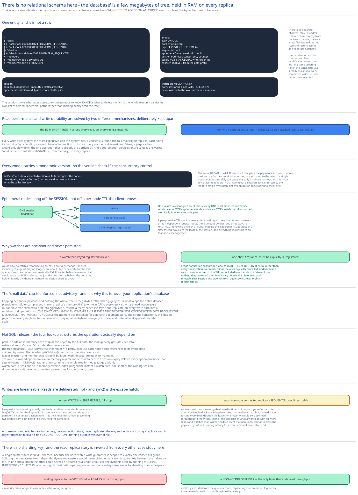

# Module 03 — Database Design & Scaling

This module is going to look different from every other case study's Database Design in this guide, and that's worth saying plainly rather than forcing the usual shape onto it: there is no relational schema and no NoSQL document model here. The "database" is a small, fully in-memory hierarchical tree, replicated to every node, made durable by a write-ahead log rather than a disk-resident table. That's not a simplification — it's the actual, honest architecture of the system this case study builds, and every subsection below explains why.

## From entities to schema

One entity, and it's not a row — it's a **znode**, a node in a hierarchical path namespace, the tiny "filesystem" from Module 00:

- **`znode`** `(path UNIQUE, data <= size cap, type: PERSISTENT | EPHEMERAL, sequential: bool, ephemeralOwner: sessionId | null, version, czxid, mzxid, children: derived from path prefix)` — held entirely in memory on every replica; `version` is an optimistic-concurrency counter incremented on every write to that node; `czxid`/`mzxid` are the global write-order ids (the "zxid" — ZooKeeper transaction id) of the node's creation and last modification, the same ordering token the consensus layer already assigns to every committed write.
- **`session`** `(sessionId, negotiatedTimeoutMs, lastHeartbeatAt, ephemeralNodesOwned: [path], connectedReplica)` — server-side session state; this is what a session-expiry sweep reads to know exactly what to delete.
- **`watch`** `(path, sessionId, kind: DATA | CHILDREN)` — in-memory only, per-connection bookkeeping, never written to the write-ahead log and never part of a snapshot (see "Why watches are one-shot and in-memory only" below).

There's no separate "children" table — a node's children are derived directly from the tree structure itself (every node holds references to its immediate children by name), the same way a real filesystem doesn't store a directory listing as a separate database.

## Why in-memory + a write-ahead log, not a normal on-disk table

Every write already pays the most expensive step this system has — a consensus round trip to a majority of replicas, each doing its own disk fsync (Module 01). Adding a second layer of indirection on top — a query planner, a disk-resident B-tree, a page cache — would only slow down the one operation that's already this system's bottleneck. A coordination service's entire value is answering "what's the current state" **instantly**, from memory, on every replica; the write-ahead log exists purely so a crashed-and-restarted replica can rebuild that in-memory state exactly, not to serve queries. Read performance and write durability are solved by two completely different mechanisms here, deliberately kept separate: the in-memory tree for reads, the WAL plus periodic snapshots for recovery.

## Why every znode carries a monotonic version number, not last-write-wins

`setData()` and `delete()` both accept an expected `version` and the operation is conditional — it fails outright if the node's current version doesn't match what the caller last saw. This is the same `UPDATE ... WHERE status = ?` discipline the [payments](../payments-system/03-db-design.md) and [job scheduler](../distributed-job-scheduler/03-db-design.md) case studies use for their conditional writes, pushed down to the level of a single node: a client can safely say "apply this change only if nobody has touched this node since I last read it" without taking out a separate lock — the version check *is* the concurrency-safety mechanism, enforced by the leader's single write path, not by application code racing to check first.

## Why ephemeral nodes are keyed off the session, not a client-renewed TTL

A lock or leadership claim needs *some* failure-detection mechanism, and this design deliberately ties it to the session's own server-side heartbeat timeout rather than a TTL the client renews on each individual node it holds. The payoff: one failure (a client goes silent) has exactly one resolution — session expiry — which deletes *every* ephemeral node and clears *every* watch that client owned, atomically, in one server-side pass. A per-primitive TTL would mean a client holding a lock, a leadership claim, and a membership registration simultaneously would need three independent renewal loops, three independent timeout policies, and three independent ways to half-fail (renew the lock's TTL but miss the leadership TTL because of a slow thread, say). This is the concrete server-side mechanism behind the generic "lease with a TTL" framing in [Distributed Locks](../../scalability-resilience/distributed-locks.md) — here, the lease is the session, and everything a session owns rides on that one lease together.

## Why watches are one-shot and in-memory only, never persisted or replayed from the log

A watch that stayed registered forever, and had to be redelivered to a client that reconnects after being disconnected for a while, would need to catch that client up on every change it missed — including changes it may no longer care about. The one-shot contract (fires exactly once, must be explicitly re-registered) keeps notification cost proportional to *watchers active right now*, not *every subscription ever made minus the ones explicitly cancelled*. Concretely, for the lock-queue recipe in Module 02: if watches re-fired automatically forever, every waiter behind a released lock would wake up on every single release, not just the one waiter directly behind the departing holder — exactly the thundering herd this design is built to avoid. Because a watch is never written to the WAL or included in a snapshot, a replica failing over loses nothing that mattered: the client library detects the disconnect and re-establishes both its session and its watches fresh against whichever replica it reconnects to.

## Why the "small data" cap is enforced, not advisory

Capping per-znode payload size (and holding the whole tree to the megabytes, not gigabytes) is what keeps the entire dataset plausible to hold, uncompressed, in every replica's memory, and to write in full to every replica's write-ahead log on every mutation. A tree that's allowed to drift into gigabytes turns the already-expensive fsync-and-replicate-on-every-write path (Module 01's write ceiling) into a multi-second operation — the exact mechanism that makes this service trustworthy for coordination data becomes the mechanism that makes it unusable the moment it's mistaken for a general document store. This is also the concrete reason this service is never your application's actual database, only its coordination metadata store — the strong consistency this design pays for on every single write ([Consistency Models](../../hld-building-blocks/consistency-models.md)) is a price worth paying at kilobytes-to-megabytes scale and a price that becomes untenable at application-data scale.

## Indexes

Not SQL indexes — the equivalent lookup structures this system's operations actually depend on:

- **Path → node, in-memory hash map or trie keyed by full path** — the lookup every single `getData`/`setData`/`exists` call runs; O(1) or O(path depth), never a scan.
- **The tree structure itself serves "list children of X" directly** — each node holds references to its immediate children by name, which is what `getChildren()` (the operation every lock, leader-election, and membership recipe is built on) reads directly, with no separate index to maintain.
- **`sessionId → owned ephemeral paths`, an in-memory reverse index** — maintained so a session expiry deletes every ephemeral node that session owns in one pass, instead of scanning the entire tree looking for nodes tagged with that session.
- **`watch path → subscribed sessions`, an in-memory reverse index** — purged the instant a watch fires (one-shot) or the owning session disconnects, so it never accumulates stale entries for clients that are long gone.

## Consistency

- **The znode tree (writes):** must be linearizable, full stop — every write is ordered by exactly one leader and only becomes visible once a majority of replicas have durably logged it. This is [Replication & Consensus](../../hld-building-blocks/replication-consensus.md)'s "a majority can't exist on two sides of a partition" reasoning applied concretely: it's the literal mechanism that prevents two clients from ever both being told they hold the same lock.
- **Reads served from whichever replica a client is connected to:** can be slightly stale relative to the absolute latest committed write — sequential consistency, not linearizable, by default (cross-ref [Consistency Models](../../hld-building-blocks/consistency-models.md)). A client's own reads never go backward in time, but might not yet reflect a write another client's session just had acknowledged microseconds earlier. This is an explicit, named trade, not an oversight: forcing every read through the leader or a majority would collapse read throughput to the write ceiling, the opposite of what a workload with far more reads and watches than writes actually needs. A client that genuinely can't tolerate that gap calls `sync()` before its read, trading latency for an on-demand linearizable read.
- **Sessions and watches:** in-memory, per-connection state, never replicated the way znode data is. Losing a replica's in-memory watch registrations on failover is fine by construction — the client library detects the disconnect and re-establishes both session and watches against whichever replica it reconnects to, so nothing durable was ever at risk.

## Scaling the schema

There is no sharding key here, and that's worth stating directly rather than forcing this guide's usual [Data Partitioning & Sharding](../../hld-building-blocks/data-partitioning-sharding.md) reasoning onto a system it doesn't fit: a single coordination cluster's tree is never sharded, because the linearizable-write guarantee is scoped to exactly one consensus group. Splitting the tree across two independently-elected clusters would mean giving up any atomic guarantee between the two halves — a lock in one half and a lock in the other could never be acquired as a single unit. Real deployments scale by running **multiple independent coordination clusters**, one per logical blast-radius (a cluster per region, or per major subsystem), never by sharding one cluster's namespace the way a database shards rows across nodes.

The read-replica story is also inverted from every other case study in this guide: adding replicas to the *voting* set does not add write throughput — it lowers it, since a majority takes longer to assemble as the voting set grows (Module 01). The only lever that adds read throughput without hurting write latency is a **non-voting observer**, explicitly excluded from the quorum count, replicating the committed log purely to serve reads.

## Connecting it back

Trace all three modules together: Module 00's "every write must be linearizable, never a general-purpose database" requirement is why Module 01 puts a consensus-driven, majority-acknowledged leader at the center of every write rather than trusting any single node's local state; that same requirement is why this module keeps the entire tree in memory and durable only through a write-ahead log, instead of reaching for the disk-resident schema every other case study in this guide uses — a coordination service's correctness comes from *who gets to agree on an order*, not from how the bytes happen to be stored. And the decision to key ephemeral-node cleanup off one session, rather than a TTL per lock, is what makes Module 02's lock-acquisition recipe safe to build entirely out of ordinary reads, writes, and watches — no bespoke server-side logic per primitive, because the one mechanism this schema actually provides (a small, linearizable, watchable tree) is already enough.
