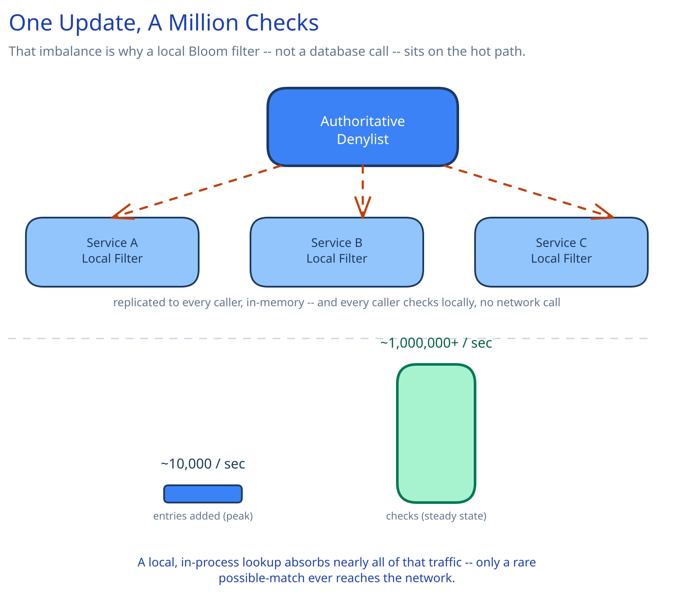

# Module 00 — Overview

## The feature, with no infrastructure in it yet

Before a login proceeds, before a link is followed, before an outbound connection is opened, some part of the system asks one question: "is this IP address / URL / file hash known to be malicious?" If yes, the action is blocked. That's the entire feature.

The interesting design problem is entirely in where that question gets asked from: **this check sits on the hot path of nearly every request across the entire company** — not one service's traffic, all of it. A blocklist with a few million entries, updated continuously from threat-intel feeds, has to answer a question fired from every corner of the company's infrastructure in single-digit milliseconds, without a central database becoming the one thing every request depends on.

## Requirements

**Functional:**
- Given an entry (an IP, a URL, or a file hash), answer whether it's currently on the denylist.
- Ingest new entries continuously from threat-intelligence feeds.
- *(Stretch, not required for the core design)* support removing an entry (a false positive correction) and expiring entries after a TTL.

**Non-functional** (these are what actually drive the architecture):
- **Scale:** assume the denylist holds ~500M entries, growing by up to 10,000 new entries/sec during an active, fast-moving attack campaign. The check volume dwarfs this: every request company-wide potentially checks it — on the order of millions of checks per second.
- **Latency:** a check must add single-digit milliseconds at the p99, because it sits in front of the action it's guarding, not beside it.
- **Freshness:** a newly-added entry should propagate everywhere within a bounded, stated window (seconds, not minutes) — how long a known-bad entry is still being allowed is a real, named risk, not an afterthought.
- **Availability:** the denylist check must never become the single point of failure that takes down every other service's request path if it's slow or unreachable.

## Capacity Estimation

- Check volume: **~1,000,000+ checks/sec** company-wide at a large-scale company — this is the number that rules out a central database call on the hot path outright; even a 1ms round trip at that volume would need an implausible amount of dedicated database capacity serving nothing but yes/no lookups.
- Update volume: 10,000 new entries/sec at peak (an active campaign) is, by contrast, tiny — **roughly 100-1,000x fewer writes than reads**, an even sharper ratio than this guide's URL Shortener uses to justify its own cache.
- Entry storage: 500M entries × ~100 bytes (the entry plus metadata) ≈ 50GB for the authoritative store — small enough to fit comfortably in memory across a modest cluster, which matters directly for how fast the "possible match" confirmation path can be.
- A Bloom filter sized for 500M entries at a 0.1% false-positive rate needs roughly 900MB of memory — trivially replicable to every calling service or edge node, which is the entire point.

## Approach Walkthrough

Every service (or every edge node) keeps a local, in-memory Bloom filter — a compact, replicated copy of the entire denylist — and checks it first, with no network call at all. The filter can only ever say "definitely not blocked" or "possibly blocked"; a possible match is confirmed against a small, fast, authoritative store before actually blocking anything. Because the overwhelming majority of checks are for entries that aren't blocked, the local filter absorbs nearly all traffic for free, and only the rare possible-match ever reaches the network.

## API Surface

- `checker.isBlocked(entry) -> bool` — a local library call (or a call to a co-located sidecar), not typically a network request to a central service; this is the hot-path entry point every other service actually calls.
- `POST /internal/v1/entries {entry, type, source, ttl}` → `202 {accepted: true}` — threat-intel feed ingestion, appends a new entry to the authoritative store.
- `GET /internal/v1/snapshot?since=<version>` → a delta or full snapshot of the authoritative store, used to build or refresh a local Bloom filter.
- `GET /internal/v1/confirm?entry=<entry>` → `{blocked: bool}` — the authoritative, definitive check, used only on a local filter's possible-match, never on the hot path directly.
