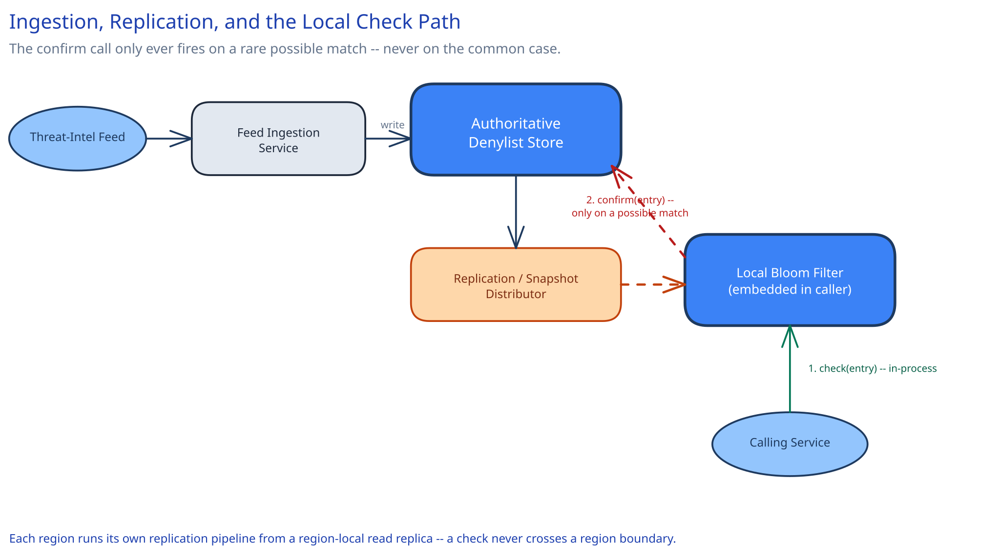

# Module 01 — Architecture & High-Level Design

## Monolith vs. microservices

The denylist is built and operated as its own small platform team's service — an ingestion pipeline plus an authoritative store plus a replication mechanism — but critically, **the actual check almost never talks to that service over the network at all.** This is a different shape from most of this guide's other case studies: the "service" isn't what answers the hot-path question, a *local replica* embedded in every caller is. Centralizing the check itself (making every caller call out to a denylist service over the network) would recreate exactly the problem this design exists to avoid — turning a company-wide, millions-of-checks-per-second hot path into a single dependency every other service now shares. The seam here isn't "which team owns this" so much as "what runs where": ingestion and authority are centralized; the actual check is deliberately pushed out to the edge, into every caller's own process.

## Building Blocks

| Block | Role |
|---|---|
| **Feed Ingestion Service** | Accepts new entries from threat-intel feeds, validates and normalizes them, writes to the authoritative store |
| **Authoritative Denylist Store** — sharded, in-memory-first | The definitive source of truth; confirms a possible match and serves snapshot/delta reads for filter replication |
| **Replication / Snapshot Distributor** | Propagates new entries out to every local Bloom filter, via a message bus or periodic snapshot pull |
| **Local Bloom Filter** (embedded in every calling service, or a co-located sidecar) | Answers "definitely not blocked" for the overwhelming majority of checks, with zero network call |
| **Filter Rebuild / Rotation Logic** | Rebuilds a local filter from a fresh snapshot periodically, without a gap where checks briefly see a stale-empty filter |

## Per-path walkthrough

**Check path (the hot path, by far the most frequent)** — `Caller → Local Bloom Filter (in-process, no network)`. On a "definitely not blocked" answer — the overwhelming majority — this is the entire path. Only on a "possibly blocked" answer does it continue: `→ Authoritative Store (confirm) → true verdict`.

**Ingestion path (rare, relative to checks)** — `Threat-intel feed → Feed Ingestion Service (validate, normalize) → Authoritative Store (write) → Replication (publish the new entry)`.

**Replication path (async, continuous)** — `Authoritative Store → Replication/Snapshot Distributor → every calling service's Local Bloom Filter (apply delta or rebuild)`. This is what keeps every edge's local copy converging toward the authoritative truth, on a bounded delay.

## Trade-offs to make explicit

| Decision | Chosen | Alternative | Why |
|---|---|---|---|
| Where the check happens | Locally, in every caller's own process (Bloom filter) | A network call to a central denylist service | A network call on every one of millions of checks/sec would make the denylist service itself the busiest, most fragile dependency in the entire company; a local filter answers almost all checks with zero network cost |
| False-positive handling | Accept them; confirm any possible match against the authoritative store before actually blocking | Trust the Bloom filter alone for the block decision | A false positive here means occasionally double-checking something that turns out fine — cheap. A false negative would be a real security miss the filter's own math guarantees can never happen, which is exactly why Bloom filters are safe for this asymmetric risk |
| Update propagation | Push (a message bus streams new entries to every filter) | Pull (each service polls periodically for updates) | Push gets a fast-moving attack's new entries out with materially lower latency; pull is simpler operationally but trades away exactly the freshness this system's non-functional requirements call out explicitly |
| Failure mode when the denylist infra is unreachable | Fail-open (allow the request) for low-risk actions; fail-closed (block) for high-risk ones, configured per calling service | One fixed policy for every caller | A generic "always block on failure" would turn a denylist outage into a company-wide outage; "always allow on failure" would silently disable protection during exactly the kind of infrastructure stress an attack might also cause. The right answer depends on what's being protected, which is why it's a per-caller configuration, not a global constant |
| Filter sizing | One Bloom filter sized for the full 500M-entry set, replicated whole | Partition the filter and replicate only relevant shards per region/service | A single filter is simpler and the whole thing comfortably fits in memory (~900MB) — partitioning would only earn its keep if the entry count grew by orders of magnitude past what one filter can hold |

## Load Handling

- **Peak-vs-average tolerance:** check volume is already assumed to run at company-wide peak continuously — there's no meaningful "spike" the way a flash sale spikes traffic, since every request already checks this. What *can* spike sharply is the write side: a fast-moving attack campaign can push entry-ingestion rate well above its steady-state average within minutes.
- **Where backpressure kicks in first:** never on the check path — a local, in-process Bloom filter lookup has no meaningful backpressure to apply, which is the entire architectural point. On the ingestion side, a burst of new entries queues in the Feed Ingestion Service's own buffer rather than blocking; the authoritative store's write throughput, not the check path, is the actual bottleneck under an ingestion spike.
- **What gets shed under overload:** replication freshness, never a check's correctness. If the replication pipeline falls behind during an ingestion spike, local filters lag the authoritative store by longer than the stated freshness window — a real, visible degradation — but no check ever returns a wrong answer because of it; it returns a *stale* answer, using whatever the local filter currently holds.
- **Load-test target:** sustain 10,000 entries/sec ingested for 10 minutes with replication lag to every local filter staying under the stated freshness SLA (e.g. 5 seconds), while a separate load generator sustains 1M+ local checks/sec with zero added latency to the calling services.

## Concurrent-User Handling

| Race | Mechanism | What the "loser" sees |
|---|---|---|
| A filter rebuild happens at the exact moment a check is in flight | The old filter instance stays live and serving checks until the new one has fully finished rebuilding and is atomically swapped in — never a check against a half-populated filter | Every in-flight check completes against a consistent filter, either fully old or fully new, never a mix |
| Two ingestion sources report the same entry (a shared threat-intel feed and an internal detection both flag the same malicious IP) | The authoritative store's write is idempotent, keyed by the entry's own value — a duplicate insert is a no-op, not a second row | The second write succeeds trivially without creating a duplicate; the entry's metadata (first-seen time, source) reflects whichever write actually landed first |
| An entry is added and immediately checked, before replication has reached the checking service's local filter | The check sees "not blocked" — a real, named staleness window, not a bug — until replication catches up | A window (bounded by the stated freshness SLA) where a just-added entry isn't yet blocked everywhere; this is the explicit trade this design's freshness requirement is stating up front, not a hidden gap |

## Scaling & Reliability

- **Horizontal scaling:** the Feed Ingestion Service and Authoritative Store scale independently of the check path entirely, since the check path doesn't call either of them in the common case.
- **Circuit breaker:** the rare authoritative-confirm call (on a possible match) is wrapped in a circuit breaker — if the Authoritative Store is degraded, the breaker trips and the calling service falls back to its per-caller fail-open/fail-closed policy rather than blocking on a call that won't return in time.
- **Retries:** the confirm call retries a small, bounded number of times with backoff; the local filter's own "not blocked" answers never need to retry anything, since they never left the process.
- **Graceful degradation:** if replication is degraded or delayed, every local filter keeps serving from whatever it last successfully loaded — a stale-but-functioning filter, never a filter that stops answering.
- **Multi-region:** each region runs its own replication pipeline reading from a region-local read replica of the authoritative store, so a check in any region never crosses a region boundary — cross-ref this guide's [DNS, Anycast & Global Traffic Management](../../hld-building-blocks/dns-global-traffic.md) for the general pattern of keeping a hot-path decision local to the region serving the request.

## What you'd revisit as this grows

- **Filter partitioning**, if the entry count grows past what a single Bloom filter can hold in memory at an acceptable false-positive rate — this design assumes 500M entries comfortably fits; an order-of-magnitude growth would need to revisit that assumption.
- **Per-caller fail-open/fail-closed policy management at scale** — this design states the policy exists per caller, but doesn't build the tooling to audit and update hundreds of callers' policies safely as the system grows.
- **Cross-region replication conflict handling**, if two regions' feed sources ever disagree about an entry (rare, but not impossible with independent regional threat-intel integrations) — this design assumes one global authoritative source, which is a simplification worth naming rather than glossing over.
