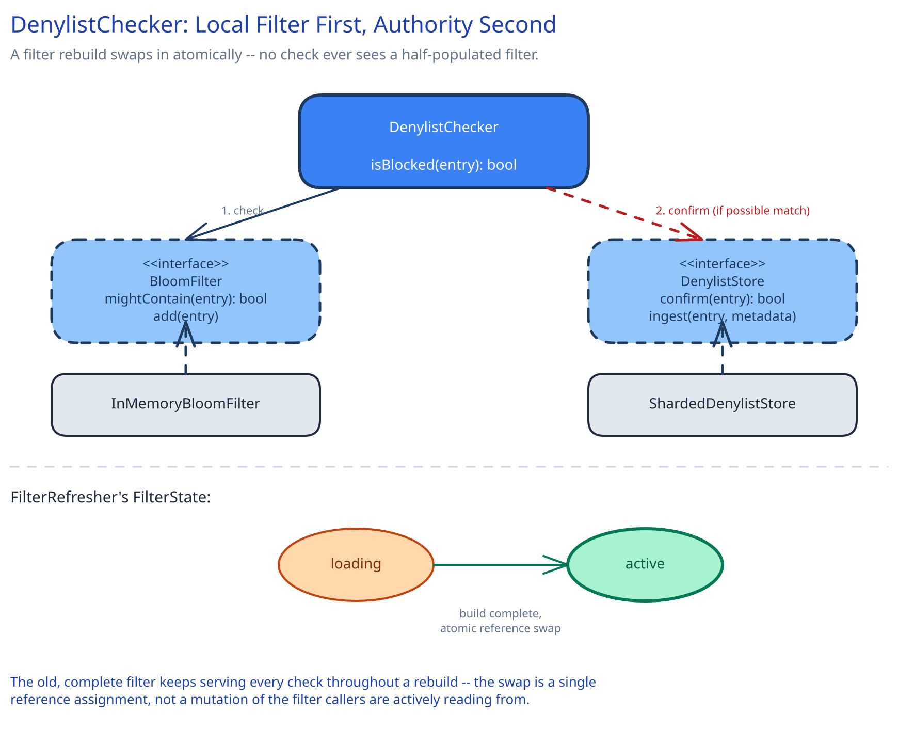

# Module 02 — Low-Level Design



**`FilterState`**, as an explicit state machine: a local filter instance is always exactly one of `loading` (being built from a snapshot, not yet serving) or `active` (fully built, currently serving checks) — never a partially-populated filter answering real traffic.

## Interfaces vs. implementations

- **`DenylistChecker`** — the orchestrator every caller actually depends on. `isBlocked(entry) -> bool`. Owns the local-filter-first, authoritative-confirm-second logic; the one class every other service's code actually calls.
- **`BloomFilter`** *(interface)* → **`InMemoryBloomFilter`** — `mightContain(entry) -> bool`, `add(entry)`. A pure data structure with no network awareness at all.
- **`DenylistStore`** *(interface)* → **`ShardedDenylistStore`** — `confirm(entry) -> bool`, `ingest(entry, metadata)`, `snapshotSince(version) -> [entries]`.
- **`FilterRefresher`** — runs on a timer or in response to a replication event; builds a new `BloomFilter` from a snapshot and atomically swaps it in for `DenylistChecker` to use next.

## Pseudocode for the check and refresh flows

```
DenylistChecker.isBlocked(entry):
    if not currentFilter.mightContain(entry):
        return false                          # definitely not blocked -- no network call, done

    return denylistStore.confirm(entry)        # possible match only -- confirm against authority

FilterRefresher.refresh():
    newFilter = InMemoryBloomFilter(expectedEntries=500_000_000, falsePositiveRate=0.001)
    for entry in denylistStore.snapshotSince(lastAppliedVersion):
        newFilter.add(entry)

    # atomic swap -- in-flight checks against the old filter finish safely,
    # the next check onward sees the new one
    currentFilter = newFilter
    lastAppliedVersion = newFilter.version
```

Two error cases worth designing for deliberately, not as an afterthought:

- **The authoritative confirm call times out or errors:** this is not the same as "not blocked" — falling through to a default here has to be the caller's own configured fail-open/fail-closed policy (Module 01), never a silent "assume safe."
- **A filter refresh fails partway (a snapshot read is interrupted):** the currently-active filter keeps serving unchanged; a failed refresh is retried on the next timer tick, never left half-applied.

## Concurrency at the code level

`FilterRefresher.refresh()` builds an entirely new `BloomFilter` instance before ever touching what `DenylistChecker` currently uses — the swap itself (`currentFilter = newFilter`) is a single reference assignment, not a mutation of the filter callers are actively reading from. This is worth stating explicitly: it means `DenylistChecker.isBlocked()` needs no lock at all to stay correct under concurrent refreshes — every in-flight check either reads the old reference or the new one, and both are individually complete, valid filters. The alternative (mutating one shared filter in place, adding entries to it as they arrive) would require locking every single check against every single update, which would reintroduce exactly the contention this design exists to avoid on its hottest path.

## Design patterns you just used, named

- **Strategy pattern** — `BloomFilter` and `DenylistStore` are both interfaces with one production implementation each today; naming them as interfaces (not just concrete classes) is what makes a future second implementation (a Cuckoo filter, a different storage backend) a non-breaking addition.
- **State pattern** — `FilterState`'s `loading`/`active` distinction is the same lifecycle discipline this guide applies to every stateful object: a filter's validity is a named state, not an implicit assumption.
- **Immutable snapshot swap** — `FilterRefresher`'s build-new-then-swap approach is the same underlying idea as copy-on-write: never mutate the thing readers are currently using, always construct the next version fully before it becomes visible.

## Practice: extend it yourself

Before moving to Module 03, sketch (pseudocode is fine) how you'd add:

1. **Entry removal** (a false-positive correction) — a `BloomFilter` structurally cannot support removing an individual entry once added (that's an inherent property of how Bloom filters work, not an implementation gap). Where does removal actually have to be enforced instead — the confirm step, the filter itself, or a separate small "definitely allow" override list?
2. **Per-entry TTL** (an entry should stop blocking automatically after 30 days) — does this belong in the authoritative store's schema, in how snapshots are generated, or in the local filter's own refresh cadence?

Neither has one clean answer — the point is noticing that a Bloom filter's own structural limitations (no removal) are a real design constraint here, not a detail to gloss over.
