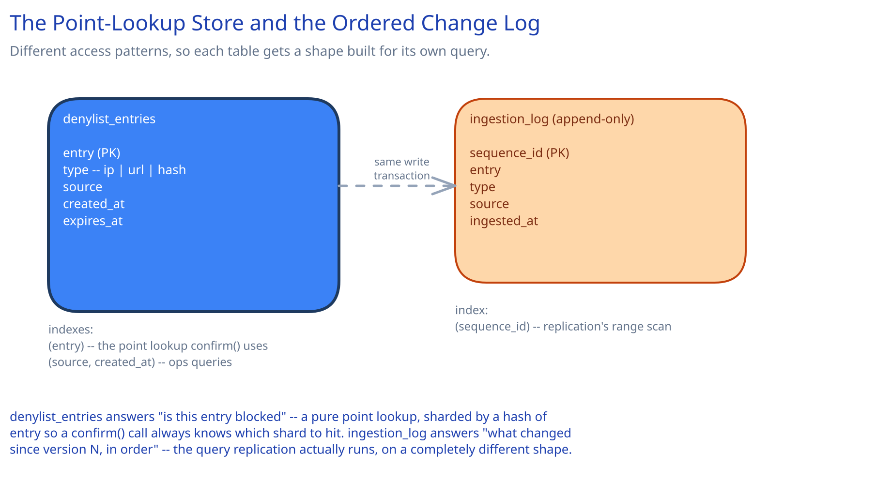

# Module 03 — Database Design & Scaling

## From entities to schema

Two entities fall directly out of the requirements in Module 00:

- **`denylist_entries`** — the authoritative source of truth: one row per blocked entry, its type, source, and when it was added.
- **`ingestion_log`** — an append-only record of every ingestion event, which the replication pipeline reads to build deltas for local filters — distinct from `denylist_entries` because "what's currently blocked" and "what changed recently, in order" are different query shapes.

## Why `denylist_entries` is sharded by a hash of the entry value

The authoritative-confirm query — `SELECT 1 FROM denylist_entries WHERE entry = ?` — is a pure point lookup with no range or join requirement, exactly the shape that makes hash-based sharding the right call: given an entry, the calling service can compute which shard holds it directly, with no fan-out needed for the hot confirm path. This mirrors this guide's [Consistent Hashing](../../hld-building-blocks/consistent-hashing.md) reasoning for distributing point-lookup data evenly across nodes without a central router.

## Why `ingestion_log` is a separate, append-only table

The replication pipeline's actual query is "give me everything added since version N, in order" — a fundamentally different access pattern from "is this specific entry blocked." Mixing both into one table would mean either scanning `denylist_entries` by a timestamp column (expensive at 500M rows, and racing against concurrent inserts) or maintaining a separate ordered structure anyway. A dedicated append-only log, ordered by insertion, is the natural fit for exactly the "since version N" query snapshotting depends on — and keeps `denylist_entries` itself optimized purely for the point-lookup it actually serves.

## Indexes

- `denylist_entries(entry)` — the point-lookup the confirm path depends on entirely; this is effectively the table's primary access pattern, not just one index among several.
- `denylist_entries(source, created_at)` — serves threat-intel operational queries ("how many entries did feed X contribute this week"), a real but secondary access pattern.
- `ingestion_log(sequence_id)` — the replication pipeline's core query is a range scan from the last-applied sequence forward; this is a clustered, monotonically increasing key by design, not a general-purpose index.

## Consistency

- **`denylist_entries`:** strongly consistent for writes (an ingested entry either committed or didn't), but the *system as a whole* is only eventually consistent from a checking service's point of view — a local filter's view of "what's blocked" always lags the authoritative store by some bounded amount, which is the entire, explicitly-stated trade this design makes for check-path speed.
- **`ingestion_log`:** append-only and immutable once written — a replication consumer reading forward from a sequence position never has to worry about a row it already read being changed underneath it.
- **Local Bloom filters:** deliberately, explicitly eventually consistent — Module 00's freshness requirement names the acceptable staleness window directly, rather than pretending every filter is always perfectly current.

## Scaling the schema

- **Sharding `denylist_entries`:** already sharded by entry hash from the start (above) — the confirm path's point-lookup shape means this scales linearly with shard count, with no cross-shard fan-out ever required for the common case.
- **`ingestion_log` growth:** grows monotonically and is never updated once written — a strong candidate to age out into cold storage after replication has processed it, since its only real consumer is the replication pipeline reading recent history, not a long-term audit trail (that's what `denylist_entries.created_at` and `source` already serve).
- **Read replicas per region:** each region's replication pipeline reads from a region-local read replica of `denylist_entries` / `ingestion_log`, not the primary directly — this is what keeps Module 01's "never cross a region boundary" claim actually true at the data layer, not just the application layer.

## Connecting it back

The chain holds end to end: Module 00's "millions of checks/sec, a database call can never sit on this path" requirement is why Module 01 pushes the actual check into a local, replicated Bloom filter instead of a network call; that same requirement is why `denylist_entries` is sharded purely for the point-lookup shape the rare confirm path needs, and why `ingestion_log` exists as its own table serving an entirely different access pattern. Nothing in this schema is arbitrary — every table and index traces back to which of the two, wildly different traffic shapes (a million checks/sec vs. a few thousand writes/sec) actually needs it.
