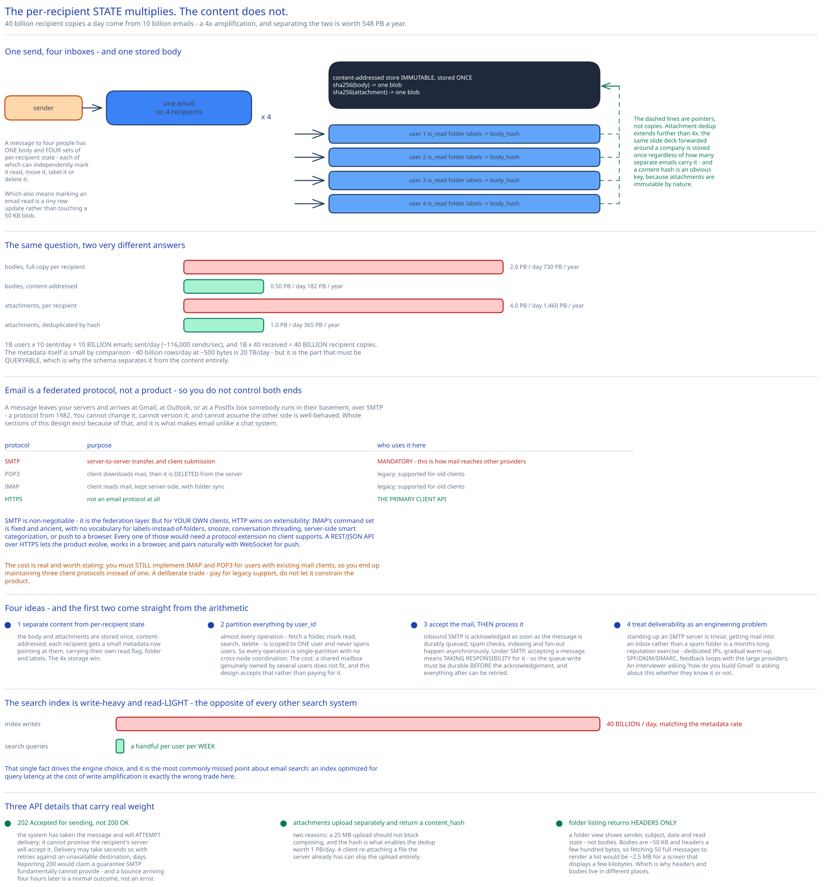

# Module 00 — Overview



## The feature, with no infrastructure in it yet

Compose an email, send it, and it appears in someone's inbox. Open your inbox and see your mail, sorted, with unread ones marked. Search it. Attach a file.

Two things make it a hard system, and only one of them is scale.

**Email is a federated protocol, not a product.** Unlike every other case study in this guide, you do not control both ends. A message leaves your servers and arrives at Gmail, Outlook, or a Postfix box someone runs in their basement — over **SMTP**, a protocol from 1982. You cannot change it, cannot version it, and cannot assume the other side is well-behaved. Whole sections of this design exist because of that ([Module 03](./03-deliverability.md) is entirely about it), and it's the thing that makes email unlike a chat system.

**One email becomes many stored copies.** A message to 10 recipients lands in 10 inboxes, each of which can independently mark it read, move it, label it, or delete it. So the *per-recipient state* multiplies while the *content* doesn't — and noticing that distinction is worth about 4× the storage bill, as the arithmetic below shows.

## Requirements

**Functional:**
- **Send** email, including to external domains, with attachments.
- **Receive** email from external domains.
- **Fetch** a folder's contents, paginated.
- **Folders** — the RFC 6154 standard set (Inbox, All, Archive, Drafts, Flagged, Junk, Sent, Trash) plus user-created ones.
- **Read/unread** state, and filtering by it.
- **Full-text search** across a user's own mail.
- **Anti-spam** on inbound mail.
- *(Bonus)* **Conversation threading** — group a reply chain into one view.

**Non-functional:**
- **Reliability: data loss is unacceptable.** Losing someone's email is the one unrecoverable failure, and this requirement outranks availability — which is why [Module 04](./04-db-design.md#consistency) chooses consistency over availability at the storage layer.
- **Scale:** 1 billion users.
- **Availability:** high, but explicitly subordinate to reliability.
- **Extensibility:** the reason this design uses **HTTP for its own clients** rather than IMAP — see below.

## Why HTTP, when email has three protocols already

Worth settling early, because it looks like a strange choice.

| Protocol | Purpose | Who uses it here |
|---|---|---|
| **SMTP** | Server-to-server transfer, and client submission | **Mandatory** — this is how mail reaches other providers |
| **POP3** | Client downloads mail, then it's **deleted from the server** | Legacy; supported for old clients |
| **IMAP** | Client reads mail, kept server-side, with folder sync | Legacy; supported for old clients |
| **HTTPS** | Not an email protocol at all | **The primary client API** |

SMTP is non-negotiable — it's the federation layer, and without it you cannot exchange mail with anyone.

But for *your own* clients, HTTP wins on the extensibility requirement. IMAP's command set is fixed and ancient: it has no vocabulary for labels-instead-of-folders, snooze, conversation threading, server-side smart categorization, or push to a browser. Every one of those would need a protocol extension that no client supports. A REST/JSON API over HTTPS lets the product evolve, works in a browser, and pairs naturally with WebSocket for push.

The cost is real and worth stating: **you must still implement IMAP and POP3** for users with existing mail clients, so you end up maintaining three client protocols instead of one. That's a deliberate trade — pay for legacy support, don't let it constrain the product.

## Capacity Estimation

Method from [Back-of-the-Envelope Estimation](../../foundations/back-of-envelope-estimation.md).

**Throughput**
- 1B users × 10 sent/day = **10 billion emails sent/day** = **~116,000 sends/sec.**
- 1B users × 40 received/day = **40 billion recipient copies/day.**

**That ratio is the design's central insight.** 40 billion copies from 10 billion emails is a **4× amplification** — the average message has four recipients. So the naive question "how much storage do we need?" has two very different answers:

| Approach | Body storage/day | Per year |
|---|---|---|
| Store the full email per recipient | **2.0 PB** | **730 PB** |
| **Store the body once, content-addressed** | **0.50 PB** | **182 PB** |

**4× saving, from one observation.** A message sent to four people has one body and four sets of per-recipient state (read flag, folder, labels). Separating "the content" from "one user's relationship to the content" is worth 548 PB/year.

Attachments amplify identically and are larger:

| Approach | Attachment storage/day | Per year |
|---|---|---|
| Per recipient | **4.0 PB** | **1,460 PB** |
| **Deduplicated by content hash** | **1.0 PB** | **365 PB** |

Attachment dedup is also the easier win, because a content hash is an obvious key and attachments are immutable by nature. And it extends further than the 4×: the same corporate slide deck forwarded around a company is stored once regardless of how many separate emails carry it.

**Metadata**
- 40 billion per-recipient rows/day at ~500 bytes = **20 TB/day** of metadata. Small next to the bodies, and it's the part that must be **queryable** — which is why [Module 04](./04-db-design.md) separates it from the content entirely.

**Search — the surprising workload**
- 40 billion index writes/day, matching the metadata rate.
- But search *queries* are rare: most people search a handful of times a week.

So **the search index is write-heavy and read-light**, which is the opposite of every other search system. That single fact drives [Module 02](./02-search.md)'s engine choice, and it's the most commonly missed point about email search.

## Approach Walkthrough

Four ideas, and the first two come straight from the arithmetic above.

**1. Separate content from per-recipient state.** The body and attachments are stored once, content-addressed. Each recipient gets a small metadata row pointing at them, carrying their own read flag, folder and labels. This is the 4× storage win, and it also means marking an email read is a tiny row update rather than touching a 50 KB blob.

**2. Partition everything by `user_id`.** Almost every operation — fetch a folder, mark read, search, delete — is scoped to **one user**, and never spans users. So `user_id` as the partition key makes every operation single-partition with no cross-node coordination. The cost is that a shared mailbox (one message genuinely owned by several users) doesn't fit, and this design accepts that limitation rather than paying for it.

**3. Accept the mail, then process it.** Inbound SMTP is acknowledged as soon as the message is durably queued, and spam checks, indexing and fan-out happen asynchronously. Under SMTP, accepting a message means taking responsibility for it — so the queue write must be durable *before* the acknowledgement, and everything after can be retried.

**4. Treat deliverability as an engineering problem.** Standing up an SMTP server is trivial; getting mail into an inbox rather than a spam folder is a months-long reputation exercise involving dedicated IPs, gradual warm-up, SPF/DKIM/DMARC, and feedback loops with the large providers. It's the part that surprises people, and [Module 03](./03-deliverability.md) covers it because an interviewer asking "how do you build Gmail" is asking about it whether they know it or not.

## API Surface

```
# Client API (HTTPS — the primary interface)
POST   /v1/messages
  { "to": [{name, email}], "cc": […], "bcc": […], "subject": …, "body": …,
    "attachment_ids": ["att_…"],           # uploaded separately, see below
    "in_reply_to": "<msg-id>" }            # threading
  → 202 Accepted { message_id }            ← accepted for delivery, not delivered

POST   /v1/attachments                     → { attachment_id, content_hash, size }
GET    /v1/folders                         → [ {id, name, unread_count, total_count} ]
GET    /v1/folders/{id}/messages?limit=50&cursor=…
                                           → { messages: [ …headers only… ], next_cursor }
GET    /v1/messages/{id}                   → the full message incl. body
PATCH  /v1/messages/{id}                   { is_read, folder_id, labels }
DELETE /v1/messages/{id}                   → moves to Trash; a second delete purges
GET    /v1/search?q=invoice+from:alice&folder=&has_attachment=true

# Real-time push
WS     /v1/stream                          ← new mail, read-state sync across devices

# Federation (not a client API — this is how the world talks to us)
SMTP   :25   inbound from other providers
SMTP   :587  authenticated submission from legacy clients
IMAP   :993  legacy client sync        POP3 :995  legacy download
```

Three API details worth noticing:

**`202 Accepted` for sending, not `200 OK`.** The system has taken the message and will attempt delivery; it cannot promise the recipient's server will accept it. Delivery may take seconds or, with retries against an unavailable destination, days. Reporting `200` would claim a guarantee SMTP fundamentally cannot provide — and a bounce arriving four hours later is a normal outcome, not an error.

**Attachments upload separately and return a `content_hash`.** Two reasons: a 25 MB upload shouldn't block composing, and the hash is what enables the deduplication worth 1 PB/day. A client re-attaching a file the server already has can skip the upload entirely.

**Folder listing returns headers only.** A folder view shows sender, subject, date and read state — not bodies. Since bodies are 50 KB and headers are a few hundred bytes, fetching 50 full messages to render a list would be ~2.5 MB for a screen that displays a few kilobytes. This is why [Module 04](./04-db-design.md#from-entities-to-schema)'s schema keeps headers and bodies in different places.

## Where this goes next

| Module | The question it answers |
|---|---|
| [01 · Architecture & HLD](./01-architecture-hld.md) | What are the boxes, and what happens between "send" and the recipient's server accepting it? |
| [02 · Search](./02-search.md) | **Why is email search write-heavy, and what does that change?** Elasticsearch versus a custom LSM index. |
| [03 · Deliverability](./03-deliverability.md) | **Why does mail from a brand-new server go to spam?** IP reputation, SPF/DKIM/DMARC, warm-up, feedback loops. |
| [04 · DB Design](./04-db-design.md) | The schema that separates content from per-recipient state, and how threading works. |
| [05 · Interviewer Q&A](./05-interviewer-qna.md) | The ten follow-ups this design invites. |
