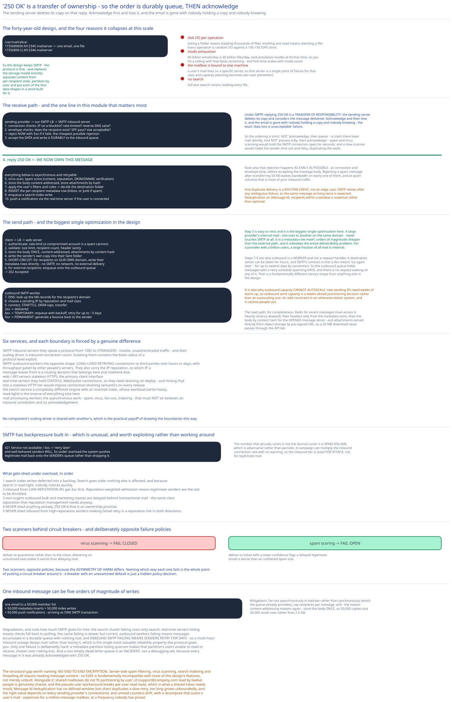

# Module 01 — Architecture & High-Level Design



## Why the traditional design fails

Worth starting here, because it explains every subsequent decision.

A classic mail server (`sendmail`, Postfix in its simplest configuration) stores **one file per email on a local filesystem**:

```
/var/mail/alice/
    1735689600.M12345.mailserver     ← one email, one file
    1735689612.M12346.mailserver
    ...
```

It's elegant, it's been running for forty years, and it collapses at scale for four reasons:

- **Disk I/O per operation.** Listing a folder means `stat()`ing thousands of files. Marking one read means rewriting a file. Every operation is random I/O against a 100–150 IOPS drive — the same wall the [object storage](../object-storage-s3/00-overview.md#capacity-estimation) case study hits, for the same reason.
- **Inode exhaustion.** 40 billion emails/day means 40 billion files/day. `ext4` provisions inodes at format time, so you hit a ceiling with free bytes remaining — and `fsck` time scales with inode count.
- **The mailbox is bound to one machine.** A user's mail lives on a specific server, so that server is a single point of failure for that user, and capacity planning becomes per-user placement.
- **No search.** Full-text search means reading every file.

So the design keeps SMTP (the protocol is fine) and replaces the storage model entirely: **separate content from per-recipient state, partition by user, and put each of the four data shapes in a store built for it.**

## Monolith vs. microservices

Six services, and each boundary is forced by a genuine difference.

**SMTP inbound servers** are separate because they speak a protocol from 1982 to strangers. They are the system's attack surface — hostile, unauthenticated traffic — and their scaling driver is inbound connection count. Isolating them contains the blast radius of a protocol-level exploit.

**SMTP outbound workers** are separate from inbound because they have the opposite shape: they make *long-lived retrying* connections to third parties over hours or days, and their throughput is gated by other people's servers. They also carry the IP reputation ([Module 03](./03-deliverability.md)), so which IP a message leaves from is a routing decision that belongs here and nowhere else.

**Web/API servers** are separate, stateless, and serve the HTTP client API.

**Real-time servers** are separate because they hold **stateful WebSocket connections**. Like the [nearby friends](../nearby-friends/01-architecture-hld.md#monolith-vs-microservices) design, connection-holding servers need draining on deploy, and mixing that into a stateless HTTP tier would impose connection-draining semantics on every ordinary release.

**The search service** is separate because it's a completely different engine with an inverted index, and [Module 02](./02-search.md) shows its workload (write-heavy, read-light) is the inverse of everything else here.

**Mail processing workers** are separate because they do the asynchronous work — spam scoring, virus scanning, fan-out, indexing — that must not sit between an inbound connection and its acknowledgement.

## Per-path walkthrough

**Send path**

```
Client → LB → Web server
   1. authenticate; rate-limit (a compromised account is a spam cannon)
   2. validate: size limit, recipient count, header sanity
   3. store the body ONCE, content-addressed; store attachments by content hash
   4. write the sender's own copy into their "Sent" folder
   5. SHORT-CIRCUIT: for recipients on our own domain, write their metadata rows directly
        → no SMTP, no network, no external delivery. Just a row insert.
   6. for external recipients: enqueue onto the outbound queue
   → 202 Accepted

Outbound SMTP worker
   7. DNS: look up the MX records for the recipient's domain
   8. choose a sending IP by reputation and mail class (Module 03)
   9. connect, STARTTLS, DKIM-sign, transfer
        2xx → delivered
        4xx → TEMPORARY failure: requeue with exponential backoff, retry for up to ~3 days
        5xx → PERMANENT failure: generate a bounce back to the sender
```

**Step 5 is the biggest single optimization in the design**, and it's easy to miss. A large provider's internal mail — one user to another on the same domain — never touches SMTP at all. It's a metadata row insert, so it's orders of magnitude cheaper than the external path, and it avoids the entire deliverability problem. For a provider with a billion users, a large fraction of mail is internal.

**Steps 7–9 are why outbound is a worker and not a request handler.** A destination server can be down for hours, and SMTP's contract is that a `4xx` means *try again later* — for up to several days, by convention. So the outbound queue holds messages with a retry schedule spanning days, and there is no request waiting on any of it. That's a fundamentally different service shape from anything else here.

**Receive path**

```
Sending provider → our SMTP LB → SMTP inbound server
   1. connection-level checks: is this IP on a blocklist? rate-limited? reverse DNS sane?
   2. envelope checks: does the recipient exist? SPF pass? size acceptable?
        → reject NOW with 5xx if it fails — cheapest possible rejection
   3. accept the DATA, write it DURABLY to the inbound queue
   4. ACKNOWLEDGE with 250 OK          ← we now OWN this message
      ↓ everything below is async and retryable
Mail processing worker
   5. virus scan; spam score (content, reputation, DKIM/DMARC verification)
   6. store the body content-addressed; store attachments by hash
   7. apply the user's filters/rules → decide the destination folder
   8. INSERT the per-recipient metadata row (Inbox, or Junk if spam)
   9. enqueue a search-index write
  10. push a notification via the real-time server if the user is connected
```

**Step 4 is the most important line in this module.** Under SMTP, replying `250 OK` is a **transfer of responsibility**: the sending server deletes its copy and considers the message delivered. If you acknowledge and then lose it, the email is gone with nobody holding a copy and nobody knowing — the exact "data loss is unacceptable" failure from [Module 00](./00-overview.md#requirements).

So the ordering is strict: **durably queue, then acknowledge.** Not "acknowledge, then queue" (a crash loses mail silently), and not "process fully, then acknowledge" (spam scanning and virus scanning would hold the SMTP connection open for seconds, and a slow scanner would cause the sender to time out and retry, duplicating work).

Note also that **rejection happens as early as possible** — at connection and envelope time, before accepting the message body. Rejecting a spam message after transferring 50 KB wastes bandwidth on every one, and at spam volumes that's most of your inbound traffic.

**Read path**

```
Client → LB → Web server
   → Redis: recent messages for this user (hot, and most reads are recent mail)
   → metadata store: SELECT headers WHERE user_id=? AND folder=? ORDER BY id DESC LIMIT 50
   → for the opened message only: fetch the body by content hash
   → attachments served from object storage via a pre-signed URL (never proxied)
```

Two things: the folder list fetches **headers only** ([Module 00](./00-overview.md#api-surface)) because bodies are 50 KB and a list view shows a few hundred bytes per row. And attachments are served **directly from object storage via pre-signed URLs**, so a 25 MB download never passes through the API tier — the same pattern as the [object storage](../object-storage-s3/01-architecture-hld.md#building-blocks) case study's refusal to buffer objects in its API service.

## Building blocks

**SMTP load balancer + inbound servers** — port 25, hostile traffic, cheap early rejection.

**Web/API servers** — stateless HTTPS; the primary client interface.

**Real-time servers** — WebSocket, with long-polling fallback for old browsers. Push new mail and sync read-state across a user's devices. Cross-ref [Long Polling, WebSockets & SSE](../../scalability-resilience/long-polling-websockets-sse.md).

**Inbound/outbound queues** — Kafka or equivalent. The inbound queue is where the `250 OK` promise is kept; the outbound queue holds a multi-day retry schedule. Cross-ref [Kafka & the Distributed Log](../../hld-building-blocks/kafka-distributed-log.md).

**Mail processing workers** — spam, virus, filters, fan-out, index writes.

**Metadata store** — per-recipient rows, partitioned by `user_id`. [Module 04](./04-db-design.md).

**Content store** — bodies and attachments, content-addressed. Object storage; cross-ref the [object storage](../object-storage-s3/00-overview.md) case study, which is exactly this component.

**Search cluster** — inverted index, partitioned by `user_id`. [Module 02](./02-search.md).

**Distributed cache (Redis)** — recent messages and folder counts. Mail access is heavily recency-skewed, so a small cache covers most reads.

**Reputation/IP pool manager** — decides which outbound IP a message leaves from. [Module 03](./03-deliverability.md).

## Trade-offs to make explicit

| Decision | Chosen | Alternative | Why |
|---|---|---|---|
| Inbound acknowledgement | **Durably queue, then `250 OK`** | Acknowledge then queue, or process fully then acknowledge | `250 OK` transfers ownership — the sender deletes its copy. Acknowledging before durability loses mail silently. Processing before acknowledging holds the SMTP connection through spam and virus scanning, causing sender timeouts and duplicate transfers. |
| Content storage | **Content-addressed, stored once** | Full copy per recipient | 4× amplification (40B copies from 10B emails) makes this worth **548 PB/year** ([Module 00](./00-overview.md#capacity-estimation)). Also makes "mark as read" a small row update instead of touching a 50 KB blob. |
| Internal mail | **Short-circuit — direct metadata insert** | Route through SMTP like external mail | Same-domain delivery needs no protocol, no network, and no deliverability concerns. For a billion-user provider this is a large fraction of all mail. |
| Client protocol | **HTTPS + WebSocket** | IMAP as the primary API | IMAP's command set can't express labels, snooze, threading or server-side categorization, and doesn't work in a browser. Cost: IMAP and POP3 must still be supported for legacy clients — three protocols instead of one. |
| Spam rejection point | **At connection/envelope time, before DATA** | After accepting and scoring the message | Rejecting after transferring 50 KB wastes bandwidth on every spam message, and spam is most of inbound volume. |
| Attachment delivery | **Pre-signed URLs, direct from object storage** | Proxied through the API tier | A 25 MB download through the API tier consumes a request slot and bandwidth for the entire transfer. |
| Metadata partitioning | **By `user_id`** | By `message_id`, or by thread | Nearly every operation is scoped to one user, so `user_id` makes them all single-partition. Cost: a genuinely shared mailbox doesn't fit, and this design accepts that. |
| Outbound retries | **Up to ~3 days, exponential backoff** | Fail fast after a few attempts | SMTP's `4xx` explicitly means "retry later", and destination outages of hours are routine. Failing fast would bounce mail that would have been delivered. |

## Load Handling

- **Peak-vs-average.** Business-hours diurnal, staggered globally. But the number that actually varies is **spam volume**, which is adversarial rather than diurnal — a campaign can multiply inbound connection rate with no warning. So the inbound tier is sized for attack, not for legitimate mail.

- **Where backpressure kicks in first.** At the **inbound SMTP tier's connection capacity.** And here SMTP does something genuinely useful: a `421 Service not available` or a `4xx` tells the sender to **retry later**, and well-behaved senders will. So under overload the system can push legitimate mail back onto the *sender's* queue rather than dropping it — **the protocol has built-in backpressure**, which is unusual and worth exploiting rather than working around. Cross-ref [Backpressure & Load Shedding](../../scalability-resilience/backpressure-load-shedding.md).

- **What gets shed under overload**, in order:
  1. **Search index writes** — deferred into a backlog. Search results go stale; nothing else is affected, and [Module 02](./02-search.md) shows nobody notices quickly because search is read-light.
  2. **Inbound connections from low-reputation IPs** get `4xx` first. Reputation-weighted admission means legitimate senders are the last to be throttled.
  3. **Non-urgent outbound** (bulk and marketing classes) is delayed behind transactional mail, using the same class separation [Module 03](./03-deliverability.md#separate-your-mail-classes) sets up for reputation reasons.
  4. **Never shed:** anything already acknowledged with `250 OK`. That's an ownership promise.
  5. **Never shed:** inbound from high-reputation senders. Making Gmail retry is a reputation risk in both directions.

- **The mailing-list amplification problem.** An email to a 50,000-member list is one inbound message and **50,000 metadata inserts plus 50,000 index writes plus 50,000 push notifications.** So a single message can be a five-order-of-magnitude write amplification, arriving as one SMTP transaction. Mitigations: fan out asynchronously in batches rather than synchronously (which the queue already provides), cap recipients per message, and — the reason content-addressing matters again — store the body once so 50,000 copies cost 50,000 small rows rather than 2.5 GB.

- **Autoscaling.** Web servers, SMTP inbound and processing workers all scale in minutes. **Real-time servers scale badly** (connection draining, and clients must reconnect), and **outbound workers scale carefully** — adding new sending IPs requires warm-up ([Module 03](./03-deliverability.md#ip-warm-up-is-not-optional)), so outbound send capacity is a *weeks-ahead* provisioning decision, not an autoscaling one. That's an unusual constraint and it catches people out.

- **Load-test target.** Sustain 116,000 sends/sec and equivalent inbound while (a) killing a processing worker mid-batch and confirming **zero acknowledged messages are lost**, (b) delivering a single message to a 50,000-recipient list and measuring fan-out completion time, and (c) taking a destination MX offline for 6 hours and confirming the retry schedule delivers everything on recovery with no duplicates and no premature bounces.

## Concurrent-User Handling

| Race | Mechanism | What the "loser" sees |
|---|---|---|
| The same message is delivered twice (sender retried after a lost ack) | Deduplicate on the message's `Message-Id` header plus recipient, within a time window. | The duplicate is discarded. **This is essential, not optional** — SMTP retries after any ambiguous failure, so duplicate delivery is a routine event rather than an edge case. |
| Two devices mark the same message read simultaneously | `is_read` is a boolean set to the same value; last-write-wins is correct because both writes agree. | Nothing. **Idempotent-by-overwrite state needs no coordination** — the same reasoning as [nearby friends](../nearby-friends/02-lld.md#concurrency-at-the-code-level). |
| One device moves a message to Archive while another moves it to Trash | Last-write-wins on `folder_id`, with the WebSocket pushing the winning state to both devices. | The losing device's view corrects itself within a moment. A conflict-resolution UI would be worse than a corrected view. |
| Two recipients of one email both delete it | Each has their **own** metadata row; deleting one doesn't touch the other. The content is reference-counted and reclaimed only when the last reference goes. | Nothing — the deletions are genuinely independent. This is a direct payoff of separating content from per-recipient state. |
| An inbound message arrives while the user's mailbox is being migrated between shards | The migration holds a write lease; new mail queues behind it and is applied after the cutover. | A brief delay in delivery. Because the message is already durably queued, no mail is at risk. |
| Unread count updated concurrently by delivery and by a read action | Maintained as a counter, updated atomically; periodically recomputed from the source rows to correct drift. | Nothing. A momentarily wrong unread badge is tolerable; the periodic recompute is what keeps it honest, since counters drift. |

## Scaling & Reliability

- **Horizontal scaling.** Every tier scales independently: web servers on request rate, SMTP inbound on connection rate, workers on queue depth, metadata by `user_id` partitions, content in object storage, search by `user_id` shards. **No component's scaling driver is shared with another's**, which is the practical payoff of the service boundaries above.

- **Circuit breaker** around the virus and spam scanners. When one trips, the decision is a policy question worth answering explicitly: **fail closed for virus scanning** (deliver to quarantine rather than to the inbox — delivering an unscanned executable is worse than delaying mail) and **fail open for spam scoring** (deliver to Inbox with a lower confidence flag — a delayed legitimate email is worse than an unfiltered spam one). Two scanners, opposite policies, because the asymmetry of harm differs. Cross-ref [Circuit Breakers & Retries](../../scalability-resilience/circuit-breakers-retries.md).

- **Retries.** Outbound retries are the protocol's own mechanism (backoff over ~3 days). Processing-worker retries are safe because of `Message-Id` deduplication. Client sends retry under a client-generated message id.

- **Dead-letter queue.** A message that cannot be processed after N attempts goes to a DLQ — and here it's a genuine **data-loss risk**, not a debugging aid, because the message was acknowledged with `250 OK`. A non-empty DLQ is an incident requiring human resolution, exactly like the [digital wallet's](../digital-wallet/01-architecture-hld.md#scaling-reliability).

- **Graceful degradation:**
  1. **The search cluster fails** → search is unavailable; everything else works. Index writes backlog and drain later.
  2. **Real-time servers fail** → no push, so clients fall back to polling. Mail still arrives.
  3. **The cache fails** → reads fall through to the metadata store. Slower, still correct.
  4. **Outbound workers fail** → sending stops, and messages accumulate in a durable queue. Nothing is lost; delivery is delayed.
  5. **Inbound SMTP fails** → the system returns `4xx` (or simply refuses connections), and **senders retry for days.** So a multi-hour inbound outage delays mail rather than losing it — the single most valuable reliability property SMTP gives you for free.
  6. **A metadata partition loses quorum** → that partition's users cannot read or receive mail. Deliberately unavailable rather than risking loss, per [Module 04](./04-db-design.md#consistency).

- **Multi-region.** Home each user's mailbox in a region, with leader-follower replication and failover. Works well because mail operations never span users, so there is no cross-region transaction. Inbound SMTP is anycast to the nearest region and the message is routed internally to the recipient's home region.

## What you'd revisit as this grows

- **Shared mailboxes don't fit the partitioning scheme.** `support@company.com` accessed by twelve people is a genuinely shared mailbox, and partitioning by `user_id` assumes an email belongs to one user. Modelling it as a pseudo-user with delegated access is the usual workaround, and it breaks per-user read state — which is exactly what a shared inbox needs most.

- **Outbound capacity cannot autoscale.** New sending IPs need weeks of warm-up ([Module 03](./03-deliverability.md#ip-warm-up-is-not-optional)), so a sudden legitimate surge in outbound volume can't be absorbed by adding capacity. Planning is weeks ahead, which is an odd constraint in an otherwise elastic system.

- **`Message-Id` deduplication has no defined window.** Too short and a slow retry duplicates a message; too long and the dedup table grows unboundedly. The right value depends on the retry conventions of every sending provider, which nobody controls.

- **Unread counters drift.** They're maintained incrementally and periodically recomputed, and the recompute is a scan of a user's mail. For a mailbox with a million messages that's expensive, so the recompute frequency is a trade nobody has priced here.

- **No end-to-end encryption.** Server-side spam filtering, virus scanning, search indexing, and threading all require reading message content — so E2EE is fundamentally incompatible with most of this design's features, not merely unbuilt. Worth naming as a structural conflict rather than a backlog item.
