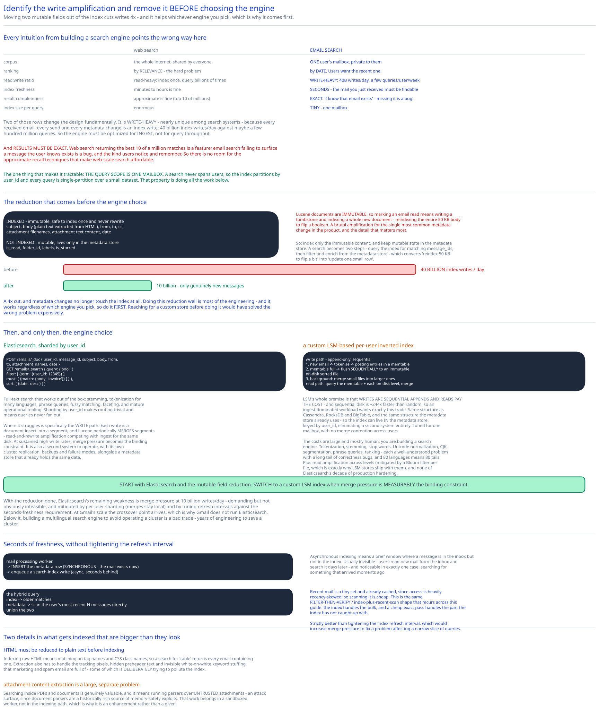

# Module 02 — Search



## Email search is the opposite of web search

Every intuition from building a search engine points the wrong way here. The comparison is worth making explicitly:

| | Web search (the [search engine](../search-engine/00-overview.md) case study) | **Email search** |
|---|---|---|
| Corpus | The whole internet, shared by everyone | **One user's mailbox, private to them** |
| Ranking | By **relevance** — the hard problem | **By date.** Users want the recent one. |
| Read:write ratio | **Read-heavy** — index once, query billions of times | **Write-heavy** — 40B writes/day, a few queries/user/week |
| Index freshness | Minutes to hours is fine | **Seconds** — searching for the mail you just received must find it |
| Result completeness | Approximate is fine (top 10 of millions) | **Exact.** "I know that email exists" — missing it is a bug. |
| Index size per query scope | Enormous | **Tiny** — one mailbox |

Two of those rows change the design fundamentally.

**It's write-heavy**, which is nearly unique among search systems. Every received email, every send, and every metadata change (moved folder, marked read, labelled) is an index write. That's 40 billion index writes/day against maybe a few hundred million queries — a ratio inverted from every general-purpose search deployment, and it means **the index engine must be optimized for ingest, not for query throughput.**

**Results must be exact.** Web search returning the best 10 of a million matches is a *feature*. Email search failing to surface a message the user knows exists is a **bug**, and it's the kind users notice and remember. So there's no room for the approximate-recall techniques that make web-scale search affordable.

The one thing that makes it tractable: **the query scope is one mailbox.** A search never spans users, so the index is partitioned by `user_id` and every query is single-partition over a small dataset. That's the property doing all the work below.

## Option 1 — Elasticsearch

Run a cluster, index per-user documents, shard by `user_id` so a mailbox's index lives on one node.

```
POST /emails/_doc          { user_id, message_id, subject, body, from, to,
                             folder, is_read, has_attachment, date }
GET  /emails/_search       { query: { bool: {
                               filter: [ {term: {user_id: 12345}}, … ],
                               must:   [ {match: {body: "invoice"}} ] } },
                             sort: [ {date: "desc"} ] }
```

**What it gets you:** full-text search that works out of the box, including stemming, tokenization for many languages, phrase queries, fuzzy matching, faceting (`has_attachment`, `folder`, `from`), and mature operational tooling. Sharding by `user_id` means routing is trivial and queries never fan out.

**Where it struggles, and it's specifically the write path:**

- **40 billion writes/day is a lot for Lucene.** Each write is a document insert into a segment, and Lucene periodically **merges** segments — which is read-and-rewrite amplification competing with ingest for the same disk. At sustained high write rates, merge pressure becomes the binding constraint.
- **Updates are deletes plus reinserts.** Lucene documents are immutable, so marking an email read means writing a tombstone and indexing a whole new document — reindexing the entire 50 KB body to flip a boolean. That's a brutal amplification for the single most common metadata change in the product, and it's the detail that matters most.
- **It's a second system to operate**, with its own cluster, replication, backups and failure modes, alongside the metadata store that already holds the same data.

The mitigation for the second point is important and worth knowing: **keep mutable fields out of the search index entirely.** Index only the immutable content (subject, body, from, to, date, attachment names) and store mutable state (`is_read`, `folder`, labels) only in the metadata store. Then a search becomes: query the index for matching `message_id`s, then filter and enrich from the metadata store.

That's a two-step query instead of one, and it converts "reindex 50 KB to flip a bit" into "update one small row" — turning the write rate from **40 billion index writes/day into 10 billion** (only genuinely new messages), since metadata changes no longer touch the index at all. Doing this reduction well is most of the engineering.

## Option 2 — A custom LSM-based index

Build a per-user inverted index on a **log-structured merge tree**, optimized specifically for this write pattern.

```
Write path (append-only, sequential):
  1. new email → tokenize → posting entries in an in-memory table (a memtable)
  2. memtable full → flush SEQUENTIALLY to an immutable on-disk sorted file
  3. background: merge small files into larger ones

Read path:
  query the memtable + each on-disk level, merge the results
```

**Why LSM specifically.** Its whole design premise is that **writes are sequential appends and reads pay the cost.** Sequential disk is ~244× faster than random ([the message queue](../distributed-message-queue/02-storage-engine.md#the-measurement-everything-follows-from) derives this), so an ingest-dominated workload wants exactly this trade. It's the same structure behind Cassandra, RocksDB and BigTable — and, notably, the same structure the metadata store already uses.

**What that buys, beyond raw ingest speed:**

- **The index can live in the metadata store itself**, keyed by `user_id` — eliminating an entire second system, along with its cluster, its replication, its backups, and the consistency questions between two copies of the same data.
- **Tuned for one mailbox.** Generic engines optimize for large shared corpora; here every index is small and single-tenant, so you can make choices (per-user files, no cross-user merges, simpler posting lists) a general engine cannot.
- **No merge contention across users.** One user's compaction never affects another's, because their index data is physically separate.

**The costs are large and mostly human:**

- **You are building a search engine.** Tokenization, stemming, stop words, Unicode normalization, CJK segmentation, phrase queries, ranking. Each is a well-understood problem with a long tail of correctness bugs, and 80 languages means 80 tails.
- **Read amplification.** A query touches the memtable plus every on-disk level, so more levels mean more files consulted. Bloom filters per file reduce this substantially (cross-ref [Bloom Filters](../../scalability-resilience/bloom-filters.md)), which is exactly why LSM stores ship with them.
- **No operational maturity.** Elasticsearch has a decade of production hardening you'd be reproducing.

## Choosing

**Start with Elasticsearch, sharded by `user_id`, indexing only immutable fields.**

The reasoning is that the mutable-field reduction above already solves the dominant problem. Moving `is_read` and `folder` out of the index cuts index writes **4×** (40B → 10B/day) and eliminates the "reindex 50 KB to flip a boolean" pathology entirely. That's the single highest-leverage change available, and it works regardless of which engine you pick — so do it first, before choosing an engine.

With that done, Elasticsearch's remaining weakness is merge pressure at 10 billion writes/day, which is demanding but not obviously infeasible, and it's mitigated by per-user sharding (merges stay local) and by tuning refresh intervals against the seconds-freshness requirement.

**Switch to a custom LSM index when** merge pressure is measurably the binding constraint and the operational cost of a second system is material. At Gmail's scale that point arrives, which is why Gmail doesn't run Elasticsearch. Below it, building a multilingual search engine to save operating one is a bad trade — you'd be spending years of engineering to avoid a cluster.

**The general principle worth extracting:** identify the write amplification and remove it *before* choosing the engine. A reduction that cuts writes 4× helps whichever engine you use, and it may make the simpler engine sufficient. Reaching for a custom store first would have solved the wrong problem expensively.

## Making search fresh

The requirement is **seconds** — searching for an email you just received must find it. That's much tighter than web search and it's a real constraint on the ingest path.

```
Mail processing worker
  → INSERT the metadata row                        (synchronous — the mail exists now)
  → enqueue a search-index write                   (async, seconds behind)
```

Asynchronous indexing means a **brief window where a message is in the inbox but not in the search index.** That's usually invisible: users read new mail from the inbox, and search it days later. It's noticeable in exactly one case — searching for something that arrived moments ago.

The pragmatic fix is a **hybrid query**: search the index for older matches, and simultaneously scan the user's most recent N messages directly from the metadata store. Recent mail is a tiny set, already cached ([Module 01](./01-architecture-hld.md#per-path-walkthrough) notes access is heavily recency-skewed), so scanning it is cheap. Union the results.

That's the same **filter-then-verify / index-plus-recent-scan** shape that recurs across this guide — the index handles the bulk, a cheap exact pass handles the part the index hasn't caught up with. It's strictly better than tightening the index refresh interval, which would increase merge pressure to fix a problem affecting a narrow slice of queries.

## What actually gets indexed

```
Indexed (immutable — safe to index once, never rewritten):
  subject, body (plain text extracted from HTML), from, to, cc,
  attachment filenames, attachment text content (PDFs, documents), date

NOT indexed (mutable — lives only in the metadata store):
  is_read, folder_id, labels, is_starred
```

Two details worth calling out:

**HTML must be reduced to plain text before indexing.** Indexing raw HTML means matching on tag names and CSS class names, so a search for `table` returns every email with a table in it. Extraction also has to handle the tracking pixels, hidden preheader text, and invisible white-on-white keyword stuffing that marketing and spam email are full of — some of which is *deliberately* trying to pollute the index.

**Attachment content extraction is a large, separate problem.** Searching inside PDFs and documents is a genuinely valuable feature and it means running parsers over untrusted attachments — an attack surface, since document parsers are a historically rich source of memory-safety exploits. That work belongs in a sandboxed worker, not in the indexing path, and it's why it's listed as an enhancement rather than a given.

## Practice: extend it yourself

1. **Design the hybrid query precisely.** Given the async index and the recency-skewed access pattern, specify: how many recent messages to scan directly (and what bounds that number — cache size? a time window? a message count?), how to deduplicate a message appearing in both the index and the recent scan, how to merge two result sets that are both date-ordered, and how to paginate the union without re-scanning. Then state what breaks when a user's index is hours behind after an outage.
2. **Handle a user with 2 million emails searching a common word.** The result set is enormous, results must be exact, and they're sorted by date rather than relevance — so you can't use a relevance cut-off to bound the work. Design the pagination: what does the cursor contain, how do you avoid materializing the whole posting list, and what happens when new mail arrives mid-pagination and shifts the date ordering underneath the cursor?
