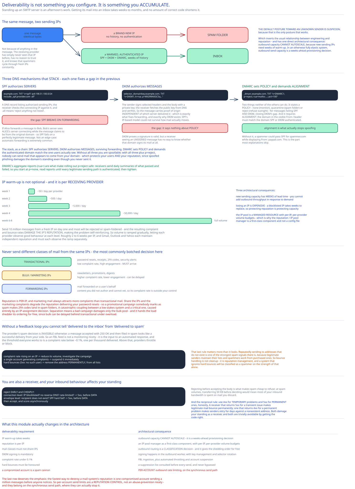

# Module 03 — Deliverability



## The problem nobody expects

Standing up an SMTP server that sends mail is an afternoon's work. **Getting that mail into an inbox rather than a spam folder takes weeks to months**, and no amount of correct code shortens it.

Send from a brand-new IP address and your mail goes to spam. Not because of anything in it — the receiving provider has simply never seen that IP before, has no reason to trust it, and knows that spammers cycle through fresh IPs constantly. **The default posture toward an unknown sender is suspicion**, because that's the only posture that works.

This matters for the design because it inverts the usual relationship between engineering and reputation: **deliverability is not something you configure, it's something you accumulate.** And it has a direct architectural consequence — [Module 01](./01-architecture-hld.md#load-handling) notes outbound capacity **cannot autoscale**, because new sending IPs need weeks of warm-up. In an otherwise fully elastic system, outbound send capacity is a weeks-ahead provisioning decision.

An interviewer asking "how would you build Gmail" is asking about this whether they name it or not, because it's the part that separates people who have operated a mail system from people who have read about one.

## Email authentication: the three records

Three DNS-based mechanisms, and they stack — each fixes a gap in the previous one. Getting the *relationship* between them right is the interesting part.

### SPF — which servers may send for my domain

```
example.com.  TXT  "v=spf1 ip4:198.51.100.0/24 include:_spf.provider.com -all"
```

A DNS record listing authorized sending IPs. The receiver checks the connecting IP against it. `-all` means "reject anything not listed."

**Its gap: SPF breaks on forwarding.** If Alice forwards a message to Bob, Bob's server sees *Alice's* server connecting while the message claims to be from the original domain — so SPF fails on a perfectly legitimate message. This is not an edge case; automatic forwarding is extremely common.

### DKIM — a cryptographic signature over the message

```
selector._domainkey.example.com.  TXT  "v=DKIM1; k=rsa; p=MIGfMA0GCSq..."
```

The sender signs selected headers and the body with a private key; the receiver fetches the public key from DNS and verifies. So the message carries proof of origin **independent of which server delivered it.**

**That's precisely what fixes forwarding**: the signature travels with the message, so a forwarded email still verifies. DKIM exists because SPF's IP-based model couldn't survive the way mail actually moves.

**Its gap: DKIM proves a signature is valid, but says nothing about what to do if it isn't.** A receiver seeing an unsigned message has no way to know whether that domain signs its mail at all.

### DMARC — the policy that ties them together

```
_dmarc.example.com.  TXT  "v=DMARC1; p=reject; rua=mailto:reports@example.com; pct=100"
```

DMARC does two things neither of the others can:

1. **It states a policy** — `none` (monitor only), `quarantine` (spam folder), or `reject` (refuse outright) — for messages failing SPF **and** DKIM. That closes DKIM's gap: now a receiver knows an unsigned message from this domain should be rejected.
2. **It requires alignment** — the domain in the visible `From:` header must match the domain that SPF or DKIM authenticated. Without this, a spammer could pass SPF for `spammer.com` while displaying `From: paypal.com`. **Alignment is what makes the whole stack actually prevent spoofing**, and it's the part most explanations skip.

DMARC also provides **aggregate reports** (`rua=`) — receivers send you daily summaries of what passed and failed. That's the feedback loop that makes rolling out `p=reject` safe: start at `p=none`, read reports until you're confident every legitimate sending path is authenticated, then tighten.

**The stack, stated as a chain:** SPF authorizes *servers*. DKIM authorizes *messages*, surviving forwarding. DMARC sets *policy* and demands the authenticated domain match the one users see.

Without all three you're spoofable. With all three plus `p=reject`, nobody can send mail that appears to come from your domain — which protects your users *and* your reputation, since spoofed phishing damages the domain's standing even though you never sent it.

## IP warm-up is not optional

Receiving providers rate-limit unfamiliar IPs. Send 10 million messages from a fresh IP on day one and most will be rejected or spam-foldered — and the resulting complaint and bounce rates **damage the IP's reputation**, making the problem self-reinforcing.

So volume is ramped gradually, letting each provider observe good behaviour at each level:

```
Week 1:   ~50/day per provider
Week 2:   ~500/day
Week 3:   ~5,000/day
Week 4:   ~50,000/day
...
Week 6-8: full volume
```

Roughly **2 to 6 weeks** per IP, and the ramp must be **per receiving provider** — Gmail, Outlook and Yahoo each maintain independent reputation and each must observe the ramp separately.

Three architectural consequences:

- **New sending capacity has weeks of lead time.** You cannot add outbound throughput in response to demand.
- **Losing an IP is expensive.** A blocklisted IP means weeks to replace, so protecting reputation is protecting capacity.
- **The IP pool is a managed resource** with per-IP, per-provider volume budgets — which is why [Module 01](./01-architecture-hld.md#building-blocks) has a reputation/IP pool manager as a first-class component rather than a config file.

## Separate your mail classes

The single most important operational decision, and the one people get wrong most often: **never send different classes of mail from the same IPs.**

```
Transactional IPs:  password resets, receipts, 2FA codes, security alerts
                    → low complaint rate, high engagement, MUST arrive
Bulk/marketing IPs: newsletters, promotions, digests
                    → higher complaint rate, lower engagement, can be delayed
Forwarding IPs:     mail forwarded on a user's behalf
                    → content you didn't author and can't control
```

Why it matters: **reputation is per-IP, and marketing mail always attracts more complaints than transactional mail.** Share the IPs and the marketing complaints degrade the reputation delivering your password resets — so a promotional campaign someone marks as spam makes 2FA codes land in spam folders. That's a catastrophic coupling between a low-stakes system and a critical one, caused entirely by an IP-assignment decision.

Separation means a bad campaign damages only the bulk pool, and transactional mail stays deliverable. It also gives [Module 01](./01-architecture-hld.md#load-handling) its shedding order — bulk can be delayed behind transactional under overload, using the same class distinction.

Forwarding gets its own pool because you're relaying content you didn't write and cannot vet, so its complaint rate is outside your control entirely.

## Feedback loops and complaint rate

The major providers offer **feedback loops (FBLs)**: when a user clicks "report spam", the provider notifies you.

That signal is essential, because **the provider's spam decision is invisible otherwise** — a message accepted with `250 OK` and then filed in spam looks like a successful delivery from your side. Without an FBL you cannot distinguish "delivered to the inbox" from "delivered to the spam folder", so you'd be flying blind on the metric that actually matters.

The threshold everyone works to: **keep the complaint rate below ~0.1%** — one complaint per thousand delivered. Above that, providers begin throttling or blocking. So an FBL feed is not merely a monitoring nicety; it's the input to an **automated response**:

```
Complaint rate rising on an IP  → reduce its volume, investigate the campaign
A single account generating complaints → suspend it immediately
Hard bounces (5xx: no such user) → remove the address permanently from all lists
```

**That last rule matters more than it looks.** Repeatedly sending to addresses that don't exist is one of the strongest spam signals there is, because legitimate senders maintain their lists and spammers work from purchased ones. So bounce handling isn't cleanup — it's reputation management, and a system that ignores hard bounces will be classified as a spammer on the strength of that alone.

## Being a good receiver too

Deliverability is usually framed as an outbound concern, but as an email provider you're also a **receiver**, and your inbound behaviour affects your standing.

```
Reject EARLY and CHEAPLY:
  - connection level: IP on a blocklist? no reverse DNS? rate-limited?  → 5xx, before DATA
  - envelope level:   recipient doesn't exist? SPF hard fail?           → 5xx, before DATA
Then accept, and score asynchronously (Module 01)
```

Rejecting before accepting the message body is what makes spam cheap to refuse — at spam volumes, transferring 50 KB before deciding would mean most of your inbound bandwidth is spent on mail you discard.

And the reciprocal rule: **use `4xx` for temporary problems, `5xx` for permanent ones, honestly.** A receiver that returns `5xx` for a transient issue causes legitimate mail to bounce permanently; one that returns `4xx` for a permanent problem makes senders retry for days against a nonexistent address. Both damage your standing as a receiver, and both are trivially avoidable by getting the code right.

## What this means for the design

Pulling the architectural consequences together, because this module has more of them than it first appears:

| Deliverability requirement | Architectural consequence |
|---|---|
| IP warm-up takes weeks | **Outbound capacity cannot autoscale** ([Module 01](./01-architecture-hld.md#load-handling)) — it's a weeks-ahead provisioning decision |
| Reputation is per-IP | An **IP pool manager** is a first-class component with per-IP, per-provider volume budgets |
| Mail classes must not share IPs | Outbound routing is a **classification decision**, and it gives the load-shedding order for free |
| DKIM signing is mandatory | Signing happens in the **outbound worker**, with key management and selector rotation |
| Complaint rate must stay under 0.1% | **FBL ingestion** plus automated throttling and account suspension |
| Hard bounces must be honoured | A **suppression list** consulted before every send, and never bypassed |
| A compromised account is a spam cannon | **Per-account outbound rate limiting**, which is why [Module 01](./01-architecture-hld.md#per-path-walkthrough) rate-limits on the send path |

The last row deserves emphasis: the fastest way to destroy a mail system's reputation is one compromised account sending a million messages before anyone notices. So per-account send limits are a **reputation control**, not an abuse-prevention nicety — and they belong on the synchronous send path where they can actually stop it.

## Practice: extend it yourself

1. **Design the IP pool manager.** You have 200 sending IPs across three classes, each at a different warm-up stage, with per-provider volume budgets. Given a message to send, specify how you choose an IP: how you track remaining budget per (IP, provider, day), what you do when a class's budget is exhausted (delay? borrow from another class? accept degraded deliverability?), and how a newly-blocklisted IP is drained without dropping mail. Then work out how many IPs you need in the warm-up pipeline at all times to grow outbound volume 20% per quarter.
2. **Roll out DMARC `p=reject` for a large organization.** They have mail from marketing platforms, a CRM, a ticketing system, and shadow-IT scripts nobody has inventoried. Design the rollout using `p=none` aggregate reports: what you look for in them, how you use the `pct=` parameter to ramp, how you identify legitimate senders that are failing alignment (and why *alignment* rather than plain SPF/DKIM failure is the thing that breaks), and what you do about a legitimate sender that cannot be made to align.
