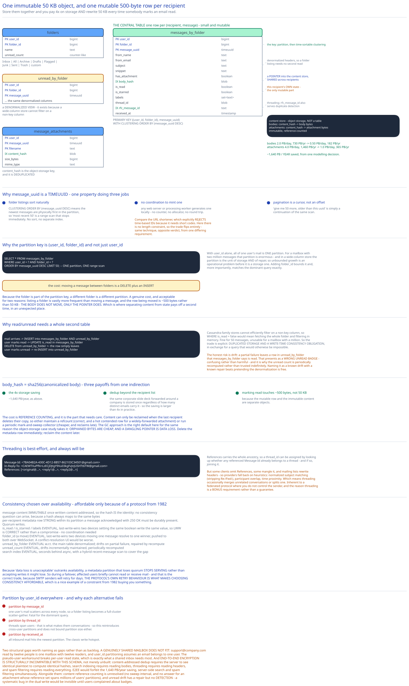

# Module 04 — Database Design



## The organising decision

Everything in this schema follows from one observation in [Module 00](./00-overview.md#capacity-estimation): **40 billion recipient copies come from 10 billion emails.** So the schema separates two things that a naive design conflates:

- **The content** — subject, body, attachments. Identical for every recipient, immutable, large (~50 KB).
- **Per-recipient state** — which folder, read or not, labels, starred. Different per recipient, mutable, tiny (~500 bytes).

Store them together and you pay 4× on storage *and* rewrite 50 KB every time someone marks an email read. Separate them and you pay once for content and once per recipient for a small mutable row.

| | Stored per recipient | **Content-addressed** |
|---|---|---|
| Bodies | 2.0 PB/day, 730 PB/yr | **0.50 PB/day, 182 PB/yr** |
| Attachments | 4.0 PB/day, 1,460 PB/yr | **1.0 PB/day, 365 PB/yr** |

**~1,640 PB/year saved**, from one modelling decision.

## From entities to schema

The metadata store is wide-column (Cassandra-family), partitioned by `user_id`. Content lives in object storage.

```sql
-- ══════ Per-user folders ══════
CREATE TABLE folders (
    user_id       bigint,
    folder_id     bigint,
    name          text,          -- Inbox|All|Archive|Drafts|Flagged|Junk|Sent|Trash|custom
    unread_count  counter_like,  -- maintained incrementally, periodically recomputed
    PRIMARY KEY ((user_id), folder_id)
);

-- ══════ THE CENTRAL TABLE: one row per (recipient, message). Small and mutable. ══════
CREATE TABLE messages_by_folder (
    user_id        bigint,
    folder_id      bigint,
    message_uuid   timeuuid,      -- SORTABLE BY TIME. See below.
    -- denormalized headers, so a folder listing needs no second read:
    from_name      text,
    from_email     text,
    subject        text,
    snippet        text,          -- first ~200 chars, for the list preview
    has_attachment boolean,
    -- pointers into the content store:
    body_hash      blob,          -- content-addressed; SHARED across recipients
    -- this recipient's OWN state:
    is_read        boolean,
    is_starred     boolean,
    labels         set<text>,
    -- threading:
    thread_id      blob,
    rfc_message_id text,          -- the RFC 5322 Message-Id, for dedup
    received_at    timestamp,
    PRIMARY KEY ((user_id, folder_id), message_uuid)
) WITH CLUSTERING ORDER BY (message_uuid DESC);

-- ══════ Denormalized read/unread views ══════
CREATE TABLE unread_by_folder (
    user_id bigint, folder_id bigint, message_uuid timeuuid,
    /* … same denormalized columns … */
    PRIMARY KEY ((user_id, folder_id), message_uuid)
) WITH CLUSTERING ORDER BY (message_uuid DESC);

-- ══════ Attachment references (many-to-many via content hash) ══════
CREATE TABLE message_attachments (
    user_id       bigint,
    message_uuid  timeuuid,
    filename      text,
    content_hash  blob,           -- the object-storage key; DEDUPLICATED
    size_bytes    bigint,
    mime_type     text,
    PRIMARY KEY ((user_id, message_uuid), filename)
);

-- ══════ Content store (object storage, NOT a table) ══════
--   bodies:      content_hash → body bytes           (immutable, ref-counted)
--   attachments: content_hash → attachment bytes     (immutable, ref-counted)
```

### Why `message_uuid` is a TIMEUUID

A TIMEUUID embeds a timestamp in its high bits, so it is **globally unique and lexicographically sortable by creation time** at once. That single property does three jobs:

- **Folder listings sort naturally.** `CLUSTERING ORDER BY (message_uuid DESC)` means the newest messages are physically first in the partition, so "most recent 50" is a range scan that stops immediately. No sort, no separate index.
- **No coordination to mint one.** Any web server or processing worker generates one locally — no counter, no allocator, no round trip. Compare the [URL shortener](../url-shortener/02-short-code-generation.md#b1-dont-use-snowflake-ids-directly), which explicitly *rejects* time-based IDs because it needs short codes. Here there's no length constraint, so the trade flips entirely. Same technique, opposite verdict, from one differing requirement.
- **Pagination is a cursor, not an offset.** "Give me 50 more, older than this uuid" is a continuation of the same scan.

### Why the partition key is `(user_id, folder_id)` and not just `user_id`

This is the schema's most consequential choice.

With `user_id` alone, all of one user's mail is one partition. For a mailbox with two million messages that partition is enormous — and in a wide-column store the partition is the unit of storage *and* of repair, so an unbounded partition is an operational problem before it's a storage one.

Adding `folder_id` bounds it and — more importantly — **matches the dominant query exactly**:

```sql
SELECT * FROM messages_by_folder
 WHERE user_id = ? AND folder_id = ?
 ORDER BY message_uuid DESC LIMIT 50;      -- ONE partition, ONE range scan
```

The cost is that **moving a message between folders is a delete plus an insert**, not an update — because the folder is part of the partition key, so a different folder is a different partition. That's a genuine cost, and it's acceptable because listing a folder is vastly more frequent than moving a message, and the row being moved is ~500 bytes rather than 50 KB (the body doesn't move — only the pointer does). **This is where separating content from state pays off a second time**, in an unexpected place.

### Why read/unread is a separate denormalized table

Cassandra-family stores cannot efficiently filter on a non-key column, so `WHERE is_read = false` would mean fetching the whole folder and filtering in memory. Fine for 50 messages, unusable for a mailbox with a million.

So "unread in this folder" gets **its own table**, maintained on write:

```
Mail arrives      → INSERT into messages_by_folder AND unread_by_folder
User marks read   → UPDATE is_read in messages_by_folder
                    DELETE from unread_by_folder            ← the row simply leaves
User marks unread → re-INSERT into unread_by_folder
```

The trade is explicit: **duplicated storage and a write-time consistency obligation, in exchange for a query that would otherwise be impossible.** Cross-ref [Normalization & Schema Design](../../database-design/normalization-schema-design.md).

The honest risk is that the two tables can drift — a partial failure leaves a row in `unread_by_folder` that `messages_by_folder` says is read. That presents as a **wrong unread badge**, which is confusing rather than harmful, and it's why the unread count is periodically recomputed rather than trusted indefinitely. Naming that as a known drift with a known repair is better than pretending the denormalization is free.

### Why content is addressed by hash

```
body_hash = sha256(canonicalized body)
```

Three payoffs from one indirection:

1. **The 4× storage saving** above.
2. **Automatic dedup beyond the recipient list.** The same corporate slide deck forwarded around a company is stored once, regardless of how many distinct emails carry it. The saving is larger than 4× in practice.
3. **Marking read touches ~500 bytes**, not 50 KB — because the mutable row and the immutable content are separate objects.

The cost is **reference counting**, and it's the part that needs care. Content can only be reclaimed when the last recipient deletes their copy, so either maintain a refcount (correct, and a hot contended row for a widely-forwarded attachment) or run a periodic mark-and-sweep garbage collector (cheaper, and reclaims late). The GC approach is the right default here for the same reason the [object storage](../object-storage-s3/03-lld.md#garbage-collection) case study takes it: **orphaned bytes are cheap, and a dangling pointer is data loss.** Delete the metadata row immediately, reclaim the content later.

### Threading

Threading uses the RFC 5322 headers, which every mail client sets:

```
Message-Id:  <7BA04B2A-430C-4D12-8B57-862103C34501@gmail.com>
In-Reply-To: <CAEWTXuPfN=LzECjDJtgY9Vu03kgFvJnJUSHTt6TW@gmail.com>
References:  [<original@…>, <reply1@…>, <reply2@…>]
```

`References` carries the whole ancestry, so a `thread_id` can be assigned by looking up whether any referenced `Message-Id` already belongs to a thread — and if so, joining it.

Two things worth knowing:

**`rfc_message_id` also serves deduplication.** [Module 01](./01-architecture-hld.md#concurrent-user-handling) notes SMTP retries after any ambiguous failure, so duplicate delivery is routine rather than exceptional. Indexing on `(user_id, rfc_message_id)` makes the dedup check a point lookup.

**Threading is best-effort and always will be.** Some clients omit `References`; some mangle it; mailing lists rewrite headers. So providers fall back on heuristics — matching normalized subjects (stripping `Re:`/`Fwd:`), participant overlap, and time proximity. Which means threading occasionally merges unrelated conversations or splits one. That's inherent to a federated protocol where you don't control the sender, and it's why threading is a *bonus* requirement in [Module 00](./00-overview.md#requirements) rather than a guarantee.

## Indexes

| Index | Serves |
|---|---|
| `PRIMARY KEY ((user_id, folder_id), message_uuid DESC)` | **The dominant query**: a folder listing, newest-first, as one partition range scan with no sort. |
| `PRIMARY KEY ((user_id, folder_id), message_uuid DESC)` on `unread_by_folder` | Filtering by unread — impossible without a separate table in a wide-column store. |
| `PRIMARY KEY ((user_id), folder_id)` on `folders` | The folder list plus unread counts; one partition per user. |
| `INDEX (user_id, rfc_message_id)` | Duplicate-delivery detection, and threading lookups. |
| `PRIMARY KEY ((user_id, message_uuid), filename)` on `message_attachments` | An opened message's attachment list. |
| `content_hash → bytes` (object storage) | Body and attachment fetch; the dedup key. |
| Inverted index on immutable fields, sharded by `user_id` | Search — and deliberately **excluding mutable fields**, which is what cuts index writes 4× ([Module 02](./02-search.md#option-1-elasticsearch)). |

**Deliberately absent:** no index on `subject` or `from_email` in the metadata store — those searches go to the search cluster, which is built for them. No index on `is_read` (the denormalized table replaces it). No global index on `rfc_message_id` across all users — dedup is per-recipient, so it never needs to span users.

## Consistency

| Data | Model | Why |
|---|---|---|
| Message content (bodies, attachments) | **Immutable once written** | Content-addressed, so the hash *is* the identity. No consistency question can arise — a given hash always maps to the same bytes. |
| Per-recipient metadata row | **Strong within its partition** | "Data loss is unacceptable" ([Module 00](./00-overview.md#requirements)). A message acknowledged with `250 OK` must be durably present. Quorum writes. |
| `is_read`, `is_starred`, `labels` | **Eventual, last-write-wins** | Two devices setting the same boolean write the same value, so LWW is *correct*, not a compromise. No coordination needed. |
| `folder_id` (a move) | **Eventual, last-write-wins** | Two devices moving one message to different folders resolves to one winner, pushed to both over WebSocket. A conflict-resolution UI would be worse than a corrected view. |
| `unread_by_folder` | **Eventually consistent with `messages_by_folder`** | Denormalized. Can drift on partial failure, presenting as a wrong badge. Repaired by periodic recompute. |
| `unread_count` | **Eventual, drifts** | An incrementally-maintained counter, periodically recomputed. A momentarily wrong badge is tolerable; the recompute keeps it honest. |
| Search index | **Eventual, seconds behind** | Async, with a hybrid recent-message scan to cover the gap ([Module 02](./02-search.md#making-search-fresh)). |

**The design chooses consistency over availability at the storage layer**, and this is worth stating as a deliberate inversion of the usual instinct. Because "data loss is unacceptable" outranks availability in the requirements, a metadata partition that loses quorum **stops serving** rather than accepting writes it might lose ([Module 01](./01-architecture-hld.md#scaling-reliability)). So during a failover or partition, affected users briefly cannot read or receive mail — and that's the correct trade, because SMTP senders will retry for days. **The protocol's own retry behaviour is what makes choosing consistency affordable**, which is a nice example of a constraint from 1982 buying you something.

## Scaling the schema

**Partition by `user_id` everywhere.** Almost every operation — list a folder, mark read, move, search, delete — is scoped to one user and never spans users. So every operation is single-partition with no cross-node coordination, and no distributed transactions exist anywhere in the design.

Why the alternatives fail:
- **Partition by `message_id`** → one user's mail scatters across every node, so a folder listing becomes a full-cluster scatter-gather. Fatal for the dominant query.
- **Partition by `thread_id`** → threads span users (that's what makes them conversations), so this reintroduces cross-user partitions and doesn't bound partition size either.
- **Partition by `received_at`** → all inbound mail hits the newest partition. The classic write hotspot.

**The cost is that a genuinely shared mailbox doesn't fit.** `support@company.com` accessed by twelve people is one mailbox with twelve readers, and `user_id` partitioning assumes an email belongs to one user. The workaround — model it as a pseudo-user with delegated access — breaks per-user read state, which is exactly what a shared inbox needs most. [Module 01](./01-architecture-hld.md#what-youd-revisit-as-this-grows) names this as an accepted limitation rather than a solved problem.

**Content scales as object storage**, which is the [object storage](../object-storage-s3/00-overview.md) case study's problem — including its erasure coding, its tiering, and its garbage collection.

**Archival by age.** Mail access is heavily recency-skewed, so old messages move to a colder tier: metadata stays queryable (it's small), bodies and attachments move to infrequent-access storage. A ten-year-old email opens slightly slower, which nobody notices.

**Multi-region** homes each user's mailbox in one region with leader-follower replication. Works cleanly because operations never span users, so there's no cross-region transaction. Inbound SMTP is anycast to the nearest region and routed internally to the recipient's home region.

## Connecting it back

**"40 billion copies from 10 billion emails"** (Module 00) → separate content from per-recipient state, so bodies and attachments are stored once (Module 01) → surfacing here as **`body_hash` and `content_hash` as content-addressed pointers**, worth ~1,640 PB/year — and paying off a second time by making a folder move a 500-byte row operation instead of a 50 KB one.

**"Data loss is unacceptable"** (Module 00) → durably queue inbound mail *before* replying `250 OK`, because that reply transfers ownership (Module 01) → surfacing here as **quorum writes on metadata and a deliberate choice of consistency over availability** — affordable only because SMTP senders retry for days.

**"Fetch a folder, filtered by read state"** (Module 00) → surfacing here as **`(user_id, folder_id)` as the partition key** (matching the dominant query and bounding partition size) plus a **separate `unread_by_folder` table**, because a wide-column store cannot filter on a non-key column. Accepted costs: a folder move is a delete-plus-insert, and the two tables can drift.

**"Full-text search"** (Module 00) → write-heavy, read-light, exact-match-required (Module 02) → surfacing here as an inverted index sharded by `user_id` that **deliberately excludes mutable fields**, cutting index writes 4× by ensuring "mark as read" never touches the index.

## What you'd revisit as this grows

- **`unread_by_folder` drift has a repair but no detection.** The periodic recompute fixes counts, and nothing actively reports how often the two tables disagree — so a systematic bug in the dual write would be invisible until users complained about badges. A comparison job that *reports* drift, not just corrects it, belongs here.

- **Content reference counting is unresolved.** The design leans on a mark-and-sweep GC, and never states the sweep interval or how it handles a widely-forwarded attachment whose reference set spans millions of users' partitions. Scanning all users' `message_attachments` to determine whether one hash is still referenced is expensive, and a refcount would be a hot contended row. Neither option is priced.

- **Shared mailboxes remain unsupported.** Named above and in [Module 01](./01-architecture-hld.md#what-youd-revisit-as-this-grows); it's a completely ordinary business requirement, not an edge case.

- **No `Message-Id` dedup window is defined.** Too short and a slow SMTP retry duplicates a message; too long and the dedup index grows unboundedly. The right value depends on other providers' retry conventions, which nobody controls.

- **End-to-end encryption is structurally incompatible with this schema, not merely unbuilt.** Content-addressed dedup requires the server to see identical plaintext to compute identical hashes; search indexing requires reading bodies; threading requires reading headers; spam filtering requires reading everything. E2EE would forfeit dedup (the 1,640 PB/year saving), server-side search, and spam filtering simultaneously. That's a genuine architectural conflict worth naming as such rather than listing as a feature gap.
