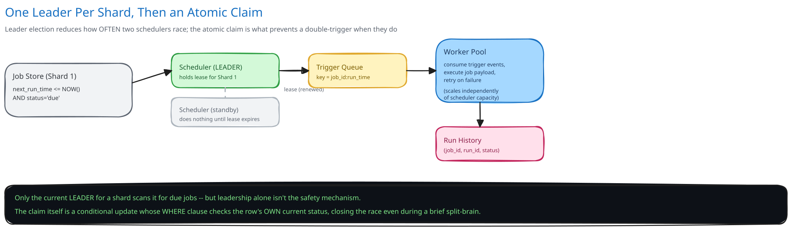

# Module 01 — Architecture & High-Level Design

**Job store** — holds job definitions, each with an indexed `next_run_time` (cross-ref [Database Indexing](../../database-design/database-indexing.md) — this index is this entire system's most important one: "find jobs due now" is the query the whole design exists to answer quickly).

**Scheduler tier, leader-elected per shard** — the job store is partitioned into shards (cross-ref [Data Partitioning & Sharding](../../hld-building-blocks/data-partitioning-sharding.md)), and exactly ONE scheduler instance is the active leader for each shard at a time (cross-ref [Replication & Consensus](../../hld-building-blocks/replication-consensus.md) for the leader-election mechanism, and [Distributed Locks](../../scalability-resilience/distributed-locks.md) for the lease that backs it — a time-bounded lease a scheduler instance must keep renewing to remain "the" leader for its shard). Only the current leader for a shard scans that shard for due jobs — this is what prevents two scheduler instances from both noticing the same due job and triggering it twice.

**Trigger queue and worker pool** — a claimed, due job is published as a trigger event to a queue (cross-ref [Message Queues & Pub/Sub](../../hld-building-blocks/message-queues-pubsub.md)), and a separate, horizontally-scaled worker pool consumes trigger events and actually executes the job payload, independently of the scheduler's own capacity.

**Run history store** — every trigger's outcome (success, failure, retry count) is recorded separately from the job definition itself, matching the reasoning this guide's [payments case study](../payments-system/00-overview.md) uses for keeping a payment's lifecycle separate from the order's: a job definition's identity and a specific run's outcome are different things with different retention needs.

**Load Handling.** The defining load risk here is triggers clustering at round-number boundaries (many jobs scheduled for "the top of the hour") rather than smooth arrival — the scheduler claims and dispatches due jobs in small batches with a cap per scan interval, so a burst of 50,000 simultaneously-due jobs is drained over several seconds rather than attempting to trigger all of them in the same instant and overwhelming the worker pool or the trigger queue. [Backpressure, Load Shedding & Bulkheads](../../scalability-resilience/backpressure-load-shedding.md) applies directly to the worker pool: if workers fall behind, the trigger queue absorbs the backlog (a job firing a few seconds late is acceptable per this system's own latency requirement) rather than the scheduler dropping triggers to keep up.

**Concurrent-User Handling.** The core race is exactly the one leader election exists to prevent: two scheduler instances both believing they're the leader for the same shard (a split-brain during a slow failover) and both claiming the same due job. This is closed at the CLAIM itself, not just at the leadership layer: claiming a due job is an atomic conditional update (`UPDATE jobs SET status='claimed', claimed_by=? WHERE id=? AND status='due'`) — even if a split-brain briefly produces two "leaders," only one of their claim attempts can succeed, because the row's own current state is part of the `WHERE` clause, the identical mechanism this guide's [e-commerce schema](../../database-design/ecommerce-schema-worked-example.md) uses for the inventory-decrement race. Leader election reduces how OFTEN this race happens; the atomic claim is what actually prevents a double-trigger when it does.
