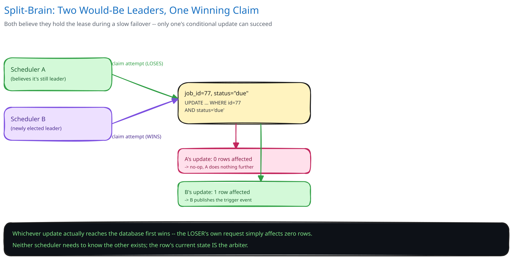
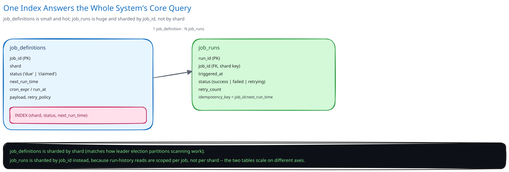

# Design a Distributed Job Scheduler


## Requirements

**Functional:**
- Schedule one-off jobs (`run_at`) and recurring jobs (a cron-style expression).
- Trigger each scheduled job **exactly once** per scheduled time — not zero times (a missed trigger) and not more than once (a duplicate trigger), even with multiple scheduler instances running for availability.
- Execute the triggered job reliably, retrying on failure, and record the run's outcome.

**Non-functional** (stated as assumptions, interview-style):
- Millions of scheduled jobs across all tenants.
- Trigger accuracy within a few seconds of the scheduled time — this isn't a hard-realtime system, but "an hour late" is a bug, not a rounding error.
- The scheduler itself must be highly available; it cannot be a single process that takes every scheduled job down with it if it crashes.

## Capacity Estimation

Using this guide's [back-of-envelope method](../../foundations/back-of-envelope-estimation.md):

- **Job volume:** 5M active job definitions, with an average trigger interval of roughly once per hour: 5M / 3,600 ≈ **~1,400 triggers/sec** average.
- **Peak clustering:** many recurring jobs are scheduled on round boundaries (every job set to "top of the hour" all firing in the same second) — the real peak can be a large multiple of the average within a single second, which is why the design below claims and dispatches due jobs in small batches rather than assuming triggers are ever smoothly spread out.
- **Job-run history:** if each trigger produces one run record retained for 90 days: 1,400/sec x 86,400 x 90 ≈ **~10.9B run records** — large enough that run history needs its own scaling story, separate from the much smaller table of active job definitions.

## Approach Walkthrough

Each job definition stores its own `next_run_time`. A scheduler component continuously looks for job definitions whose `next_run_time` has passed, claims them, and hands each one off to a worker pool for actual execution — then computes and stores the job's NEXT `next_run_time` (for recurring jobs) so the same job is found and triggered again at its next scheduled time. The scheduler's job is purely "notice it's due and hand it off exactly once"; the worker pool's job is "actually run it, with retries."

## API Surface

- `POST /jobs {cron_expr | run_at, payload, retry_policy}` -> `{job_id}`
- `DELETE /jobs/{job_id}` — cancel a scheduled job.
- `GET /jobs/{job_id}/runs` -> `[{run_id, status, started_at, finished_at}]`

## High-Level Design

**Job store** — holds job definitions, each with an indexed `next_run_time` (cross-ref [Database Indexing](../../database-design/database-indexing.md) — this index is this entire system's most important one: "find jobs due now" is the query the whole design exists to answer quickly).

**Scheduler tier, leader-elected per shard** — the job store is partitioned into shards (cross-ref [Data Partitioning & Sharding](../../hld-building-blocks/data-partitioning-sharding.md)), and exactly ONE scheduler instance is the active leader for each shard at a time (cross-ref [Replication & Consensus](../../hld-building-blocks/replication-consensus.md) for the leader-election mechanism, and [Distributed Locks](../../scalability-resilience/distributed-locks.md) for the lease that backs it — a time-bounded lease a scheduler instance must keep renewing to remain "the" leader for its shard). Only the current leader for a shard scans that shard for due jobs — this is what prevents two scheduler instances from both noticing the same due job and triggering it twice.

**Trigger queue and worker pool** — a claimed, due job is published as a trigger event to a queue (cross-ref [Message Queues & Pub/Sub](../../hld-building-blocks/message-queues-pubsub.md)), and a separate, horizontally-scaled worker pool consumes trigger events and actually executes the job payload, independently of the scheduler's own capacity.

**Run history store** — every trigger's outcome (success, failure, retry count) is recorded separately from the job definition itself, matching the reasoning this guide's [payments case study](../payments-system/README.md) uses for keeping a payment's lifecycle separate from the order's: a job definition's identity and a specific run's outcome are different things with different retention needs.

**Load Handling.** The defining load risk here is triggers clustering at round-number boundaries (many jobs scheduled for "the top of the hour") rather than smooth arrival — the scheduler claims and dispatches due jobs in small batches with a cap per scan interval, so a burst of 50,000 simultaneously-due jobs is drained over several seconds rather than attempting to trigger all of them in the same instant and overwhelming the worker pool or the trigger queue. [Backpressure, Load Shedding & Bulkheads](../../scalability-resilience/backpressure-load-shedding.md) applies directly to the worker pool: if workers fall behind, the trigger queue absorbs the backlog (a job firing a few seconds late is acceptable per this system's own latency requirement) rather than the scheduler dropping triggers to keep up.

**Concurrent-User Handling.** The core race is exactly the one leader election exists to prevent: two scheduler instances both believing they're the leader for the same shard (a split-brain during a slow failover) and both claiming the same due job. This is closed at the CLAIM itself, not just at the leadership layer: claiming a due job is an atomic conditional update (`UPDATE jobs SET status='claimed', claimed_by=? WHERE id=? AND status='due'`) — even if a split-brain briefly produces two "leaders," only one of their claim attempts can succeed, because the row's own current state is part of the `WHERE` clause, the identical mechanism this guide's [e-commerce schema](../../database-design/ecommerce-schema-worked-example.md) uses for the inventory-decrement race. Leader election reduces how OFTEN this race happens; the atomic claim is what actually prevents a double-trigger when it does.

## Low-Level Design



**Claim-and-dispatch loop**, pseudocode (run only by the current shard leader):
```
Scheduler.tick():
    if not haveValidLease(shard_id):
        return   # not the leader right now; do nothing

    due_jobs = JobStore.query(
        "next_run_time <= NOW() AND status = 'due' AND shard = ?", shard_id,
        limit=BATCH_SIZE)   # bounded batch, not unbounded

    for job in due_jobs:
        claimed = JobStore.updateIf(job.id, status='claimed', where="status='due'")
        if not claimed:
            continue   # another process already claimed it; not our race to win

        TriggerQueue.publish(job.id, job.payload, idempotency_key=f"{job.id}:{job.next_run_time}")
        job.next_run_time = computeNext(job.cron_expr)   # recurring jobs only
        JobStore.update(job.id, status='due', next_run_time=job.next_run_time)
```
The `idempotency_key` combining `job_id` and the SPECIFIC scheduled time it fired for (not just `job_id` alone) is what lets a worker safely retry a trigger without worrying it's silently re-triggering a DIFFERENT scheduled occurrence of the same recurring job (cross-ref [Idempotency Keys](../../scalability-resilience/idempotency-keys.md)).

**Missed-schedule catch-up**: if the scheduler itself was down when a job was due (not a worker failure — the scheduler process itself unavailable), the job's `next_run_time` is simply still in the past once a leader resumes scanning, and it's picked up and triggered on the next tick, no different from any other due job — the design doesn't need special catch-up logic because "overdue" is just a more extreme case of "due."

## Database Design & Scaling



- **Job definitions:** `(job_id, cron_expr/run_at, next_run_time, status, shard, retry_policy)` — indexed on `(shard, status, next_run_time)`, the composite index this system's core query actually needs (cross-ref [Database Indexing](../../database-design/database-indexing.md)'s leftmost-prefix reasoning: filter by shard first, then status, then range-scan the due timestamps).
- **Job runs:** `(run_id, job_id, triggered_at, status, retry_count)` — sharded separately, by `job_id`, since run-history queries ("this job's recent runs") are scoped per job, not per shard.
- **Scaling the scheduler itself:** more shards means more parallel leaders, each independently scanning a smaller slice of job definitions — the job store's sharding is what lets scheduling throughput scale horizontally, the same reasoning [Data Partitioning & Sharding](../../hld-building-blocks/data-partitioning-sharding.md) applies generally.

## Interviewer Q&A

**What happens when two requests hit the same resource at the same instant?**
Two scheduler processes racing to claim the same due job — whether from a brief split-brain during leader failover or any other overlap — resolve at the atomic claim: `UPDATE ... WHERE status='due'` only ever succeeds for the first claimant, because the row's current status is part of the update's own condition, not checked separately beforehand.

**What happens when traffic spikes 10x for an hour?**
This system's real spike shape is a burst of simultaneously-due jobs (a round-number-time cluster), not sustained load — bounded-batch claiming caps how many jobs any one scheduler tick dispatches, and the trigger queue absorbs whatever the worker pool can't immediately execute, so the burst is drained over a few extra seconds rather than triggering a worker-pool overload.

**How would you handle clock skew between scheduler instances?**
Rely on the database's own clock for "is this job due" (the `next_run_time <= NOW()` comparison happens inside the job store's query, using one authoritative clock) rather than trusting each scheduler instance's local clock — this sidesteps skew between scheduler processes entirely, since none of them are the source of truth for "now."

**How would you guarantee exactly-once triggering, given the claim is only atomic, not distributed-transactional with the trigger queue publish?**
Full exactly-once here would need the claim and the publish to be one atomic unit spanning two systems, which this guide's [Transactional Outbox](../../hld-building-blocks/transactional-outbox-cdc.md) pattern solves for exactly this shape of problem: write the "trigger this job" event into an outbox row in the SAME transaction as the claim, and let a relay publish it — turning "exactly-once claim, best-effort publish" into "exactly-once claim AND publish," at the cost of the outbox's own relay delay.

**Would you use a distributed lock instead of leader election for each shard?**
They're solving related but different problems: leader election designates one long-lived owner for an entire shard's ongoing scanning work; a distributed lock (cross-ref [Distributed Locks](../../scalability-resilience/distributed-locks.md)) is better suited to a single, short operation. Using a lock for continuous shard ownership would mean constantly re-acquiring it, which is exactly what a lease-based leader election already manages more cheaply.

**How would you support a job that must run on a SPECIFIC worker (not any available one)?**
Add a routing key to the trigger event and have the worker pool's consumers filter or partition by it (cross-ref [Message Queues & Pub/Sub](../../hld-building-blocks/message-queues-pubsub.md)'s point about partition keys controlling which consumer sees which message) rather than changing anything about how the scheduler claims and dispatches — the scheduler doesn't need to know or care which specific worker eventually executes a job.

**What happens if a job's execution takes longer than its own scheduled interval (a job scheduled every minute that takes 90 seconds to run)?**
This is a worker-pool concurrency policy decision, not a scheduler decision: either allow overlapping runs of the same job (if genuinely safe) or explicitly skip/queue the next trigger until the current run finishes — but the SCHEDULER's job of noticing "due" and dispatching stays the same either way; the overlap policy lives with whichever component actually executes the job.

**How would you let a user retroactively change a recurring job's schedule?**
Update the job definition's `cron_expr` and recompute `next_run_time` from it — since the scheduler always reads `next_run_time` fresh from the job store on every tick rather than caching a schedule in memory, a schedule change takes effect on the very next tick without any special invalidation logic.
