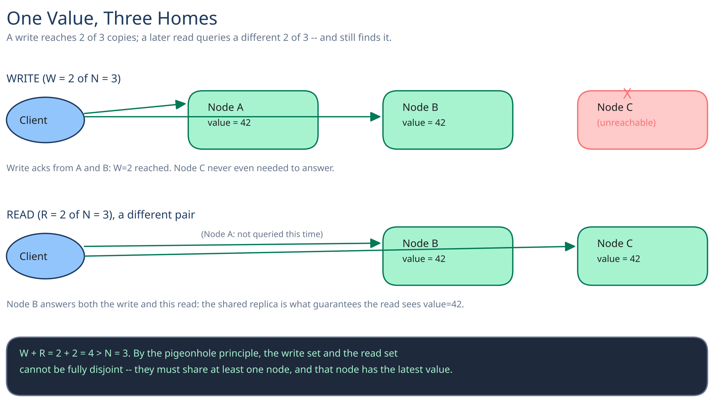

# Module 00 — Feature Overview



A key-value store that keeps running, correctly, when a machine holding your data simply disappears. No queries, no joins, no schema — just `put`, `get`, `delete` against an opaque blob, addressed only by its key. The one hard rule everything else in this module exists to protect: **no single node failure should lose data or block the store**, and unlike a system that hard-codes "strongly consistent" or "eventually consistent," this one leaves that dial tunable per operation.

## Requirements

**Functional:**
- `put(key, value)` — write or overwrite a value.
- `get(key)` — read the current value.
- `delete(key)` — remove a value.

**Non-functional** (stated as assumptions, interview-style):
- Tens of millions of distinct keys.
- A few hundred thousand operations/sec at peak.
- No single node failure loses data or blocks reads/writes to unaffected keys.
- Consistency is a per-operation dial, not a fixed system-wide guarantee — a caller can ask for more of it and pay more latency, or less of it and stay available through almost anything.

This is the Dynamo-style design: prioritize availability and horizontal scale over the strong guarantees a relational store defaults to (cross-ref [SQL vs NoSQL](../../database-design/sql-vs-nosql.md) — this is the query-pattern-driven case for the "vs NoSQL" side: the access pattern is a pure key lookup, nothing here needs a join).

## Capacity Estimation

Using this guide's [back-of-envelope method](../../foundations/back-of-envelope-estimation.md):

- **Keys:** 50M distinct keys, average value size 1KB → 50GB of raw value data.
- **Replication factor N=3** (survives up to 2 node failures without losing a key) → ~150GB of total stored bytes across the cluster.
- **Ops/sec, average:** assume a 10:1 read:write ratio (typical for a KV store backing reads-heavy services) and ~50,000 writes/sec average → **~500,000 reads/sec average**.
- **Peak (3x factor):** ~150,000 writes/sec, ~1.5M reads/sec — the number the quorum mechanism and node count both have to absorb.
- **Per-node share:** with 3-way replication and, say, 30 storage nodes, each node holds roughly 150GB / 30 ≈ 5GB and serves its share of both the primary and replica traffic for its ring segment.

## Approach Walkthrough

Every key hashes onto a ring (cross-ref [Consistent Hashing](../../hld-building-blocks/consistent-hashing.md)); its value replicates to the **N consecutive nodes clockwise** from that position, not just one. A write succeeds once `W` of those `N` replicas acknowledge it; a read queries `R` replicas and returns the newest value among them. Pick `W` and `R` so their sum exceeds `N` and every read is guaranteed to overlap the most recent write — that single arithmetic fact, not a special protocol, is what makes `get()` right after `put()` reliably see its own write.

## API Surface

```
PUT   /keys/{key}          body: { value: bytes, client_version?: vector_clock }
GET   /keys/{key}          -> { value: bytes, version: vector_clock } | { versions: [...] } if concurrent siblings exist
DELETE /keys/{key}
```

Internal, node-to-node (not client-facing):

```
POST /internal/replicate   { key, value, version }         -- coordinator -> replica, one per replica in the write's N
POST /internal/hint        { key, value, version, for_node } -- hinted handoff delivery
```
