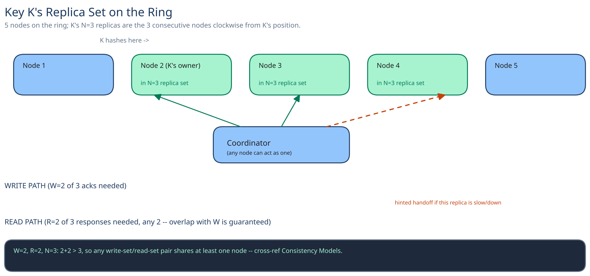

# Module 01 — Architecture & High-Level Design

## Monolith vs. microservices

There's no "monolith" version of this to compare against — a key-value store is never a feature bolted onto an app service, it's the storage tier other services depend on. The real seam question is different: why is this its own dedicated cluster, with its own membership/gossip and anti-entropy protocol, rather than just "a table" inside whatever relational database the rest of the system already runs? Because this tier is *always* doing background work regardless of request volume — replicating hinted writes, running read repair, gossiping node liveness — the same reasoning this guide's [Distributed Job Scheduler](../distributed-job-scheduler/01-architecture-hld.md) uses for why a continuously-active tier can't share capacity with a request-response service without one starving the other's latency budget.

## Building blocks

| Block | Role |
|---|---|
| **Coordinator** (stateless, any node can act as one for any request) | Receives a client's `put`/`get`, hashes the key, fans out to the `N` replica nodes on the ring, and applies the `W`/`R` quorum rule to decide success |
| **Storage node** | Holds a local, indexed key-value store for its ring segment (cross-ref [Database Indexing](../../database-design/database-indexing.md) — each node's local lookup is a plain indexed point-read, the ring is what makes the *cluster-wide* lookup fast) |
| **Membership / gossip layer** | Every node's view of which nodes are up, and their ring positions — cross-ref [Replication & Consensus](../../hld-building-blocks/replication-consensus.md) for how nodes agree on this without a single point of failure |
| **Hinted-handoff store** | Temporarily holds a write meant for a node that's down, delivered once that node recovers |
| **Conflict resolver** | Decides which version wins (or that both survive as siblings) when replicas disagree — last-write-wins or version vectors, see Low-Level Design |

## Per-path walkthrough

**Write path** — `Client → Coordinator (any node) → hash key onto ring → fan out to N replicas in parallel → wait for W acks → return success to client`. A replica that's down at fan-out time doesn't block the write — cross-ref hinted handoff below — it just doesn't contribute to the `W` count.

**Read path** — `Client → Coordinator → fan out to R replicas → compare versions → return newest (LWW) or all concurrent versions (version vectors) → if replicas disagreed, read repair patches the stale one in the background`.

**Hinted-handoff path (async)** — `Write's target replica is down at write time → another node in the write's fan-out holds the write as a "hint" → target node rejoins (gossip detects it) → hint is replayed directly to the recovered node → hint is discarded`. This keeps the write durable without blocking the client on a node that might be down for minutes.

## Trade-offs to make explicit

| Decision | Chosen | Alternative | Why |
|---|---|---|---|
| Conflict resolution | Tunable — LWW by default, version vectors when losing a write silently is unacceptable | Always version vectors | Version vectors push conflict resolution onto every caller, even ones that don't care; LWW is the right default and the exception should be deliberate, not universal |
| Consistency level | `W`/`R` chosen per-operation | A single fixed consistency level for the whole store | Different keys have different tolerance for staleness — forcing one system-wide choice wastes availability on data that didn't need strong consistency, or risks data that did |
| Replica placement | Consistent hashing ring, `N` consecutive nodes | A centralized placement service assigning replicas | A central placement service is one more thing that can go down and block every write; the ring computes placement locally from the key alone, no lookup needed |
| Failure handling | Hinted handoff (write still lands, elsewhere, temporarily) | Reject the write if any target replica is down | Rejecting turns a transient single-node blip into an availability outage for every key on that node's ring segment — exactly what "no single node failure should block the store" rules out |
| Node membership | Gossip-based (nodes tell each other) | A centralized membership service | Cross-ref [Replication & Consensus](../../hld-building-blocks/replication-consensus.md) — a centralized service is a single point of failure for the one piece of information every other decision in this system depends on |

## Load Handling

- **Peak-vs-average tolerance:** the 3x peak factor from Capacity Estimation (~150K writes/sec, ~1.5M reads/sec) is absorbed by adding storage nodes — both reads and writes scale roughly linearly with node count, since the coordinator role has no central bottleneck (any node can coordinate any request).
- **Where backpressure kicks in first:** at the coordinator's per-node connection/request queue to its `N` replicas — if a specific replica is consistently slow rather than down, the coordinator's bounded-timeout fan-out simply proceeds with whichever `W`/`R` replicas answer first, rather than waiting on the slow one.
- **What gets shed under overload:** nothing is silently dropped; a request that can't reach `W` (or `R`) replicas in time fails cleanly back to the client rather than being accepted and quietly under-replicated.
- **Autoscaling:** adding a storage node is a ring-join operation (cross-ref [Consistent Hashing](../../hld-building-blocks/consistent-hashing.md)) — only the new node's ring neighbors need to hand off data to it, not a full-cluster reshuffle, so capacity can be added incrementally under load.
- **Load-test target:** sustain 150,000 writes/sec and 1.5M reads/sec for 10 minutes with zero requests silently under-replicated (every write either reaches `W` acks or fails cleanly) and p99 read/write latency inside the store's own SLA.

## Concurrent-User Handling

| Race | Mechanism | What the "loser" sees |
|---|---|---|
| Two clients write the same key concurrently, landing on two different replicas before either write propagates | Version vectors detect the two writes are concurrent (neither happened-before the other) rather than silently picking one | Both versions are returned together on the next `get()` — the client sees both, not a silent overwrite (under LWW instead, the later timestamp wins and the other write is gone with no signal) |
| A hinted-handoff replay lands on a recovered replica at the same moment a fresh, direct write for the same key arrives | Both writes carry version metadata; the replica's local store treats them as concurrent writes to the same key, resolved the same way any concurrent write is (LWW timestamp or version-vector merge) — not a special case | Whichever version the resolution rule keeps is what a subsequent read sees; the "loser" (LWW) or "sibling" (version vectors) is handled identically to any other concurrent-write race |
| Read repair patches a replica's stale value at the same moment a new write arrives at that same replica | The replica's local write path is a single serialized point-update per key (the same guarantee any single-node store gives); whichever operation's write lands last on that replica wins locally, and the coordinator's own version comparison at read time is what actually determines the answer returned to the client, not which local write happened to land first | The stale-repair write is simply superseded by the newer write if the newer one lands after it locally — no corruption, just an ordinary last-write on one replica, resolved the normal way at the next read |

## Scaling & Reliability

- **Horizontal scaling:** adding nodes to the ring is the whole scaling story — cross-ref [Consistent Hashing](../../hld-building-blocks/consistent-hashing.md) for why a join only disrupts one ring neighbor's slice, not a global reshuffle.
- **Circuit breaker:** a coordinator that repeatedly fails to reach a specific replica within its fan-out timeout stops including that replica in new requests' `W`/`R` counts for a cooldown window (cross-ref [Circuit Breakers & Retries](../../scalability-resilience/circuit-breakers-retries.md)), relying on the other `N-1` replicas in the meantime.
- **Retries:** a coordinator retries a replica that timed out exactly once, with a short backoff, before falling back to hinted handoff — retrying indefinitely against a genuinely down node would just delay the response the client is waiting on.
- **Dead-letter queue:** a hint that fails to replay after repeated attempts (the target node never actually recovers) is flagged for manual/administrative cleanup rather than held forever.
- **Graceful degradation:** losing up to `N-1` replicas for a given key degrades that key's consistency guarantees (fewer replicas available for `W`/`R`) but never makes it fully unavailable as long as at least one replica is reachable and the caller accepts `W=1`/`R=1`.
- **Multi-region:** not built here — see below.

## What you'd revisit as this grows

- **Multi-region replication.** This design assumes one region; a real Dynamo-style deployment replicates across regions too, which reopens the LWW-vs-version-vector question at a much higher latency (cross-region RTT, cross-ref [Latency, Throughput & the CAP Theorem](../../foundations/latency-throughput-cap.md)) and a much higher chance of genuine concurrent writes.
- **Large values.** A multi-megabyte value replicated to `N` nodes on every write is expensive — cross-ref [Object / Blob Storage](../../scalability-resilience/object-blob-storage.md) for storing the actual bytes elsewhere and replicating only a pointer through this system.
- **Anti-entropy beyond read repair.** Read repair only fixes drift on keys that are actually read; a mature system runs a background Merkle-tree comparison between replicas to catch drift on cold keys nobody's read in a while.
- **Per-key consistency policy as a first-class setting**, rather than a per-call `W`/`R` choice the caller has to remember every time.
