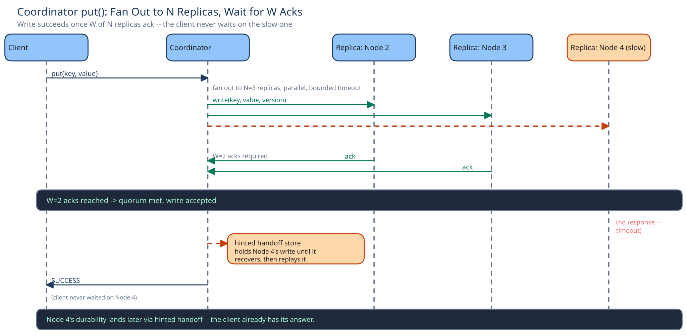

# Module 02 — Low-Level Design



## Interfaces vs. implementations

- **`Coordinator`** — the entry point for a client request. Owns the fan-out-and-quorum logic; knows nothing about *how* a replica stores a value, only that it can `write(key, value, version)` and `read(key)` one.
- **`RingLocator`** *(interface)* → **`ConsistentHashRing`** — given a key, returns the ordered list of `N` node addresses responsible for it.
- **`ConflictResolver`** *(interface)* → **`LastWriteWinsResolver`** / **`VersionVectorResolver`** — given two or more versions of a value read from different replicas, decides what to return to the caller.
- **`ReplicaClient`** *(interface)* → **`GrpcReplicaClient`** — the coordinator's handle to one specific replica node; `write()`/`read()` over the network, with its own bounded timeout.

Swapping `LastWriteWinsResolver` for `VersionVectorResolver` — or adding a third strategy later — never touches `Coordinator`, which is the entire point of naming it as its own interface rather than an `if` branch inside the coordinator's read path.

## Pseudocode for the two methods that matter

```
Coordinator.put(key, value):
    replicas = ringLocator.replicasFor(key)          # N nodes, in ring order
    version = versionClock.next(key)                  # new vector-clock entry for this write
    acks = 0
    for replica in replicas (parallel, bounded timeout):
        try:
            replica.write(key, value, version)
            acks += 1
        except Timeout:
            hintedHandoffStore.holdFor(replica, key, value, version)   # write still lands, elsewhere
    if acks >= W:
        return SUCCESS
    raise InsufficientReplicas   # never silently accept an under-replicated write as success

Coordinator.get(key):
    replicas = ringLocator.replicasFor(key)
    responses = []
    for replica in replicas[:some order] (parallel, bounded timeout, stop once R responded):
        responses.append(replica.read(key))
    if len(responses) < R:
        raise InsufficientReplicas
    result = conflictResolver.resolve(responses)      # LWW winner, or all concurrent siblings
    if responses disagree:
        readRepair.patchStaleReplicas(key, result)     # fire-and-forget, doesn't block the response
    return result
```

Two error cases worth designing for deliberately, not as an afterthought:

- **Fewer than `W`/`R` replicas reachable:** the coordinator raises `InsufficientReplicas` rather than quietly succeeding with fewer acks/reads than the caller asked for — silently downgrading a `W=3` write to "2 acks, close enough" is exactly the kind of unstated surprise this guide warns against elsewhere.
- **Read responses disagree:** this is not an error — it's the normal case that triggers read repair. Only a *failure to reach enough replicas at all* is the error condition; disagreement among reachable replicas is what the conflict resolver exists to handle.

## Concurrency at the code level

The coordinator's fan-out to `N` replicas needs no application-level lock: each replica's `write()`/`read()` call is independent, and the coordinator simply counts responses — there's nothing shared between the parallel calls that a lock would protect. The actual serialization happens one level down, inside each replica's own local store, which is a single-process, single-writer-per-key store the same way any embedded key-value engine is — that local atomicity is what the whole distributed design leans on rather than re-implementing.

## Design patterns you just used, named

- **Strategy pattern** — `ConflictResolver` is a strategy: LWW and version-vector resolution are two interchangeable implementations behind the same interface.
- **Facade pattern** — `Coordinator` is a facade over the fan-out/quorum/conflict-resolution machinery; a client calls `put`/`get` and never sees the `N` individual replica calls underneath.

## Practice: extend it yourself

1. **Multi-key transactions** — a caller wants to `put` two keys atomically (both succeed or neither does). Which part of this design breaks first, and why doesn't the quorum mechanism help here?
2. **Range scans** — a caller wants "all keys starting with `user:123:`" instead of a single-key lookup. Why doesn't the consistent-hashing ring make this cheap the way it makes single-key lookup cheap?

There's no single right answer to either — the point is noticing that both push against decisions this module made deliberately (single-key atomicity, no ordering guarantee across keys) rather than accidentally.
