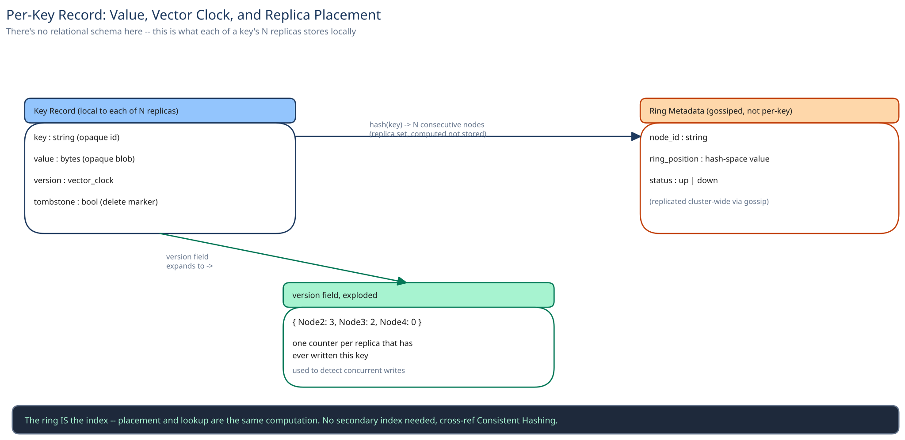

# Module 03 — Database Design

## From entities to schema

This system doesn't have a relational schema — it *is* the database, so "schema" here means the actual per-key record every replica stores locally, and the ring metadata that decides where each key lives:

- **Key record** (stored locally on each of a key's `N` replicas): `key`, `value` (opaque bytes), `version` (a vector clock — one counter per replica that has ever written this key), `tombstone` (a delete marker, not an immediate physical delete — see below).
- **Ring metadata** (replicated to every node via gossip, not stored per-key): the ordered list of node positions on the hash ring, used to compute a key's `N` replicas locally without a lookup.

### Why a vector clock rides alongside the value, not in a separate table

Conflict detection has to happen at read time, per key, comparing whatever versions came back from the replicas queried — joining out to a separate version-history table on every read would defeat the entire point of a fast point-lookup store. Keeping the version inline with the value is the same reasoning this guide's [E-Commerce Schema](../../database-design/ecommerce-schema-worked-example.md) module uses for denormalizing `orders.total_amount`: the two pieces of data are always read together, so they live together.

### Why deletes are tombstones, not physical removals

A `delete()` writes a tombstone record (same replication path as a normal write) rather than immediately removing the key from a replica's local store. If a delete propagated to 2 of 3 replicas and then the coordinator failed, the third replica's stale value could otherwise "resurrect" the deleted key the next time it's read or gossiped. A tombstone is just a value that means "deleted," replicated and conflict-resolved exactly like any other write, and physically purged later by a background compaction pass once it's replicated everywhere.

## Indexes

There's no secondary index in the traditional sense — the ring itself *is* the index for "which node(s) own this key" (an O(1) hash computation, cross-ref [Data Partitioning & Sharding](../../hld-building-blocks/data-partitioning-sharding.md)). Locally, each node indexes its own subset of keys with a standard local structure (an LSM-tree or B-tree, cross-ref [Database Indexing](../../database-design/database-indexing.md)) so its own point-lookup is fast — but that index only ever needs to cover the fraction of the keyspace this one node is responsible for, never the whole cluster.

## Consistency

- **Key/value data:** tunable per operation via `W`/`R` (cross-ref [Consistency Models](../../hld-building-blocks/consistency-models.md)) — this is the data the whole system is built to make *flexibly* consistent.
- **Ring/membership metadata:** must be strongly, eventually-but-quickly consistent across every node — cross-ref [Replication & Consensus](../../hld-building-blocks/replication-consensus.md). A node with a stale view of the ring computes the *wrong* replica set for a key, which is a correctness bug, not a tunable trade-off — this is why gossip protocols are designed to converge fast even though they're not linearizable.

## Scaling the schema

The "shard key" for this entire system is the key's own hash position on the ring — there's no separate sharding decision to make, because placement and indexing are the same mechanism. Adding capacity means adding a node to the ring (cross-ref [Consistent Hashing](../../hld-building-blocks/consistent-hashing.md)): only that node's immediate neighbors hand off a slice of their data to it, never a full-cluster rebalance. This is a genuinely different scaling story from a relational system with read replicas plus separately-sharded write capacity — here, the one mechanism does both, because every node is simultaneously a shard owner and (for the keys it doesn't own) unused capacity waiting to be assigned a ring slice.

## Connecting it back

Look at the chain end to end: the non-functional requirement ("no single node failure should lose data") is why replication factor `N` exists at all; the architecture's quorum mechanism (`W`/`R`) is what turns that replication into a tunable consistency guarantee instead of an all-or-nothing one; the LLD's `ConflictResolver` interface is what makes "which version is current" a swappable policy instead of hard-coded logic; and this module's vector-clock-inline-with-value decision is what makes that policy actually able to detect a conflict in the first place. Change any one link — say, drop to `N=1` — and every layer above it stops making sense, which is exactly the kind of chain this guide's case studies are built to make visible.
