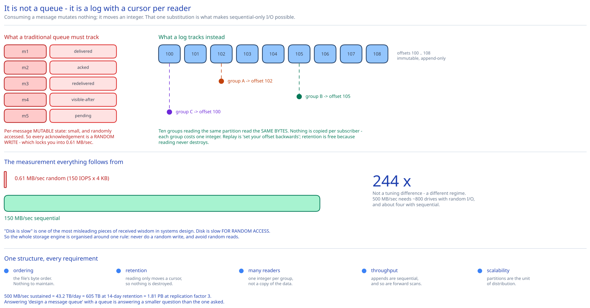

# Module 00 — Overview



> The guide already has [Kafka & the Distributed Log](../../hld-building-blocks/kafka-distributed-log.md) as a building block — what a log *is*, and how to use one. This case study **designs** one: the on-disk format, the replication protocol, the rebalancing dance, and where exactly-once actually comes from.

## The feature, with no infrastructure in it yet

Producers send messages. Consumers receive them. That's it — the whole interface is `send(topic, message)` and `poll()`.

What makes it a hard design problem is a set of requirements that a naive queue satisfies trivially and a *useful* one does not:

- **Messages are retained after being consumed**, for two weeks. A classic queue deletes on acknowledgement; this one keeps everything, so a second consumer can read the same messages independently, and a broken consumer can be fixed and replayed from where it went wrong. Retention is the single requirement that changes the design most.
- **Order is preserved.** Messages for the same key come out in the order they went in.
- **Throughput is enormous but latency requirements vary wildly.** Log aggregation wants millions of messages/sec and tolerates 100ms. An order-processing pipeline wants 5ms and sends 100/sec. The same system must serve both, tuned rather than rewritten.

Those three pull hard against each other. Retention plus ordering plus high throughput is what forces the central architectural move: **the queue is not a queue at all, it's an append-only log with a cursor per reader.** Everything else follows.

## Requirements

**Functional:**
- Producers publish to a **topic**; consumers subscribe to a topic.
- Messages can be consumed **repeatedly** by independent **consumer groups**, each with its own position.
- **Ordering** guaranteed within a partition (and therefore per partition key).
- **Retention** of two weeks, then truncation. Historical data can be replayed from any point.
- Message size in the **kilobytes**; text or opaque binary.
- **Configurable delivery semantics**: at-most-once, at-least-once, exactly-once.
- Support both **point-to-point** (each message to exactly one consumer in a group) and **publish-subscribe** (each message to every group).

**Non-functional:**
- **Throughput:** 500 MB/sec sustained ingest ≈ **500,000 messages/sec** at 1 KB.
- **Latency:** configurable — sub-10ms p99 when tuned for latency, 100ms+ acceptable when tuned for throughput. Explicitly a **tuning axis, not a fixed target**, and the mechanism that makes it a dial is batching ([Module 02](./02-storage-engine.md#batching-is-the-whole-performance-story)).
- **Durability:** a message acknowledged to a producer must survive broker failure. Persisted to disk and replicated.
- **Availability:** a broker failure must not lose data or stall a partition for more than a few seconds.
- **Scalability:** adding brokers must add capacity without downtime or rebalancing all data.

## Messaging models, and why this design serves both

| | Point-to-point (traditional queue) | Publish-subscribe (event stream) |
|---|---|---|
| A message goes to | Exactly one consumer | Every subscriber |
| After consumption | Deleted | **Retained** |
| Replay possible? | No | Yes |
| Typical use | Work distribution, task queues | Event sourcing, log aggregation, CDC |
| Examples | RabbitMQ, SQS, ActiveMQ | Kafka, Pulsar |

The design insight worth leading with: **you don't need two systems.** A retained log with a per-group cursor gives you publish-subscribe natively (many groups, many cursors), and point-to-point falls out as the special case of *one* group whose partitions are divided among its members. Deletion-on-acknowledge is then not a feature you implement but a retention policy you configure.

That's why the log is the more general primitive, and why "design a message queue" answered with a queue is answering a smaller question than the one asked.

## Capacity Estimation

Method from [Back-of-the-Envelope Estimation](../../foundations/back-of-envelope-estimation.md).

**Ingest and storage**
- 500 MB/sec sustained = **43.2 TB/day**.
- 14-day retention = **605 TB** of unique data.
- At replication factor 3: **1.81 PB** of raw disk.
- At 1 KB average message size that's **~488,000 messages/sec**.

**The number that decides the storage engine.** Compare disk access patterns on the commodity spinning disks that make 1.8 PB affordable:

| Access pattern | Throughput |
|---|---|
| Random reads/writes (150 IOPS × 4 KB) | **0.61 MB/sec** |
| Sequential reads/writes | **~150 MB/sec** |

**Sequential is ~244× faster than random on identical hardware.** The 500 MB/sec requirement is flatly impossible with random I/O — you'd need 800 drives just for the write path — and comfortably achievable with sequential I/O on a handful. This one ratio is why the storage engine is an append-only log rather than any indexed structure, and it's worth deriving in an interview rather than asserting that "Kafka uses a log."

**Partition count**
- One partition is one append-only file per broker, sustaining ~50 MB/sec conservatively (leaving disk headroom for reads and replication).
- 500 MB/sec ÷ 50 MB/sec = **10 partitions minimum for write throughput.**
- But partition count also caps **consumer parallelism**: at most one consumer per partition per group ([Module 04](./04-consumers-delivery.md#why-partitions-cap-consumer-parallelism)). So a topic wanting 100 parallel consumers needs ≥ 100 partitions.
- Partition count is therefore driven by the *larger* of throughput need and desired consumer parallelism — and since [reducing it later is genuinely hard](./04-consumers-delivery.md#changing-partition-count), over-provisioning to ~100 is the right default.

**Syscall budget — why batching isn't optional.** At 488k messages/sec, one syscall per message is 488k syscalls/sec on the write path alone, plus the same again on network sends. Batching 16 KB at a time (≈16 messages) cuts that to **~31k/sec**, a 16× reduction, and simultaneously makes the disk writes larger and more sequential. Batching is doing two jobs at once, which is why it's the primary tuning dial.

## Approach Walkthrough

A **topic** is split into **partitions**. Each partition is an **append-only log** stored as a sequence of segment files on disk. A producer picks a partition (by hashing a key, or round-robin) and appends. A consumer holds an **offset** — a position in the partition — and reads forward from it.

That's the whole model, and every requirement maps onto it directly:

- **Ordering** — within a partition, order is the file's byte order. Nothing to maintain. Across partitions there's no ordering, which is the deliberate cost of parallelism; a partition key is how you buy ordering back for the messages that need it.
- **Retention and replay** — messages aren't deleted on read because reading only moves a cursor. Replay is "set your offset backwards."
- **Multiple independent consumers** — each group has its own offset. Nothing is copied per subscriber; ten groups reading the same partition read the same bytes.
- **Throughput** — appends are sequential, and reads are mostly sequential too (consumers scan forward), so both paths get the 244× win.
- **Scalability** — partitions are the unit of distribution. More partitions across more brokers means more parallel throughput.

The elegance is that **the consumer's position is data the consumer owns, not state the broker maintains per message.** A traditional queue tracks per-message delivery state (delivered? acknowledged? redelivered?), which is random-access mutable state and exactly what forces random I/O. Replacing it with one integer per partition per group is what collapses the entire problem into sequential file appends.

## API Surface

```
# Admin
POST   /topics                    { name, partitions, replication_factor, retention_ms }
GET    /topics/{name}             → { partitions[], leaders[], isr[] }
POST   /topics/{name}/partitions  { count }         # increase only; see Module 04

# Producer (binary protocol in practice; shown as RPC)
Produce(topic, partition?, key?, batch[], acks)     → { base_offset, error? }
        acks ∈ {0, 1, all}                          # the durability dial, Module 03
        partition defaults to hash(key) % n, or round-robin if key is null

# Consumer
JoinGroup(group_id, topics[], member_id?)           → { generation_id, assignment[], is_leader }
SyncGroup(group_id, generation_id, assignment?)     → { my_partitions[] }
Heartbeat(group_id, generation_id, member_id)       → { ok | REBALANCE_IN_PROGRESS }
Fetch(topic, partition, offset, max_bytes, max_wait_ms)  → { messages[], high_watermark }
CommitOffset(group_id, topic, partition, offset)    → { ok }
```

Three API details that carry design weight:

**`acks` is exposed to the producer, not chosen by the broker.** Durability is a per-message trade the *caller* is best placed to make: a metrics sample and a payment event have wildly different tolerance for loss. Hard-coding one value would force every workload onto the strictest requirement's latency. Detailed in [Module 03](./03-replication-isr.md#acknowledgement-levels-are-the-durability-dial).

**`Fetch` is a pull, with `max_wait_ms`.** The broker never pushes to consumers. This is a deliberate inversion of the obvious design, argued in [Module 04](./04-consumers-delivery.md#pull-not-push), and `max_wait_ms` is what stops pull from meaning "poll in a busy loop" — it's long polling (cross-ref [Long Polling, WebSockets & SSE](../../scalability-resilience/long-polling-websockets-sse.md)).

**`CommitOffset` is a separate call from `Fetch`.** The gap between them is where delivery semantics live: commit before processing and you get at-most-once; commit after and you get at-least-once. That the choice is *visible in the API* rather than hidden in a config flag is the point — it's a decision the consumer author must make consciously.

## Where this goes next

| Module | The question it answers |
|---|---|
| [01 · Architecture & HLD](./01-architecture-hld.md) | What are the boxes — brokers, coordination service, routing — and what does each own? |
| [02 · Storage Engine](./02-storage-engine.md) | **How is a partition stored so that 500 MB/sec is possible?** Segments, batching, zero-copy, page cache. |
| [03 · Replication & ISR](./03-replication-isr.md) | **How is an acknowledged message never lost?** In-sync replicas, ack levels, the high watermark, leader election. |
| [04 · Consumers & Delivery Semantics](./04-consumers-delivery.md) | **Where does exactly-once actually come from?** Consumer groups, the rebalance protocol, at-most/at-least/exactly-once. |
| [05 · State & Metadata Storage](./05-state-metadata-storage.md) | Where offsets and cluster metadata live, and why that store is a different shape from the log. |
| [06 · Interviewer Q&A](./06-interviewer-qna.md) | The ten follow-ups this design invites. |
