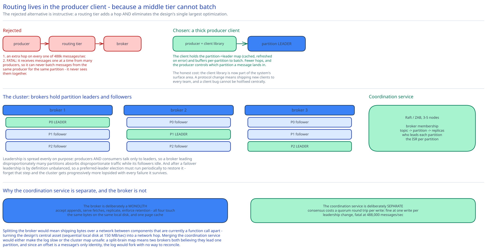

# Module 01 — Architecture & High-Level Design



## Monolith vs. microservices

**The broker is deliberately a monolith**, and this is one of the clearer cases in the guide where splitting would be actively wrong.

A broker does four things: accept appends, serve fetches, replicate to peers, and enforce retention. All four operate on the *same bytes on the same local disk*. Splitting them into separate services would mean shipping those bytes over a network between components that are currently a function call apart — turning the design's central asset (sequential local disk access at 150 MB/sec, [Module 00](./00-overview.md#capacity-estimation)) into a network hop. The whole performance argument depends on the write path, the read path, and the replication path all touching one page cache.

What *is* separated, and why each is a genuine boundary:

- **The coordination service** (ZooKeeper/etcd/Raft — cross-ref [Replication & Consensus](../../hld-building-blocks/replication-consensus.md)) is separate because it needs **linearizable consensus** while brokers need **throughput**. Those are opposite designs: consensus means every write costs a quorum round trip, which is fine at one write per leadership change and catastrophic at 488k messages/sec. Merging them would either make the log slow or the cluster map unsafe.
- **The consumer group coordinator** is *logically* separate but **physically hosted on a broker**, selected by hashing the group name. This is a deliberate middle position: it needs to be highly available and consistent per group, but it handles a tiny request rate (heartbeats and rare rebalances), so giving it dedicated infrastructure would be waste. Hosting it on a broker whose identity is derivable from the group name means no lookup service is needed to find it.
- **The schema registry** (if you have one) is separate because it's shared across every producer and consumer in the organisation and changes on a completely different cadence.

What is deliberately **not** separated: there is no "producer routing service" in the data path. That's covered below, and it's the most instructive rejected alternative here.

## The rejected alternative: a routing tier

The intuitive design puts a stateless routing layer between producers and brokers:

```
Producer → Routing service → (looks up partition leader) → Broker
```

It looks right — producers stay dumb, routing logic lives in one place, the cluster map is hidden. It's wrong for two reasons, and the second is the one that matters:

1. **An extra network hop on every message.** At 488k messages/sec that's 488k additional round trips, doubling the latency of the write path to save the producer a lookup it can trivially cache.
2. **It destroys batching.** This is the fatal one. A routing tier receives messages one at a time from many producers and forwards them; it cannot batch messages *from the same producer for the same partition*, because it never sees them together. And [Module 02](./02-storage-engine.md#batching-is-the-whole-performance-story) shows batching is the single largest performance lever in the design — a 16× syscall reduction plus larger sequential writes. A design decision that eliminates the primary optimization is not a trade-off, it's a mistake.

So the routing logic is **embedded in the producer client library**: it fetches the partition→leader map from any broker, caches it locally, refreshes on error, and buffers messages per-partition to batch them. The producer is thick on purpose.

The consequence worth acknowledging: **the client library is now part of the system's surface area.** A protocol change means shipping new clients to every team, and a client bug is a production incident you can't hotfix centrally. That's a real operational cost, and it's the honest price of the batching win.

## Per-path walkthrough

**Produce path**

```
Producer app → client library
   → partition = key ? hash(key) % n : round_robin()
   → append to the in-memory batch buffer for that partition
   → [batch full OR linger_ms elapsed] → send batch to that partition's LEADER broker
Leader broker
   → append batch to the active segment file (sequential write, no fsync per message)
   → followers PULL the batch from the leader
   → once the ISR has it → advance the high watermark → ack the producer   (acks=all)
   → 
Producer ← { base_offset }
```

Two things to notice. **The producer talks to the partition leader directly**, never to a follower — writes have one ordering authority per partition, which is what makes the log's byte order the ordering guarantee. And **followers pull rather than being pushed to**, which means a slow follower slows only itself; the leader never blocks trying to push into a saturated peer. That's the same pull-based reasoning [Module 04](./04-consumers-delivery.md#pull-not-push) applies to consumers, reused for replication.

**Consume path**

```
Consumer → coordinator (broker chosen by hash(group_id))
   → JoinGroup → assigned partitions
   → for each assigned partition:
        Fetch(topic, partition, my_offset, max_bytes, max_wait_ms) → LEADER broker
        → broker sendfile()s bytes from page cache straight to socket   (Module 02)
        → process messages
        → CommitOffset(group, partition, new_offset)
   → Heartbeat(...) every few seconds, or the coordinator declares us dead
```

**Consumers also read from the leader**, not from followers. That's a deliberate choice with a real cost — it concentrates read load on leaders while followers sit idle as pure insurance — and the reason is that a follower can lag, so serving reads from one would let a consumer see messages, then have them disappear on failover, or see a stale high watermark. [Module 03](./03-replication-isr.md#the-high-watermark) covers why. Balanced by spreading *leadership* evenly across brokers, so every broker leads roughly the same number of partitions.

**Retention path (background, continuous)**

```
Every broker, per partition:
   for segment in sealed_segments:
       if segment.max_timestamp < now - retention_ms:  delete the whole file
       (or, if compaction is enabled: rewrite keeping only the latest value per key)
```

Retention deletes **entire segment files**, never individual messages. That is the payoff of segmenting the log ([Module 02](./02-storage-engine.md#segments-and-why-the-log-isnt-one-file)): expiry is an `unlink()` syscall, an O(1) operation that reclaims gigabytes, rather than a rewrite. A design that stored a partition as one giant file would have to copy the surviving tail to expire the head.

**Failover path**

```
Broker dies → coordination service's session expires (heartbeat timeout)
   → for each partition this broker LED:
        elect a new leader from the current ISR   ← only from the ISR, never outside it
        update the cluster map (a consensus write)
   → producers/consumers get NOT_LEADER on their next request, refresh the map, retry
   → the dead broker's follower replicas are under-replicated → schedule re-replication
```

The critical constraint is **elect only from the ISR**. A replica outside the in-sync set is missing committed messages, so promoting it silently discards acknowledged data. [Module 03](./03-replication-isr.md#unclean-leader-election) covers what happens when the ISR is empty and you have to choose between data loss and unavailability.

## Building blocks

**Brokers** — stateful servers, each holding some partition leaders and some followers. Deliberately dumb about *meaning*: a broker knows topics, partitions, offsets and bytes, and nothing about consumer groups' business logic or message contents.

**Partitions** — the unit of parallelism, ordering, distribution, and replication all at once. That one abstraction carries four responsibilities, which is why partition count is the hardest number to choose in operating this system.

**Coordination service** — 3–5 nodes running Raft/ZAB. Owns: the broker membership list, the topic→partition→replica assignment, which replica leads each partition, and the current ISR per partition. Cross-ref the [distributed coordination service](../distributed-coordination-service/00-overview.md) case study for how one is built.

**Consumer group coordinator** — a role hosted on a broker, found by `hash(group_id)`. Owns group membership, triggers rebalances, and stores committed offsets. See [Module 05](./05-state-metadata-storage.md).

**Producer & consumer client libraries** — thick clients holding the cached cluster map, the batch buffers, and the rebalance state machine. Part of the system, not merely users of it.

## Trade-offs to make explicit

| Decision | Chosen | Alternative | Why |
|---|---|---|---|
| Storage structure | **Append-only segmented log** | An indexed store (B-tree, or a DB table with a `consumed` flag) | Sequential I/O is 244× faster than random on the same disk ([Module 00](./00-overview.md#capacity-estimation)); 500 MB/sec is impossible with random access. Per-message mutable delivery state is precisely what forces random writes. |
| Routing | **In the producer client** | A stateless routing tier | A routing tier adds a hop *and* destroys per-partition batching — eliminating the design's biggest optimization. Cost: clients become part of the system's surface area. |
| Replication direction | **Followers pull from the leader** | Leader pushes to followers | A slow follower then slows only itself; the leader never blocks on a saturated peer, and the follower controls its own pace. |
| Consumer delivery | **Consumers pull (long-poll)** | Broker pushes to consumers | The broker cannot know a consumer's processing capacity; push overwhelms slow consumers and can't batch adaptively. Full argument in [Module 04](./04-consumers-delivery.md#pull-not-push). |
| Read serving | **From the partition leader only** | From any in-sync replica | A follower's high watermark can lag, so a consumer could read messages that later vanish on failover. Cost: followers are idle insurance; mitigated by spreading leadership evenly. |
| Durability control | **Producer-specified `acks`** | One broker-wide durability level | Metrics samples and payment events have different loss tolerance; one setting forces everyone onto the strictest requirement's latency. |
| Retention | **Delete whole segment files** | Delete individual expired messages | `unlink()` is O(1) and reclaims GBs; per-message deletion in an append-only file requires rewriting the survivors. This is the main reason to segment at all. |
| Metadata store | **Separate consensus service** | Store the cluster map on the brokers themselves | Consensus writes cost a quorum round trip — fine per leadership change, fatal at 488k msg/sec. And a split-brain cluster map means two brokers both believing they lead one partition, which corrupts the log's ordering guarantee. |

## Load Handling

- **Peak-vs-average.** The bind is **disk and network bandwidth**, not request rate. 500 MB/sec ingest becomes ~1.5 GB/sec of disk writes cluster-wide (replication factor 3) plus read traffic for every consumer group. Ten consumer groups on the same topic means **10× the read bandwidth of the write bandwidth** — so consumer group count, not producer rate, is often what saturates a cluster first. That inversion catches people out.

- **Where backpressure kicks in first.** In the **producer's own batch buffer**. When a broker slows, batches accumulate client-side; when the buffer hits its bound the producer either blocks the calling thread or throws. That's the right place for it — backpressure applied at the source, before any network or disk is wasted, and it makes the application author confront the overload rather than discovering it as broker-side queue growth. Cross-ref [Backpressure & Load Shedding](../../scalability-resilience/backpressure-load-shedding.md).

- **What gets shed under overload**, in order:
  1. **`acks=0` producers** — they've already declared they tolerate loss, so they're the correct first casualty.
  2. **Replication throttling** for catch-up traffic (a rejoining broker re-replicating), but never below a floor, because prolonged under-replication is a durability risk exactly as in the [object storage](../object-storage-s3/02-durability.md#what-the-numbers-actually-say) case study.
  3. **Historical reads** — a consumer reading two-week-old data does cold disk reads and evicts the page cache that tail consumers depend on. Throttling it protects everyone else (see the hot/cold problem below).
  4. **Never shed:** `acks=all` produces, and tail consumption. Those are the guarantees.

- **The page-cache eviction problem.** This is the design's most interesting overload mode, and it's specific to a retained log. Normal consumers read the *tail* — data written seconds ago, still in the OS page cache, served with **zero disk reads**. A consumer that starts from offset 0 to replay two weeks reads 605 TB of cold data, which streams through the page cache and **evicts the hot tail**. Suddenly every well-behaved consumer's reads go to disk, and cluster throughput collapses — a single replaying consumer degrading everyone. Mitigations: rate-limit historical reads, and in a mature deployment keep dedicated brokers (extra followers promoted to serve replay) so cold reads never share a page cache with tail traffic.

- **Autoscaling lag.** Brokers **cannot** autoscale meaningfully, because adding one is useless until partitions move to it, and moving a partition means copying its data — hundreds of GB at network speed. Capacity planning here is a weeks-ahead forecasting exercise, and the operational signal is *disk runway in days*, not percent used.

- **Load-test target.** Sustain 500 MB/sec ingest with `acks=all` and p99 produce latency under 50ms, with 10 consumer groups reading the tail, **while** (a) killing a broker and confirming failover completes in under 10 seconds with zero acknowledged messages lost, and (b) starting a from-zero replay consumer and confirming tail consumers' p99 fetch latency stays within budget.

## Concurrent-User Handling

| Race | Mechanism | What the "loser" sees |
|---|---|---|
| Two producers append to the same partition simultaneously | The **leader is the single writer** — it serializes appends and assigns offsets. No lock is needed above it because there is exactly one authority per partition. | Nothing. Both succeed with different offsets; the leader's assignment order *is* the order. |
| Two brokers both believe they lead one partition (split brain) | Leadership is a **consensus-service-held lease with a generation/epoch number**. Followers and clients reject requests carrying a stale epoch. | The deposed leader's appends are rejected as `STALE_EPOCH`; it steps down. This fencing is what protects the ordering guarantee. |
| Two consumers in one group read the same partition | The rebalance protocol assigns each partition to **exactly one** member per group. | The unassigned consumer gets no messages from that partition — deliberately idle, which is why partition count caps parallelism. |
| A consumer commits an offset while a rebalance reassigns its partition | Commits carry the **generation_id**; a commit from a stale generation is rejected. | `ILLEGAL_GENERATION`; the consumer must rejoin. Without this fence, a slow consumer could commit an offset for a partition it no longer owns, rewinding or skipping the new owner's progress. |
| A follower fetches while the leader is appending | Followers read up to the **log end offset**; consumers read only up to the **high watermark**. Two different bounds, deliberately. | Consumers simply don't see uncommitted messages. [Module 03](./03-replication-isr.md#the-high-watermark) explains why the two bounds must differ. |
| Retention deletes a segment a consumer is reading | The segment is unlinked, but an open file descriptor keeps the inode alive until the reader closes it (POSIX semantics). | The in-flight read completes; the *next* fetch gets `OFFSET_OUT_OF_RANGE` and the consumer resets to the earliest available offset. |

## Scaling & Reliability

- **Horizontal scaling.** Add partitions for throughput and consumer parallelism; add brokers to host them. New partitions take **new** messages only — existing data is never redistributed, because moving it would cost more bandwidth than the imbalance costs. Same reasoning as [object storage](../object-storage-s3/01-architecture-hld.md#scaling-reliability)'s refusal to rebalance petabytes.

- **Circuit breaker & retries.** The producer client retries with backoff on `NOT_LEADER` (refreshing its map first) and on timeouts. Retries are why **idempotent produce** matters: a retried batch after an ack was lost in flight would duplicate without a producer sequence number. Cross-ref [Circuit Breakers & Retries](../../scalability-resilience/circuit-breakers-retries.md) and [Module 04](./04-consumers-delivery.md#exactly-once-what-it-actually-means).

- **Dead-letter handling.** The broker has none, and shouldn't — a message the *consumer* cannot process is not a broker problem. The pattern is a **retry topic** and a **DLQ topic**, written by the consumer. Keeping poison-message policy in the consumer rather than the broker is what lets the broker stay ignorant of message contents.

- **Graceful degradation**, in order:
  1. **A follower dies** → it drops out of the ISR; the partition keeps serving. `acks=all` now requires fewer acknowledgements, so durability is reduced but availability holds — unless `min.insync.replicas` is met, in which case writes fail deliberately.
  2. **A leader dies** → a new leader is elected from the ISR in seconds. Acknowledged messages survive. Clients see one `NOT_LEADER` and retry.
  3. **The coordination service loses quorum** → the cluster map freezes. Existing leaders keep serving reads *and* writes (they hold valid leases), but **no failover and no rebalance can occur**. This is a notably graceful failure: steady-state traffic is unaffected, and only change is blocked.
  4. **Disk full on a broker** → that broker's partitions stop accepting writes. Retention normally prevents this, which is why disk runway is the metric to alert on.

- **Multi-region.** Not synchronous — a cross-region `acks=all` would put 100ms+ into every produce call. The pattern is **asynchronous cluster-to-cluster mirroring** (a consumer in region B reading region A's topics and re-producing them), which means region B's copy lags and its offsets **do not match** region A's. That offset mismatch is the awkward part of multi-region log replication and it has no clean fix; consumers failing over must translate positions by timestamp rather than offset.

## What you'd revisit as this grows

- **Partition count is close to irreversible.** Increasing it is easy but **breaks key-based ordering**, because `hash(key) % n` changes for every key — messages for one key that were in partition 3 now go to partition 7, and the two orderings interleave. Decreasing it is worse ([Module 04](./04-consumers-delivery.md#changing-partition-count)). Getting this number right up front matters more than almost any other operational choice, and this design offers no migration path.
- **The page-cache eviction problem is only mitigated, not solved.** Rate limits help; dedicated replay brokers help more but aren't designed here. A cluster serving both tail and replay traffic well needs tiered storage — offloading cold segments to object storage — which real systems now do and this design doesn't.
- **The thick client is a liability.** Batching, routing, the rebalance state machine and idempotent-produce sequencing all live in client code shipped to every team. A protocol change is an organisation-wide migration, and a client bug can't be hotfixed centrally.
- **No tiered storage.** 605 TB × 3 on broker-local disk is expensive for data whose access probability decays sharply with age. Offloading sealed segments to object storage would cut cost substantially and simultaneously fix the page-cache problem — the single highest-value extension to this design.
- **The multi-region offset mismatch is unresolved.** Timestamp-based position translation is the usual answer and it's approximate, which is unsatisfying for an exactly-once pipeline.
