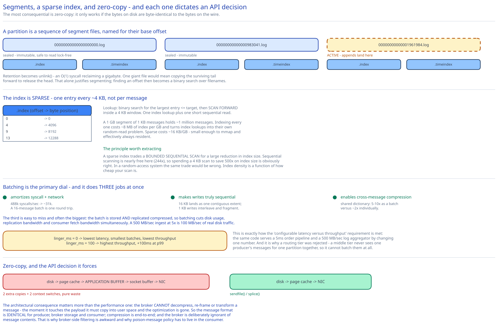

# Module 02 — The Storage Engine



The requirement is **500 MB/sec sustained** ([Module 00](./00-overview.md#capacity-estimation)). This module is how that's possible on commodity disks, and every decision traces back to one measurement.

## The measurement everything follows from

| Access pattern on the same 7200 RPM drive | Throughput |
|---|---|
| Random (150 IOPS × 4 KB) | **0.61 MB/sec** |
| Sequential | **~150 MB/sec** |

**244×.** Not a tuning difference — a different regime. Hitting 500 MB/sec with random I/O would need ~800 drives for the write path alone; with sequential I/O it needs about four.

This is why "disk is slow" is one of the most misleading pieces of received wisdom in systems design. Disk is slow *for random access*. For sequential access a spinning disk is within an order of magnitude of RAM's *effective* bandwidth for streaming workloads, and it costs 50× less per byte. A design that exploits sequential access can put 1.8 PB on spinning rust and serve it fast.

So the entire storage engine is organised around one rule: **never do a random write, and avoid random reads.**

The corollary is what a message queue must *not* store. A traditional queue tracks per-message delivery state — delivered, acknowledged, redelivered, visible-after. That state is small, mutable, and randomly accessed, which means every acknowledgement is a random write. **Replacing per-message mutable state with one integer per partition per group is what makes sequential-only I/O possible**, and it's the single most important structural decision in the design. Everything in this module is downstream of it.

## Segments, and why the log isn't one file

A partition is logically an infinite append-only log. Physically it's a sequence of **segment files**:

```
/data/orders-3/
   00000000000000000000.log     ← sealed, 1 GB, immutable
   00000000000000000000.index   ← sparse offset → byte position
   00000000000000000000.timeindex← sparse timestamp → offset
   00000000000000983041.log     ← sealed
   00000000000000983041.index
   00000000000000983041.timeindex
   00000000000001961984.log     ← ACTIVE: appends go here
   00000000000001961984.index
```

Each file is named for the **base offset** of its first message. Four things fall out of this, and each solves a problem that one giant file couldn't:

**1. Retention becomes `unlink()`.** Expiring two-week-old data deletes whole files — an O(1) syscall reclaiming a gigabyte. With one giant file you'd have to copy the surviving tail forward to release the head, at the cost of rewriting the entire partition. This alone justifies segmentation.

**2. Finding an offset is a binary search over filenames.** Because filenames are base offsets in sortable order, locating the segment containing offset 1,500,000 is a search over a directory listing, not a scan.

**3. Sealed segments are immutable**, which makes them safe to read lock-free, safe to checksum once, safe to copy for replication, and safe to offload to object storage. Immutability keeps paying, exactly as in [object storage](../object-storage-s3/03-lld.md#concurrency-at-the-code-level).

**4. Only one file is open for writing per partition**, so the file descriptor and its page-cache working set stay small.

### The sparse index

A 1 GB segment holding 1 KB messages has ~1M messages. Finding offset 983,500 by scanning is unacceptable; indexing every message costs ~8 MB of index per GB of data and turns index lookups into their own random-read problem.

So the index is **sparse** — one entry every ~4 KB of log:

```
.index    (offset_delta → byte_position)     ~2000 entries per GB
   0     →      0
   4     →   4096
   9     →   8192
   ...
```

Lookup: binary search the index for the largest entry ≤ target, then **scan forward** within a 4 KB window. One index lookup plus one short sequential read. The index is small enough (~16 KB/GB) to be memory-mapped and effectively always resident.

The design principle worth extracting: **a sparse index trades a bounded sequential scan for a large reduction in index size.** Sequential scanning is nearly free here (244×), so spending a 4 KB scan to save 500× on index size is obviously right. In a random-access system the same trade would be wrong. The right index density is a function of how cheap your scan is.

The `.timeindex` does the same for timestamps, and it's what makes "reset my consumer to 9am yesterday" and time-based retention possible without scanning.

## Batching is the whole performance story

Batching is the primary tuning dial in the system, and it's doing **three** jobs simultaneously — which is why it dominates everything else.

At 488k messages/sec, one syscall per message means 488k write syscalls plus 488k network sends. Batch 16 KB (≈16 messages) and that becomes **~31k/sec** — a 16× reduction. But the syscall saving is the least interesting of the three:

| What batching does | Why it compounds |
|---|---|
| **Amortizes syscall + network overhead** | A 16-message batch costs one round trip, not 16. Per-message overhead falls ~16×. |
| **Makes disk writes larger and more sequential** | 16 KB writes land as one contiguous extent; 1 KB writes risk interleaving with other partitions' writes, fragmenting what should be sequential. **Batching is partly what makes "sequential" true**, rather than merely appending. |
| **Enables compression across messages** | Compressing 16 similar messages together beats compressing each alone by a wide margin, because the dictionary is shared. Typical log data compresses 5–10× as a batch versus 2× individually. |

That third one is easy to miss and often the biggest win: compression applied per-batch means **the batch is stored and replicated compressed**, so batching reduces disk usage, replication bandwidth, and consumer fetch bandwidth all at once. A 500 MB/sec ingest with 5× batch compression is 100 MB/sec of actual disk traffic.

**The dial:**

```
linger_ms = 0      → send immediately.       Lowest latency, smallest batches, lowest throughput.
linger_ms = 100    → wait up to 100ms.       Highest throughput, +100ms p99 latency.
batch_size = 16KB  → send when full, whichever comes first.
```

This is precisely how [Module 00](./00-overview.md#requirements)'s "configurable latency versus throughput" requirement is satisfied: the same code serves a 5ms order pipeline (`linger_ms=0`) and a 500 MB/sec log aggregator (`linger_ms=100`) by changing one number. And it's why the [routing tier was rejected](./01-architecture-hld.md#the-rejected-alternative-a-routing-tier) — a middle tier never sees one producer's messages for one partition together, so it cannot batch them, and losing batching loses all three benefits at once.

## Zero-copy: why the read path costs almost nothing

The naive fetch path copies data four times and crosses the user/kernel boundary twice:

```
disk → kernel page cache → application buffer → kernel socket buffer → NIC
                         ^^^ 2 copies + 2 context switches, pure waste
```

The application never inspects the bytes — it's forwarding a byte range from a file to a socket unchanged. So use `sendfile()` (or `splice()`), which tells the kernel to move the data directly:

```
disk → kernel page cache → NIC
```

The measured effect is large: fetch throughput improves several-fold, and CPU per byte served drops enough that a broker becomes NIC-bound rather than CPU-bound. But the **architectural** consequence matters more than the performance one, and it's this:

**Zero-copy only works if the bytes on disk are byte-identical to the bytes on the wire.** The broker cannot decompress, re-frame, transform, or re-encode a message — the moment it touches the payload, it must copy it into user space and the optimization is gone.

That single constraint explains several otherwise-arbitrary-looking design decisions:

- **The message format is identical for producer, broker storage, and consumer.** The producer writes the final wire format; the broker stores those exact bytes; the consumer receives them. There's no internal representation.
- **Compression is end-to-end**, done by the producer and undone by the consumer. The broker stores compressed batches and never decompresses them — which is also why the broker cannot inspect message contents, and therefore why [message filtering](./06-interviewer-qna.md) is awkward and why poison-message policy has to live in the consumer.
- **The broker is deliberately ignorant of message semantics.** Not a simplification for its own sake — a requirement of the read path's performance.

This is a good example of a low-level optimization dictating a high-level API. You cannot bolt broker-side transformation onto this design later; it's excluded by the storage format.

## The page cache does the caching

There is no application-level message cache, and that's deliberate.

**Why not.** Consumers overwhelmingly read the **tail** — data written seconds ago. That data is already in the OS page cache from having just been written. So a tail fetch does **zero disk reads**, and an application cache would be a second copy of what the kernel already holds, doubling memory use to serve the same bytes. Worse, in a JVM broker a large heap cache means large GC pauses, which show up directly as p99 latency.

So brokers run a **small heap and let the OS own the memory.** A 64 GB machine might give the broker a 6 GB heap and leave ~58 GB as page cache — enough to hold the tail of every partition it leads. Cross-ref [Caching Strategies](../../hld-building-blocks/caching-strategies.md); the pattern here is "don't cache, let the kernel do it", which is only available because the access pattern is sequential-and-recent.

A useful consequence: **a broker restart does not lose the cache.** Page cache belongs to the OS, not the process, so a broker that restarts comes back with warm memory. An application cache would need to be re-populated, causing a post-restart disk-read storm.

And the failure mode this creates is [Module 01](./01-architecture-hld.md#load-handling)'s page-cache eviction problem: a consumer replaying two weeks of data streams 605 TB of cold segments through the shared cache and evicts the hot tail, pushing every well-behaved consumer onto disk. The cache being shared and kernel-managed is exactly why one bad consumer can degrade all of them — the strategy's strength and its weakness are the same property.

## Durability without fsync per message

An `fsync` costs 1–10ms on a spinning disk. At 488k messages/sec, one per message is impossible, so appends go to the page cache and are **not** synced individually.

That leaves a real gap: a broker that loses power has acknowledged messages sitting in volatile page cache. The design's answer is that **durability comes from replication, not from fsync**:

- A message is acknowledged (`acks=all`) once it's in the page cache of **every in-sync replica** — typically 3 machines in different racks.
- Losing one machine's page cache loses nothing, because two other copies exist.
- Simultaneous power loss across all three racks is the failure this doesn't cover, and it's a deliberate, stated exposure.

This is the same reasoning [object storage](../object-storage-s3/02-durability.md) uses — compose unreliable components rather than making one reliable — but reached from the opposite direction: there, replication protects against *drive failure*; here, it substitutes for *fsync*, buying back the latency that per-message syncing would cost.

Operators who need stronger guarantees can enable periodic or per-batch `fsync`, and the trade is explicit: `flush.ms` bounds the exposure window at a direct throughput cost. Naming that as a knob rather than a default is the right call, because the correct setting depends on whether racks share a power domain — a fact the software cannot know.

## Practice: extend it yourself

1. **Design tiered storage.** Offload sealed segments older than 24 hours to object storage ([the object storage case study](../object-storage-s3/00-overview.md) is the target). Work out: how a fetch for an offloaded offset is served without breaking `sendfile()` for local reads, what happens to the sparse index, how a follower re-replicates a partition whose old segments live remotely, and why this simultaneously fixes the page-cache eviction problem.
2. **Derive the right sparse-index density** for a workload of 100-byte messages instead of 1 KB. Compute index size per GB and the average forward-scan length at 4 KB spacing, then find the spacing that minimizes total lookup cost. State the assumption about scan cost that your answer depends on, and how the answer changes on SSD, where the sequential/random ratio is ~10× rather than 244×.
