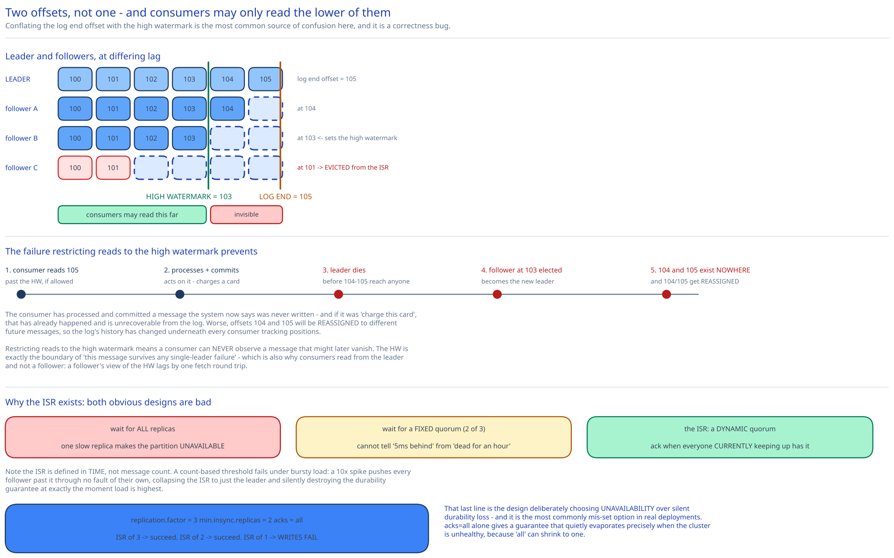

# Module 03 — Replication, ISR & the High Watermark



The requirement: **a message acknowledged to a producer must survive broker failure.** This module is the protocol that delivers it, and the two or three places where it deliberately doesn't.

## The replication protocol

Each partition has one **leader** and N−1 **followers**, on different brokers (and ideally different racks).

```
Producer ──batch──▶ LEADER (broker 1)
                      │  append to active segment; assign offsets
                      │
     followers PULL ──┤◀── Follower A (broker 2): Fetch(partition, offset=104)
                      │◀── Follower B (broker 3): Fetch(partition, offset=104)
                      │
                      └─ once ISR has offset 104 → advance high watermark → ack producer
```

**Followers pull; the leader never pushes.** This looks like a minor detail and is actually load-bearing:

- A slow follower slows **only itself**. The leader never blocks on a saturated peer, so one degraded machine cannot stall a partition.
- The follower's fetch request *is* its acknowledgement — asking for offset 104 proves it has everything through 103. There's no separate ack message, so replication tracking is free.
- A follower is just a consumer with special privileges, so it reuses the entire fetch path including `sendfile()` ([Module 02](./02-storage-engine.md#zero-copy-why-the-read-path-costs-almost-nothing)). One code path serves consumers and replication.

That last point is why the pull model is cheaper to *build*, not just to run.

## The high watermark

Two different offsets per partition, and conflating them is the most common source of confusion here:

| | Meaning |
|---|---|
| **Log End Offset (LEO)** | The last offset the leader has written. Includes messages not yet on all in-sync replicas. |
| **High Watermark (HW)** | The last offset replicated to **every member of the ISR**. Everything ≤ HW is *committed*. |

```
Leader log:  [100][101][102][103][104][105]
                                  ▲         ▲
                                  HW=103    LEO=105
Follower A:  [100][101][102][103][104]        ← at 104
Follower B:  [100][101][102][103]             ← at 103, so HW = 103

Consumers may read up to 103.   104 and 105 are invisible to them.
```

**Consumers can only read up to the high watermark.** This is the rule that makes the whole system safe, and the reason is a failure scenario worth walking through:

> Suppose consumers could read up to the LEO. A consumer reads message 105, processes it, and commits. The leader then dies before 104–105 reached any follower. A follower at 103 is elected leader. Messages 104 and 105 **no longer exist anywhere**. The consumer has processed and committed a message that the system now says was never written — and if that message was "charge this card", it has been acted upon and is unrecoverable from the log.

Restricting reads to the HW means **a consumer can never observe a message that might later vanish.** The HW is precisely the boundary of "this message survives any single-leader failure," so exposing only committed data makes the log's history immutable from a reader's perspective.

This is also the honest answer to why [consumers read from the leader only](./01-architecture-hld.md#per-path-walkthrough): a follower's knowledge of the HW lags the leader's by one fetch round trip, so a follower-served read could expose an offset the follower believes committed on stale information.

## In-sync replicas

The **ISR** is the set of replicas currently caught up "enough" with the leader. It is dynamic — replicas join and leave continuously as machines and networks vary.

```
replica.lag.time.max.ms = 30000
  → a follower is in the ISR if it has fetched up to the leader's LEO
    at some point within the last 30 seconds
```

Note the definition is in **time**, not message count, and this matters. A message-count threshold (`lag.max.messages = 4000`) fails badly under bursty load: a sudden 10× spike pushes every follower past 4,000 messages behind through no fault of their own, collapsing the ISR to just the leader and silently destroying the durability guarantee at exactly the moment load is highest. A time-based definition asks the right question — "is this follower keeping up?" — and is insensitive to absolute rate.

**Why the ISR exists at all** is the interesting part. There are two obvious designs and both are bad:

- **Wait for *all* replicas before acknowledging.** Maximum durability, but **one slow replica makes the partition unavailable.** A single machine with a failing disk stalls every write. Availability becomes the minimum across all replicas, which gets worse as you add replicas — so more redundancy would make the system *less* available.
- **Wait for a fixed quorum (e.g. 2 of 3).** Better, but it doesn't distinguish "this replica is 5ms behind" from "this replica has been dead for an hour." You could acknowledge to a quorum that includes a replica about to be declared dead.

The ISR is a **dynamic quorum**: acknowledge when everyone who is *currently keeping up* has the message, and evict anyone who stops keeping up. A dead or slow replica is removed from the ISR within 30 seconds, after which it stops affecting write latency entirely. So durability degrades gracefully rather than availability collapsing — you keep serving with fewer copies instead of stalling with more.

The trade is explicit: **the ISR can shrink, and a shrinking ISR silently reduces durability.** `acks=all` with an ISR of 1 means "acknowledged by the leader alone," which is `acks=1` wearing a misleading name. That's what `min.insync.replicas` exists for:

```
replication.factor    = 3
min.insync.replicas   = 2
acks                  = all

→ ISR of 3: writes succeed, 3 copies.
→ ISR of 2: writes succeed, 2 copies. (Fine.)
→ ISR of 1: writes FAIL with NOT_ENOUGH_REPLICAS.
```

**That last line is the design deliberately choosing unavailability over silent durability loss.** It's the correct default for anything whose data matters, and it's the setting most commonly left wrong — `acks=all` alone gives you a guarantee that quietly evaporates precisely when the cluster is unhealthy.

## Acknowledgement levels are the durability dial

| `acks` | Leader waits for | Latency | Loss window |
|---|---|---|---|
| `0` | Nothing — fire and forget | Lowest | Any failure loses the message. No error is even reported. |
| `1` | Its own local write (page cache) | Low | Leader dies before any follower fetches → **acknowledged message lost** |
| `all` | Every member of the ISR | Highest | Only if all ISR members lose data simultaneously |

`acks=1` is the dangerous middle, because it *looks* durable — the producer got a success — and isn't. The window is small (one fetch interval, typically ~500ms) but real, and under `acks=1` the failure is silent: the producer was told the message was written.

**Why this is producer-controlled rather than a broker policy** is the design point. A metrics sample and a payment authorization have genuinely different loss tolerance, and forcing one setting on both means either the metrics pipeline pays payment-grade latency, or the payment pipeline silently accepts loss. Exposing `acks` per-produce-request lets each workload buy exactly the durability it needs. It also puts the decision where the knowledge is — the broker cannot know what a message means.

## Unclean leader election

The hardest case: **every member of the ISR is down**, and only an out-of-sync replica survives.

```
Partition: leader (broker 1) + ISR followers (brokers 2, 3), plus an out-of-sync replica (broker 4)
Brokers 1, 2, 3 all fail.  Broker 4 is alive but 5,000 messages behind.
```

Two options, and they are genuinely both bad:

**`unclean.leader.election.enable = false`** (the safe default) — the partition is **unavailable** until an ISR member returns. Nothing is lost, but reads and writes for that partition stop, potentially for hours. If the failed brokers' disks are gone, potentially forever.

**`unclean.leader.election.enable = true`** — broker 4 becomes leader. The partition is available immediately, and **5,000 acknowledged messages are permanently and silently gone.** Worse, consumers that already read those messages have now read data that no longer exists, so the log's history has *changed* — offsets past broker 4's LEO get reassigned to different messages, which breaks the immutability that every downstream consumer's offset tracking depends on.

This is a rare case of a genuinely unavoidable CAP trade at the level of a single configuration flag (cross-ref [Latency, Throughput & the CAP Theorem](../../foundations/latency-throughput-cap.md)). The right answer is per-topic, not per-cluster:

- **Payments, orders, audit logs** → `false`. Unavailability is recoverable; acknowledged-then-vanished money is not.
- **Metrics, click streams, logs** → `true`. Losing 5,000 samples is invisible; a stalled metrics pipeline during an incident is actively harmful because it blinds you when you most need visibility.

Being able to argue *both* directions from the data's meaning, rather than defaulting to "safety first," is what the question is testing.

## Replica placement

All the durability reasoning assumes replicas fail independently — which requires placing them so they don't share a failure domain. Same principle as [object storage](../object-storage-s3/02-durability.md#failure-domains-are-the-actual-mechanism):

```
partition 0: leader broker-1 (rack A), followers broker-4 (rack B), broker-7 (rack C)
partition 1: leader broker-5 (rack B), followers broker-2 (rack A), broker-8 (rack C)
```

Two constraints, and both are easy to get wrong:

**Spread replicas across racks.** Three replicas in one rack means one top-of-rack switch or PDU is your actual durability. With rack-aware placement, `min.insync.replicas=2` survives a full rack loss.

**Spread *leadership* evenly.** Because [consumers and producers both talk only to leaders](./01-architecture-hld.md#per-path-walkthrough), a broker leading disproportionately many partitions absorbs disproportionate traffic while its followers idle. Leadership balance is a *load* concern distinct from replica balance being a *durability* concern — and after a failover, leadership is by definition unbalanced (the dead broker's leaderships moved elsewhere), so a **preferred-leader election** must run periodically to restore balance. Forgetting that step means a cluster gets progressively more lopsided with every failure it survives.

## Practice: extend it yourself

1. **Compute the `acks=1` loss window** for a 500 MB/sec partition with a 500ms follower fetch interval: how many messages sit unreplicated on the leader on average, and what's the maximum? Then decide whether shortening the fetch interval to 50ms is worth it — quantify the extra fetch request rate against the reduced exposure, and say what breaks first if you push it to 5ms.
2. **Design a "reduced ISR" alert that operators will act on.** An ISR shrinking to `min.insync.replicas` means writes still succeed but the next failure stops them. Define the alert (on what signal, at what threshold, with what urgency) so that it fires early enough to act but doesn't page on the routine 30-second flaps that happen during normal deploys and GC pauses.
